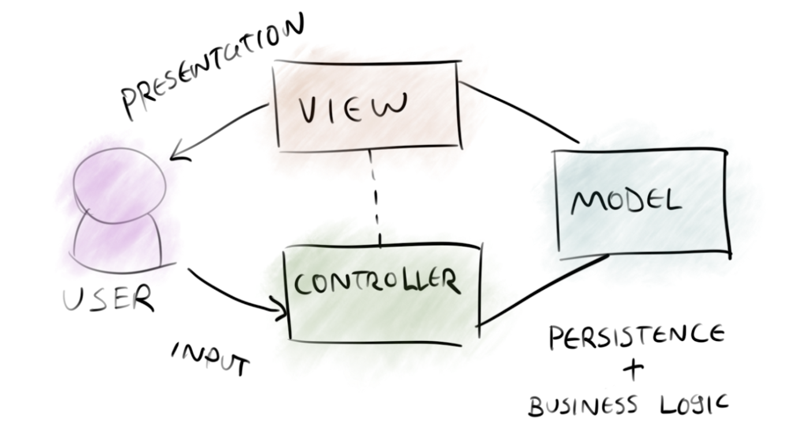
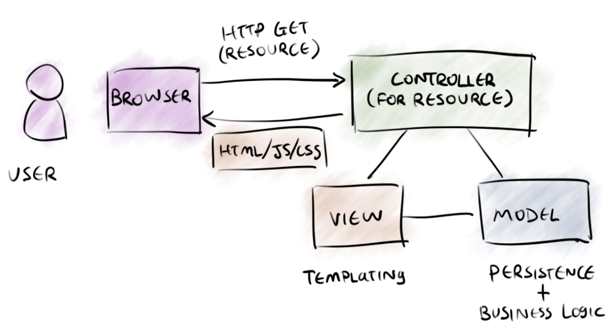
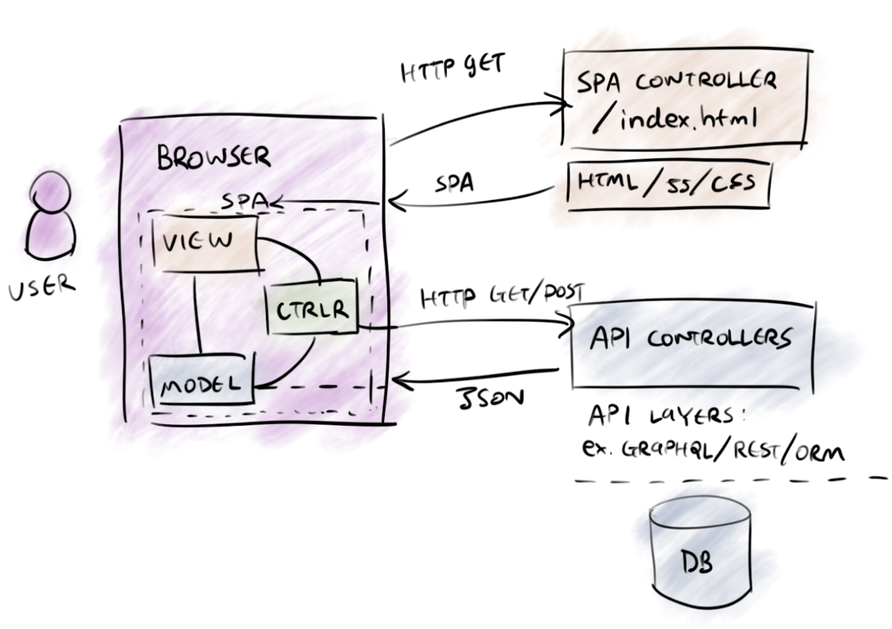
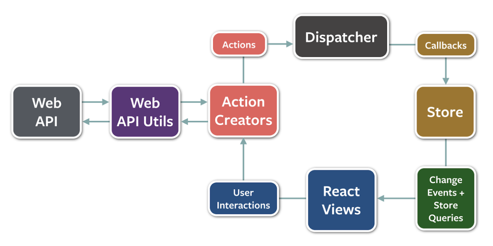
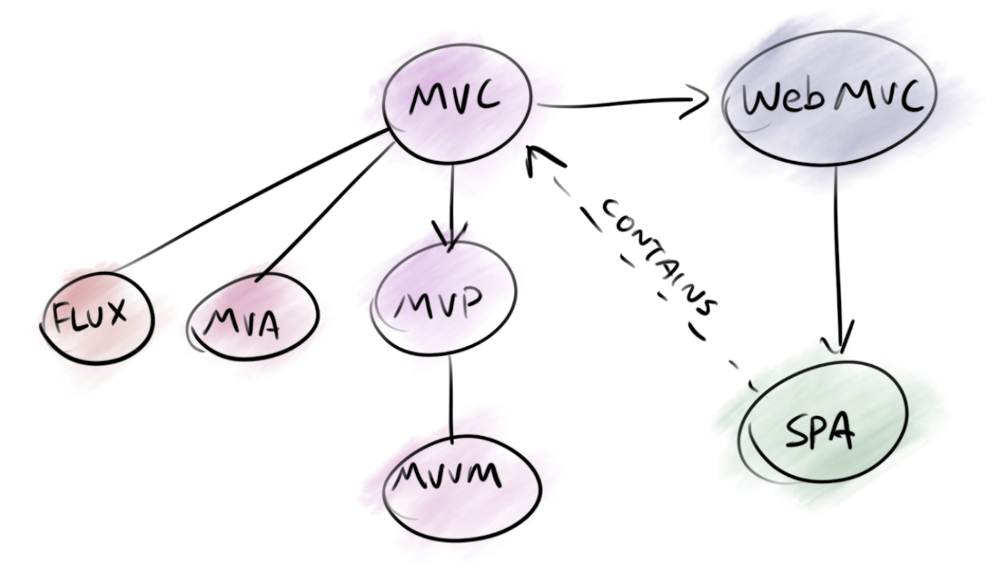

# From MVC to Modern Web Frameworks

> 원본 글  
> https://medium.com/hackernoon/from-mvc-to-modern-web-frameworks-8067ec9dee65

**목차**

- [From MVC to Modern Web Frameworks](#from-mvc-to-modern-web-frameworks)
  - [Inception](#inception)
  - [Native MVC](#native-mvc)
  - [Web MVC](#web-mvc)
  - [Modern Web Frameworks](#modern-web-frameworks)

**Model-View-Controller** (MVC)는 소프트웨어 아키텍처 중 가장 널리 퍼지고 영향력 있는 패턴 중 하나이다. [MVC는 끝났다](https://cirw.in//blog/time-to-move-on.html) 라는 소문에도 불구하고 **MVC**는 이해하는 데 유용한 패턴으로 남아있다. 이 포스팅에서는 **MVC**의 다양한 정의에 대해서 다루기보다는 **MVC**가 어떻게 우리가 오늘날 사랑하는 현대 웹 프레임워크로 진화했는지 알아볼 것이다.

## Inception

1978년 **Trygve Reenskaugh**와 **Adele Goldberg**가 **"Model-View-Controller"**라는 이름을 만들었다. Trygve는 **MVC**와 **MVC**의 변형이 사람들이 문제와 해결책에 대해 이야기할 수 있는 공유 언어인 [Pattern Language](https://en.wikipedia.org/wiki/A_Pattern_Language)를 형성했다고 믿었다. 소프트웨어 Parttern Language의 개념은 디자인 패턴 책을 집필한 Gang of Four([에릭 감마](https://www.google.com/search?newwindow=1&rlz=1C5CHFA_enKR962KR962&sxsrf=ALiCzsYCQZ2UnvgOHHhTH3uBvqvlun5kxQ:1667301590519&q=%EC%97%90%EB%A6%AD+%EA%B0%90%EB%A7%88&stick=H4sIAAAAAAAAAOPgE-LQz9U3SDIyLFDiBLGMi5PScrVkspOt9JPy87P1y4syS0pS8-LL84uyrRJLSzLyixax8r6ZPuH1srUKrzZMeL28Ywcr4y52Jg5GAMqqTetNAAAA&sa=X&ved=2ahUKEwj36KS47oz7AhVpTGwGHcJXApAQmxMoAHoFCIkBEAI), [존 블리사이드스](https://www.google.com/search?newwindow=1&rlz=1C5CHFA_enKR962KR962&sxsrf=ALiCzsYCQZ2UnvgOHHhTH3uBvqvlun5kxQ:1667301590519&q=%EB%B8%94%EB%A6%AC%EC%82%AC%EC%9D%B4%EB%93%9C%EC%8A%A4&stick=H4sIAAAAAAAAAOPgE-LQz9U3SDIyLFDiBLEszMvKjLRkspOt9JPy87P1y4syS0pS8-LL84uyrRJLSzLyixaxCr3eMeX1sjVvmta8mbvl9eQ5b7qW7GBl3MXOxMEIANb6-3hSAAAA&sa=X&ved=2ahUKEwj36KS47oz7AhVpTGwGHcJXApAQmxMoAXoFCIkBEAM), [랄프 존슨](https://www.google.com/search?newwindow=1&rlz=1C5CHFA_enKR962KR962&sxsrf=ALiCzsYCQZ2UnvgOHHhTH3uBvqvlun5kxQ:1667301590519&q=Ralph+Johnson&stick=H4sIAAAAAAAAAOPgE-LQz9U3SDIyLFDiBLEsjNPLU7RkspOt9JPy87P1y4syS0pS8-LL84uyrRJLSzLyixax8gYl5hRkKHjlZ-QV5-ftYGXcxc7EwQgA4DfUik0AAAA&sa=X&ved=2ahUKEwj36KS47oz7AhVpTGwGHcJXApAQmxMoAnoFCIkBEAQ), [리하르트 헬름](https://www.google.com/search?newwindow=1&rlz=1C5CHFA_enKR962KR962&sxsrf=ALiCzsYCQZ2UnvgOHHhTH3uBvqvlun5kxQ:1667301590519&q=%ED%97%AC%EB%A6%84+%EB%A6%AC%ED%95%98%EB%A5%B4%ED%8A%B8&stick=H4sIAAAAAAAAAOPgE-LQz9U3SDIyLFDiBLHMknNzcrVkspOt9JPy87P1y4syS0pS8-LL84uyrRJLSzLyixaxCr-dvub1shaF18vWvJ064_XSLW-7duxgZdzFzsTBCAAPgFfcUwAAAA&sa=X&ved=2ahUKEwj36KS47oz7AhVpTGwGHcJXApAQmxMoA3oFCIkBEAU))에게도 영향을 끼쳤다. 만약 MVC가 디자인 패턴 책에 포함됐었다면, 아마 [Behavioral Pattern](https://en.wikipedia.org/wiki/Behavioral_pattern) 섹션 아래에서 [Mediator](https://en.wikipedia.org/wiki/Mediator_pattern) 그리고 [Observer](https://en.wikipedia.org/wiki/Observer_pattern) 패턴과 함께 있는 걸 찾아볼 수 있었을 것이다.

Here’s Trygve’s retrospective paper in 2003, [MVC, Its Past and Present](http://heim.ifi.uio.no/~trygver/2003/javazone-jaoo/MVC_pattern.pdf). 이 문서에서 **Trygve**는 **MVC** 패턴 언어를 구성하는 11개의 패턴에 대해 이야기한다. 여기서 **Model/Editor Separation**와 **Input/Output Separation** 이 두 가지만 주요 방식으로 자리 잡았는데 필자는 이 두 가지가 본질적으로 같다고 생각한다.

> Variants where the input goes through the View are also common.  
> 출처: https://medium.com/hackernoon/from-mvc-to-modern-web-frameworks-8067ec9dee65

> **View**와 **Controller**의 역할이 밀접하게 결합된 경우 하나의 객체 안에 위치할 수도 있다. _— Trygve Reenskaugh_

## Native MVC

In the decades that followed, MVC outlived Smalltalk and powered applications for Mac OS and Windows as those systems grew and evolved rapidly. 나중에 스마트폰이 등장했을 때도 네이티브 모바일 앱을 위한 모바일 윈도우 그리고 초기 버전의 iOS도 **MVC**와 **MVC** 변형에 의존했다. 마이크로소프트에서 **MVC**는 나중에 **WPF**, **Silverlight** 그리고 **Xamarin**과 같은 프로젝트를 지원하는 **MVVM**으로 진화했다.

## Web MVC

2000년대 초반 몇몇의 주요 웹 프레임워크들(**Spring**, **Ruby on Rails**, **PHP** 그리고 **ASP.net**)이 **MVC**의 패턴 언어를 받아들였다. 이 프레임워크들은 `Controller`에 새로운 책임을 추가했는데 이 책임이라는 건 다음과 같이 초기 **HTTP** 요청을 처리하는 것을 말한다.

> Controllers respond to HTTP requests  
> 출처: https://medium.com/hackernoon/from-mvc-to-modern-web-frameworks-8067ec9dee65

`Controller`는 이제 `View` 대신 애플리케이션의 새로운 진입점이 되었다. 그에 따라 `View`가 가진 책임도 변경됐다. 사용자가 직접 무언가를 보여주고 처리하는 대신 브라우저가 렌더링 하는데 필요한 **HTML**, **JS** 그리고 **CSS**의 번들을 조합하는 것으로 말이다. **HTML**/**JS**는 `XMLHttpRequest`를 통하여 컨트롤러에게 `action`을 다시 전달하는 버튼 클릭 핸들러와 같은 로직을 포함하고 있다. 참고로 브라우저에는 **MVC** 패턴의 존재가 명확하게 있지 않다. 이는 현대 웹 프레임워크의 등장으로 출현으로 곧 바뀐다.

## Modern Web Frameworks

브라우저 전쟁이 해결되면서 마침내 여러 가지 좋은 것들(`XMLHttpRequest`, **stable DOM API**, **ES6** 등)을 갖게 되었다. 이렇게 향상된 성능과 유연성을 이용하여 기업들은 단순한 웹페이지가 아닌 **Single Page Apps**, 즉 **SPA**라고 불리는 더욱 더 복잡한 웹앱을 만들기 시작했다. 모던 웹 프레임워크는 높아져가는 클라이언트 사이드 복잡성을 정리하고 애플리케이션 개발이 예측 가능하고 생산적일 수 있도록 유지하는데 도움이 된다.

이러한 프레임워크들은 간단한 **View Controller**(주로 핸들러이거나 `index.html`에 해당된다)를 통해 직접 호스팅하기 위한 **HTML**, **JS** 그리고 **CSS**의 정적 번들 파일을 생성하기 위한 추가적인 빌드 단계를 선보였다. 이러한 정적 리소스는 우리가 **HTTP** 헤더에 `cache-control`을 설정하여 **CDN**을 통해 더 빠르게 리소스를 전달할 수 있게 만들 수 있었다. **Single Page App**들은 "API Controller"에 의해 전달되는 리소스(주로 **JSON** 형태로 요청에 대해 응답한다)에 대해 **HTTP** **API** 요청을 만들어 낼 수 있는 로직을 포함한다.

> 출처: https://medium.com/hackernoon/from-mvc-to-modern-web-frameworks-8067ec9dee65

오늘날 우리를 이끌고 있는 가장 유명한 모던 웹 프레임워크의 예로는 **React**, **Vue** 그리고 **Angular**가 있다. 이러한 프레임워크들의 구성하고 있는 패턴들은 **MVC**와 얼마나 유사할까? 세 개의 프레임워크 모두 일종의 **View**는 있기 때문에 다음 계층에서 비교가 이루어져야 한다.

`state` (Model), `mediating logic` (Controller), and `synchronization`.

> _I’m about to describe these frameworks by the most common ways to use them. I’m sure someone somewhere insists on pairing Data-Binding with React, Flux with Angular, and french fries with peanut butter._

**Vue**는 가장 직관적이다. **Vue**의 문서에는 **Vue**는 **MVVM**의 구현이다 라고 명확하게 명시되어 있다. **Angular** 또한 **MVVM** 개념을 기반으로 한다. 그러나 **React**는 **Flux**라는 패턴을 사용한다.

> Actual Flux diagram; all the arrows on the right-side point clockwise.  
> 출처: https://medium.com/hackernoon/from-mvc-to-modern-web-frameworks-8067ec9dee65

**Flux**는 단방향 데이터 흐름에 관한 것이다. **MVC**에서 **Model**은 **View**에 의해 렌더링될 지속적인 데이터를 나타낸다. **Flux**는 **MVC** 모델의 책임을 분리했다. 비즈니스 로직에 대해서는 **Action**/**API**를 사용하고 상태값을 다루기 위해 **"Store"**를 사용한다. You can think of the Store as one monolithic [Passive Model](<https://docs.microsoft.com/en-us/previous-versions/msp-n-p/ff649643(v=pandp.10)>) for the entire app.

**Flux**가 단방향 데이터 흐름을 선택한 이유는 무엇일까? 애플리케이션이 복잡해짐에 따라 **View** 업데이트로 인한 상태 변경을 관리하는 것이 점점 어려워졌다. 특히나 다른 소스에서 오는 경우에는 더욱 그랬다. **View**가 속성 변경에 대한 **ViewModel**의 `mutable` 인스턴스를 바라보고 있는 데이터 바인딩과는 반대로 **React**는 불변 `state`/`props`의 함수로 새로운 **View**를 만들어 냈다. **View**는 로컬 상태 변경에 대해 신경 쓰지 않아도 된다. 애플리케이션은 상태 트리에 새로운 **Model** 인스턴스를 생성해야만 **View**를 변경할 수 있다. **React**가 애플리케이션을 업데이트하고 싶을 때 상태 트리의 일부를 새로운 객체로 대체하여 새로운 **View**를 생성하게끔 만든다.

단방향 데이터 흐름은 강력한 개념이지만 이 개념 하나로 모든 걸 해결할 수는 없으며 이 개념을 사용하는 **React/Flux**라고 해서 **Angular/Vue** 보다 뛰어나다고 평가할 수도 없다.

> The MVC tree of life  
> 출처: https://medium.com/hackernoon/from-mvc-to-modern-web-frameworks-8067ec9dee65
