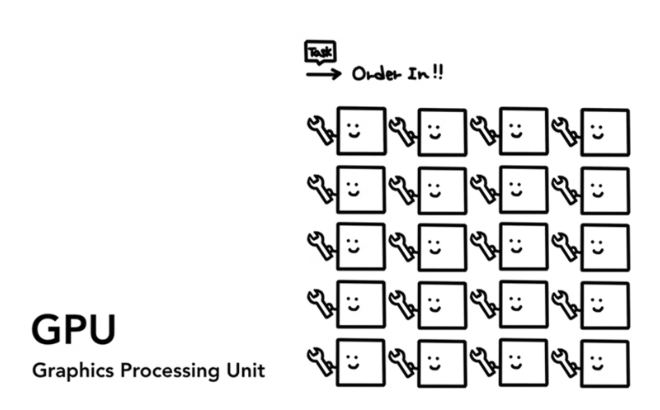
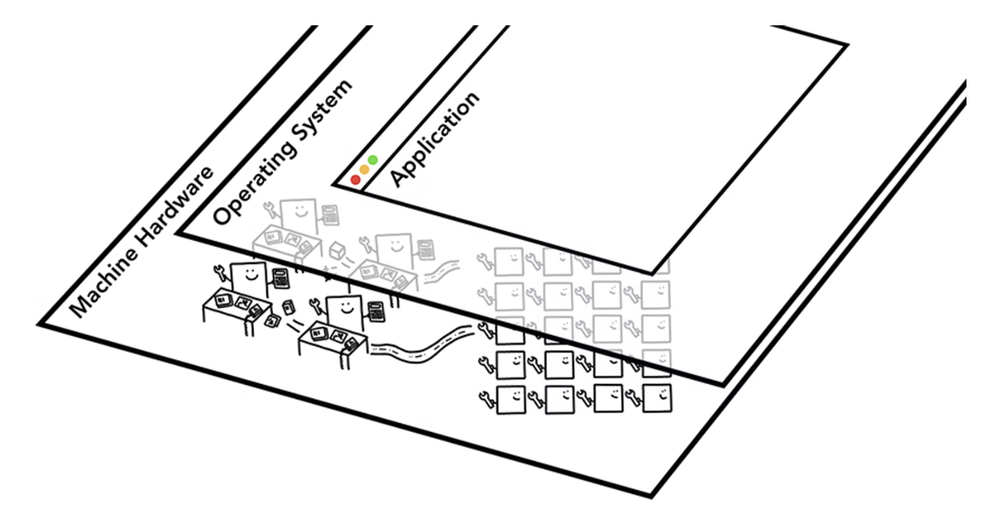
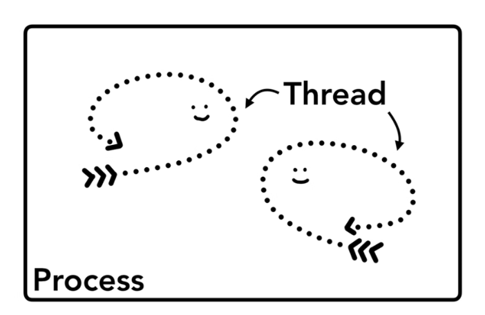
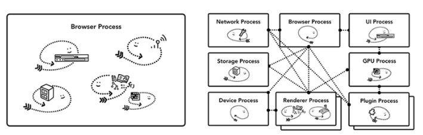
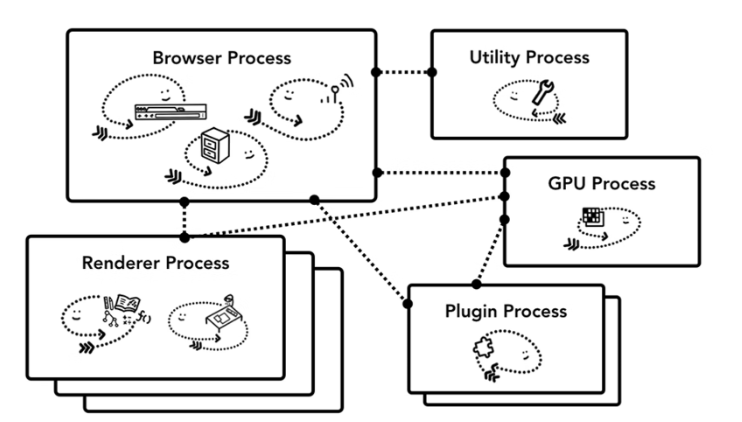
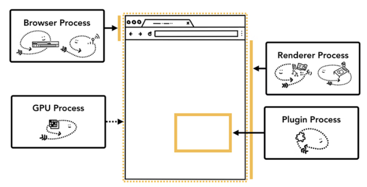
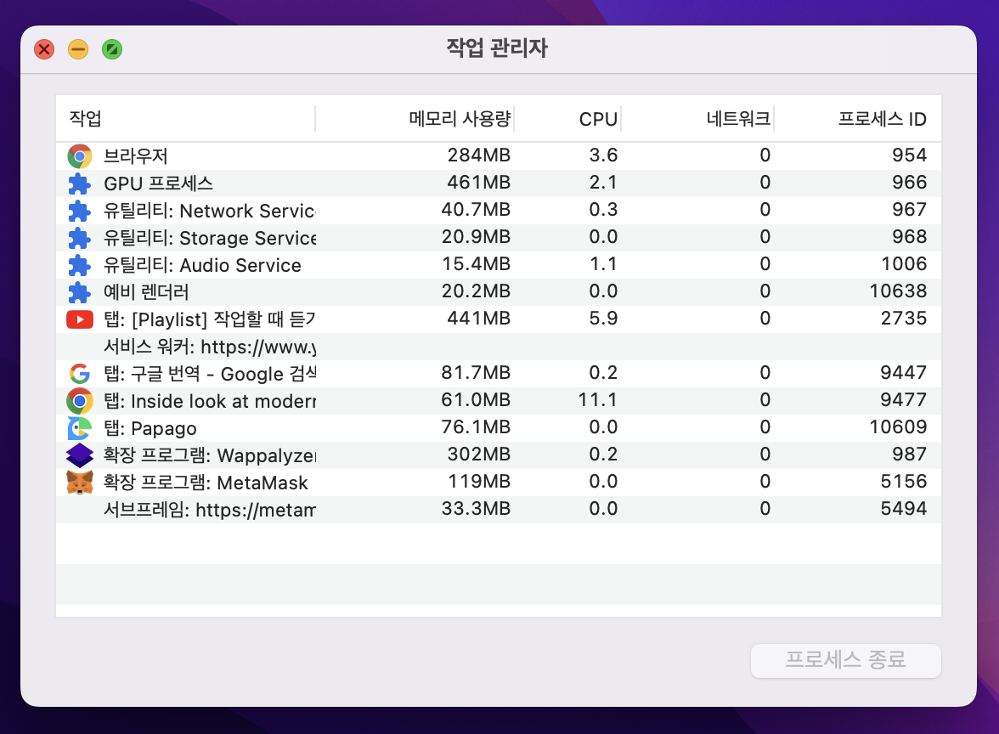
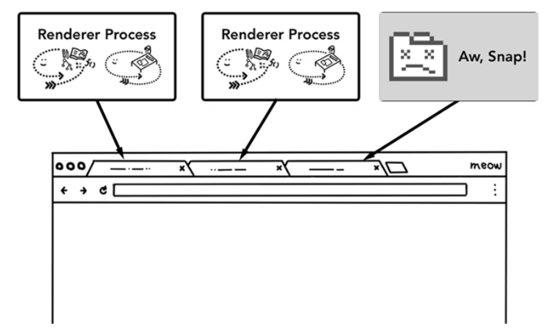
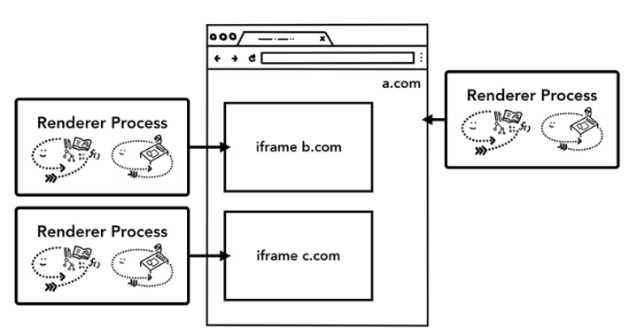

# #1 Core computing terminology and Chrome’s multi-process architecture

> 원본 글
> https://developer.chrome.com/blog/inside-browser-part1/

**Series**

- #1 Core computing terminology and Chrome’s multi-process architecture (현재)
- #2 Where a user requests a site and the browser prepares to render a page
- #3 Inner workings of a Renderer Process
- #4 Input is coming to the Compositor

**목차**

- [#1 Core computing terminology and Chrome’s multi-process architecture](#1-core-computing-terminology-and-chromes-multi-process-architecture)
  - [CPU, GPU, Memory, and multi-process architecture](#cpu-gpu-memory-and-multi-process-architecture)
  - [At the core of the computer are the CPU and GPU](#at-the-core-of-the-computer-are-the-cpu-and-gpu)
    - [CPU](#cpu)
    - [GPU](#gpu)
  - [Executing program on Process and Thread](#executing-program-on-process-and-thread)
  - [Browser Architecture](#browser-architecture)
  - [Which process controls what?](#which-process-controls-what)
    - [Process and What it controls](#process-and-what-it-controls)
  - [The benefit of multi-process architecture in Chrome](#the-benefit-of-multi-process-architecture-in-chrome)
  - [Saving more memory - Servicification in Chrome](#saving-more-memory---servicification-in-chrome)
  - [Per-frame renderer processes - Site Isolation](#per-frame-renderer-processes---site-isolation)

## CPU, GPU, Memory, and multi-process architecture

4 파트로 이루어진 이 블로그 시리즈에서 우리는 **high-level architecture**에서 **렌더링 파이프라인의 세부 사항**에 이르기까지 크롬 브라우저의 내부를 살펴볼 것이다. 만약 평소에 브라우저가 우리의 코드를 어떻게 기능적인 웹사이트로 변환하는지 궁금했거나 어떻게 해야 특정 기능의 퍼포먼스 향상을 이룰 수 있는지 잘 모르겠는 경우 이 시리즈가 도움이 될 것이다.

파트 1에서는 핵심 컴퓨팅 용어와 **Chrome**의 다중 프로세스 아키텍처를 살펴볼 것이다.

## At the core of the computer are the CPU and GPU

브라우저가 돌아가는 환경을 이해하기 위해서는 몇 가지의 컴퓨터 부품과 그들이 무엇을 하는지 이해할 필요가 있다.

### CPU

> Figure 1: 4 CPU cores as office workers sitting at each desk handling tasks as they come in  
> 출처: https://developer.chrome.com/blog/inside-browser-part1/

첫 번째는 바로 중앙 처리 유닛(**C**entral **P**rocessing **U**nit) - 또는 **CPU**이다.

**CPU**는 컴퓨터의 뇌라고 말할 수 있다. 위 사진에서 `office worker`라고 표현된 **CPU**의 `core`는 **CPU**로 들어오는 많은 작업들을 하나씩 처리할 수 있다. **CPU**는 호출에 응답하는 법을 알고 있으며 수학부터 예술에 이르기까지 모든 것을 처리할 수 있다. 과거에는 대부분의 **CPU**들은 단일 칩이었다. `core`는 같은 칩에 있는 다른 **CPU**와 같으며 현대의 하드웨어에선 종종 두 개 이상의 `core`를 사용하여 핸드폰과 노트북에 더 많은 컴퓨팅 성능을 제공한다.

### GPU

> Figure 2: Many GPU cores with wrench suggesting they handle a limited task  
> 출처: https://developer.chrome.com/blog/inside-browser-part1/

그래픽 처리 유닛(**G**raphics **P**rocessing **U**nit) - 또는 **GPU**는 컴퓨터의 다른 부품 중 하나이다. **CPU**와 달리 **GPU**는 간단한 작업을 처리하는 데 능숙하지만 동시에 여러 코어에 걸쳐 있다. 이름에서 알 수 있듯이 GPU는 처음에 그래픽을 다루기 위해 개발됐었다. 이것이 그래픽 맥락에서 "**GPU** 사용" 또는 "**GPU** 지원"이 빠른 렌더링 및 부드러운 상호 작용과 관련된 이유다. 최근 몇 년 동안 **GPU** 가속 컴퓨팅을 통해 **GPU** 단독으로 더 많은 연산이 가능해지고 있다.

우리가 컴퓨터나 핸드폰의 애플리케이션을 실행하면 **CPU**와 **GPU**가 애플리케이션에 전원을 공급한다. 일반적으로 애플리케이션은 OS에서 제공하는 메커니즘을 사용하여 **CPU** 및 **GPU**에서 실행됩니다.

> Figure 3: Three layers of computer architecture. Machine Hardware at the bottom, Operating System in the middle, and Application on top.  
> 출처: https://developer.chrome.com/blog/inside-browser-part1/

## Executing program on Process and Thread

> Figure 4: Process as a bounding box, threads as abstract fish swimming inside of a process  
> 출처: https://developer.chrome.com/blog/inside-browser-part1/

브라우저 아키텍처에 뛰어들기 전에 파악해야 할 또 다른 개념은 `Process`와 `Thread`이다. `Process`는 애플리케이션이 프로그램을 실행하는 것이라고도 할 수 있다. `Thread`는 `Process` 내부에 존재하며 `Process`의 프로그램 일부를 실행하는 것이라고 할 수 있다.

우리가 애플리케이션을 실행하면 `Process`가 생성된다. 프로그램은 작업을 돕기 위해 `Thread`를 생성할 수 있지만 이는 선택 사항이다. **OS**는 `Process`에게 작업할 메모리 "**Slab**"를 제공하고 모든 애플리케이션 상태는 해당 개인 메모리 공간에 유지된다. 애플리케이션이 종료될 때, `Process` 또한 종료되며 **OS**는 메모리 공간에 여유를 찾게 된다. (`Process`가 잡아먹고 있던 메모리 공간)

> Figure 5: Diagram of a process using memory space and storing application data  
> 출처: https://developer.chrome.com/blog/inside-browser-part1/

`Process`는 **OS**에게 다른 작업을 실행하기 위해 다른 `Process`를 가동하도록 요청할 수 있다. 요청이 발생할 때, 메모리의 다른 공간이 새로운 `Process`에게 할당된다. 만약 두 Process가 소통해야 하는 경우 **I**nter **P**rocess **C**ommunication (**IPC**)를 통하여 소통할 수 있다. 많은 애플리케이션들이 이러한 방식으로 작동하도록 설계되어 `Worker process`가 응답하지 않는 경우 애플리케이션의 다른 부분을 실행하는 다른 `Process`들을 중지하지 않고 다시 시작할 수 있습니다.

> Figure 6: Diagram of separate processes communicating over IPC  
> 출처: https://developer.chrome.com/blog/inside-browser-part1/

## Browser Architecture

그러면 `Process`와 `Thread`를 사용하여 웹 브라우저를 구축하는 방법은 무엇일까? 이는 **IPC**로 통신하는 하나의 `Process`와 수 많은 `Thread`가 될 수도 있고 수 많은 `Process`와 몇 개의 `Thread`일 수도 있다.

> Figure 7: Different browser architectures in process/thread diagram
> 출처: https://developer.chrome.com/blog/inside-browser-part1/

The important thing to note here is that these different architectures are implementation details. 웹 브라우저를 구축하는 방법에 대한 표준 사양은 없다. 브라우저들의 아키텍처 구축 방법에 대한 접근 방법은 서로 완전히 다를 수도 있다.

> 웹 브라우저 구축에 사용되는 것이 `Process`와 `Thread`라는 점을 제외하면 이 둘을 가지고 어떻게 웹 브라우저를 구축할지에 대한 접근 방법은 해당 브라우저를 만드는 사람들에 따라 천차만별일 수 있다는 말이다.

해당 블로그 시리즈에서는 아래 다이어그램에 설명된 **Chrome**의 최신 아키텍처에 대해 알아볼 것이다.

최상단에는 애플리케이션의 각기 다른 부분을 다루는 `Process`들을 관장하는 **Browser Process**가 있다. **Renderer Process**의 경우, 여러 `Process`가 생성되어 각 탭에 할당된다. 아주 최근까지, **Chrome**은 가능하다면 각 탭에 `Process`를 제공했다. 그러나 이제는 `iframe`을 포함하여 각 사이트에 고유한 `Process`를 제공하고자 한다.

> Figure 8: Diagram of Chrome’s multi-process architecture. Multiple layers are shown under Renderer Process to represent Chrome running multiple Renderer Processes for each tab.
> 출처: https://developer.chrome.com/blog/inside-browser-part1/

## Which process controls what?

다음 표는 Chrome의 각 Process가 무엇을 제어하는지 설명한다.

### Process and What it controls

| Browser  | 주소창, 북마크, 앞으로 가기, 뒤로 가기를 포함한 애플리케이션의 Chrome에 해당하는 부분을 제어한다. 또한 네트워크 요청과 파일 접근과 같은 웹 브라우저의 보이지 않는 권한 부분을 제어한다. |
| -------- | --------------------------------------------------------------------------------------------------------------------------------------------------------------------------------------- |
| Renderer | 웹사이트가 표시되는 탭 내부의 모든 것을 제어한다.                                                                                                                                       |
| Plugin   | 웹사이트에서 사용하는 모든 플러그인을 제어한다. (ex. flash)                                                                                                                             |
| GPU      | GPU 작업은 다른 Process들과 독립되어 처리된다. 다른 Process들에게서 독립되어 처리되는 이유는 GPU가 여러 애플리케이션의 요청을 처리하고 동일한 surface에 이를 그리기 때문이다.           |

> Figure 9: Different processes pointing to different parts of browser UI
> 출처: https://developer.chrome.com/blog/inside-browser-part1/

**Extension Process** 및 **Utility Process**와 같은 훨씬 더 많은 프로세스가 있다. 만약 **Chrome** 내에서 얼마나 많은 `Process`가 동작하고 있는지 궁금하다면 우측 상단에 있는 `Menu` 아이콘을 클릭하고 **도구 더보기**를 선택한 뒤에 **Task Manager(작업 관리자)**를 골라보자. 이는 현재 동작하고 있는 `Process` 목록과 해당 `Process`들의 **CPU** 및 **Memory** 사용량을 보여줄 것이다.

## The benefit of multi-process architecture in Chrome

위에서 언급했듯이 **Chrome**은 다수의 **Renderer Process**를 사용한다. 가장 간단하게 **Chrome** 브라우저 각 탭마다 **Renderer Process**가 있다고 생각하면 된다. 현재 3개의 탭이 열려 있고 각 탭이 독립적인 **Renderer Process**에 의해 실행된다고 가정해보자. 우리는 하나의 탭이 응답하지 않으면 응답하지 않는 탭을 닫고 잘 동작하고 있는 다른 탭으로 이동할 수 있다. 만약 모든 탭이 하나의 `Process`로 동작하고 있었다면 하나의 탭이 응답하지 않을 때 다른 모든 탭들도 응답하지 않을 것이다.

> 각 탭에 **Renderer Process**가 독립적으로 동작하고 있기 때문에 하나의 탭에서 문제가 생겨도 문제없는 나머지 탭을 이용할 수 있는 것이다. 즉, 하나의 **Renderer Process**로 운영되고 있지 않다는 뜻이며 각기 다른 `Process`가 독립적으로 동작하고 있기 때문에 얻을 수 있는 이점이라는 것이다.

> Figure 10: Diagram showing multiple processes running each tab
> 출처: https://developer.chrome.com/blog/inside-browser-part1/

브라우저의 작업이 분리됨으로써 얻는 다른 이점은 **보안**과 **Sandboxing**이다.

> **Sandbox**: **Sandbox**란 외부로부터 들어온 프로그램이 보호된 영역에서 동작해 시스템이 부정하게 조작되는 것을 막는 보안 형태이다.

**OS**는 `Process`의 권한을 제한하는 방법을 제공하므로, 브라우저는 특정 기능에서 특정 `Process`를 **Sandboxing** 할 수 있다. 예를 들어, **Chrome** 브라우저는 **Renderer Process**와 같이 임의의 사용자 입력을 처리하는 `Process`에 대한 임의의 파일 접근을 제한한다.

> HTML input 태그의 `file` 타입을 사용할 때 여러 보안상의 이유로 파일 접근에 대한 여러 방법들이 제한되어 있는데 이러한 처리를 **OS**에서 제공하는 권한 제어 방법을 통해 브라우저 단에서 막는다는 뜻

`Process`들은 각자 고유의 개인 메모리 공간을 가지고 있기 때문에, **common infrastructure** (like V8 which is a Chrome's JavaScript engine)의 복사본을 포함하고 있는 경우가 많다. 즉, 동일한 `Process` 내의 `Thread`인 경우와 같은 방식으로 서로를 공유할 수 없기 때문에 메모리 사용량이 증가한다.

> 각자 고유의 개인 메모리 공간을 가지고 있는 `Process`는 한 `Process` 내에 `Thread`들과 같이 공유가 될 수 없는 상황이기 때문에 `Process`의 증가는 메모리 사용량의 증가를 의미한다.

메모리를 절약하기 위해 **Chrome**은 운용할 수 있는 `Process` 수를 제한한다. 한도는 기기의 메모리 및 **CPU** 성능에 따라 다르지만 **Chrome**이 운용 가능한 `Process` 수의 한도에 도달하면 한 `Process`에서 동일한 사이트의 여러 탭을 실행하기 시작한다.

## Saving more memory - Servicification in Chrome

**Browser Process**에도 동일한 접근 방식이 적용된다. **Chrome**은 브라우저 프로그램의 각 부분을 다른 `Process`로 쉽게 분할하거나 하나로 통합할 수 있는 서비스로 실행하기 위해 아키텍처를 변경하고 있다.

아이디어의 근간은 이러하다. **Chrome**이 높은 성능의 하드웨어에서 실행될 때는 각 서비스를 다른 `Process`들로 분할하여 안정성을 높이고 리소스가 제한된 기기에서 실행될 때는 **Chrome**이 서비스를 하나의 `Process`로 통합하여 메모리 공간을 절약한다.

> **정리**: **Chrome**을 실행하는 하드웨어 성능에 따라 서비스를 여러 `Process` 분할 또는 하나의 `Process`로 통합하여 안정성을 높이거나 메모리 공간을 절약

이러한 변경 이전에는 **Android**와 같은 플랫폼에서 메모리 사용량을 줄이기 위하여 `Process`를 통합하는 유사한 접근 방식이 사용됐었다.

> Figure 11: Diagram of Chrome’s servicification moving different services into multiple processes and a single browser process
> 출처: https://developer.chrome.com/blog/inside-browser-part1/

## Per-frame renderer processes - Site Isolation

[Site Isolation for web developers - Chrome Developers](https://developer.chrome.com/blog/site-isolation/)

**Site Isolation**은 **Chrome**에서 최근에 소개된 기능으로 각 **cross-site iframe**에 대해 독립된 **Renderer Process**를 운용하는 것을 말한다. 앞에서 **cross-site iframe**이 서로 다른 사이트에서 메모리 공간을 공유하면서 단일 **Renderer Process**에서 운용되도록 허용하는 탭 모델당 하나의 **Renderer Process**에 대해서 이야기했다.

> We’ve been talking about one renderer process per tab model which allowed cross-site iframes to run in a single renderer process with sharing memory space between different sites.
>
> 의역, 직역, 번역기 모두 잘 이해가지 않아서 원문 추가

동일한 **Renderer Process**에서 `a.com`과 `b.com`을 운용하는 것은 괜찮아 보일 수도 있다.

> 하나의 **Renderer Process**에서 두 가지 사이트를 운용하는 경우를 말한다.

**Same Origin** 정책은 웹의 핵심 보안 모델이다. 해당 정책을 통해서 한 사이트가 동의 없이 다른 사이트의 데이터에 액세스할 수 없도록 한다. 그렇기에 해킹하려고 하는 사람들에게 이 정책을 우회하는 것은 주요 목표가 된다. **Process isolation**은 사이트를 분리하는 가장 효과적인 방법이다. [Meltdown and Spectre](https://developers.google.com/web/updates/2018/02/meltdown-spectre)을 미루어 볼때 `Process`를 사용하여 사이트를 분리해야 한다는 것은 더욱 더 명확해졌다. Chrome 67부터 기본적으로 데스크톱에서 **Site Isolation**을 사용하도록 설정하면 탭의 각 **cross-site iframe**에 별도의 **Renderer Process**가 적용된다.

> **Site Isolation**과 **cross-site iframe**이 뭔지 정확하게 파악하지 않는 이상 완벽하게 이해하기는 힘들듯

> Figure 12: Diagram of site isolation; multiple renderer processes pointing to iframes within a site
> 출처: https://developer.chrome.com/blog/inside-browser-part1/

**Site Isolation**을 활성화하기 위해 다년간의 노력이 필요했다. **Site Isolation**은 다른 **Renderer Process**를 할당하는 것만큼 간단하지 않다. 왜냐하면 `iframe`이 서로 통신하는 방식을 근본적으로 바꿔야했기 때문이다. 서로 다른 `Process`에서 실행되는 `iframe`이 있는 페이지에서 개발자 도구를 열면 개발자 도구가 매끄럽게 보이도록 **behind-the-scenes** 작업을 구현해야 했다. 페이지에서 단어를 찾기 위해 Ctrl+F를 실행하는 것조차도 여러 **Renderer Process** 간에 검색하는 것을 의미한다. You can see the reason why browser engineers talk about the release of Site Isolation as a major milestone!
