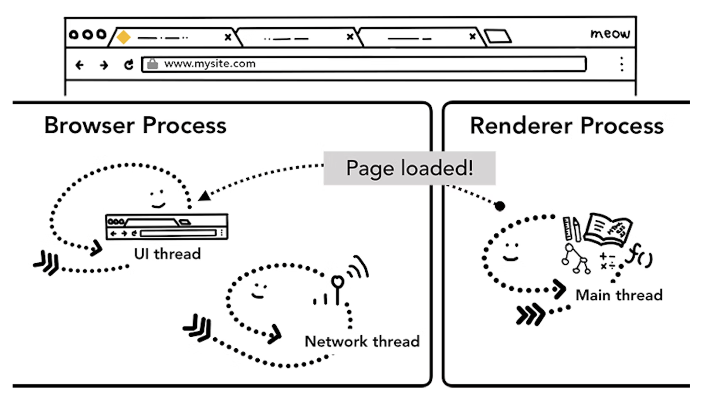

# #2 What happens in navigation

> 원본 글  
> https://developer.chrome.com/blog/inside-browser-part2/

**Series**

- [#1 Core computing terminology and Chrome’s multi-process architecture](https://github.com/taeyoungs/Goals/tree/main/broswer/%231_Core_computing_terminology_and_Chrome%E2%80%99s_multi-process_architecture)
- #2 Where a user requests a site and the browser prepares to render a page (현재)
- [#3 Inner workings of a Renderer Process](https://github.com/taeyoungs/Goals/tree/main/broswer/%233_Inner_workings_of_a_Renderer_Process)
- #4 Input is coming to the Compositor

**목차**

- [#2 What happens in navigation](#2-what-happens-in-navigation)
  - [Overview](#overview)
  - [It starts with a browser process](#it-starts-with-a-browser-process)
  - [A Simple navigation](#a-simple-navigation)
    - [Step 1: Handling input](#step-1-handling-input)
    - [Step 2: Start navigation](#step-2-start-navigation)
    - [Step 3: Read response](#step-3-read-response)
    - [Step 4: Find a renderer process](#step-4-find-a-renderer-process)
    - [Step 5: Commit navigation](#step-5-commit-navigation)
    - [Extra Step: Initial load complete](#extra-step-initial-load-complete)
  - [Navigating to a different site](#navigating-to-a-different-site)
  - [In case of Service Worker](#in-case-of-service-worker)
  - [Navigation Preload](#navigation-preload)
  - [Wrap-up](#wrap-up)

## Overview

파트 1에서 서로 다른 **Process**들과 **Thread**들이 어떻게 브라우저의 여러 부분들을 다루는지 알아봤었다. 이번 포스팅에선 웹사이트를 보여주기 위해 **Process**들과 **Thread**들이 어떻게 소통하는지 더 깊게 알아볼 것이다.

웹 브라우징의 간단한 사용 사례를 살펴보자. 우리가 브라우저에 **URL**를 입력하면 브라우저는 인터넷에서 데이터를 가져와 페이지를 보여준다. 이번 포스팅에서는 사용자가 사이트를 요청하고 브라우저가 페이지를 렌더링할 준비를 하는 부분에 초점을 맞출 것이다. - `navigation`이라고도 알려진

## It starts with a browser process

> Figure 1: Browser UI at the top, diagram of the browser process with UI, network, and storage thread inside at the bottom  
> 출처: https://developer.chrome.com/blog/inside-browser-part2/

파트 1에서도 다뤘듯이, 탭 밖의 모든 것은 **Browser Process**가 관장한다. **Browser Process**는 브라우저의 버튼과 입력창을 그리는 **UI thread**, 인터넷에서 데이터를 수신하기 위해 네트워크 스택을 처리하는 **Network thread** 그리고 파일 등에 대한 접근 권한을 제어하는 **Storage thread**와 같은 `Thread`들을 가지고 있다. 우리가 주소창에 `URL`을 입력했을 때, 우리의 입력창(웹페이지에 보이는)은 **Browser Process**의 **UI thread**에 의해서 처리되고 있다.

## A Simple navigation

### Step 1: Handling input

사용자가 주소창에 무언가를 입력하기 시작할 때, **UI thread**가 첫 번째로 묻는 건 “이건 `Search Query` 또는 `URL`인가요?” 이다. **Chrome**에선 주소창 또한 하나의 검색 입력창이기에 **UI** **thread**는 사용자를 검색 엔진으로 보낼지 요청한 사이트로 보낼지를 Parsing 및 결정해야 한다.

> Figure 2: UI Thread asking if the input is a search query or a URL  
> 출처: https://developer.chrome.com/blog/inside-browser-part2/

### Step 2: Start navigation

사용자가 엔터를 친 순간, 사이트 컨텐츠를 가져오기 위해 네트워크 요청을 시작한다. 탭 구석에 로딩 스피너가 보여지고 **Network thread**는 **DNS** 조회 및 요청에 대한 **TLS** 연결 설정과 같은 적절한 프로토콜을 거친다.

> Figure 3: the UI thread talking to the network thread to navigate to mysite.com  
> 출처: https://developer.chrome.com/blog/inside-browser-part2/

이때, **Network thread**는 HTTP 301과 같은 서버 리다이렉트 헤더를 수신할 수도 있다. 이 경우 **Network thread**는 서버가 리다이렉트를 요청하는 **UI thread**와 소통한다. 그리고 나서, 다른 `URL` 요청이 시작된다.

### Step 3: Read response

> Figure 4: response header which contains Content-Type and payload which is the actual data  
> 출처: https://developer.chrome.com/blog/inside-browser-part2/

**Response body**가 들어오기 시작하면, **Network thread**는 필요한 경우 `stream`의 처음 몇 바이트를 확인한다. **Response**의 `Content-Type` 헤더는 데이터가 무슨 타입인지 알려줘야 하지만 `Content-Type` 헤더가 누락되거나 잘못됐을 경우, [MIME Type sniffing](https://developer.mozilla.org/docs/Web/HTTP/Basics_of_HTTP/MIME_types)을 수행한다. **MIME Type sniffing**은 **tricky bussiness**라고 표현되는데 다음 링크에서 다른 브라우저가 `Content-Type`/`payload` 쌍을 처리하는 방법을 볼 수 있다.

[https://source.chromium.org/chromium/chromium/src/+/main:net/base/mime_sniffer.cc;l=5](https://source.chromium.org/chromium/chromium/src/+/main:net/base/mime_sniffer.cc;l=5)

> Detecting mime types is a tricky business because we need to balance compatibility concerns with security issues. Here is a survey of how other browsers behave and then a description of how we intend to behave.
>
> MIME 유형을 감지하는 것은 보안 문제와 호환성 문제의 균형을 맞춰야 하기 때문에 까다로운 작업이다. 다음은 다른 브라우저가 어떻게 작동하는지에 대한 조사와 우리가 의도하는 작동 방식에 대한 설명이다.
>
> 위 링크를 참조해봤을 때 `Content-Type`에 대한 정보가 없을 경우 `payload`를 **HTML**로 대한다.

만약 **Response**가 **HTML**일 경우, **Renderer Process**에게 데이터를 전달하는 것이 다음 수순이겠지만 `zip` 파일 또는 다른 파일인 경우 다운로드 요청을 의미하므로 **Download Manager**에게 데이터를 전달해야 한다.

> Figure 5: Network thread asking if response data is HTML from a safe site  
> 출처: https://developer.chrome.com/blog/inside-browser-part2/

이 부분은 [SafeBrowsing](https://safebrowsing.google.com/) 검사가 일어나는 곳이기도 하다.

> **SafeBrowsing** 검사란 구글에서 제공하고 있는 검사 중 하나로 구글을 사용하는 사용자가 다양한 유형의 악의적인 사이트 또는 애플리케이션으로부터 스스로를 지킬 수 있도록 도와준다. 대표적인 기능은 검사 기능은 다음과 같다.
>
> - 2005년 `Phishing` 사이트와 같이 악의적인 공격을 막기 위한 기능이 추가
> - 2006년 `Malware`를 방지하기 위한 기능이 추가
> - 2014년 원하지 않는 소프트웨어 다운로드를 자동으로 막는 기능이 추가
> - …

만약 **도메인**과 **Response** 데이터가 악의적인 사이트로 알려진 곳과 일치한다면, **Network thread**가 경고 페이지를 사용자에게 노출시켜 해당 사항을 알린다. 추가적으로 민감한 **cross-site** 데이터가 **Renderer Process**에 전달되지 않도록 [**C**ross **O**rigin **R**ead **B**locking (**CORB**)](https://www.chromium.org/Home/chromium-security/corb-for-developers) 검사가 이루어진다.

### Step 4: Find a renderer process

모든 검사 과정이 마무리되고 **Network thread**가 브라우저가 요청된 사이트 사이트로 이동해야 한다고 확신하게 된다면, **Network thread**는 **UI thread**에게 데이터가 준비됐다고 알린다. 그리고 나서 **UI thread**는 웹 페이지 렌더링을 수행할 **Renderer Process**를 찾는다.

> Figure 6: Network thread telling UI thread to find Renderer Process  
> 출처: https://developer.chrome.com/blog/inside-browser-part2/

네트워크 요청이 응답을 받는 데 수백 milliseconds가 걸릴 수 있으므로 이 프로세스의 속도를 높이는 최적화가 적용된다. **UI thread**가 **Network thread**에게 **URL** 요청을 보내는 2단계 때, 어느 사이트로 이동할지는 이미 알고 있다. 따라서, **UI thread**는 네트워크 요청과 동시에 **Renderer Process**를 찾으려고 시도한다. 이렇게 하면 모든 것이 이상적으로 진행됐을 경우 **Renderer Process**는 이미 **Network thread**가 데이터를 수신했을 때 대기 위치에 있게 된다. 이러한 사전 준비 과정은 만약 **cross-site** 리다이렉트가 발생한 경우 다른 **Process**가 필요할 수도 있기 때문에 이루어지지 않을 수도 있다.

### Step 5: Commit navigation

이제 데이터와 **Renderer Process**가 준비되었으므로 `navigation`을 `commit`하기 위해 **Browser Process**에서 **Renderer Process**로 **IPC**가 전송된다. 또한 **Renderer Process**가 **HTML** 데이터를 계속해서 수신할 수 있도록 `data stream`을 전달한다. **Browser Process**가 **Renderer Process**에서 `commit`이 발생했다는 확인을 들으면, `navigation`이 완료가 되고 **Document**는 로딩 단계에 접어든다.

이때, 주소창이 갱신되고 **security indicator**와 **site settings UI**는 새로운 페이지의 사이트 정보를 반영한다. **Tab**의 **session history**가 업데이트 되어 `back`/`forward` 버튼이 방금 탐색한 사이트로 이동한다. **Tab**이나 **Window**을 닫을 때 `tab`/`session` 복원을 용이하게 하기 위해 **session history**가 디스크에 저장된다.

> Figure 7: IPC between the browser and the renderer processes, requesting to render the page  
> 출처: https://developer.chrome.com/blog/inside-browser-part2/

### Extra Step: Initial load complete

`navigation`이 `commit` 되고 나면, **Renderer Process**는 리소스를 계속 로딩하고 페이지를 렌더링한다. 페이지 렌더링 단계에 대해서는 다음 포스팅에서 더 자세히 알아볼 것이다. **Renderer Process**가 렌더링을 "**finishes**"하면, **Browser Process**에게 다시 **IPC**를 보낸다. (**IPC**를 보내는 때는 모든 `onload` 이벤트가 페이지의 모든 프레임에서 시작되고 실행이 완료된 후다) 이때, **UI thread**는 **Tab**의 `loading spinner`를 멈춘다.

"**finishes**"라고 표현한 이유는 클라이언트 사이드 **JavaScript**가 이 시점 이후에 추가 리소스를 가져오고 새로운 `view`를 렌더링할 수 있기 때문이다.

> Figure 8: IPC from the renderer to the browser process to notify the page has "loaded"  
> 출처: https://developer.chrome.com/blog/inside-browser-part2/

## Navigating to a different site

간단한 `navigation`이 완료됐다! 하지만 사용자가 다시 주소창에 다른 **URL**을 입력한다면 무슨 일이 발생할까? **Broswer Process**는 다른 사이트로 `navigate`하기 위해서 위에서 설명한 단계를 다시 수행할 것이다. 단, 위에서 설명한 단계를 다시 밟기 전에, 현재 렌더링된 사이트가 `beforeunload` 이벤트에 관심이 있는지 체크해봐야 한다.

`beforeunload`는 사용자가 다른 곳으로 `navigate`하거나 **Tab**을 닫으려고 시도할 때 "이 사이트를 떠나시겠습니까?" 라는 알림을 만들어 낼 수 있다. **JavaScript**를 포함하여 **Tab** 안의 모든 것은 **Renderer Process**에 의해 처리되므로 **Browser Process**는 새로운 `navigation` 요청이 들어왔을 때 현재 **Renderer Process**를 체크해야 한다.

> ✋  **주의**
>
> 무조건 `beforeunload` 핸들러를 추가하려고 하지 마라. `beforeunload` 핸들러를 추가하게 되면 `navigation`이 시작되기 전에 해당 핸들러를 수행해야하기 때문에 지연(대기 시간)을 발생시킨다. 이 이벤트 핸들러는 반드시 필요한 경우메나 사용해야 한다. 예를 들어, 만약 사용자가 페이지에 입력한 데이터를 잃어버릴 수 있다고 경고해줘야 하는 경우

> Figure 9: IPC from the browser process to a renderer process telling it that it's about to navigate to a different site  
> 출처: https://developer.chrome.com/blog/inside-browser-part2/

만약 **Renderer Process**에서 `navigation`이 시작된 경우(예를 들어, 사용자가 링크를 클릭했거나 Client-side **JavaScript**가 `window.location = "https://newsite.com"`과 같은 코드를 실행한 경우) **Renderer Process**는 `beforeunload` 핸들러를 체크해야 한다. 그리고 나서 **Browser Process**에서 `navigation`이 시작된 것과 동일한 과정을 거친다. 두 과정의 유일한 차이점은 `navigation` 요청의 시작점이 **Renderer Process**에서 **Browser Process**로 시작된다는 것 뿐이다.

현재 렌더링된 사이트가 아닌 다른 사이트로의 새로운 `navigation`이 발생했을 때, 별도의 **Render Process**가 호출되어 새로운 `navigation`을 처리하는 반면 기존 **Render Process**는 `unload`와 같은 이벤트를 처리하기 위해 유지된다. 페이지 생명주기에 대한 더 자세한 사항이 궁금하다면 다음 링크를 확인하자.

[Page Lifecycle API - Chrome Developers](https://developer.chrome.com/blog/page-lifecycle-api/#overview_of_page_lifecycle_states_and_events)

> Figure 10: 2 IPCs from a browser process to a new renderer process telling to render the page and telling old renderer process to unload  
> 출처: https://developer.chrome.com/blog/inside-browser-part2/

## In case of Service Worker

최근 **Navigation Process**의 변경점 중 하나는 [service worker](https://developer.chrome.com/docs/workbox/service-worker-overview/)의 등장이다. **Service Worker**는 애플리케이션 코드에 `network proxy`를 작성하는 방법이다. 웹 개발자가 로컬로 캐시할 항목과 네트워크에서 새 데이터를 가져올 시기를 더 잘 제어할 수 있도록 도와준다. 만약 **Service Worker**가 캐시에서 페이지를 가져오도록 설정되어 있다면, 더 이상 네트워크를 통해 데이터를 요청할 필요가 없다.

여기서 중요한 점은 **Service Worker**가 **Renderer Process**에서 돌아가는 **JavaScript** 코드라는 것이다. 그렇다면 `navigation` 요청이 들어왔을 때, **Browser Process**는 어떻게 사이트에 **Service Worker**가 있다는 사실을 알까?

> Figure 11: the network thread in the browser process looking up service worker scope  
> 출처: https://developer.chrome.com/blog/inside-browser-part2/

**Service Worker**가 등록될 때, **Service Worker**의 `Scope`에 대한 참조를 유지한다. (해당 `Scope`에 더 자세히 알고 싶다면 [Service Worker 생명주기 포스팅](https://web.dev/service-worker-lifecycle/)을 읽어보자) `navigation`이 발생했을 때, **Network thread**는 등록되어 있던 **Service Worker**의 `Scope`에서 도메인을 체크하고 만약 **Service Worker**에 **URL**이 등록되어 있다면, **UI thread**는 **Service Worker** 코드를 수행하기 위한 **Renderer Process**를 찾는다. **Service Worker**는 캐시에서 데이터를 가져와 네트워크를 통해 데이터를 요청할 필요가 없도록 하거나 네트워크를 통해 새로운 리소스를 요청한다.

> Figure 12: the UI thread in a browser process starting up a renderer process to handle service workers; a worker thread in a renderer process then requests data from the network  
> 출처: https://developer.chrome.com/blog/inside-browser-part2/

## Navigation Preload

만약 **Service Worker**가 결국에 네트워크를 통해 데이터를 요청하기로 결정했다면 **Browser Process**와 **Renderer Process**간의 `round trip`으로 인해 지연이 발생할 수 있다는 것을 예상할 수 있다. [Navigation Preload](https://web.dev/navigation-preload/)는 **Service Worker**가 시작과 동시에 리소스를 로딩함으로써 이러한 **Process**의 속도를 높이기 위한 메커니즘이다. 이는 헤더로 이러한 요청을 표시하여, 서버로 하여금 이러한 요청들에 대해 다른 컨텐츠를 보낼 수 있도록 한다. 예를 들어, 전체 **Document** 파일을 보내는 것이 아닌 업데이트된 데이터만 보내게끔 만드는 경우

> Figure 13: the UI thread in a browser process starting up a renderer process to handle service worker while kicking off network request in parallel  
> 출처: https://developer.chrome.com/blog/inside-browser-part2/

## Wrap-up

이 포스팅에선, `navigation` 하는 동안 무슨 일이 발생하는지와 **Response** 헤더와 클라이언트 사이드 **JavaScript**와 같은 웹 애플리키에션 코드가 어떻게 브라우저와 상호 작용하는지 살펴봤다. 브라우저가 네트워크에서 데이터를 가져오기 위해 거쳐야 하는 단계를 알면 **Navigation Preload**와 같은 API가 왜 개발됐지는 더 쉽게 이해할 수 있다. 다음 포스팅에선, 브라우저가 페이지를 렌더링하기 위해 **HTML**/**CSS**/**JavaScript**를 어떻게 평가하는지 알아볼 것이다.
