# #3 Inner workings of a Renderer Process

> 원본 글  
> https://developer.chrome.com/blog/inside-browser-part3/

**Series**

- [#1 Core computing terminology and Chrome’s multi-process architecture](https://github.com/taeyoungs/Goals/tree/main/broswer/%231_Core_computing_terminology_and_Chrome%E2%80%99s_multi-process_architecture)
- [#2 Where a user requests a site and the browser prepares to render a page](https://github.com/taeyoungs/Goals/tree/main/broswer/%232_What_happens_in_navigation)
- #3 Inner workings of a Renderer Process (현재)
- [#4 Input is coming to the Compositor](https://github.com/taeyoungs/Goals/tree/main/broswer/%234_Input_is_coming_to_the_Compositor)

**목차**

- [#3 Inner workings of a Renderer Process](#3-inner-workings-of-a-renderer-process)
  - [Inner workings of a Renderer Process](#inner-workings-of-a-renderer-process)
  - [Renderer processes handle web contents](#renderer-processes-handle-web-contents)
  - [Parsing](#parsing)
    - [Construction of a DOM](#construction-of-a-dom)
    - [Subresource loading](#subresource-loading)
    - [JavaScript can block the parsing](#javascript-can-block-the-parsing)
  - [Hint to browser how you want to load resources](#hint-to-browser-how-you-want-to-load-resources)
  - [Style calculation](#style-calculation)
  - [Layout](#layout)
  - [Paint](#paint)
    - [Updating rendering pipeline is costly](#updating-rendering-pipeline-is-costly)
  - [Compositing](#compositing)
    - [How would you draw a page?](#how-would-you-draw-a-page)
    - [What is compositing](#what-is-compositing)
    - [Diving into layers](#diving-into-layers)
    - [Raster and composite off of the main thread](#raster-and-composite-off-of-the-main-thread)
  - [Wrap Up](#wrap-up)

## Inner workings of a Renderer Process

이전 포스팅들에서 우리는 `multi-process architecture`와 `navigation flow`에 대해서 알아봤다. 이번 포스팅에서는 **renderer process**의 내부에서 무슨 일이 발생하는지에 대해 알아볼 것이다.

Renderer process는 웹 성능의 많은 측면을 다룬다. `renderer process`의 내부에서 많은 일이 발생하기 때문에 이 포스팅은 전반적인 개요만을 다룬다. 만약 `renderer process`에 대해 더 깊게 알아보고 싶다면, [the Performance section of Web Fundamentals](https://developers.google.com/web/fundamentals/performance/why-performance-matters/)에 더 많은 정보가 있으니 이를 확인하자.

## Renderer processes handle web contents

**Renderer process**는 탭 내부에서 발생하는 모든 일을 담당한다. **Render process**에서 **main thread**는 우리가 사용자에게 보내는 대부분의 코드들을 다룬다. 만약 **Web Worker** 또는 **Service Worker**를 사용하는 경우 **JavaScript**의 일부가 **Worker thread**에 의해 처리되는 경우도 있다. 페이지를 효과적이고 부드럽게 렌더링하기 위해 **Compositor**와 **Raster thread** 또한 **Renderer process** 내에서 실행된다.

**Renderer process**의 핵심 작업은 **HTML**, **CSS** 그리고 **JavaScript**를 사용자가 상호 작용할 수 있는 웹 페이지로 변환하는 것이다.

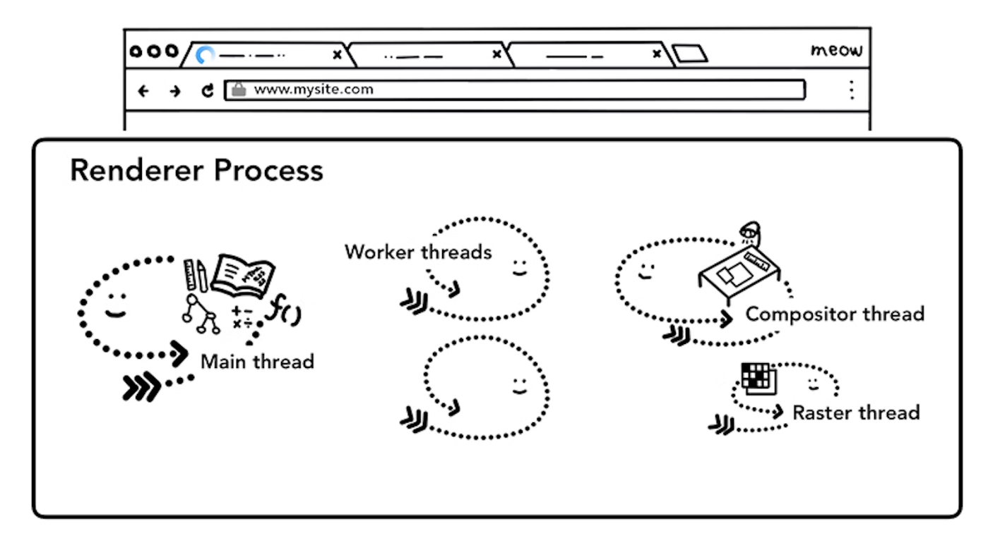

> Figure 1: Renderer process with a main thread, worker threads, a compositor thread, and a raster thread inside  
> 출처: https://developer.chrome.com/blog/inside-browser-part3/

## Parsing

### Construction of a DOM

**Renderer process**가 `navigation`에 대한 `commit` 메시지를 수신하고 **HTML** 데이터를 수신하기 시작하면 **main thread**는 `text string`(**HTML**)을 파싱하고 이를 **Document Object Model**(`DOM`)로 변환하기 시작한다.

**DOM**은 웹 개발자가 **JavaScript**를 통해 상호 작용할 수 있는 데이터 구조 및 **API**뿐 아니라 페이지에 대한 브라우저의 내부 표현이다.

**HTML** 문서를 **DOM**으로 파싱하는 것은 `HTML Standard`에 의해 정의되어 있다. 눈치챘을 수도 있겠지만 **HTML**을 잘못 작성하는 것에 대해 브라우저는 절대 에러를 던지지 않는다. 예를 들어, `
` 태그로 닫는 것을 깜빡했을 지언정 유효한 **HTML**이다. `Hi! <b>I'm <i>Chrome</b>!</i>`(`i` 태그 전에 `b` 태그가 닫힌 상황)와 같은 잘못된 마크업은 `Hi! <b>I'm <i>Chrome</i></b><i>!</i>`와 같이 작성된 것처럼 처리된다. 이는 **HTML** 스펙 상 이러한 오류들을 정상적으로 처리하도록 설계되었기 때문이다. 만약 이러한 처리에 대해 궁금하다면 HTML 스펙 상에 있는 "[An introduction to error handling and strange cases in the parser](https://html.spec.whatwg.org/multipage/parsing.html#an-introduction-to-error-handling-and-strange-cases-in-the-parser)
" 섹션을 읽어보면 된다.

### Subresource loading

웹사이트는 주로 이미지, **CSS** 그리고 **JavaScript**와 같은 외부 리소스들을 사용한다. 이러한 파일들을 네트워크 또는 캐시로부터 가져올 필요가 있다. **Main thread**가 **DOM**을 만들기 위해 **HTML**을 파싱하는 동안 이러한 리소스들을 하나하나 찾아서 요청할 수도 있지만 속도를 높이기 위해 `preload scanner`라는 것이 동시에 실행된다. 만약 **HTML** 문서에 `` 또는 `<link>`와 같은 것이 있다면, `preload scanner`는 **HTML parser**에 의해 생성된 토큰을 엿보고 **Browser process**의 **network thread**에게 요청을 보낸다.

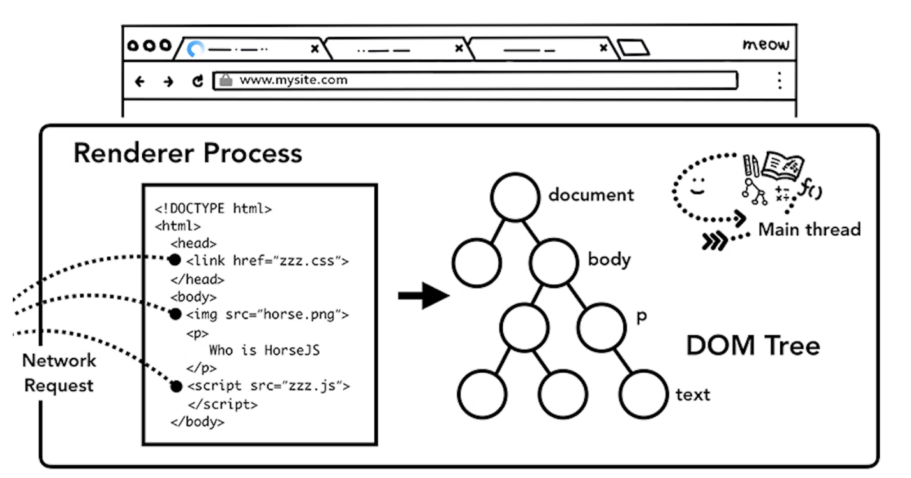

> Figure 2: The main thread parsing HTML and building a DOM tree  
> 출처: https://developer.chrome.com/blog/inside-browser-part3/

### JavaScript can block the parsing

**HTML parser**가 `<script>` 태그를 발견하면, **HTML** 문서의 파싱을 멈추고 **JavaScript** 코드를 가져와서 파싱한 뒤 실행한다.

**이유가 뭘까?**

왜냐하면 **JavaScript**는 전체 **DOM** 구조([overview of the parsing model](https://html.spec.whatwg.org/multipage/parsing.html#overview-of-the-parsing-model) in the HTML spec has a nice diagram).를 바꿀 수 있는 `document.write()`와 같은 것을 사용하여 **Document**의 모양을 변경할 수 있기 때문이다. 이것이 **HTML parser**가 **HTML** 문서를 다시 파싱하기 시작하기 전에 **JavaScript**의 실행을 기다려야 하는 이유이다. 만약 JavaScript의 실행에서 무슨 일이 발생하는지 궁금하다면 다음 글을 확인해보자, [the V8 team has talks and blog posts on this](https://mathiasbynens.be/notes/shapes-ics).

## Hint to browser how you want to load resources

웹 개발자가 깔끔하게 리소스들을 가져오기 위해서 브라우저에게 힌트를 보낼 수 있는 방법에는 여러 가지가 있다. 만약 **JavaScript**로 `document.write()`를 사용하지 않는다면, `<script>` 태그에 `async` 또는 `defer` 속성을 추가할 수 있다. 이리하면 브라우저는 **JavaScript** 코드를 비동기적으로 가져오고 실행하기에 **HTML** 파싱의 진행을 막지 않는다. 상황이 맞는다면 `JavaScript Module`을 사용할 수도 있다.

`<link rel="preload">`는 해당 리소스가 현재 `navigation`에 명확하게 필요하고 가능한한 빠르게 다운로드 받고 싶다고 브라우저에게 알리는 방법이다.

## Style calculation

**CSS**를 가지고 페이지 요소들을 스타일링할 수 있기 때문에 **DOM**을 가지게 된 것만으로는 페이지가 어떻게 생겼는지 알기엔 충분하지 않다. **Main thread**는 **CSS**를 파싱하고 각 **DOM** 노드의 `Computed Style`을 결정한다. 이는 **CSS** 선택자에 기반하여 각 요소에 어떤 스타일이 적용되는지에 대한 정보다. **Chrome DevTools**의 `computed` 섹션에서 이에 대한 정보를 확인해볼 수 있다.

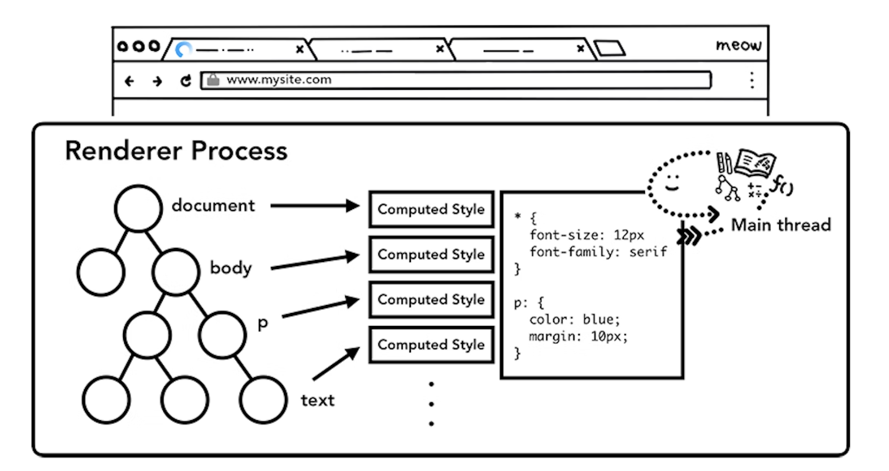

> Figure 3: The main thread parsing CSS to add computed style  
> 출처: https://developer.chrome.com/blog/inside-browser-part3/

비록 어떠한 **CSS**도 제공하지 않았을 지라도 각 **DOM** 노드는 `Computed Style`을 가지고 있다. `<h1>` 태그는 `<h2>` 태그보다 크게 표시되며 `margin`은 각 요소에 이미 정의되어 있다. 이는 브라우저가 기본적인 Style Sheet를 가지고 있기 때문이다. 만약 **Chrome**의 Default **CSS**가 궁금하다면 [여기](https://source.chromium.org/chromium/chromium/src/+/main:third_party/blink/renderer/core/html/resources/html.css)를 확인해보자.

## Layout

이제 **Renderer process**는 문서의 구조와 각 노드의 스타일을 알고 있다. 하지만 아직도 페이지를 렌더링하기에는 충분하지 않다. 전화로 친구에게 그림에 대해 묘사한다고 상상해보자. "거기에는 빨갛고 큰 원과 파랗고 작은 사각형이 있어"라는 묘사는 친구에게 그림이 정확히 어떻게 생겼는지 알려주기 위한 정보로써 충분하지 않다.

> 위치에 대한 정보가 없다.

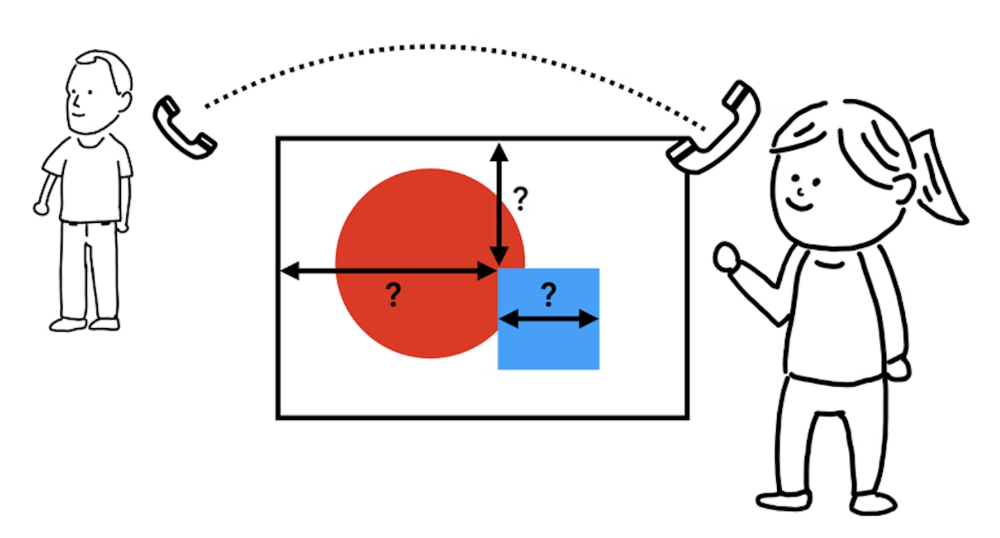

> Figure 4: A person standing in front of a painting, phone line connected to the other person  
> 출처: https://developer.chrome.com/blog/inside-browser-part3/

**Layout**은 요소들의 기하학적 정보를 찾기 위한 과정이다. **Main thread**는 **DOM**과 `Computed Style`을 지나 `x`, `y` 좌표와 **Bounding box sizes**와 같은 정보를 가진 **Layout tree**를 생성한다. **Layout tree**는 **DOM tree**와 유사한 구조일 수도 있지만 이 **Tree**에는 페이지에 표시되는 것과 관련된 정보만 포함되어 있다.

만약 특정 요소에 `disaply: none`을 제공한 상태라면 해당 요소는 **Layout tree**의 일부가 아니다(그러나, `visibility: hidden`을 제공한 경우 **Layout tree**의 일부다). 비슷하게, 만약 특정 요소에 `p::before{content:"Hi!"}`와 같은 내용과 함꼐 `pseudo class`를 제공하고 있다면, 해당 요소는 비록 **DOM tree**에 없을지라도 **Layout tree**에는 포함된다.

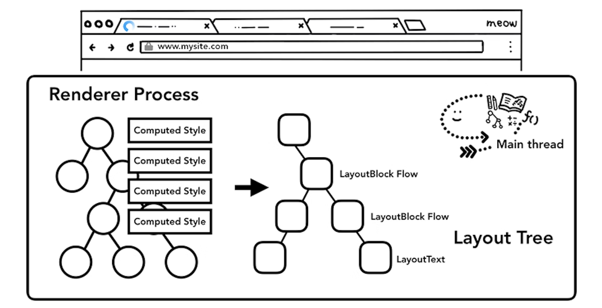

> Figure 5: The main thread going over DOM tree with computed styles and producing layout tree  
> 출처: https://developer.chrome.com/blog/inside-browser-part3/

<video src="videos/video1.mp4" controls width="600"></video>

> Figure 6: Box layout for a paragraph moving due to line break change
> 출처: https://developer.chrome.com/blog/inside-browser-part3/

페이지의 **Layout**을 결정하는 것은 어려운 작업이다. 위에서 아래로의 `Block flow`와 같은 가장 간단한 페이지 레이아웃조차도 단락의 크기와 모양에 영향을 미치기 때문에 글꼴의 크기와 줄 바꿈 위치를 고려해야 합니다.

> 다음 단락이 있어야할 위치에 영향을 주기 때문

**CSS**는 한쪽 방향으로 요소를 띄울 수도(`float`) 있고 mask overflow item 할 수도 있으며 작성 방향을 변경할 수도 있다. You can imagine, this layout stage has a mighty task. 크롬에선, 엔지니어의 한 팀 전체가 **Layout** 파트에서 일을 한다. If you want to see details of their work, [few talks from BlinkOn Conference](https://www.youtube.com/watch?v=Y5Xa4H2wtVA) are recorded and quite interesting to watch.

## Paint

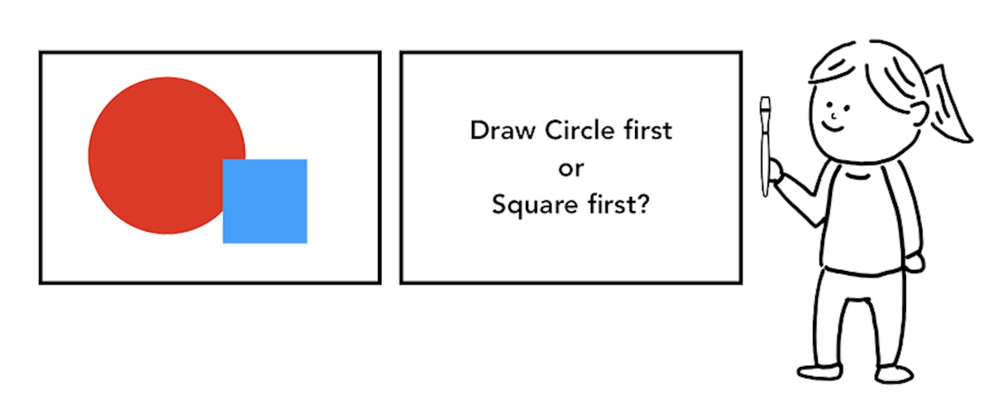

> Figure 7: A person in front of a canvas holding paintbrush, wondering if they should draw a circle first or square first  
> 출처: https://developer.chrome.com/blog/inside-browser-part3/

**DOM**, **Style** 그리고 **Layout**을 가진 상태지만 여전히 페이지를 렌더링하기엔 충분하지 않다. 우리가 그림을 다시 그린다고 해보자. 우리는 사이즈, 모양 그리고 요소의 위치도 알지만 이러한 요소들의 칠하는 순서도 판단해야 한다.

예를 들어, `z-index`가 특정 요소에 설정되어 있다고 해보자. 이 경우 **HTML**에 작성된 요소의 순서대로 그리면 잘못된 렌더링이 된다.

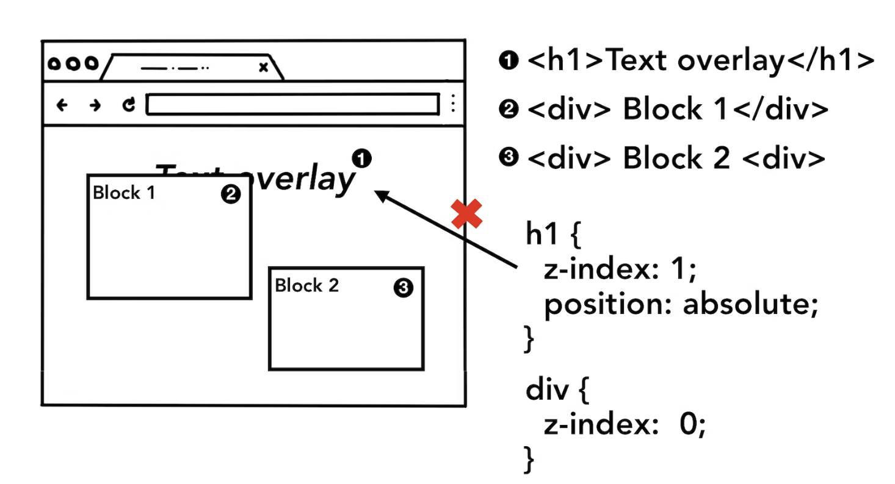

> Figure 8: Page elements appearing in order of an HTML markup, resulting in wrong rendered image because z-index was not taken into account  
> 출처: https://developer.chrome.com/blog/inside-browser-part3/

**Paint** 단계에서 **Main thread**는 **Layout tree**를 따라 `Paint record`를 생성한다. `Paint record`는 "background first, then text, then rectangle"와 같은 **Painting process(그림 그리는 순서)**에 대한 정보다. 만약 **JavaScript**를 사용하여 `<canvas>` 요소에 무언갈 그린다면, 이 과정이 친숙할 것이다.

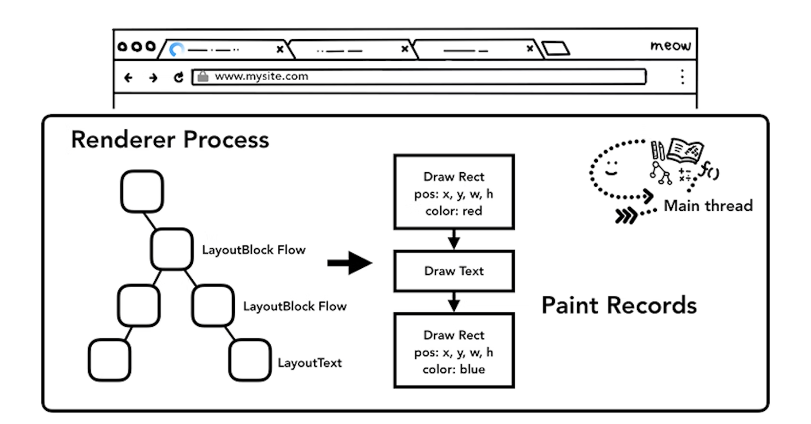

> Figure 9: The main thread walking through layout tree and producing paint records  
> 출처: https://developer.chrome.com/blog/inside-browser-part3/

### Updating rendering pipeline is costly

<video src="videos/video2.mp4" controls width="600"></video>

> Figure 10: DOM+Style, Layout, and Paint trees in order it is generated
> 출처: https://developer.chrome.com/blog/inside-browser-part3/

렌더링 파이프라인에서 파악해야 하는 가장 중요한 것은 **각 단계에서 이전 작업의 결과를 사용**하여 새 데이터를 생성한다는 것이다. 예를 들어, 만약 **Layout tree**에서 변경 사항이 있는 경우 문서의 영향을 받은 부분에 대해 **Paint** 순서를 다시 생산해야 한다.

만약 애니메이션을 적용한 요소가 있는 경우 브라우저는 이러한 작업을 매 프레임 사이에 실행하게 된다. 대부분의 디스플레이는 초당 60번 스크린을 새로고침한다. (60 fps); animation will appear smooth to human eyes when you are moving things across the screen at every frame. 그러나 애니메이션이 그 사이의 프레임을 놓치면 페이지가 "버벅거림"으로 나타난다.

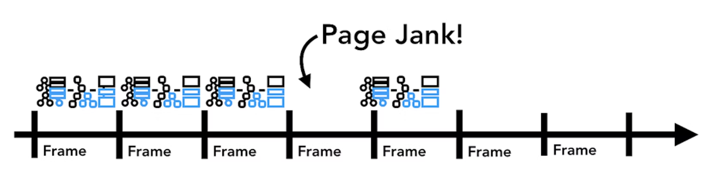

> Figure 11: Animation frames on a timeline  
> 출처: https://developer.chrome.com/blog/inside-browser-part3/

렌더링 작업이 스크린 새로고침을 따라가고 있더라도 이러한 계산 작업은 **Main thread**에서 실행되기에 애플리케이션이 **JavaScript**를 실행하면서 계산 작업이 막힐 수도 있다.

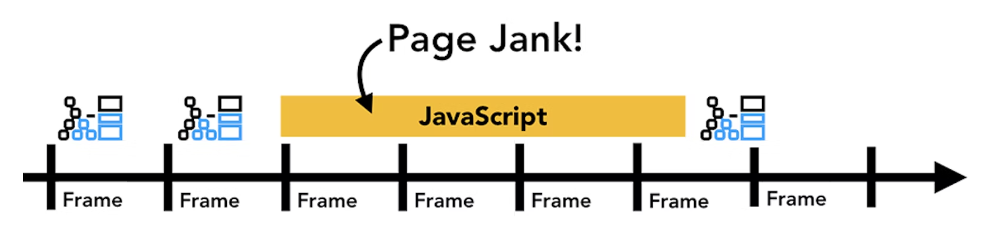

> Figure 12: Animation frames on a timeline, but one frame is blocked by JavaScript  
> 출처: https://developer.chrome.com/blog/inside-browser-part3/

**JavaScript** 작업을 작은 덩어리로 나누고 `requestAnimationFrame()`을 사용하여 모든 프레임에서 실행되도록 예약할 수 있다. For more on this topic, please see [Optimize JavaScript Execution](https://developers.google.com/web/fundamentals/performance/rendering/optimize-javascript-execution)
 . You might also run your [JavaScript in Web Workers](https://www.youtube.com/watch?v=X57mh8tKkgE) to avoid blocking the main thread.

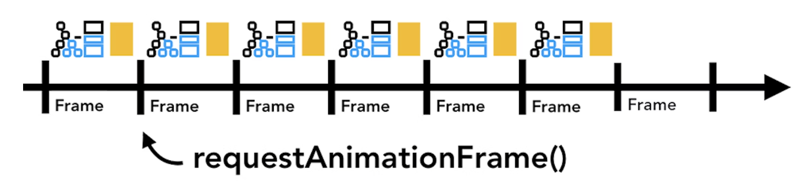

> Figure 13: Smaller chunks of JavaScript running on a timeline with animation frame  
> 출처: https://developer.chrome.com/blog/inside-browser-part3/

## Compositing

### How would you draw a page?

<video src="videos/video3.mp4" controls width="600"></video>

> Figure 14: Animation of naive rastering process
> 출처: https://developer.chrome.com/blog/inside-browser-part3/

이제 브라우저는 문서의 구조, 각 요소의 스타일, 페이지의 기하학적 요소 그리고 요소들이 그려질 순서를 알고 있다. 이것들을 갖고 어떻게 페이지를 그릴 수 있을까? 이 정보를 스크린의 픽셀로 바꾸는 방법을 `Rasterizing`이라고 한다.

> [https://ko.wikipedia.org/wiki/래스터\_그래픽스](https://ko.wikipedia.org/wiki/%EB%9E%98%EC%8A%A4%ED%84%B0_%EA%B7%B8%EB%9E%98%ED%94%BD%EC%8A%A4)
>
> **래스터 그래픽스 이미지** = **비트맵**  
> **비트맵**은 `픽셀(pixel)`이라고 부르는 컴퓨터 그래픽의 최소 단위에 맞춰 이미지 정보를 저장한다.

아마도 이를 처리하는 순수한 방법은 `viewport` 내에 부분들을 `raster` 하는 것이다. 만약 사용자가 페이지를 스크롤할 경우, `rastered frame`가 이동하고 누락된 부분을 더 `raster`하여 채운다. 이것이 **Chrome**이 처음 출시됐을 당시에 `Rasterizing`을 다루는 방식이었다. 하지만 모던 브라우저는 **합성**(`Compositing`)이라 불리는 보다 정교한 과정을 실행한다.

### What is compositing

<video src="videos/video4.mp4" controls width="600"></video>

> Figure 15: Animation of compositing process
> 출처: https://developer.chrome.com/blog/inside-browser-part3/

`Compositing`은 페이지의 일부를 레이어로 분리하고 개별적으로 `rasterize`한 다음 **Compositor thread**라는 별도의 **thread**에서 페이지로 **합성**(`composite`)하는 기술이다. 만약 스크롤이 발생할 경우, 레어이들은 이미 `rasterize` 되어 있기에 새로운 프레임을 **합성**(`composite`)하기만 하면 된다. 애니메이션은 레이어를 움직이고 새로운 프레임을 **합성**(`composite`)하여 동일한 방법으로 원하는 결과를 얻어낼 수 있다.

### Diving into layers

어떤 요소가 어떤 레이어에 있어야 하는지 알아내기 위해 **Main thread**는 **Layout tree**를 통해서 **Layer tree**를 생성한다. (이 부분은 **Chrome DevTools performance panel**에서 **Update Layer Tree**로 되어 있다)

`slide-in` 사이드 메뉴와 같이 별도의 레이어여야 하는 페이지의 특정 부분에 레이어가 표시되지 않은 경우 **CSS**에서 `will-change` 속성을 사용하여 브라우저에게 힌트를 줄 수 있다.

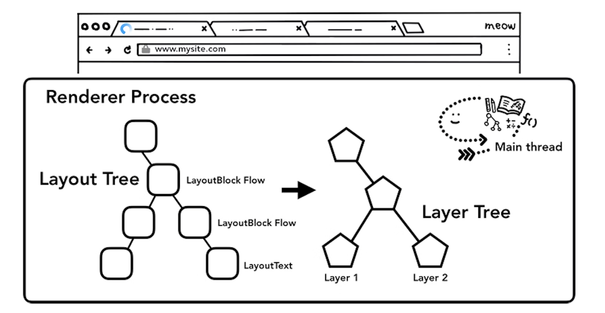

> Figure 16: The main thread walking through layout tree producing layer tree  
> 출처: https://developer.chrome.com/blog/inside-browser-part3/

모든 요소에 레이어를 제공하고 싶을 수도 있지만, 너무 많은 수의 레이어에 걸쳐 **합성**하면 매 프레임 페이지의 작은 부분을 `rasterizing` 하는 것보다 작업 속도가 느려질 수 있으므로 애플리케이션의 렌더링 성능을 측정하는 것이 중요하다.

### Raster and composite off of the main thread

**Layer tree**가 생성되고 **Paint** 순서가 결정되고 나면, **Main thread**는 해당 정보를 **Compositor thread**에게 `commit`한다. **Compositor thread**는 각 레이어를 `rasterize` 한다. 레이어는 페이지의 전체 길이만큼 클 수도 있으므로 **Compositor thread**는 레이어를 타일로 나누고 각 타일을 **Raster thread**에게 보낸다. **Raster thread**는 각 타일을 `rasterize`하고 **GPU** 메모리에 타일들을 저장한다.

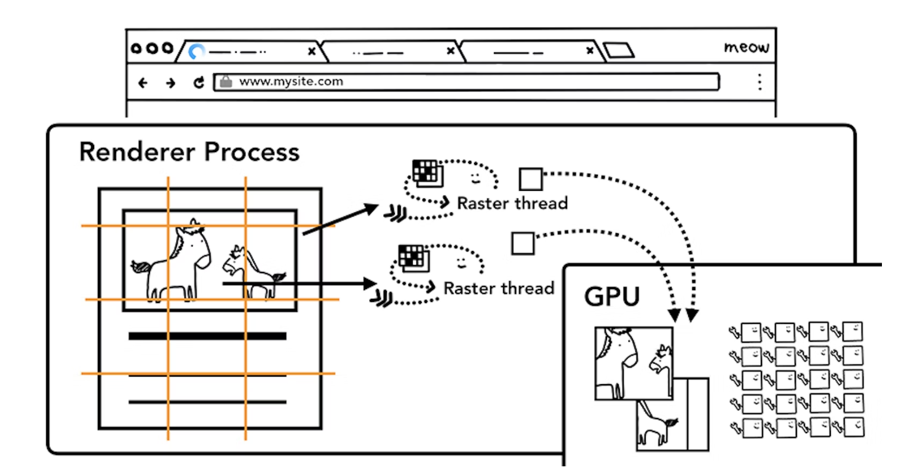

> Figure 17: Raster threads creating the bitmap of tiles and sending to GPU  
> 출처: https://developer.chrome.com/blog/inside-browser-part3/

**Compositor thread**는 다른 **Raster thread**의 우선 순위를 지정하여 `viewport`(또는 주변) 내의 항목을 먼저 `raster`화 할 수 있다. 또한 레이어에는 확대 동작과 같은 작업을 처리하기 위해 다양한 해상도에 대한 여러 타일링이 있습니다.

타일들이 `raster`화 되고 나면, **Compositor thread**는 **Compositor frame**을 생성하기 위 **draw quads**라는 정보를 모은다.

| 이름             | 설명                                                                                            |
| ---------------- | ----------------------------------------------------------------------------------------------- |
| Draw quads       | 메모리 내 타일의 위치, 페이지 합성을 고려하여 타일을 그릴 페이지 내 위치 등의 정보를 담고 있다. |
| Compositor frame | 페이지의 프레임을 나타내기 위한 draw quads의 모음                                               |

**Compositor frame**은 **IPC**를 통해 **Browser process**에게 제출된다. 이 시점에 브라우저 **UI** 변경을 위해 **UI Thread** 또는 `extension`을 위해 다른 **Renderer process**에서 또 다른 **Compositor frame**을 추가할 수 있다. 이러한 **Compositor frame**은 **GPU**로 보내져 화면에 표시된다. 만약 스크롤 이벤트가 발생하면, **Compositor thread**는 또 다른 **Compositor frame**을 생성하여 **GPU**에게 보낸다.

> Figure 18: Compositor thread creating compositing frame. Frame is sent to the browser process then to GPU  
> 출처: https://developer.chrome.com/blog/inside-browser-part3/

`Compositing`의 이점은 **Main thread**를 포함하지 않고 완료된다는 것이다. **Compositor thread**는 **Style caclulation** 또는 **JavaScript**의 실행을 기다릴 필요가 없다. This is why [compositing only animations](https://www.html5rocks.com/en/tutorials/speed/high-performance-animations/)
 are considered the best for smooth performance. 만약 `layout` 또는 `paint`가 다시 계산되어야 하는 경우 **Main thread**가 관련되어야 한다.

## Wrap Up

In this post, we looked at rendering pipeline from parsing to compositing. Hopefully, you are now empowered to read more about performance optimization of a website.

In the next and last post of this series, we'll look at the compositor thread in more details and see what happens when user input like `mouse move` and `click` comes in.
