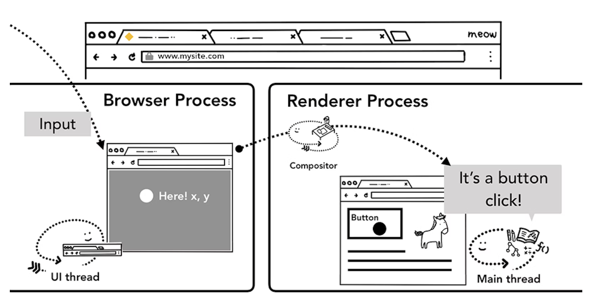
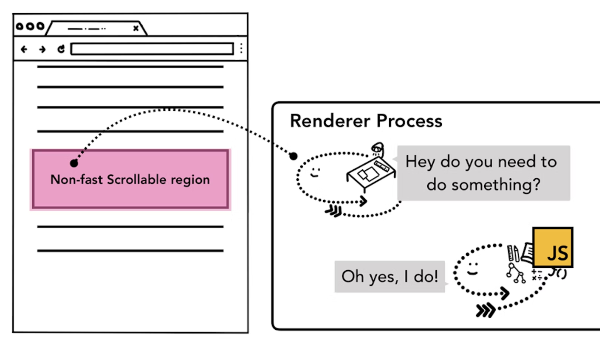
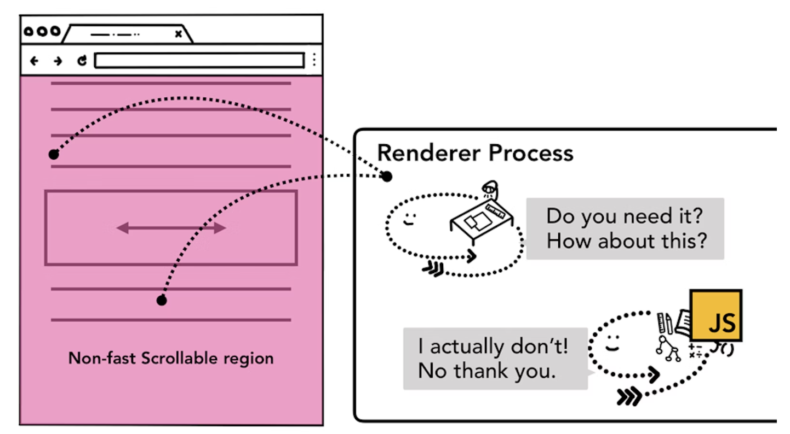
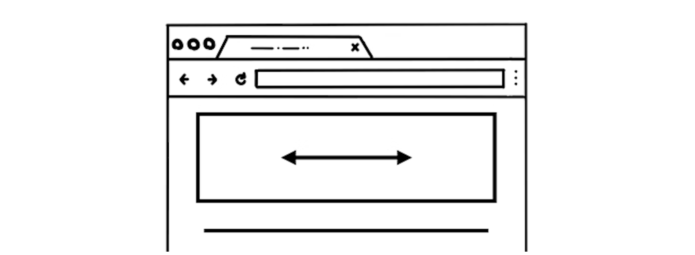
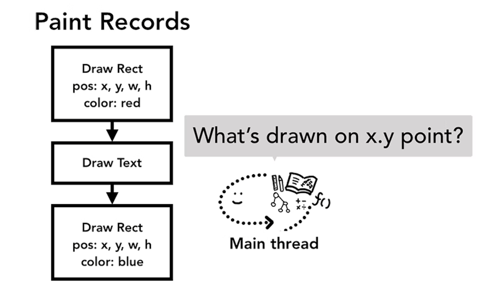
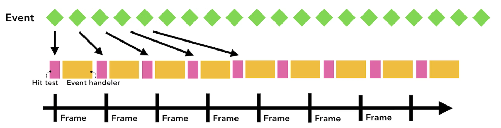
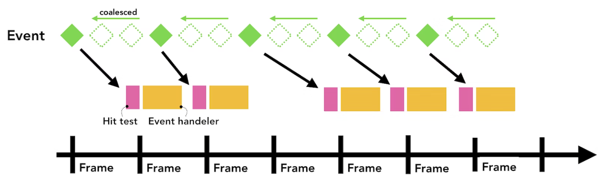
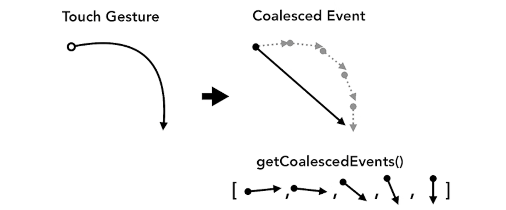

# #4 Input is coming to the Compositor

> 원본 글  
> https://developer.chrome.com/blog/inside-browser-part4/

**Series**

- [#1 Core computing terminology and Chrome’s multi-process architecture](https://github.com/taeyoungs/Goals/tree/main/broswer/%231_Core_computing_terminology_and_Chrome%E2%80%99s_multi-process_architecture)
- [#2 Where a user requests a site and the browser prepares to render a page](https://github.com/taeyoungs/Goals/tree/main/broswer/%232_What_happens_in_navigation)
- [#3 Inner workings of a Renderer Process](https://github.com/taeyoungs/Goals/tree/main/broswer/%233_Inner_workings_of_a_Renderer_Process)
- #4 Input is coming to the Compositor (현재)

**목차**

- [#4 Input is coming to the Compositor](#4-input-is-coming-to-the-compositor)
  - [개요](#개요)
  - [Input events from the browser’s point of view](#input-events-from-the-browsers-point-of-view)
  - [Compositor receives input events](#compositor-receives-input-events)
  - [Understanding non-fast scrollable region](#understanding-non-fast-scrollable-region)
    - [Be aware when you write event handlers](#be-aware-when-you-write-event-handlers)
  - [Check if the event is cancelable](#check-if-the-event-is-cancelable)
  - [Finding the event target](#finding-the-event-target)
  - [Minimizing event dispatches to the main thread](#minimizing-event-dispatches-to-the-main-thread)
  - [Use `getCoalescedEvents` to get intra-frame events](#use-getcoalescedevents-to-get-intra-frame-events)
  - [Wrap up](#wrap-up)

## 개요

이 포스팅에서는 사용자의 `input`이 들어올 때 **Compositor**가 어떻게 부드러운 상호 작용을 가능하게 하는지 알아볼 것이다.

## Input events from the browser’s point of view

`input events`라는 말을 들었을 때 아마 `textbox`에서 타이핑하거나 마우스 클릭하는 것을 생각할 것이다. 하지만 브라우저의 시선에서 `input`이란 사용자의 모든 제스처를 의미한다. 마우스 휠 스크롤도 `input event`이며 터치 또는 마우스 오버와 같은 제스처 또한 `input event`다.

화면에 터치와 같은 사용자 제스처가 발생하면 **Browser process**가 제일 먼저 제스처를 수신한다. 그러나 탭 내부의 컨텐츠는 **Renderer process**에 의해 처리되기 때문에 **Browser process**는 오직 해당 제스처가 어디서 발생했는지만 안다. 그래서 **Browser process**는 이벤트 타입(`touchstart`와 같은)과 제스처의 좌표값을 **Renderer process**에게 보낸다. **Renderer process**는 이벤트 대상을 찾고 대상에게 연결된 이벤트 리스너를 실행시킴으로써 이벤트를 적절하게 처리한다.



> Figure 1: Input event routed through the browser process to the renderer process  
> 출처: https://developer.chrome.com/blog/inside-browser-part4/

## Compositor receives input events

<video src="videos/1.mp4" width="600" controls></video>

> Figure 2: Viewport hovering over page layers  
> 출처: https://developer.chrome.com/blog/inside-browser-part4/

이전 포스팅에서 우리는 **Compositor**가 `rasterize`된 레이어들을 합성함으로써 스크롤을 부드럽게 처리하는 방법에 대해 살펴봤었다. 만약 페이지에 연결된 `input` 이벤트 리스너가 없다면, **Compositor thread**는 **Main thread**에 완전히 독립적인 새로운 합성 프레임을 만들 수 있다. 하지만 페이지에 연결된 이벤트 리스너들이 존재한다면? **Compositor thread**는 이벤트가 처리되어야 한다는 사실을 어떻게 알 수 있을까?

## Understanding non-fast scrollable region

**JavaScript**를 실행하는 것이 **Main thread**의 작업이기 때문에 페이지가 합성될 때 **Compositor thread**는 이벤트 핸들러가 연결된 페이지 영역을 `"Non-Fast Scrollable Region"`으로 표시한다. 이러한 정보를 가짐으로써 **Compositor thread**는 해당 지역에서 이벤트가 발생하는 경우 **Main thread**에게 `input event`를 보낼 수 있다. 만약 `input event`가 이러한 지역 밖에서 발생한다면, **Compositor thread**는 **Main thread**를 기다리지 않고 새로운 프레임을 합성한다.



> Figure 3: Diagram of described input to the non-fast scrollable region  
> 출처: https://developer.chrome.com/blog/inside-browser-part4/

### Be aware when you write event handlers

웹 개발에서 일반적인 이벤트 핸들링 패턴은 이벤트 위임이다. 이벤트가 버블링되기 때문에 최상위 요소에 하나의 이벤트 핸들러를 연결하고 이벤트 대상에 따라 작업을 위임할 수 있다. 아마 다음과 같은 코드를 보거나 작성한 적이 있을 것이다.

```jsx
document.body.addEventListener('touchstart', (event) => {
  if ((event, target === area)) {
    event.preventDefault();
  }
});
```

모든 요소에 대해 하나의 이벤트 핸들러만 작성하면 되기 때문에 이벤트 위임 패턴은 매력적이다. 하지만 만약 이 코드를 브라우저의 관점에서 보게 된다면, 이제 전체 페이지가 `non-fast scrollable region`으로 표시된다. 이는 애플리케이션이 페이지의 특정 부분들에서 발생하는 `input`들을 신경쓰지 않아도 되는 상황임에도 불구하고 **Compositor thread**가 **Main thread**와 계속 통신하고 `input event`가 들어올 때마다 기다려야 한다는 것을 말한다. 따라서, 이벤트 위임 방식은 **Compositor**의 부드러운 스크롤 기능을 손상시킨다.



> Figure 4: Diagram of described input to the non-fast scrollable region covering an entire page  
> 출처: https://developer.chrome.com/blog/inside-browser-part4/

이를 방지하기 위하여 이벤트 리스너에 `passive: true` 옵션을 전달할 수도 있다. 이는 브라우저에게 여전히 **Main thread**에서 이벤트를 수신하기를 원하지만 **Compositor**는 계속 진행하여 새로운 프레임을 합성할 수 있음을 암시한다.

```jsx
document.body.addEventListener(
  'touchstart',
  (event) => {
    if (event.target === area) {
      event.preventDefault();
    }
  },
  { passive: true }
);
```

## Check if the event is cancelable



> Figure 5: A web page with part of the page fixed to horizontal scroll  
> 출처: https://developer.chrome.com/blog/inside-browser-part4/

스크롤 방향을 가로 스크롤만 할 수 있게 제한하려고 하는 영역이 페이지 내에 있다고 상상해보자.

Using `passive: true` option in your pointer event means that the page scroll can be smooth, but vertical scroll might have started by the time you want to `preventDefault` in order to limit scroll direction. 이럴 때 `event.cancelable` 메서드를 사용하여 이를 체크할 수 있다.

```jsx
document.body.addEventListener(
  'pointermove',
  (event) => {
    if (event.cancelable) {
      event.preventDefault(); // block the native scroll
      /*
       *  do what you want the application to do here
       */
    }
  },
  { passive: true }
);
```

대신에 `touch-action`과 같은 CSS 규칙을 사용하여 이벤트 핸들러를 완전히 제거할 수도 있다.

```css
#area {
  touch-action: pan-x;
}
```

## Finding the event target



> Figure 6: The main thread looking at the paint records asking what's drawn on x.y point  
> 출처: https://developer.chrome.com/blog/inside-browser-part4/

**Compositor thread**가 `input event`를 **Main thread**에게 보냈을 때 가장 먼저 실행하는 것은 이벤트 대상을 찾기 위한 `Hit test`다. `Hit test`는 이벤트가 발생한 좌표에 무엇이 있는지 확인하기 위해 렌더링 프로세스에서 생성됐던 **Paint record** 데이터를 사용한다.

## Minimizing event dispatches to the main thread

이전 게시물에서 일반적인 디스플레이가 화면을 초당 60번 새로 고치는 방법과 부드러운 애니메이션을 위해 케이던스를 따라야 하는 방법에 대해 논의했다. `input`의 경우 일반적인 터치 스크린 기기는 초당 60 - 120번의 터치 이벤트를 전달하고 일반적인 마우스는 초당 100번의 이벤트를 전달한다. Input event has higher fidelity than our screen can refresh.

`touchmove`와 같은 연속적인 이벤트가 1초에 120번 **Main thread**로 전송되면 화면 새로 고침 속도에 비해 과도한 양의 `Hit test` 및 **JavaScript** 실행이 트리거될 수 있습니다.



> Figure 7: Events flooding the frame timeline causing page jank  
> 출처: https://developer.chrome.com/blog/inside-browser-part4/

과도한 **Main thread** 호출을 최소화하기 위해 **Chrome**은 연속적인 이벤트(예: `wheel`, `mousewheel`, `mousemove`, `pointermove`, `touchmove`)를 통합하고 다음 `requestAnimationFrame` 직전까지 전달을 지연한다.



> Figure 8: Same timeline as before but event being coalesced and delayed  
> 출처: https://developer.chrome.com/blog/inside-browser-part4/

`keydown`, `keyup`, `mouseup`, `mousedown`, `touchstart` 및 `touchend`와 같은 개별 이벤트는 즉시 전달된다.

## Use `getCoalescedEvents` to get intra-frame events

대부분의 웹 애플리케이션의 경우 병합된 이벤트는 좋은 사용자 경험을 제공할 수 있다. 그러나 만약 무언갈 그리는 애플리케이션이나 `touchmove` 좌표값에 기반하여 길을 표시하는 것과 같은 제품을 만든다면 부드러운 선을 그리기 위해 중간 좌표값를 잃어버릴 수도 있다. 이럴 때 이 경우 포인터 이벤트에서 `getCoalescedEvents` 메서드를 사용하여 병합된 이벤트에 대한 정보를 가져올 수 있다.



> Figure 9: Smooth touch gesture path on the left, coalesced limited path on the right  
> 출처: https://developer.chrome.com/blog/inside-browser-part4/

```jsx
window.addEventListener('pointermove', (event) => {
  const events = event.getCoalescedEvents();

  for (let event of events) {
    const x = event.pageX;
    const y = event.pageY;
    // draw a line using x and y coordinates.
  }
});
```

## Wrap up

---

When I started building websites, I almost only cared about how I would write my code and what would help me be more productive. Those things are important, but we should also think about how browser takes the code we write. Modern browsers have been and continue to invest in ways to provide a better web experience for users. Being nice to the browser by organizing our code, in turn, improves your user experience.
