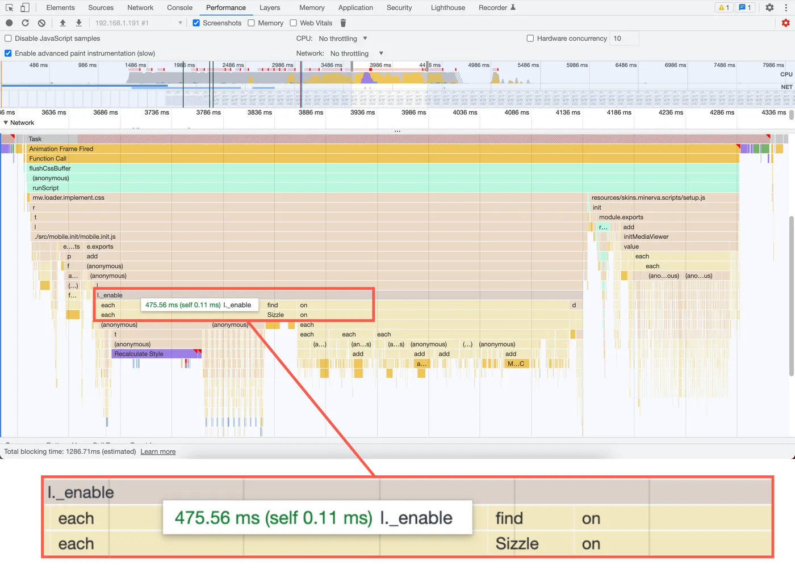

# 300ms Faster: Reducing Wikipedia's Total Blocking Time

> 원본 글  
> https://www.nray.dev/blog/300ms-faster-reducing-wikipedias-total-blocking-time/?ck_subscriber_id=1780635791

**목차**

- [300ms Faster: Reducing Wikipedia's Total Blocking Time](#300ms-faster-reducing-wikipedias-total-blocking-time)
  - [개요](#개요)
  - [Total Blocking Time: Why long tasks matter](#total-blocking-time-why-long-tasks-matter)
  - [What is Total Blocking Time?](#what-is-total-blocking-time)
  - [How to reduce Total Blocking Time](#how-to-reduce-total-blocking-time)
  - [Step 1: Remove unnecessary JavaScript](#step-1-remove-unnecessary-javascript)
  - [Step 2: Optimize existing JavaScript](#step-2-optimize-existing-javascript)
  - [Conclusion](#conclusion)

## 개요

클릭에 느리게 반응하거나 스크롤이 끊기는 웹사이트로 인해 불편을 겪은 적이 있으신가요? 이러한 성능 결함으로 인해 다음과 같은 문제가 발생할 수 있습니다:

- [Rage clicking](https://speakerdeck.com/bluesmoon/ux-and-performance-metrics-that-matter-a062d37f-e6c7-4b8a-8399-472ec76bb75e?slide=13)
- [Increased bounce rates and decreased conversion rates](https://edgemesh.com/blog/time-to-interactive-and-conversion-rate)
- [Lower search engine ranking](https://developers.google.com/search/blog/2021/11/bringing-page-experience-to-desktop?hl=ko)

3년이 넘는 기간 동안 Wikipedia의 모바일 사이트는 저사양 디바이스에서 페이지를 로드하는 동안 실행하는 데 600ms 이상 걸리는 자바스크립트가 사용자 상호 작용을 효과적으로 차단했습니다.

이 글에서는 이 작업의 실행 시간을 약 50% 단축하기 위해 제가 취한 몇 가지 간단한 단계를 살펴보겠습니다.

## Total Blocking Time: Why long tasks matter

600ms의 동기식 자바스크립트 실행은 그리 길지 않은 시간처럼 들릴 수 있지만, 페이지 로딩 중에 사용자가 자바스크립트 실행이 시작될 때 버튼을 클릭하려고 했다고 상상해 보세요. 브라우저의 메인 스레드에서는 한 번에 하나의 작업만 처리할 수 있으므로 사용자는 다음 단계가 완료될 때까지 기다려야 시각적 업데이트를 확인할 수 있습니다:

- 600ms 자바스크립트 태스크가 실행됩니다.
- 관련된 클릭 핸들러 태스크가 실행됩니다.
- 브라우저가 페이지를 시각적으로 업데이트하는 데 필요한 렌더링 단계를 수행합니다.


> 작업이 길어지면 시각적 업데이트를 생성하는 클릭 핸들러의 실행이 지연될 수 있습니다.

각 단계에는 시간이 걸리며 사용자는 시각적 업데이트를 생성하는 데 100ms 이상 걸리는 모든 상호 작용을 느린 것으로 인식할 수 있습니다. 이 때문에 Google은 50ms 이상 걸리는 모든 작업을 사용자 입력에 대한 페이지의 응답성에 영향을 줄 수 있는 '긴 작업'으로 간주합니다. 이를 위해 '**총 차단 시간**(**TBT**)'이라는 측정 지표도 개발했습니다.


> 두 가지 긴 작업이 있습니다. (> 50ms) — 80ms 작업과 100ms 작업입니다.

## What is Total Blocking Time?

**TBT**는 브라우저의 메인 스레드에 있는 모든 긴 작업의 차단 부분의 합계를 **First Contentful Paint** (**FCP**)과 **Time to Interactive** (**TTI**) 사이의 시간으로 측정합니다. '차단 부분'은 각 긴 작업의 50ms 이후의 시간입니다.

아래 예시를 통해 TBT를 계산해 보겠습니다:


1. 80ms 작업은 50ms보다 30ms 더 길기 때문에 **TBT**에 30ms를 기여합니다.
2. 30ms 작업은 50ms 미만이고 긴 작업이 아니므로 **TBT**에 영향을 미치지 않습니다.
3. 100ms 작업은 50ms보다 50ms 더 길기 때문에 **TBT**에 50ms를 기여합니다.

**TBT**는 각 긴 작업의 50ms를 초과하는 시간의 합계이므로 이 예의 **TBT**는 30ms + 50ms = 80ms입니다.

평균적인 모바일 하드웨어에서 테스트했을 때 Google은 사이트의 **TBT**가 200ms 미만일 것을 권장합니다. 하지만 Wikipedia에는 600ms가 넘게 걸리는 작업이 하나 있었는데, 이 한 가지 작업에만 권장 **TBT** 제한의 약 3배가 걸렸습니다.

**TBT**를 개선하려면 어떻게 해야 하나요?

## How to reduce Total Blocking Time

**TBT**를 줄이려면 둘 중 하나를 선택해야 합니다:

- **First Contentful Paint**와 **Time to Interactive** 사이의 메인 스레드 작업을 줄이세요.
- 동일한 양의 작업을 수행하되, 긴 작업을 50ms를 초과하지 않는 작은 작업으로 나누세요.

이 글에서는 두 가지 중 첫 번째 방법에서 이득을 얻는 데 중점을 둡니다.

## Step 1: Remove unnecessary JavaScript

HTML 구문 분석, 페인트, 가비지 컬렉션 등 많은 작업이 메인 스레드에서 실행되지만, 자바스크립트 실행 시간이 길어지면 **TBT** 문제의 원인이 되는 경우가 많습니다. 결국 자바스크립트는 사이트 속도를 저하시키는 가장 빠른 방법입니다.



Wikipedia의 모바일 사이트를 프로파일링한 결과, `_enable` 메서드가 실행 시간의 대부분을 차지한다는 사실을 발견했습니다. 이 메서드는 모바일 사이트의 섹션 확장 및 축소 동작을 초기화합니다. 또한 프로파일에 따르면 `_enable` 메서드 내에서 jQuery의 `.on("click")` 메서드에 대한 호출이 느린 것으로 나타났습니다.

```javascript
function _enable( $container, prefix, page, isClosed ) {
  ...
  // Restricted to links created by editors and thus outside our
  // control T166544 - don't do this for reference links - they will
  // be handled elsewhere
  var $link = $container.find("a:not(.reference a)");
  $link.on("click", function () {
    // the link might be an internal link with a hash.  if it is check
    // if we need to reveal any sections.
    if (
      $link.attr("href") !== undefined &&
      $link.attr("href").indexOf("#") > -1
    ) {
      checkHash();
    }
  });
  util.getWindow().on("hashchange", function () {
    checkHash();
  });
}
```

`.on("click")` 호출은 콘텐츠의 거의 모든 링크에 클릭 이벤트 리스너를 첨부하여 클릭한 링크에 해시 조각이 포함되어 있는 경우 해당 섹션이 열리도록 했습니다. 링크가 거의 없는 짧은 기사의 경우 성능에 미치는 영향은 미미했습니다. 하지만 'United States'과 같은 긴 기사에는 4,000개 이상의 링크가 포함되어 있어 저사양 기기에서 200밀리초 이상의 실행 시간이 발생했습니다.

더 심각한 문제는 이 동작이 불필요하다는 점입니다. 해시 변경 이벤트를 수신한 다운스트림 코드가 이미 클릭 이벤트 리스너가 호출한 것과 동일한 메서드를 호출했기 때문입니다. 창의 위치가 이미 링크의 목적지를 가리키고 있지 않는 한, 링크를 클릭하면 링크 클릭 이벤트 핸들러에 한 번, 해시 변경 핸들러에 한 번 더 체크해시 메서드를 두 번 호출하게 됩니다.


따라서 이 경우 가장 좋은 방법은 이 자바스크립트 블록을 제거하고 사실상 동일한 기능으로 메인 스레드에서 약 200ms를 확보하는 것이었습니다.

프로파일링할 때는 항상 가장 많은 시간이 소요되는 위치를 확인하세요. 그런 다음 최적화하거나 더 나은 방법으로 제거할 수 있는 코드가 있는지 확인하세요.

사이트 속도를 높이는 가장 빠른 방법은 자바스크립트를 제거하는 것임을 기억하세요.

## Step 2: Optimize existing JavaScript


추가 성능 검토 결과, `initMediaViewer` 메서드를 실행하는 데 약 100ms가 걸리는 것으로 나타났습니다. 이 메서드는 콘텐츠의 각 썸네일에 클릭 이벤트 리스너를 연결하여 썸네일을 클릭하면 미디어 뷰어가 열리도록 하는 역할을 담당했습니다:

```javascript
/**
 * Event handler for clicking on an image thumbnail
 *
 * @param {jQuery.Event} ev
 * @ignore
 */
function onClickImage(ev) {
  ev.preventDefault();
  routeThumbnail($(this).data('thumb'));
}

/**
 * Add routes to images and handle clicks
 *
 * @method
 * @ignore
 * @param {jQuery.Object} [$container] Optional container to search
 * within
 */
function initMediaViewer($container) {
  currentPageHTMLParser.getThumbnails($container).forEach(function (thumb) {
    thumb.$el.off().data('thumb', thumb).on('click', onClickImage);
  });
}
```

1단계의 링크 예시와 마찬가지로 페이지의 각 썸네일에 이벤트 리스너를 첨부하는 것은 제대로 확장되지 않습니다. 위키백과 문서 편집자는 수천 개의 이미지가 포함된 문서를 만들 수 있으며 실제로 그렇게 하고 있습니다. 이 코드 블록을 실행하면 이미지가 많은 페이지에서 실행하는 데 100ms가 훨씬 넘게 걸리고 페이지의 **TBT**가 증가할 수 있습니다. 다른 접근 방식은 무엇인가요?

**이벤트 위임**(**event delegation**)을 사용합니다.

이벤트 위임은 여러 요소의 공통 조상인 요소에 단일 이벤트 리스너를 연결할 수 있는 강력한 기술입니다. 이벤트 위임을 사용하면 여러 요소를 추가할 수 있는 사용자 생성 콘텐츠를 처리할 때 더 효율적인 경우가 많습니다. 이벤트 위임은 이벤트 버블링을 활용하며 다음과 같이 작동합니다:

1. 컨테이너 요소에 이벤트 리스너를 연결합니다.
2. 이벤트 핸들러의 이벤트 매개변수를 사용하여 `event.target` 속성을 확인하여 이벤트의 출처를 확인합니다. 선택적으로 `event.target.closest(selector)` API를 사용하여 상위 요소를 확인합니다.
3. 이벤트의 소스가 관심 있는 요소 또는 요소의 자식인 경우 처리합니다.

업데이트된 코드는 다음과 같습니다:

```javascript
/**
 * Event handler for clicking on an image thumbnail
 *
 * @param {MouseEvent} ev
 * @ignore
 */
function onClickImage(ev) {
  var el = ev.target.closest(PageHTMLParser.THUMB_SELECTOR);
  if (!el) {
    return;
  }

  var thumb = currentPageHTMLParser.getThumbnail($(el));
  if (!thumb) {
    return;
  }

  ev.preventDefault();
  routeThumbnail(thumb);
}

/**
 * Add routes to images and handle clicks
 *
 * @method
 * @ignore
 * @param {HTMLElement} container Container to search within
 */
function initMediaViewer(container) {
  container.addEventListener('click', onClickImage);
}
```

이 경우:

1. 모든 이미지가 포함된 단일 컨테이너 요소에 하나의 클릭 이벤트 리스너를 첨부하도록 `initMediaViewer` 메서드를 수정했습니다.
2. `onClickImage` 메서드에서 `ev.target.closest(selector)` API를 사용하여 클릭이 썸네일 또는 썸네일 요소의 하위 요소에서 발생했는지 확인했습니다. 그렇지 않은 경우, 썸네일 클릭만 고려하므로 코드가 일찍 반환됩니다. 클릭이 발생하면 코드가 이벤트를 처리합니다.

하지만 이 작업의 결과는 어땠을까요?

## Conclusion

1단계와 2단계에서 설명한 최적화를 두 번의 배포를 통해 프로덕션에 적용했습니다. — 1단계에 이어 2단계로 이동합니다.

Wikipedia의 [synthetic performance test](https://developer.mozilla.org/en-US/docs/Web/Performance/Rum-vs-Synthetic#synthetic_monitoring) 데이터에 따르면, 첫 번째 배포는 약 200ms의 **TBT** 감소를 가져왔고, 두 번째 배포는 실제 Moto G (5) 휴대폰에서 테스트했을 때 약 80ms의 **TBT**를 개선했습니다. 전반적으로 이 두 단계는 긴 기사를 방문하는 Moto G (5) 휴대폰과 같은 디바이스에서 **TBT**를 300ms 가까이 줄였습니다.


> 영문 Wikipedia의 "Sweden" 문서를 방문한 Wikipedia의 Moto G (5) synthetic performance test

Wikipedia의 실제 사용자 모니터링(RUM)도 긴 작업 시간에서 개선되었습니다.


> `load` 이벤트 발생 전 긴 작업 시간이 약 200ms 개선된 것을 보여주는 p95 인도 사용자의 실제 사용자 모니터링 그래프

저사양 디바이스에서는 여전히 권장 한도를 초과하는 등 아직 개선의 여지가 있지만, 지금까지의 진전은 상당한 수준입니다. **TBT**를 더 크게 줄이려면 작업을 더 작은 작업으로 나눠야 할 수도 있습니다.

이 경험을 통해 알 수 있는 것은 소규모의 타겟 최적화를 통해 상당한 성능 향상을 달성할 수 있다는 것입니다. 코드의 특정 섹션을 제거하거나 최적화하면 사소해 보이는 변경 사항도 웹사이트의 전반적인 성능에 상당한 영향을 미칠 수 있습니다. 이는 모든 디바이스에서 작동하는 보다 반응성이 뛰어난 브라우징 경험을 제공한다고 해서 항상 복잡하고 광범위한 코드베이스 변경이 필요한 것은 아니라는 점을 상기시켜 줍니다. 때로는 작은 변화가 가장 큰 차이를 만들기도 합니다.
