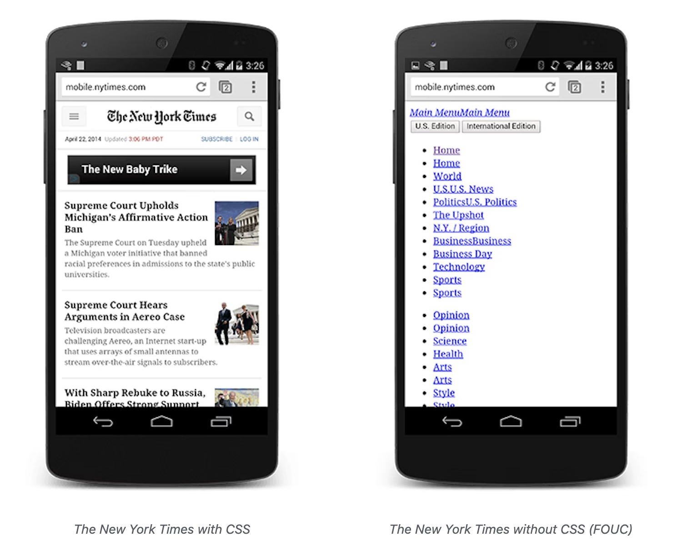

# Render Blocking CSS

**목차**

- [Render Blocking CSS](#render-blocking-css)
  - [개요](#개요)
  - [Summary](#summary)

## 개요

기본적으로 **CSS**는 렌더링 차단 리소스로 취급되므로 브라우저는 **CSSOM**이 구성될 때까지 처리된 콘텐츠를 렌더링하지 않습니다. **CSS**를 간결하게 유지하고 가능한 한 빨리 전달하며 미디어 타입과 쿼리를 사용하여 렌더링 차단을 해제하세요.

[렌더링 트리 구성](https://web.dev/critical-rendering-path-render-tree-construction/)에서 중요한 렌더링 경로에는 렌더링 트리를 구성하는 데 **DOM**과 **CSSOM**이 모두 필요하다는 것을 확인했습니다. 이는 성능에 중요한 영향을 미칩니다. **HTML**과 **CSS**는 모두 렌더링 차단 리소스입니다. **HTML**은 **DOM**이 없으면 렌더링할 것이 없기 때문에 분명하지만 **CSS** 요구 사항은 덜 분명할 수 있습니다. **CSS**에서 렌더링을 차단하지 않고 일반적인 페이지를 렌더링하려고 하면 어떻게 될까요?

## Summary

- 기본적으로 **CSS**는 렌더링 차단 리소스로 취급됩니다.
- 미디어 타입 및 미디어 쿼리를 사용하면 일부 **CSS** 리소스를 렌더링 차단이 아닌 것으로 표시할 수 있습니다.
- 브라우저는 차단 또는 비차단 동작에 관계없이 모든 **CSS** 리소스를 다운로드합니다.



위의 예는 **CSS**가 있는 웹 사이트와 없는 웹 사이트를 보여주는 것으로, **CSS**를 사용할 수 있을 때까지 렌더링이 차단되는 이유(**CSS**가 없으면 페이지를 상대적으로 사용할 수 없음)를 보여줍니다. 오른쪽의 경험을 흔히 "**Flash of Unstyled Content**"(**FOUC**)라고 합니다. 브라우저는 **DOM**과 **CSSOM**을 모두 갖출 때까지 렌더링을 차단합니다.

> **CSS**는 렌더링 차단 리소스입니다. 가능한 한 빨리 클라이언트에 전달하여 첫 번째 렌더링 시간을 최적화하세요.

하지만 페이지가 인쇄 중이거나 대형 모니터에 투사되는 경우와 같이 특정 조건에서만 사용되는 **CSS** 스타일이 있다면 어떨까요? 이러한 리소스에서 렌더링을 차단하지 않아도 된다면 좋을 것입니다.

**CSS** "미디어 타입(media types)"과 "미디어 쿼리(media queries)"를 사용하면 이러한 사용 사례를 해결할 수 있습니다:

```html
<link href="style.css" rel="stylesheet" />
<link href="print.css" rel="stylesheet" media="print" />
<link href="other.css" rel="stylesheet" media="(min-width: 40em)" />
```

미디어 쿼리는 미디어 타입과 특정 미디어 기능의 조건을 확인하는 하나 이상의 표현식으로 구성됩니다. 예를 들어 첫 번째 `stylesheet` 선언은 미디어 타입이나 쿼리를 제공하지 않으므로 모든 경우에 적용되며, 즉 항상 렌더링 차단입니다. 반면에 두 번째 `stylesheet` 선언은 레이아웃을 재정렬하거나 글꼴을 변경하는 등 콘텐츠가 인쇄될 때만 적용되므로 페이지가 처음 로드될 때 이 `stylesheet` 선언이 렌더링을 차단할 필요가 없습니다. 마지막으로 마지막 `stylesheet` 선언은 브라우저에서 실행되는 "미디어 쿼리"를 제공합니다. 조건이 일치하면 브라우저는 스타일시트가 다운로드되어 처리될 때까지 렌더링을 차단합니다.

미디어 쿼리를 사용하면 디스플레이 vs 인쇄와 같은 특정 사용 사례와 화면 방향 변경, 크기 조정 이벤트 등과 같은 동적 조건에 맞게 프레젠테이션을 조정할 수 있습니다. **`stylesheet` 에셋을 선언할 때 미디어 타입과 쿼리는 중요한 렌더링 경로 성능에 큰 영향을 미치므로 세심한 주의를 기울여야 합니다.**

몇 가지 실제 사례를 살펴보겠습니다:

```html
<link href="style.css" rel="stylesheet" />
<link href="style.css" rel="stylesheet" media="all" />
<link href="portrait.css" rel="stylesheet" media="orientation:portrait" />
<link href="print.css" rel="stylesheet" media="print" />
```

- 첫 번째 선언은 렌더링 차단이며 모든 조건에서 일치합니다.
- 두 번째 선언도 렌더링 차단입니다: "all"가 기본 타입이므로 타입을 지정하지 않으면 암시적으로 "all"로 설정됩니다. 따라서 첫 번째와 두 번째 선언은 실제로 동일합니다.
- 세 번째 선언에는 페이지가 로드될 때 평가되는 동적 미디어 쿼리가 있습니다. **페이지가 로드되는 동안 기기의 방향**에 따라 `portrait.css`가 렌더링 차단을 수행할 수도 있고 그렇지 않을 수도 있습니다.
- 마지막 선언은 페이지가 인쇄될 때만 적용되므로 브라우저에서 페이지가 처음 로드될 때 렌더링 차단이 발생하지 않습니다.

마지막으로, "렌더링 차단(render blocking)"은 브라우저가 해당 리소스에서 페이지의 초기 렌더링을 유지해야 하는지 여부만을 나타냅니다. 두 경우 모두 브라우저는 비차단 리소스에 대해 우선순위가 낮지만 여전히 **CSS** 에셋을 다운로드합니다.
