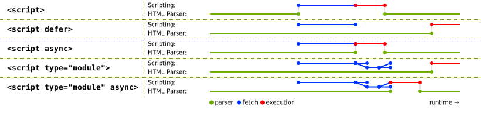

# JavaScript Modules

> 원본 글  
> https://v8.dev/features/modules

**목차**

- [JavaScript Modules](#javascript-modules)
  - [What are JS modules?](#what-are-js-modules)
  - [Using JS modules in the browser](#using-js-modules-in-the-browser)
    - [Browser-specific differences between modules and classic scripts](#browser-specific-differences-between-modules-and-classic-scripts)
    - [A note on file extensions](#a-note-on-file-extensions)
    - [Module specifiers](#module-specifiers)
    - [Modules are deferred by default](#modules-are-deferred-by-default)
  - [Other module featuers](#other-module-featuers)
    - [Dynamic `import()`](#dynamic-import)
    - [`import.meta`](#importmeta)
  - [Performance recommendations](#performance-recommendations)
    - [Kepp bundling](#kepp-bundling)
    - [Trade-offs of bundling vs. shipping unbundled modules](#trade-offs-of-bundling-vs-shipping-unbundled-modules)
    - [Use fine-grained modules](#use-fine-grained-modules)
    - [Preload modules](#preload-modules)
    - [Use HTTP/2](#use-http2)
  - [Web adoption of JS modules](#web-adoption-of-js-modules)
  - [What’s next for JS modules](#whats-next-for-js-modules)
    - [Faster and deterministic module resolution algorithm](#faster-and-deterministic-module-resolution-algorithm)
    - [Worklets and web workers](#worklets-and-web-workers)
    - [Import maps](#import-maps)
    - [Web packaging: native bundles](#web-packaging-native-bundles)
    - [Layered APIs](#layered-apis)

## What are JS modules?

JS 모듈(**ES** `modules` 또는 **ECMAScript** `modules`라고도 알려진)은 새로운 주요 기능 또는 기능들의 모음이다. 아마도 과거에 **Node.js**의 **CommonJS** 또는 **AMD** 또는 그 외에 모듈 시스템과 같은 **JavaScript** 모듈 시스템을 사용해본 적이 있을 것이다. 이러한 모듈 시스템들의 공통점은 `import`와 `export`를 할 수 있게 만들어 준다는 것이다.

이제 **JavaScript**는 이와 같은 표준화된 문법을 갖게 됐다. 모듈 내에서 `export` 키워드를 사용하여 거의 모든 것(`const`, `function` 또는 바인딩된 변수 또는 변수 선언문 등)을 `export` 할 수 있다. 그저 변수 선언문 앞에 `export` 키워드를 붙여주기만 하면 `export`할 준비가 끝난다.

```jsx
// lib.mjs
export const repeat = (string) => `${string} ${string}`;
export function shout(string) {
  return `${string.toUpperCase()!}`;
}
```

`import`를 키워드를 사용하면 모듈에서 다른 모듈을 `import` 할 수도 있다. 아래 예제의 `main` 모듈처럼 `main` 모듈에서 `lib` 모듈으로부터 `repeat`과 `shout`을 `import`해서 사용할 수 있다.

```jsx
// main.mjs
import { repeat, shout } from './lib.mjs';

repeat('hello');
// -> 'hello hello'
shout('Modules in action');
// 'MODULES IN ACTION'
```

모듈에서 `default` 값을 `export` 할 수도 있다.

```jsx
// lib.mjs
export default function (string) {
  return `${string.toUppercase()}!`;
}
```

`default` `export`의 경우 어떤 이름으로든 `import`가 가능하다.

```jsx
// main.mjs
import shout from './lib.mjs';
```

모듈은 기존 스크립트와는 조금 다르다.

- 모듈은 기본적으로 **strict mode**이다.
- 기존 스크립트에서 **HTML** 스타일 주석이 동작했을지라도 모듈에선 더 이상 지원하지 않는다.

```jsx
// Don't use HTML-style comment syntax in JavaScript!
const x = 42; <!-- TODO: Rename x to y.
// Use a regular single-line comment instead:
const x = 42; // TODO: Rename x to y.
```

- 모듈은 **lexical top-level scope**를 가진다. 예를 들어, `var foo =42;`를 모듈 내에서 실행할 경우 `foo`라는 이름의 전역 변수를 생성하지 않으며 브라우저에서 `window.foo`를 통해서 접근할 수도 없다. **HTML** 스타일 주석과 동일하게 기존 스크립트에서 가능했을지라도 모듈에선 더 이상 불가능하다.
- 비슷하게 모듈 안에 `this`는 전역 `this`를 참조하지 않는 대신 `undefined`가 된다.
  - 전역 `this`에 접근하고 싶다면 `globalThis`를 통해서 접근하면 된다.
- 새로운 정적 `import`와 `export`는 모듈 내에서만 이용할 수 있다.
  - 기존 스크립트에서는 동작하지 않는다.
- [Top-level `await`](https://v8.dev/features/top-level-await)는 기존 스크립트에서는 불가능하지만 모듈 내에서는 이용 가능하다. 이와 관련하여 기존 스크립트에서는 `async` 함수 밖에서 `await`로 변수 이름을 지을 수 있었지만 모듈 내에 어디서든 `await`라는 변수 식별자를 선언할 수 없다.

이러한 차이점들로 인해 모듈과 기존 스크립트에서 동일한 코드를 실행시켰을 경우 다르게 동작할 지도 모른다. 따라서, **JavaScript** 런타임은 스크립트가 모듈이라는 것을 알아야 한다.

## Using JS modules in the browser

웹에서는 `type` 속성을 `module`로 설정하여 브라우저가 `<script>` 요소를 모듈로서 대하도록 만들 수 있다.

```html
<script type="module" src="main.mjs"></script>
<script nomodule src="fallback.js"></script>
```

`type="module"`을 이해하는 브라우저는 `nomodule` 속성이 있는 스크립트를 무시한다. 즉, 모듈 기반 페이로드를 모듈 지원 브라우저에 제공하는 동시에 다른 브라우저에 `fallback`을 제공할 수 있다.

> 모듈을 지원하는 브라우저는 모듈을 사용하도록 만들고 그렇지 않은, 즉 모듈을 이해하지 못하는 구형 브라우저의 경우를 고려하여 `fallback`을 제공해줄 수 있다는 뜻 같다.

The ability to make this distinction is amazing, if only for performance! 오직 모던 브라우저만 모듈을 지원한다. 만약 브라우저가 모듈 코드를 이해한다면 화살표 함수나 `async-await`와 같은 모듈 이전에 있었던 기능들도 지원한다. 따라서, 이러한 기능들을 위해 더 이상 번들 파일을 트랜스파일링할 필요가 없다. 사이즈는 더 작으면서 대부분 트랜스파일링 되지 않은 모듈 기반 페이로드를 모던 브라우저에게 전달할 수 있다. 오직 구형 브라우저만이 `nomodule` 페이로드를 받을 것이다.

모듈은 기본적으로 `defer`(지연)되므로 `nomodule` 스크립트 또한 원한다면 `defer`된 방식으로 로딩할 수 있다.

```html
<script type="module" src="main.mjs"></script>
<script nomodule defer src="fallback.js"></script>
```

### Browser-specific differences between modules and classic scripts

알다시피 모듈은 기존 스크립트와 다르다. 위에서 언급된 브라우저 구별 없이 모듈이 가진 공통적인 차이점 외에도 브라우저에 한해서 모듈이 가진 몇 가지 차이점이 더 있다.

예를 들어, 모듈은 오직 한번만 평가되는데 반해 기존 스크립트는 **DOM**에 추가되어 있는 만큼 평가된다.

```html
<script src="classic.js"></script>
<script src="classic.js"></script>
<!-- classic.js executes multiple times. -->

<script type="module" src="module.mjs"></script>
<script type="module" src="module.mjs"></script>
<script type="module">
  import './module.mjs';
</script>
<!-- module.mjs executes only once. -->
```

또한, 모듈 스크립트와 모듈의 의존성은 **CORS**에 기반하여 패칭이 이루어진다. 이는 모든 **cross-origin** 모듈 스크립트가 `Access-Control-Allow-Origin: *`과 같은 적절한 헤더 속성과 함께 전달되어야 한다는 것을 의미한다. 이는 기존 스크립트는 해당되지 않는다.

또 다른 차이점은 `async` 속성과 관련이 있다. `async` 속성은 `defer`와 같이 **HTML** 파싱을 막지 않고 스크립트를 다운로드 하도록 한다. 단, 다운로드 순서가 보장되지 않으며 **HTML** 파싱이 완료될 때까지 기다리지 않고 최대한 빨리 스크립트를 실행한다는 점만 다르다. `async` 속성은 기존 스크립트에서는 동작하지 않지만 `<script type="module">`에서는 동작한다.

### A note on file extensions

이미 알고 있겠지만 모듈의 파일 확장자에 `.mjs`를 사용하고 있다. 웹에서 파일 확장자는 **JavaScript** `MIME` 타입인 `text/javascript`로 파일이 제공되는 게 아닌 이상 큰 상관이 없다. 브라우저가 스크립트 요소에 있는 `type` 속성을 보고 모듈인지 알기 때문이다.

하지만 여전히 두 가지 이유 때문에 모듈에 대한 파일 확장자를 `.mjs`로 사용하는 것을 추천한다.

1. 개발 중에 본인 또는 누군가 프로젝트를 보았을 때 `.mjs` 확장자는 해당 파일이 기존 스크립트가 아니라 모듈 파일이라는 것을 명확하게 알 수 있게 해준다. 이는 확장자 없이 코드만 보고 판단할 수 없는 일이다. 앞서 언급했듯이 모듈은 기존 스크립트와는 다르게 대해지며 이 차이점은 상당히 중요하다.
2. **Node.js**나 **d8**과 같은 런타임 환경 그리고 **Babel**과 같은 빌드 도구에서 파일들을 모듈로 파싱하게 만든다. 이러한 환경과 도구들은 각자 독자적인 방법을 통해 각기 다른 확장자를 가진 파일을 모듈로 해석하긴 하지만 `.mjs` 확장자는 파일이 모듈로써 처리되도록 하는 **cross-compatible**한 방법이다.

> **주의** ✋
>
> 웹에 `.mjs`를 배포하기 위해서는 위에서 언급했던 적절한 `Content-Type: text/javacript` 헤더를 사용하여 `.mjs` 확장자를 가진 파일을 전달하도록 웹 서버를 구성해야 한다. Additionally, you may want to configure your editor to treat `.mjs` files as `.js` files to get syntax highlighting. Most modern editors already do this by default.

### Module specifiers

모듈을 `import` 할 때 모듈의 위치를 명시하는 문자열은 **module specifier** 또는 **import specifier**라고 부른다. 앞선 예제에서 **module specifier**는 `'./lib.mjs'`였다.

```jsx
import { shout } from './lib.mjs';
```

브라우저 **module specifier**에는 몇 가지 제약사항으로 인해 소위 말하는 **bare** **module specifier**를 아직 지원하지 않는다. This restriction is [specified](https://html.spec.whatwg.org/multipage/webappapis.html#resolve-a-module-specifier) so that in the future, browsers can allow custom module loaders to give special meaning to bare module specifiers like the following:

```jsx
// Not supported (yet):
import { shout } from 'jquery';
import { shout } from 'lib.mjs';
import { shout } from 'modules/lib.mjs';
```

반면에 다음 예제들은 모두 지원된다.

```jsx
// Supported
import { shout } from './lib.mjs';
import { shout } from '../lib.mjs';
import { shout } from '/modules/lib.mjs';
import { shout } from 'https://simple.example/modules/lib.mjs';
```

현재로썬 **module specifier**는 반드시 전체 **URL** 또는 `/`, `./`, `../`로 시작하는 상대 경로여야 한다.

### Modules are deferred by default

기존의 `<script>`는 기본적으로 **HTML** 파싱을 막는다. 이는 스크립트 다운로드와 HTML 파싱을 동시에 이루어 지도록 하는 defer 속성을 추가함으로써 해결할 수 있다.



모듈 스크립트는 기본적으로 `defer`(지연)된다. 따라서, `<script type="module">` 태그에 따로 `defer`를 추가할 필요가 없다. 메인 모듈의 다운로드만 **HTML** 파싱과 병렬로 이루어지는 것이 아니라 모든 의존성 모듈에 대해서도 마찬가지다.

## Other module featuers

### Dynamic `import()`

지금까지 정적 `import`만 사용했다. 정적 `import`를 사용하면 메인 코드가 실행되기 전에 모듈 전체가 다운로드되어야 한다. 때로는 모듈을 미리 로딩하는 것이 아니라 필요할 때만, 예를 들어 사용자가 링크나 버튼을 클릭할 때만 로딩하고 싶을 때가 있다. 이는 초기 로딩 퍼포먼스를 향상시키는데 **Dynamic** `import()`로 이 효과를 얻을 수 있다.

```jsx
<script type="module">
  (async () => {
    const moduleSpecifier = './lib.mjs';
    const { repeat, shout } = await import(moduleSpecifier);
    repeat('hello');
    // -> 'hello hello'
    shout('Dynamic import in action');
    // -> 'DYNAMIC IMPORT IN ACTION!'
  })();
</script>
```

정적 `import`와 달리 동적 `import()`는 정규 스크립트 내에서 사용할 수 있다. 이는 기존 코드 베이스에서 점진적으로 모듈을 사용하기 시작하는 쉬운 방법이다.

> **주의** ✋
>
> **Webpack**은 자신들 만의 `import()`를 가지고 있는데 이는 `import` 해온 모듈을 메인 번들 파일과 별도로 자체 `chunk` 파일로 분리하는 기능을 가지고 있다.

### `import.meta`

또 다른 모듈 관련된 새로운 기능 중 하나는 현재 모듈에 대한 메타데이터를 줄 수 있는 `import.meta`다. 우리가 얻는 정확한 메타데이터는 **ECMAScript**의 일부로 지정되지 않으며 호스트 환경에 따라 다르다. 예를 들어, 브라우저에서 얻는 메타데이터와 **Node.js**에서 얻는 메타데이터는 다를 수 있다.

다음은 웹에서의 `import.meta` 예시다. 기본적으로 이미지는 **HTML** 문서에 현재 URL을 기준으로 로딩된다. `import.meta.url`을 사용하면 이미지를 로딩할 때 현재 **URL** 대신 현재 모듈을 기준으로 이미지를 로딩할 수 있다.

```jsx
function loadThumbnail(relativePath) {
  const url = new URL(relativePath, import.meta.url);
  const image = new Image();
  image.src = url;
  return image;
}

const thumbnail = loadThumbnail('../img/thumbnail.png');
container.append(thumbnail);
```

## Performance recommendations

### Kepp bundling

모듈을 사용할 경우 **Webpack**, **Rollup**, **Parcel**과 같은 번들러를 사용하지 않고도 웹사이트를 개발하는 것이 가능해진다. 이는 다음과 같이 네이티브 **JS** 모듈 사용하는 시나리오인 경우면 괜찮다.

- during local development
- 총 100개 미만의 모듈과 상대적으로 얕은 의존성 트리가 있는 작은 웹 애플리케이션을 프로덕션에 배포하는 경우

하지만 [our bottleneck analysis of Chrome’s loading pipeline when loading a modularized library composed of ~300 modules](https://docs.google.com/document/d/1ovo4PurT_1K4WFwN2MYmmgbLcr7v6DRQN67ESVA-wq0/pub)을 통해서 번들링된 애플리케이션의 로딩 퍼포먼스가 번들링하지 않은 것보다 좋다는 것을 배웠다.


결과가 위와 같은 이유 중 하나는 번들러는 정적 `import`/`export` 구문을 정적으로 분석할 수 있기에 번들러가 사용하지 않는 `export`를 제거하여 코드를 최적화하는데 도움을 주기 때문이다. 정적 `import`와 `export`는 단순히 구문 이상이며 이것들도 중요한 도구들이다.

따라서, 이전과 같이 계속해서 프로덕션에 모듈을 배포하기 전에 번들러를 사용하는 것을 추천한다. 번들링은 어떤 면에서는 코드를 `minify` 하는 것과 유사한 최적화다. 이는 결과적으로 더 적은 코드를 전달하기 때문에 퍼포먼스 측면의 이점을 가져온다. 번들링은 여전히 효과적이다! 계속해서 번들링하자.

항상 그렇듯이 **DevTools Code Coverage** 기능은 사용자에게 불필요한 코드를 전달하는지 안하는지 아는데 도움이 된다. 또한, `code splitting`을 사용하여 번들 파일을 분리하고 **non-First-Meaningful-Paint** critical scripts의 로딩을 `defer` 할 것을 추천한다.

### Trade-offs of bundling vs. shipping unbundled modules

웹 개발에선 늘 그렇듯 모든 것이 **trade-off**다. 번들링되지 않은 모듈을 전달하는 것은 초기 로딩 퍼포먼스는 떨어질지 몰라도(cold cache), `code splitting` 없는 단일 번들 파일을 전달하는 것과 비교하여 이후 방문 할 때의 로딩 퍼포먼스는 실제로 향상될 수 있다(warm cache). 200KB의 코드 베이스의 경우 세분화된 단일 모듈을 변경하고 이후 방문할 때 서버에 파일을 패칭하는 것이 번들링된 전체 파일을 다시 패칭해오는 것보다 훨씬 낫다.

> For a 200 KB code base, changing a single fine-grained module and having that be the only fetch from the server for subsequent visits is way better than having to re-fetch the whole bundle.

만약 처음 방문할 때의 퍼포먼스보다 **warn cache**를 사용하는 재방문 사용자를 더 신경쓰고 있고 세분화된 모듈이 수백개 미만인 사이트라면 번들링되지 않은 모듈을 전달하는 것을 실험하여 **cold**와 **warm** 로딩의 퍼포먼스를 측정한 뒤 이를 기반으로 결정을 내려도 된다.

Browser engineers are working hard on improving the performance of modules out-of-the-box. Over time, we expect shipping unbundled modules to become feasible in more situations.

### Use fine-grained modules

작고 세분화된 모듈을 사용하는 습관을 들여라. 개발 중에는 일반적으로 많은 `export`를 단일 파일로 합치는 것보다 모듈당 몇 개의 `export`만 있는 것이 좋다. `drop`, `pluck` 그리고 `zip`이라는 함수를 `export` 하고 있는 `./utile.mjs`라는 모듈이 있다고 해보자.

```jsx
export function drop() { ... }
export function pluck() { ... }
export function zip() { ... }
```

만약 코드 베이스에서 `pluck` 함수만 필요한 경우 아마 다음과 같이 `import` 할 것이다.

```jsx
import { pluck } from './util.mjs';
```

이때, (빌드 타임 번들링 단계 없이) 브라우저는 실제로 하나의 `export`만 필요함에도 불구하고 여전히 `./util.mjs` 모듈 전체를 다운로드, 파싱 그리고 컴파일해야 한다. 이는 불필요한 작업이다.

만약 `pluck`가 `drop`과 `zip`이랑 어떤 코드도 공유하지 않는다면 `./pluck.mjs`와 같은 `pluck` 함수 고유의 세분화된 모듈로 코드를 옮기는 것이 낫다.

```jsx
export function pluck() { ... }
```

그리하면 `drop`와 `zip`을 불필요하게 다루는 일 없이 `pluck`를 `import` 할 수 있다.

> **주의** ✋
>
> 개인적인 선호에 따라 `named export` 대신 `default export`를 사용할 수도 있다.

이는 소스 코드를 깔끔하고 간단하게 유지시켜줄 뿐만 아니라 번들러가 수행하는 **dead-code** 제거 작업의 필요성을 줄여준다. 만약 소스 트리 내 모듈 중 하나가 사용되지 않는다면 절대 `import` 되지 않을 것이고 브라우저는 해당 모듈을 다운로드할 일이 없을 것이다. 사용된 모듈은 브라우저에 의해서 개별적으로 [code-cache](https://v8.dev/blog/code-caching-for-devs)된다. (The infrastructure to make this happen already landed in V8, and [work is underway](https://bugs.chromium.org/p/chromium/issues/detail?id=841466) to enable it in Chrome as well.)

작고 세분화된 모듈을 사용하면 추후에 native 번들링 솔루션을 사용할 수 있을 때 도움이 될 것이다.

### Preload modules

`<link rel="modulepreload">`를 사용함으로써 모듈 전달을 더 최적화할 수 있다. 이 방법을 통해 브라우저가 모듈과 모듈이 가진 의존성들을 `preload`하고 `preparse` 및 `precompile`까지 할 수 있다.

```html
<link rel="modulepreload" href="lib.mjs" />
<link rel="modulepreload" href="main.mjs" />
<script type="module" src="main.mjs"></script>
<script nomodule src="fallback.js"></script>
```

이는 더 큰 의존성 트리인 경우 특히나 중요하다. `rel="modulepreload"`가 없다면 브라우저는 의존성 트리 전체를 알아내기 위해 다수의 HTTP 요청을 수행해야 한다. 그러나 만약 `rel="modulepreload"`가 있는 의존성 모듈 스크립트의 목록 전체를 선언해놓았다면 브라우저는 점진적으로 의존성을 탐색하지 않아도 된다.

### Use HTTP/2

가능하면 **HTTP/2** 사용하는 것이 만약 멀티플렉싱 지원을 위한 것일 경우에는 항상 좋은 퍼포먼스를 위한 조언이다.

> Using HTTP/2 where possible is always good performance advice, if only for [its multiplexing support](https://developers.google.com/web/fundamentals/performance/http2/#request_and_response_multiplexing).

**HTTP/2** 멀티플렉싱을 사용하면 다수의 요청과 응답 메시지를 동시에 전달될 수 있기 때문에 모듈 트리를 로딩하는데 유용하다. **Chrome** 팀은 또 다른 **HTTP/2** 기능, 특히 **HTTP/2** 서버 푸시가 고도로 모듈화된 애플리케이션 배포를 위한 실용적인 솔루션이 될 수 있는지 조사했다. 불행히도 **HTTP/2** 서버 푸시는 제대로 하기 어렵고 웹 서버와 브라우저의 구현은 현재 고도로 모듈화된 웹 애플리케이션 사용 사례에 최적화되어 있지 않았다. 예를 들어, 사용자가 캐시하지 않은 리소스만 푸시하는 것은 어렵고 원본 데이터의 전체 캐시 상태를 서버에 전달하여 이를 해결하는 것은 개인 정보에 있어서 위험이 발생한다.

So by all means, go ahead and use HTTP/2! Just keep in mind that HTTP/2 server push is (unfortunately) not a silver bullet.

## Web adoption of JS modules

**JS** 모듈은 서서히 웹에서 채택되고 있다. usage counter는 모든 페이지의 0.08% 만이 현재 `<script type="module">`을 사용하고 있음을 알려준다. Note that this number excludes other entry points such as dynamic `import()` or [worklets](https://drafts.css-houdini.org/worklets/).

## What’s next for JS modules

**Chrome** 팀은 다양한 방법으로 **JS** 모듈하여 **DX**를 향상시키기 위해 노력하고 있다. Chrome 팀이 작업 중인 사항들 중 몇 가지를 알아보자.

### Faster and deterministic module resolution algorithm

**Chrome** 팀은 부족한 속도와 **determinism**을 해결하기 위해서 **module resolution algorithm**의 변경을 제안했다. 새로운 알고리즘은 Chrome 63에 구현되어 있으며 HTML과 ECMAScript 스펙 상에 적용되어 있다. Expect this improvement to land in more browsers soon!

새로운 알고리즘은 더 효율적이고 빠르다. 이전 알고리즘은 `O(n^2)`의 시간 복잡도를 가지지만 새로운 알고리즘은 선형 시간복잡도, 즉 `O(n)`의 시간복잡도를 가진다.

Moreover, the new algorithm reports resolution errors in a deterministic way. Given a graph containing multiple errors, different runs of the old algorithm could report different errors as being responsible for the resolution failure. (이전 알고리즘은 원인은 같으나 실행마다 다른 에러로 기록이 됐었던 것 같다) 이는 디버깅을 괜히 어렵게 만들었다. 하지만 새로운 알고리즘은 매번 같은 에러를 보고한다.

### Worklets and web workers

> **Worklets**
>
> **렌더링 엔진과 그 주변 시스템에 접근할 수 있도록 해주는 자바스크립트 API**  
> **Web Workers**보다 경량화되고 수명 주기가 짧도록 설계되었다. 메인 스레드와는 별도의 스레드에서 동작하면서 렌더링 파이프라인 진행 중에 호출될 수 있도록. 그래서 웹 개발자들이 구현한 **JS** 모듈을 렌더링 파이프라인 내부에 연결할 수 있다.

**Chrome**은 웹 브라우저의 **low-level parts**에서 웹 개발자가 하드 코딩된 로직을 커스터마이징할 수 있게 해주는 [**worklets**](https://html.spec.whatwg.org/multipage/worklets.html)를 만들었다. **Worklets**를 사용하면 웹 개발자는 렌더링 파이프라인이나 오디오 프로세싱 파이프라인에 **JS** 모듈을 공급할 수 있다.

**Chrome** 65는 **DOM** 요소를 그리는 방법을 제어하기 위한 [**PaintWorklet**](https://developer.chrome.com/blog/paintapi/)을 지원한다.

```jsx
const result = await css.paintWorklet.addModule('pain-worklet.mjs');
```

Chrome 66은 우리의 코드로 오디오 프로세싱을 제어할 수 있게 해주는 [**AudioWorklet**](https://developer.chrome.com/blog/audio-worklet/)을 지원한다. The same Chrome version started an [OriginTrial for `AnimationWorklet`](https://groups.google.com/a/chromium.org/d/msg/blink-dev/AZ-PYPMS7EA/DEqbe2u5BQAJ), which enables creating scroll-linked and other high-performance procedural animations.

Finally, `[LayoutWorklet](https://drafts.css-houdini.org/css-layout-api/)` (a.k.a. the CSS Layout API) is now implemented in Chrome 67.

We’re [working](https://bugs.chromium.org/p/chromium/issues/detail?id=680046) on adding support for using JS modules with dedicated web workers in Chrome. You can already try this feature with `chrome://flags/#enable-experimental-web-platform-features` enabled.

```jsx
cosnt worker = new Worker('worker.mjs', { type: 'module' });
```

JS module support for shared workers and service workers is coming soon:

```jsx
const worker = new SharedWorker('worker.mjs', { type: 'module' });
const registration = await navigator.serviceWorker.register('worker.mjs', { type: 'module' });
```

### Import maps

**Node.js**/**npm**에선 패키지 이름으로 **JS** 모듈을 `import` 하는 것이 일반적이다. 예를 들어,

```jsx
import moment from 'moment';
import { pluck } from 'lodash-es';
```

현재 **HTML** 스펙에 따르면 **bare import specifiers**와 같은 구문은 에러를 발생시킨다. **import maps**의 목적은 프로덕션 애플리케이션을 포함하여 웹에서 이러한 코드가 동작될 수 있도록 하는 것이다. **import map**은 브라우저가 **bare import specifiers**를 **full URL**로 변환하는 데 도움을 주는 **JSON** 리소스다.

Import maps are still in the proposal stage. Although we’ve thought a lot about how they address various use cases, we’re still engaging with the community, and haven’t yet written up a full specification. Feedback is welcome!

### Web packaging: native bundles

**Chrome** 로딩 팀은 현재 웹 애플리케이션을 배포하기 위한 새로운 방법으로 **native** **웹 패키징** 형식을 모색하고 있다. 이러한 웹 패키징은 주요 기능으로는

- **[Signed HTTP Exchanges](https://wicg.github.io/webpackage/draft-yasskin-http-origin-signed-responses.html)**: 단일 **HTTP** 요청/응답 페어가 해당 페어에 적힌 `origin`에 의해 생성되었다는 사실을 브라우저가 신뢰할 수 있도록 만든다.
- **Bundled HTTP Exchanges**: 번들 파일을 전체적으로 해석할 수 있는 방법을 설명하는 메터데이터를 가진 **HTTP exchanges**의 모음이다. 단, 각각의 **HTTP exchange**는 서명됐을 수도 있고 되지 않았을 수도 있다.

이러한 웹 패키징 형식을 합치면 여러 **same-origin** 리소스(출처가 같은 리소스들)들을 안전하게 하나의 **HTTP** GET 응답에 포함할 수 있다.

현재 존재하는 **Webpack**, **Rollup** 그리고 **Parcel**과 같은 번들링 도구들은 단일 **JavaScript** 번들 파일을 만들어 낸다. 이렇게 만들어진 번들 파일에서는 본연의 개별 모듈과 `asset`들이 의미를 잃어버린다. native 번들과 함께라면 브라우저는 번들링된 파일들을 번들링되기 이전으로 되돌리지 않아도 된다. 간단히 말해 번들링된 **HTTP exchage**는 목차(`manifest`)를 통해서 순서에 상관없이 리소스들에 접근할 수 있는 번들 파일이라고 생각하면 된다. 그리고 이러한 리소스들을 개별 파일의 개념은 유지하면서 각 리소스들을 효과적으로 저장하고 리소스들의 상대적인 중요도에 따라 라벨을 지정할 수도 있다. 이러한 점 때문에 **native** 번들은 디버깅 경험을 향상시킬 수 있다. **DevTools**를 통해 `asset`을 볼 때 브라우저는 복잡한 소스맵 없이도 원본 모듈을 정확히 찾아낼 수 있게 된다.

**native** 번들 형식의 투명성은 다양한 최적화 기회를 제공한다. 예를 들어, 브라우저 내부적으로 이미 **native** 번들의 일부를 캐시하고 있는 경우 웹 서버와 소통하여 부족한 부분만 다운로드 받을 수 있다.

**Chrome**은 `SignedExchanges`의 일부를 지원하고 있긴 하지만 번들 형식 자체와 고도로 모듈화된 애플리케이션에 이를 적용하는 것에 대해선 아직 고려 중이다.

### Layered APIs

새로운 기능과 새로운 **Web API**를 제공하는 것은 지속적인 유지보수와 런타임 비용을 발생시킨다. 새로운 기능은 브라우저 네임스페이스를 오염시키고 시작 비용을 증가시키며 코드베이스 전체에 버그를 만들어 낼 수 있다. [**Layered APIs**](https://github.com/drufball/layered-apis)는 보다 확장 가능한 방식으로 웹 브라우저와 함께 상위 수준의 API를 구현하고 제공하기 위한 노력의 산물이라고 할 수 있다. **JS** 모듈은 이러한 **Layered APIs**의 핵심 기술이다.

- Since modules are explicitly imported, requiring layered APIs to be exposed via modules ensures that developers only pay for the layered APIs they use.
- 모듈 로딩을 구성할 수 있기 때문에 **Layered APIs**는 **Layered APIs**를 지원하지 않는 브라우저들에게 자동으로 폴리필을 로딩하는 메커니즘을 가질 수 있다.

The details of how modules and layered APIs work together [are still being worked out](https://github.com/drufball/layered-apis/issues), but the current proposal looks something like this:

```jsx
<script type="module" src="std:virtual-scroller|https://example.com/virtual-scroller.mjs"></script>
```

`<script>` 요소는 브라우저의 빌트인 **Layered APIs**(`std:virtual-scroller`) 또는 폴리필로 지정되어 있는 **fallback URL**로부터 `virtual-scroller` **API**를 가져온다. 이 **API**는 **JS** 모듈이 웹 브라우저에서 할 수 있는 모든 것을 할 수 있다. 그 예로 `<virtual-scroller>` 요소를 정의하면 다음의 **HTML**이 원하는 대로 이루어 진다.

```jsx
<virtual-scroller>
  <!-- Content goes here. -->
</virtual-scroller>
```
