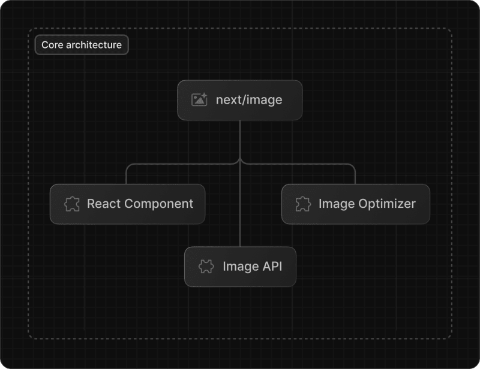
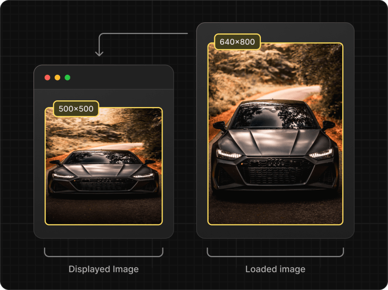
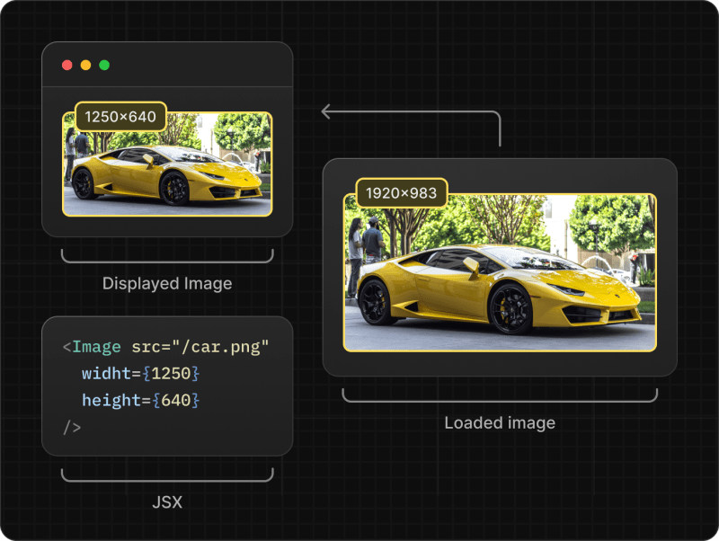
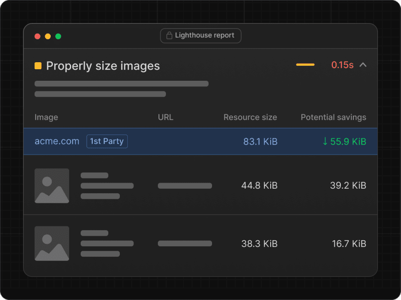

# Things you might not know about Next Image

> 원본 글  
> https://dev.to/alex_barashkov/things-you-might-not-know-about-next-image-5go8

**목차**

- [Things you might not know about Next Image](#things-you-might-not-know-about-next-image)
  - [개요](#개요)
  - [Core Architecture](#core-architecture)
    - [React Component](#react-component)
    - [Image API](#image-api)
    - [Image Optimizer](#image-optimizer)
  - [Outcomes](#outcomes)
    - [next/image does not crop](#nextimage-does-not-crop)
    - [Displayed image width ≠ loaded image width](#displayed-image-width--loaded-image-width)
    - [Image optimization can be used without the next/image component](#image-optimization-can-be-used-without-the-nextimage-component)
    - [Use import for local images](#use-import-for-local-images)
    - [Understanding Sizes and the 100vw Technique](#understanding-sizes-and-the-100vw-technique)
  - [Conclusions](#conclusions)

## 개요

Next.js로 작업해 본 적이 있다면 Next Image 컴포넌트를 접해 보셨을 것입니다. 이 번거로움 없는 이미지 최적화 솔루션은 `webp` 및 `avif`와 같은 최신 형식을 지원할 뿐만 아니라 다양한 화면 크기에 맞는 여러 버전을 생성합니다.

이 마법을 활용하려면 페이지에 다음 코드를 추가하기만 하면 됩니다:

```javascript
import Image from 'next/image';

export default function Page() {
  return <Image src="/profile.png" width={500} height={500} alt="Picture of the author" />;
}
```

하지만 모든 마법이 그렇듯, 원활하게 작동하기 위해서는 탄탄한 노력의 토대가 있어야 합니다. 이 글에서는 Next Image가 어떻게 작동하는지 살펴보고 이를 둘러싼 몇 가지 일반적인 오해를 바로잡겠습니다.

## Core Architecture

`next/image`의 기본 아키텍처는 크게 세 가지 구성 요소로 이루어져 있습니다:

- **React Next Image Component**
- **Image API**
- **Image Optimizer**



### React Component

컴포넌트의 주요 기능은 제공된 속성을 기반으로 올바른 HTML 이미지 출력을 생성하고 `srcset` 및 `src` 속성에 채워질 여러 URL을 구성하는 것입니다. 다음은 Next Image 컴포넌트의 출력 예시입니다:

```html

```

생성된 URL을 자세히 살펴보겠습니다:

```
/_next/image?url=/images/example.jpg&w=640&q=75
```

이 인코딩된 URL은 디코딩된 버전에서 더 잘 보이는 두 가지 매개변수인 `w`(너비)와 `q`(품질)를 허용합니다. `h`(높이) 속성이 없다는 것을 알 수 있지만 이에 대해서는 이 글의 뒷부분에서 설명하겠습니다.

### Image API

Next Image API는 [IPX](https://github.com/unjs/ipx)와 유사한 이미지 프록시 역할을 합니다. 다음 작업을 수행합니다:

> IPX란?
>
> [Sharp](https://github.com/lovell/sharp) 및 [libvips](https://github.com/libvips/libvips) 기반의 안전하고 사용하기 쉬운 고성능 이미지 프록시입니다.

- Accepts an image URL, width, and quality  
  (이미지 URL, 너비 및 품질을 허용합니다)
- Validates parameters  
  (매개변수 유효성 검사)
- Determines cache control policies  
  (캐시 제어 정책 결정)
- Processes the image  
  (이미지 처리)
- Serves the image in a format supported by the user's browser  
  (사용자 브라우저에서 지원하는 형식으로 이미지 제공)

이제 상황이 좀 더 이해되기 시작했으니, 여기서 몇 가지 결론을 도출하기 전에 퍼즐의 마지막 조각에 대해 간단히 논의해 보겠습니다.

### Image Optimizer

Next Image에서는 특정 조건에 따라 **Sharp** 또는 **Squoosh** 등 다양한 이미지 최적화 라이브러리를 활용합니다:

**Sharp**는 네이티브 [libvips](https://github.com/libvips/libvips) 라이브러리를 사용하는 빠르고 효율적인 이미지 최적화 Node.js 모듈입니다.

**Squoosh**는 완전한 노드 기반 이미지 최적화 솔루션입니다. 속도가 느리지만 머신에 추가 라이브러리를 설치할 필요가 없습니다. 따라서 프로덕션 환경에서는 **Sharp**를 사용하는 것이 좋지만 로컬 환경에서는 기본적으로 **Squoosh**를 사용하는 것이 좋습니다.

> 로컬 환경에서도 **Sharp**를 사용하는 것이 좋습니다. **Sharp**와 **Squoosh** 모두 이미지를 매우 유사하게 최적화하지만, **Sharp**의 압축 알고리즘은 **Squoosh**에 비해 색상이 저하될 수 있습니다. 이로 인해 프로덕션 환경과 로컬 환경 간에 시각적으로 다른 동작이 발생할 수 있으며, 특히 이미지의 배경색을 페이지 배경과 일치시키려고 할 때 더욱 그렇습니다.

## Outcomes

`next/image`의 기본 아키텍처를 이해하면 일반적인 오해를 풀고 더 효과적으로 활용하는 방법에 대한 더 많은 인사이트를 얻을 수 있습니다.

### next/image does not crop

개발자들이 흔히 오해하는 것은 `next/image`가 이미지를 자를 수 있다는 것입니다. `width`, `height`, `fill` 속성을 컴포넌트에 전달하여 이미지가 잘린 것처럼 보이게 만들 수 있기 때문에 이러한 혼란이 발생합니다. 실제로는 그렇지 않습니다. Next Image 컴포넌트는 레이아웃 이동을 방지하기 위해 주로 `img` 태그에 할당할 너비와 높이가 필요합니다.



이미 설명했듯이 Image API는 `height` 매개변수를 허용하지 않으므로 현재 원본 이미지의 가로 세로 비율을 변경할 수 없습니다. `fill` 속성을 사용하지 않으면 너비와 높이가 일치하지 않는 경우 이미지가 늘어나거나 줄어들기만 합니다.

그러나 TailwindCSS를 사용하는 경우 기본 전역 CSS 규칙으로 인해 다르게 작동합니다:

```css
img,
video {
  max-width: 100%;
  height: auto;
}
```

이렇게 하면 레이아웃 이동(layout shift) 문제를 감지하기가 더 어려워집니다.

### Displayed image width ≠ loaded image width

또 다른 잠재적 혼동 지점은 `next/image`에 전달된 `width` 속성이 이미지의 크기가 조정될 실제 너비를 나타내지 않는다는 것입니다. 글 서두의 예시에서 언급했듯이, 컴포넌트에 `width={500}`을 전달하면 생성된 URL에서 볼 수 있듯이 이미지의 너비가 640px로 조정됩니다:

```
/_next/image?url=/images/example.jpg&w=640&q=75
```

x2 retina 버전이 `1000px` 또는 `1280px`의 이미지 너비를 사용할 것이라고 예상했다면 놀랄 것입니다. 실제 사용되는 너비는 `1080px`입니다. 당연히 이 숫자가 어디서 나온 것인지 궁금하실 것입니다.



Next.js는 `next.config.js`에서 정의할 수 있는 `deviceSizes` 및 `imageSizes의` 배열에서 가장 가까운 크기로 이미지 크기를 조정합니다. 기본값은 다음과 같습니다:

```javascript
module.exports = {
  images: {
    deviceSizes: [640, 750, 828, 1080, 1200, 1920, 2048, 3840],
    imageSizes: [16, 32, 48, 64, 96, 128, 256, 384],
  },
};
```

여기서 주의해야 할 점은 기본 구성을 사용하면 성능에 부정적인 영향을 미쳐 `Lighthouse`의 페이지 속도 인사이트 점수가 낮아질 수 있다는 점입니다. 이는 페이지에 큰 이미지를 표시하려고 할 때 특히 분명해집니다. 예를 들어, 너비가 `1250px`인 이미지를 렌더링하려는 경우 실제 로드된 이미지 너비는 `1920px`이 됩니다. x2 retina 버전에서는 `3840px`로 크기가 조정되므로 필요한 크기와 실제 로드된 크기 간의 차이가 더욱 커집니다. 그러나 `deviceSizes` 또는 `imageSizes` 배열(문서)에 더 많은 크기를 추가하여 이 문제를 해결할 수 있습니다.



### Image optimization can be used without the next/image component

핵심 아키텍처를 이해하면 `next/image`를 사용하지 않고도 Image API를 사용할 수 있다는 것을 쉽게 알 수 있습니다. 이것이 유용할 수 있는 몇 가지 시나리오가 있습니다.

먼저 캔버스 내에서 최적화된 이미지를 렌더링할 수 있습니다. 외부 소스에서 캔버스로 이미지를 로드하든 로컬 저장소에서 이미지를 로드하든 관계없이 올바른 URL을 API에 전달하여 원활하게 작동하도록 할 수 있습니다.

또한 이를 사용하여 OG 이미지를 최적화하거나 더 나은 [art direction](https://web.dev/codelab-art-direction/)을 위해 자신만의 `<picture>` 태그 기반 컴포넌트를 만들 수도 있습니다.

Image API는 `/_next/image` 경로 아래에 있으며 세 가지 추가 매개변수만 허용합니다: `URL`, 너비(`w`), 품질(`q`)입니다.

```
/_next/image?url=https://example.com/test.jpg&w=640&q=75
```

`width` 매개변수는 API에 의해 확인되며 `deviceSizes` 또는 `imageSizes` 구성에서 가져온 숫자만 사용할 수 있다는 점을 기억하세요.

### Use import for local images

`next/image`를 사용하면 로컬 이미지를 로드하는 데 사용할 수 있는 두 가지 방법이 있습니다:

```javascript
import Image from 'next/image';
import profileImg from './profile.jpg';

export default function Page() {
  return (
    <>
      {/* Using absolute path */}
      <Image src="/profile.png" width={500} height={500} alt="Picture of the author" />
      {/* Using imported image via relative path */}
      <Image src={profileImg} alt="Picture of the author" />
    </>
  );
}
```

예제, 튜토리얼 또는 오픈소스 프로젝트에서 로컬 이미지를 다룰 때 절대 경로를 사용하는 것이 일반적입니다. 자동 너비/높이 할당을 제외하고는 큰 차이가 없다고 생각하기 쉽습니다. 하지만 차이가 있습니다. `public` 폴더에서 절대 경로로 이미지에 액세스하는 경우 Next.js는 대상 서버의 캐시 정책을 준수하며, 기본적으로 `public,max-age=31536000,immutable`이 아닌 30일 캐시 정책이 적용됩니다. 이미지 리소스에 30일 캐시 정책을 사용하면 `Lighthouse` 점수를 크게 낮출 수 있습니다.

### Understanding Sizes and the 100vw Technique

`next/image` 컴포넌트는 html `img` 태그의 `size` 속성과 유사한 `sizes`라는 속성을 허용합니다. 하지만 앞서 설명한 다른 측면과 마찬가지로 몇 가지 고유한 작업도 수행합니다. `sizes` 속성은 `srcset`과 함께 작동하며 활성화해야 하는 브라우저 조건 및 이미지 너비 목록을 허용합니다. 이에 익숙하지 않다면 이 [문서](https://www.dofactory.com/html/img/sizes)와 이 [codesandbox 예제](https://codesandbox.io/s/hungry-brattain-vw78xf?file=/index.html:1653-1685)를 살펴보는 것이 좋습니다. 다음은 `sizes`를 사용한 이미지의 예시입니다:

```html

```

이해를 돕기 위해 자세히 살펴보겠습니다. `sizes` 속성을 지정하지 않고 Next Image를 사용하는 경우 `srcset`에는 표준 버전(x1)과 Retina 버전(x2)의 두 가지 URL이 포함됩니다. 이 설정을 사용하면 브라우저는 Retina 기기에서 사용할 때 항상 Retina 버전을 선택합니다. 이 기본 설정은 `srcset` 내에서 1x 및 2x 구문을 사용하기 때문에 발생합니다.

```html

```

브라우저는 기본적으로 이를 다음과 같이 해석합니다: "픽셀 밀도가 2배인 경우 이 URL을 로드하고, 픽셀 밀도가 1배인 경우 다른 URL을 로드합니다."라고 해석합니다. 따라서 데스크톱의 이미지 버전이 모바일이나 태블릿보다 작은 디자인의 경우 브라우저는 기본 Next Image 구문을 사용하여 일관되게 더 큰 버전을 로드합니다. 안타깝게도 이로 인해 성능이 최적화되지 않고 `Lighthouse` 점수가 낮아질 수 있습니다.

하지만 브라우저에 적절한 너비를 기준으로 이미지를 로드하도록 지시하는 방법이 있습니다. `srcset` URL에 1x, 2x 매개변수를 제공하는 대신 이미지의 너비를 지정합니다. 예를 들어 브라우저에 다음 지침을 확인하세요:

```html

```

이 경우 브라우저는 페이지에 사용되는 현재 크기에 가장 적합한 이미지를 선택합니다. 모바일 이미지의 너비가 `600px`(Retina의 경우 `1200px`)인 경우 `1080w` 버전을 선택합니다. 반면 데스크톱 이미지의 너비가 `300px`(Retina의 경우 `600px`)만 사용하는 경우 브라우저는 `640w`를 선택합니다.

이 접근 방식의 장점은 현재 화면 크기에 가장 적합한 이미지를 로드하여 이미지 크기를 줄임으로써 성능을 향상시킬 수 있다는 점입니다. 이제 이점을 이해했으니 Next Image에서 `100vw` 트릭을 사용하여 이 전략을 적용할 수 있습니다. 픽셀 밀도(1x) 옵션 대신 URL 근처의 너비(`w`) 매개변수를 사용하도록 Next Image에 직접 지시할 수는 없지만, Next Image 코딩 방식에서 발생하는 해결 방법을 적용할 수 있습니다:

1. `sizes` 속성에 `vw` 숫자가 포함된 경우, 가장 작은 `deviceSize`(기본값 640)에 백분율(`100vw` = 1, `50vw` = 0.5)을 곱한 값보다 큰 크기만 유지합니다. `100vw`를 지정하면 URL이 8개가 됩니다.
2. `sizes` 속성에 `vw`가 아닌 숫자가 있는 경우 `srcset`에는 모든 크기(즉, `deviceSizes`와 `imageSizes`의 가능한 모든 조합)가 포함되며 총 16개의 URL이 생성됩니다.

예를 들어 `100vw`에 대해 생성된 코드를 살펴보겠습니다:

```html

```

`sizes`(예: `(max-width: 1024px) 800px, 300px`) 내에 픽셀 값을 포함하면 URL 목록이 더 확장되어 기본 구성에서 16개에 이릅니다. 이상적으로는 불필요한 옵션이 많아 HTML이 부풀어 오르는 것보다 다른 프레임워크와 유사하게 특정 이미지에 대해 4개의 URL을 생성하는 것을 선호하는데, 그 중 어느 것도 내 필요에 맞는 완벽한 크기가 아닐 수 있습니다.

다양한 해상도에서 더 나은 성능을 위해 더 많은 버전으로 `srcset`을 채우려면 `sizes`를 `100vw`로 설정하면 된다는 점이 이 논의의 핵심입니다. 이 트릭을 사용하면 `640px`부터 시작하여 8개의 크기에 대한 URL이 강제로 생성됩니다.

그러나 이 방법은 특히 이미지 크기 또는 디바이스 크기를 추가한 경우 HTML 크기를 쉽게 부풀릴 수 있으므로 이 접근 방식을 신중하게 적용하는 것이 좋습니다.

이 아키텍처의 정확한 이유에 대해서는 추측만 할 수 있지만, 여러 곳에서 다양한 이미지 비율을 사용하는 대규모 프로젝트의 경우 평균 크기 버전을 생성하는 이 접근 방식이 유용할 수 있다고 가정합니다. 이러한 버전은 사용 편의성을 유지하면서 대부분의 시나리오에 적합하고 잠재적으로 캐시에 더 자주 도달할 수 있습니다.

## Conclusions

Next Image는 이미지 관리를 간소화하고 상당한 이점을 제공하지만, 타사 솔루션과 마찬가지로 advanced cropping 및 정밀한 크기 조정과 같은 추가 기능을 사용하면 이점을 얻을 수 있습니다. 세밀한 아트 디렉션(art direction)을 위한 전문 구성 요소를 통합하는 것도 유리할 것입니다. 특히 제공된 너비의 0.25x, 0.5x, 1x, 2x로 네 가지 이미지 버전을 생성하는 자동화된 방법이 있으면 좋겠습니다.

하지만 대부분의 사용 사례에서는 Next Image의 개발자 경험과 효율성으로 충분할 것입니다.
