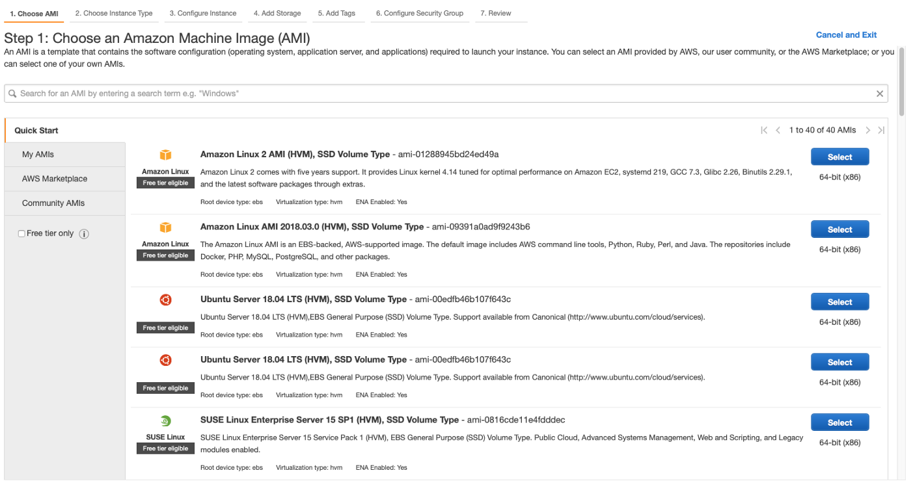

# AWS EC2, Nginx, React

**목차**

- [AWS EC2, Nginx, React](#aws-ec2-nginx-react)
  - [AWS EC2에서 Nginx로 React 앱 직접 배포하기](#aws-ec2에서-nginx로-react-앱-직접-배포하기)
    - [1. AWS EC2 instacne 생성](#1-aws-ec2-instacne-생성)
    - [2. SSH를 통한 인스턴스 접속](#2-ssh를-통한-인스턴스-접속)
    - [3. Package 설치 및 React build](#3-package-설치-및-react-build)
    - [4. Nginx 설정](#4-nginx-설정)

## AWS EC2에서 Nginx로 React 앱 직접 배포하기

### 1. AWS EC2 instacne 생성



AWS EC2에서 제공하는 인스턴스의 종류는 다양한데 이 중에서 Amazon Linux 2 AMI의 64 비트 x86을 선택해주자. (x86과 arm이 있을텐데 아무래도 호환성을 생각해서 x86으로 생성하되 추후에 이 글을 보게 될 때 호환성 문제를 고려하지 않는 수준이라면 arm을 선택하자)

> ✋ **주의**  
> 프리 티어는 AWS 가입을 하고 1년 동안만 가능하며 가입 한지 1년이 넘었다면 과금이 들어간다.

인스턴스 사양은 서비스 단계에 따라서 알아서 골라주자. 서비스가 시작되지 않았거나 사용자의 유입을 고려하지 않아도 된다면 `t2.micro`로 생성

- **Storage**

  인스턴스 사양과 동일하다. 서비스가 시작되지 않았거나 사용자의 유입을 고려하지 않아도 된다면 default 설정으로 넘어가주자.

- **Key - Value**

  EC2에서 `Key - Value` 페어 형식으로 저장하여 인스턴스 관련 작업에서 사용할 수 있는 기능이다.
  `Name`이라는 Key를 설정하면 인스턴스 목록에서 해당 `Name` Key의 `Value`로 보이게 된다.

  지금은 `Name` Key만 설정하고 넘어가자.

- **Configure Security Group (보안 그룹 설정)**

  인스턴스의 보안 그룹 설정, 기존에 작성해 놓은 보안 그룹을 사용할 수도 있고 새롭게 생성하여 추가할 수도 있다. 일반적으로 **HTTP**, **HTTPS**의 포트인 `80`, `443`을 기본적으로 열어두며(`IPv4`, `IPv6` 모두) 필요하다면 포트를 추가로 허용하여 이를 이용한다.

  **SSH**는 인스턴스로 접속하기 위해 사용되는 인터넷 프로토콜인데 말 그대로 보안 **Shell**이다. 인스턴스로의 접근을 아무나 할 수 있게 해놓으면 안되기 때문에 접근 권한이 있는 사람의 **IP**로 설정해놓는 게 일반적이다.

- **Key Pair**

  앞서 언급한 `SSH` 접속 등을 위해서 필요한 것으로 인스턴스에 적용할 Key Pair를 갖고 있지 않다면 생성 후 이를 다운로드 하면 된다.

  다운로드 한 키는 `~/.ssh` 폴더로 이동시켜 관리하게 될 것이다.

  또한, Pair인 이유는 `public`, `private` 키 두 개이기 때문이며 `public` 키가 인스턴스에 저장되어 해당 키의 짝인 `private` 키를 통한 접속만 허용하게 된다.

### 2. SSH를 통한 인스턴스 접속

인스턴스가 running 상태로 바뀌었다면 인스턴스로의 접속이 가능해졌다는 뜻이다.

앞서 Key Pair로 생성한 private 키를 설명한 대로 `~/.ssh` 폴더로 이동시킨다.

```bash
$ mv ~/Downloads/#######.pem ~/.ssh
```

`ssh` 폴더 내부에는 `config`라는 이름의 파일이 존재하는데(없다면 생성해주자) 이를 편집기로 열어 다음과 같은 내용을 입력해주자. 무슨 내용인지는 보이는 그대로 이해하면 된다.

```bash
# 아래 설정에 대한 설명 ex. modugrim AWS EC2
Host #######
HostName XXX.XXX.XXX.XXX
User ec2-user
IdentityFile ~/.ssh/#######.pem
```

- **Host**: SSH로 접속할 때 이용하고자 하는 이름
- **HostName**: 접속하고자 하는 인스턴스 IP
- **User**: 사용자명 (Amazon Linux에서는 기본적으로 `ec2-user`)
- **IdentityFile**: 이전에 생성했던 Key Pair 중 private key (이게 없다면 접속 시 비밀번호 입력)

다음과 같이 입력하여 **SSH** 접속

```bash
ssh "Host"
```

처음 접속 시에는 `The authenticity of host ‘XXX.XXX.XXX.XXX (XXX.XXX.XXX.XXX)’ can’t be established`라고 하면서 계속할 것이냐는 질문이 나타나는데 yes를 입력하고 계속 진행하면 된다.

> ✋ **주의**  
> `UNPROTECTED PRIVATE KEY FILE`이라는 경고가 나타난다면 private key 권한이 너무 개방적이라는 뜻이므로  
> `$ chmod 400 ~/.ssh/#######.pem`로 해당 private 키의 권한을 변경해준다.

### 3. Package 설치 및 React build

EC2에 SSH로 접속을 완료했다면 기본적인 셋팅을 진행해주자.

- **sudo yum update**
- `git` 설치 (git repo에서 받아온다면)
    <aside>
    💡 프로젝트 build 파일을 가져오는 데는 여러 가지 방법이 있다.
    
    1. `Git Repo에서 Clone`
    2. `sftp`
    3. `jenkins`
    
    </aside>
    
    ```bash
    $ sudo yum install git
    ```

- `nginx` 설치
  ```bash
  sudo yum install nginx
  # 위 명령어 입력 후 인스턴스에서 추천하는 nginx 버전과 명령어를 통해 설치하면 된다.
  ```
- `yarn` & `node` 설치
  ```bash
  $ curl -o- -L https://yarnpkg.com/install.sh | bash
  $ source ~/.bashrc
  $ curl -o- https://raw.githubusercontent.com/nvm-sh/nvm/v0.34.0/install.sh | bash
  $ . ~/.nvm/nvm.sh
  $ nvm install node
  ```
- 각자의 방법으로 프로젝트 빌드 파일 가져오기

### 4. Nginx 설정

> ✋ **주의**  
> 환경 설정 관련 작업들은 슈퍼 계정을 통해서 진행하자.

Nginx 관련 설정 파일들은 `/etc/nginx/` 하위에 존재한다. 해당 폴더로 이동하여 `nginx.conf` 파일을 수정하도록 하자.

```bash
vi /etc/nginx/nginx.conf
```

`nginx.conf` 내에서 React 프로젝트의 build로 바로 이어지게 설정할 수도 있지만, 설정들을 깔끔하게 관리하기 위해서 일반적으로 선호되는 방식은, `/etc/nginx` 내에 `sites-enalbed` 디렉토리를 생성하여 여기에서 각 서비스의 설정을 넣고 `nginx.conf`가 이들을 확인하도록 하는 것이다.

하나의 인스턴스 내부인데도 각 서비스라고 표현하는 것은 가상 호스트(서버) 개념을 사용할 수 있기 때문이다.

이를 통해 하나의 컴퓨터, 즉 하나의 **IP** 내에서 여러 웹을 배포할 수 있다. 사용자는 각 웹 서비스에 접속하기 위해 서로 다른 도메인(ex. `example.com`과 `another.com`)을 입력해서 들어오는데, 사실 이들은 같은 **IP**로 통하고 **Nginx**가 각각의 도메인에 따라 한 컴퓨터 내의 서로 다른 곳으로 연결되도록 해주는 것이다.

`nginx.conf` 파일의 `http {}` 블럭 내부에 `server {}` 블럭을 볼 수 있는데, `listen` 행의 `default_server`가 그러한 각 도메인 이름이 될 수 있다.

지금은 앞서 말한대로 `sites-enabled` 디렉토리에 따로 설정을 만들어줄 것이므로, default로 작성되어 있는 블럭 행들은 모두 주석처리 한다. 그리고 server 블럭 바로 위에 아래와 같이 `include /etc/nginx/sites-enabled/*.conf;` 를 추가함으로써 `sites-enabled` 하위의 설정 파일들을 포함하도록 한다.

```bash
...

include /etc/nginx/conf.d/*.conf;
include /etc/nginx/sites-enabled/*.conf;

#server {
#    listen       80 default_server;
#    listen       [::]:80 default_server;
#    server_name  _;
#    root         /usr/share/nginx/html;

    # Load configuration files for the default server block.
#    include /etc/nginx/default.d/*.conf;

#    location / {
#    }

#    error_page 404 /404.html;
#        location = /40x.html {
#    }

#    error_page 500 502 503 504 /50x.html;
#        location = /50x.html {
#    }
#}

...
```

처음 **Nginx**를 설치했다면 `sites-enabled` 디렉토리가 없기 때문에 해당 디렉토리를 생성해주자.

단, `sites-enabled`에 직접 설정 파일을 작성할 것은 아니고, 일반적인 방식은 `sites-available` 디렉토리에 필요한 파일들을 작성한 후 이들과 연결되는 `symlink`를 `site-enabled`에 추가하는 것이다.

때문에 `sites-enabled` 폴더 뿐만 아니라 `sites-available` 디렉토리도 생성해준다. 그리고 `sites-available` 내에 원하는 이름으로 설정 파일을 생성해 열도록 하자.

```bash
$ sudo mkdir /etc/nginx/sites-available
$ sudo mkdir /etc/nginx/sites-enabled
$ sudo vi /etc/nginx/sites-available/#######.conf
```

지금은 도메인 등록도 되어있지 않고, HTTPS를 위한 준비도 되어있지 않으므로, HTTP에 해당하는 80번 포트에 대해서 아주 기본 설정만 포함한다.

> ✋ **주의**  
>  **HTTPS**를 적용하고 싶다면 `SSL 인증서 작업`과 **HTTP**로 요청이 들어왔을 경우 해당 요청을 **HTTPS**로 `리다이렉트해주는 작업` 그리고 `HTTPS 포트에 대한 인증서 작업`이 필요하다.

```bash
server {
  listen 80;
  location / {
    root /home/ec2-user/#######/#######/build;
    index index.html index.htm;
    try_files $uri $uri/ /index.html;
  }
}
```

`server` 블록의 `location` 블록은 Nginx에서 특히 많이 사용하게 되는 부분이다. `location` 뒤의 `/`는 directive라고 하는 부분인데, **IP** 주소나 도메인의 뒷 부분인 URI에 대응된다.

root엔 각자의 방법으로 가져온 `build` 폴더의 경로를 작성해준다.

```bash
$ sudo ln -s /etc/nginx/sites-available/#######.conf /etc/nginx/sites-enabled/#######.conf
$ sudo nginx -t
```

위 명령어를 통해 `symlink`를 생성하고 **Nginx** 설정을 테스트한다.

```bash
nginx: the configuration file /etc/nginx/nginx.conf syntax is ok
nginx: configuration file /etc/nginx/nginx.conf test is successful
```

위와 같은 내용이 출력된다면 작성한 설정의 문법에 이상이 없다는 뜻이다.

```bash
$ sudo systemctl start nginx
```

위 명령어를 통해 **Nginx**를 동작시키고 브라우저에서 인스턴스의 **IP** 주소를 입력해 접속해보자.


위와 같은 500 에러가 발생한다면 빌드 폴더까지의 경로로 접근할 때 거치는 디렉토리들에 대해서 외부에서 실행 권한이 없어서 발생하는 문제일 가능성이 높다.

**Nginx** 설정 파일에 사용자 접근 권한을 변경해줄 수 있다. 거기에 `ec2-user`(또는 설정한 **EC2** 사용자명)의 접근 권한을 변경하여 해당 사용자가 파일에 접근할 수 있게 해주자.

`chown -R [사용자]:[그룹] [디렉토리명]` : 디렉토리 하위에있는 모든파일 사용자변경

ex.

```
sudo chown -R "$USER":www-data /webdirectory
sudo chmod -R 0755 /webdirectory
```
