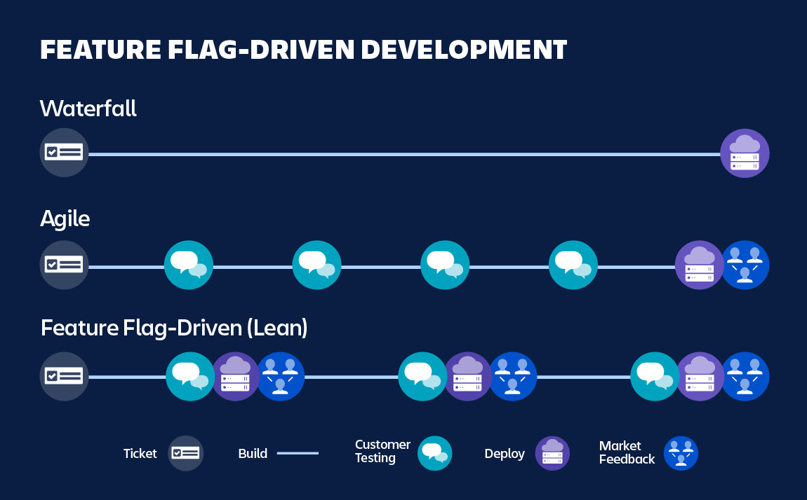
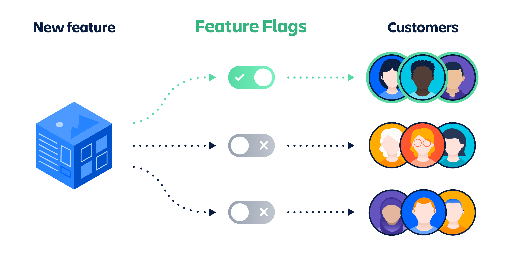

# Feature Flag

> 원본 글  
> https://www.atlassian.com/continuous-delivery/principles/feature-flags

**목차**

- [Feature Flag](#feature-flag)
  - [개요](#개요)
  - [What are feature flags?](#what-are-feature-flags)
  - [Benefits of Feature Flags](#benefits-of-feature-flags)
    - [Validate feature functionality](#validate-feature-functionality)
    - [Minimize risk](#minimize-risk)
    - [Modify system behavior without disruptive changes](#modify-system-behavior-without-disruptive-changes)
  - [Feature flag use cases](#feature-flag-use-cases)
    - [Product testing](#product-testing)
    - [Conducting experiments](#conducting-experiments)
    - [Migrations](#migrations)
    - [Canary launches](#canary-launches)
    - [System outage](#system-outage)
    - [Continuous deployment](#continuous-deployment)
  - [Feature branches vs. feature flags](#feature-branches-vs-feature-flags)
  - [How to implement feature flags](#how-to-implement-feature-flags)
  - [In conclusion](#in-conclusion)

## 개요

애플리케이션을 개발하는 와중에 **CI** 기능을 도입할 계획이 있는 경우 **Feature flag**를 고려할 수도 있다. **CI**를 도입한 이후에 해당 기능을 숨기거나 비활성화하거나 다시 활성화하고 싶을 수도 있다. 또한 어떠한 것이 더 나은지 알아보기 위해서 사용자에게 다양한 기능을 보여주고 싶을 수도 있다. `toggles`, `bits`, `flippers` 또는 `switches` 라고도 하는 **Feature flag**는 이러한 작업들을 비롯한 다양한 작업을 수행할 수 있게 해준다.

## What are feature flags?

Feature flag(일반적으로 Feature toggle이라고도 불린다)는 새로운 코드에 대한 배포 없이 런타임 중에 기능을 키고 끌 수 있는 소프트웨어 엔지니어링 기술이다. 이는 팀이 추가적인 코드를 밀어넣지 않아도 기능의 lifecycle 동안 보다 통제된 실험을 가능하게 해준다. 이 때문에 **Feature flag**는 애자일 관리 스타일과 **CI**/**CD** 환경에 매우 유용한 `workflow`들을 가능하게 한다.

개발 중에 소프트웨어 엔지니어는 **Feature flag**에 원하는 코드 경로를 래핑한다. 다음은 **JavaScript**로 작성된 기본적인 **Feature flag** 예시다.

```jsx
if (featureFlags['new-cool-feature'] == true) {
  renderNewCoolFeature();
}
```

위 코드는 `new-cool-feature`가 활성화되어 있는지를 체크하는 간단한 구문이다. flag 데이터 또는 새로운 로직에 대한 경로의 삽입 및 제거를 관리하는 데 도움이 되는 고급 프레임워크 및 도구를 사용하더라도 Feature flag는 본질적이로 "**if문**"일 뿐이다.

## Benefits of Feature Flags



> https://www.atlassian.com/continuous-delivery/principles/feature-flags

**foundational level**에서 **Feature flag**를 사용하면 코드를 커밋하고 해당 코드가 비활성화된 상태에서 프로덕션에 배포한 다음 나중에 활성화할 수도 있다. 이를 통해 팀은 최종 제품에 대한 사용자 경험성을 더 잘 제어할 수 있다. 개발팀은 사용자에게 새로운 코드가 전달되는 시기를 선택할 수 있다.

### Validate feature functionality

개발자들은 **Feature flag**를 활용하여 새로운 프로덕트 기능의 "**soft rollouts**"를 수행할 수 있다. 예상되는 릴리즈의 일부로 **Feature toggle**을 즉시 통합하여 새로운 기능을 구축할 수 있다.

> 소프트 출시라고도 하는 소프트 런칭은 일반 대중보다 먼저 제한된 청중에게 제품이나 서비스를 미리 공개하는 것

**Feature flag**는 기본적으로 "**꺼짐**"으로 설정될 수 있으므로 일단 코드가 배포되면 프로덕션 중에는 비활성화 상태로 유지하고 **Feature toggle**이 명시적으로 활성화될 때까지 해당 기능은 비활성화 상태로 유지된다. 이후에 팀은 비활성화 상태의 코드를 활성화하는 **Feature flag**를 켤 시기를 선택하여 **QA**를 수행하고 해당 기능이 예상대로 작동하는지 확인할 수 있다. 만약 팀에서 이 프로세스 도중 문제를 발견하면, 즉시 **Feature flag**를 끔으로써 활성화했던 코드를 비활성화하여 사용자에게 이슈 노출을 최소화할 수 있다.

### Minimize risk

위에서 언급한 "**soft rollouts**" 아이디어를 바탕으로 부지런한 팀의 경우 확인 가능한 간헐적 이슈에 대한 대응으로 시스템 모니터링 및 메트릭과 함께 **Feature flag**를 활용할 수 있다. 예를 들어, 만약 애플리케이션에서 트래픽이 급증하고 모니터링 시스템에서 이슈의 발생이 증가했다고 보고되는 경우, 팀은 **Feature flag**를 사용하여 성능이 좋지 않은 기능을 비활성화할 수 있다.

### Modify system behavior without disruptive changes

**Feature flag**를 사용하여 복잡한 **CI**/**CD** 시나리오를 최소화할 수 있다. 복잡한 새로운 기능 또는 민갑한 리팩토링 작업은 레포의 메인 프로덕션 브랜치에 통합하기 어려울 수도 있다. 여러 개발자가 코드베이스에서 겹치는 영역을 작업하는 경우 이는 더욱 복잡해진다.

안정적인 코드가 자리 잡고 있는 동안 Feature flag를 사용하여 새로운 변경 사항을 격리할 수 있다. 이는 개발자들이 **Feature toggle** 뒤에 있는 레포의 메인 브랜치에 자주 커밋함으로써 장기간 실행되는 **feautre** 브랜치를 피할 수 있도록 도와준다. 새로운 코드가 준비됐을 때 배포를 중단해야 하는 **CI**/**CD** 시나리오가 필요하지 않다. 팀은 Feature flag를 전환하여 새로운 시스템을 활성화할 수 있다.

## Feature flag use cases



> https://www.atlassian.com/continuous-delivery/principles/feature-flags

**Feature flag**의 새로운 유틸은 부지런한 팀을 위한 다양하고 창의적인 use-case를 시도할 수 있게 한다. 다음에 나오는 예시들은 유명한 애플리케이션의 애자일 환경에서의 **Feature flag**들이다.

### Product testing

Feature flag를 사용하여 새로운 프로덕트 기능을 점진적으로 릴리즈할 수 있다. 추가하고자 하는 새로운 기능은 사용자에 의해 채택될 것인지 그리고 투자할 가치가 있는지에 대한 여부가 확실하지 않을 수 있다. 이에 팀은 **Feature flag**를 통해 새로운 프로덕트 기능 또는 해당 기능의 일부만을 릴리즈할 수 있고 이를 배포하여 특정 사용자 하위 집합에게서 피드백을 수집할 수도 있다. The subset of users may be vocal power users who are happy to beta test and review(vocal power user? 베타 테스트 같은 걸 좋아하며 의견 내기를 좋아하는 사용자일 수도 있다는 건가 ?). 새로운 프로덕트 아이디어가 성공하면 개발팀은 더 큰 사용자 기반에 **Feature flag**를 릴리즈할 수도 있다. 이에 반해 만약에 새로운 프로덕트 아이디어가 실패한 것으로 판명되면, 개발팀은 **Feature flag**를 손쉽게 비활성화하고 나중에 코드베이스에서 이를 제거할 수 있다.

### Conducting experiments

실험 또는 A/B 테스팅은 **Feature flag**의 주요 예시 중 하나다. 가장 간단한 형태의 Feature flag는 특정 기능의 상태를 "켜짐" 및 "꺼짐"으로 전환(toggle)하는 역할을 한다. **Feature flag**의 고급 기능은 한 번에 여러 `flag`를 활용하여 각 사용자 하위 집합이 서로 다른 경험을 할 수 있도록 한다. 예를 들어, 사용자 그룹을 3분의 1로 나눈다고 가정해보자. 그런 다음 이렇게 나눈 3가지의 `flag`들의 성능을 비교하여 최종 커밋될 버전을 결정할 수 있다.

### Migrations

There are times when an application needs a data migration that requires dependent application code changes. 이러한 시나리오는 민감한 다단계 배포 작업이다. 데이터베이스 필드는 데이터베이스에서 변경되거나 제거되거나 추가될 수 있다. 만약 애플리케이션 코드가 이러한 데이터베이스 변경에 대비가 되어 있지 않은 경우 이는 실패와 에러를 발생시킨다. 이러한 경우 데이터베이스 변경 사항과 애플리케이션 코드 간에 조정된 배포가 필요하다.

**Feature flag**는 팀이 **Feature flag**를 통해 애플리케이션의 변경 사항을 미리 준비할 수 있도록 하여 위와 같은 시나리오의 복잡성을 완화하는 데 도움을 준다. 팀이 데이터베이스를 변경하면 애플리케이션 코드와 일치하도록 **Feature flag**를 즉시 전환할 수 있다. 이렇게 하면 새로운 애플리케이션 코드를 배포할 때까지 기다려야 하는 위험과 지연 그리고 배포가 실패하여 데이터베이스에서 애플리케이션 동기화가 해제되는 케이스를 제거할 수 있다.

### Canary launches

여기서 카나리아는 석탄 광부들이 일산화탄소를 감지하기 위해 탄광에 카나리아 새를 데려가는 오래되고 병적인 관습을 말한다. 새들은 신진 대사율이 높고 호흡 속도가 사람보다 빠르기 때문에 광부보다 먼저 일산화탄소에 굴복했다.

소프트웨어 개발에서의 **Canary launch**는 새로운 기능이나 코드 변경을 전체 사용자 집합에 릴리즈하기 전에 기능의 동작을 모니터링하기 위해서 소규모 사용자 하위 집합에 이를 배포할 때 발생한다. 새로운 기능에 오류 또는 실패가 표시되면 이는 자동으로 롤백된다. **Feature flag**는 사용자 집합을 제한하고 새로운 기능을 쉽게 끌 수 있으므로 이러한 프로세스에 꼭 필요하다.

### System outage

**Feature flag**는 시스템 중단 도구로도 사용할 수 있다. 웹 애플리케이션은 유지보수 또는 오프라인을 위해 **Feature flag**를 활용하여 전체 웹 사이트를 "**switch off**" 할 수도 있다. The feature flag can be instrumented throughout the codebase to push sensitive transactions and display outage content to the end users. 이는 민감한 배포를 수행해야 하거나 예기치 못한 이슈가 발견되어 긴급하게 해결해야 하는 경우 매우 유용할 수 있다. It gives teams the confidence and capability to take a controlled outage if deemed necessary.

### Continuous deployment

**Feature flag**는 CD(continuous deployment)를 구축하기 위한 필수 컴포넌트로 사용할 수 있다. **CD**는 개발자로부터 새로운 코드를 가져와 프로덕션 상의 최종 사용자에게 자동으로 배포하는 자동화된 파이프라인이다. Continuous deployment depends on layers of automated tests that verify new code behaves as expected against a matching specification as it moves through the pipeline(새로운 코드가 자동화된 파이프라인을 통해 배포되면 해당 코드가 스펙에 맞게 예상대로 잘 동작하는지 확인하기 위한 자동화된 테스트 계층으로 확인한다는 뜻인 것 같다).

**Feature flag**는 사용자에게 기능을 표시하는 것으로부터 코드 변경 사항을 분리하여 지속적으로 배포하는 것을 더 안전하게 만들어 준다. 새로운 코드는 프로덕션에 자동으로 합쳐지고 배포된 다음 **Feature flag** 뒤에서 대기한다. **CD** 시스템은 사용자의 행동과 트래픽을 모니터링하다가 자동으로 **Feature flag**를 활성화할 수 있다. 또한 활성화된 새로운 **Feature flag** 코드를 모니터링하여 해당 기능이 예상대로 동작하는지 확인하고 그렇지 않은 경우 롤백할 수도 있다.

## Feature branches vs. feature flags

위 두개, **Feature branch**와 **Feature flag**는 이름은 비슷할지 몰라도 이 둘은 전혀 다른 것들이다. **Feature branch**는 **Git** 레포와 관련된 **workflow pattern**이다. 개발자들이 새로운 프로덕트 기능을 개발하기 시작할때 **Main branch**에서 분기하여 새로운 기능에 대한 모든 코드를 포함하는 새로운 **Git** **branch**를 생성한다. 개발자가 새로운 기능을 개발 완료하면 **Feature branch**를 다시 **Main branch**로 병합하고 **Main branch**를 배포한다. Feature branches are distinct and standalone from feature flags.

**Feature flag**는 **Feature branch**와 함께 사용할 수 있다. **Feature flag**를 만들기 위해서 개발자는 **Feature branch**를 만들고 **Feature branch**에 새로운 **Feature flag** 코드를 커밋한다. **Feature branch**는 머지되고 배포되고 나면 **Feature flag**는 프로덕션에서 접근이 가능해진다.

**Feature branch**를 개발하는 동안 프로젝트는 오래 지속될 수 있으며 **Main branch**로부터 분기된 수많은 커밋을 포함할 수 있다. 개발자는 **Feature branch**가 머지할 준비가 완료되면 충돌을 최소화될 수 있도록 **Feature branch**가 지속적으로 업데이트되도록 해야 한다. **Feature flag**를 사용하여 이 시나리오를 해결할 수 있다. 오래 살아 있는 **Feature branch**를 생성하고 새로운 기능이 준비되었을 때 대규모 머지를 수행하는 대신 **Feature flag**를 생성하고 즉시 **Main branch**로 머지할 수 있다.

## How to implement feature flags

There are many paths to implement feature flags with varying logistical considerations and return on investment. The path to take depends on your team's needs and organizational goals.

**Feature flag**가 제대로 작동하기 위해서 해결해줘야 하는 몇 가지의 인프라 문제들이 존재한다. 팀에서 **Feature flag**의 사용을 확장하고 **Feature flag**를 비즈니스 결정에 따라 끄고 켜기 위해서 이러한 작업들을 할 수 있는 데이터 저장소와 **Feature flag** 관리 메커니즘을 갖추는 것이 중요해졌다. 많은 서드 파티 Feature flag 서비스들이 이러한 데이터 스토어 의존성을 제공한다.

서드 파티에서 호스팅하는 **Feature flag** 서비스가 가장 좋은 솔루션인 경우가 많다. 이러한 서드 파티들은 무거운 로직을 처리하고 설치 과정을 빠르게하는 easy-to-integrate 라이브러리를 제공한다. 이를 통해 팀은 인프라 관리 대신 핵심 비즈니스 업무에 집중할 수 있다. 그러나 만약 팀에서 서드 파티 보안에 대한 우려를 가지고 있는 경우 백엔드에 **Security flag**를 구현하는 것이 가장 좋다.

Separately, engineers need to instrument new code logic that retrieves the flag state from the service to activate the flagged content. This requires code merges and deployments of the flag code before it’s activated. 대부분의 **Feature flag**는 임시이므로 더 이상 필요하지 않은 **Feature flag**는 제거해야 한다.

## In conclusion

Feature flags are a powerful addition to an agile development arsenal. Feature flag를 활용하는 창의적인 방법에는 여러 가지가 있다. **Feature flag**는 **CD** 및 **Git** 버전 제어를 보완한다. 전반적으로 **Feature flag**는 팀의 코드베이스, 배포, 그리고 최종 사용자의 사용자 경험성까지 더 잘 제어할 수 있도록 만들어 준다.
