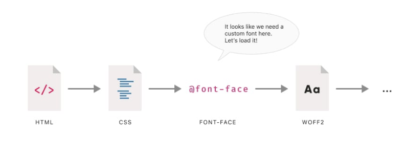
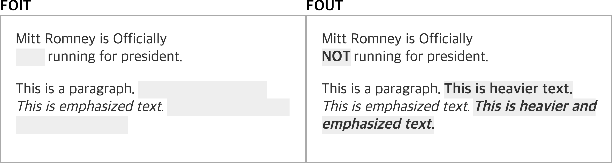
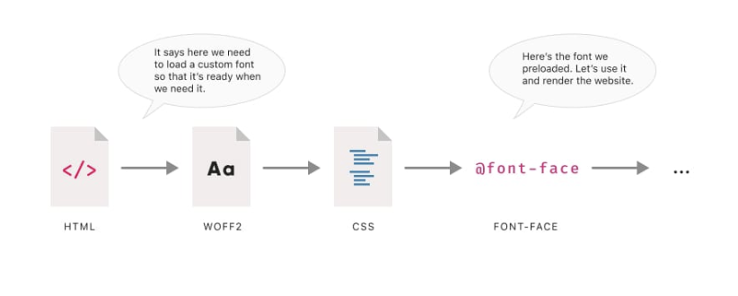
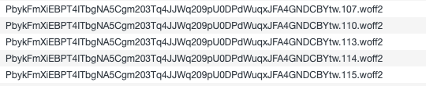

# Font

**목차**

- [Font](#font)
    - [들어가기에 앞서](#들어가기에-앞서)
  - [폰트를 불러오는 시점](#폰트를-불러오는-시점)
    - [폰트를 먼저 다운받으면 되지 않나?](#폰트를-먼저-다운받으면-되지-않나)
  - [폰트를 호스팅하는 방식](#폰트를-호스팅하는-방식)
    - [클라우드 호스팅 (Google Web Font)](#클라우드-호스팅-google-web-font)
    - [`preload`하면 되지 않나?](#preload하면-되지-않나)
    - [그럼 `preload`하고 싶으면 ..?](#그럼-preload하고-싶으면-)
    - [셀프 호스팅](#셀프-호스팅)
    - [시간을 줄여 .. ? 그럼 더 좋은거네 !](#시간을-줄여---그럼-더-좋은거네-)
    - [preload](#preload)
    - [fontsource](#fontsource)
  - [레퍼런스](#레퍼런스)

### 들어가기에 앞서

타팀 프로젝트에서 `fontsource` 라이브러리를 제거하고 `preload` 형태로 바꾼 것을 보고 저희가 이야기한 이후로 의문이 들어 폰트 호스팅에 관한 자료를 찾아봤습니다.

생각보다 더 `Font`(이하 폰트)에 대해 무지했더라구요. 이미 아실 수도 있지만 공유하면 좋을 것 같아서 문서로 남겨보겠습니다. 폰트(웹 폰트 포함)의 세계는 생각보다 어렵더라구요. 각 전략은 모두 장단점이 있습니다. 여러 포스팅을 참고했으며 제 방식대로 정리해서 풀어보겠습니다.


> 우리는 프론트엔드 개발자니까 .. 🥲

그럼 시작합니다.

## 폰트를 불러오는 시점

일반적으로 폰트를 불러오는 시점은 `CSS` 파일 내에 `@font-face` 키워드를 만났을 때입니다. 브라우저는 해당 구문을 읽고 커스텀 폰트가 필요함을 인지합니다.



네. 이게 바로 웹페이지 첫 렌더링 때 커스텀 폰트로 바로 볼 수 없는 이유입니다.

`HTML`, `CSS` 파일을 서버로부터 전달받고 렌더링을 한 후에 커스텀 폰트가 필요함을 알고 폰트를 다운받는 과정을 거치기 때문에 맨 처음부터 커스텀 폰트로 된 페이지를 볼 수 없습니다.
(`preload` 옵션에 대해서는 아래에서 설명하겠습니다)

`어? 그래서 폰트가 깜빡이면서 변했던건가?`


`font` 관련 `CSS` 속성에는 `font-display`라는 속성있습니다.

[font-display - CSS: Cascading Style Sheets | MDN](https://developer.mozilla.org/ko/docs/Web/CSS/@font-face/font-display)

여러 가지 속성이 있지만 그 중에서 자주 보는 속성은 `swap` 속성입니다.

`swap` 속성은 커스텀 폰트를 다운로드할 때까지 `fallback` 폰트를 보여주다가 다운이 완료되면 커스텀 폰트로 교체하는 속성입니다.

> **fallback 폰트란?**
>
> 우리는 일반적으로 `font-family`를 설정할 때 다음과 같이 작성합니다.
>
> `font-family: 'Noto Sans KR', sans-serif(= fallback font);`
>
> 커스텀 폰트를 설정할 때 `fallback` 폰트를 함께 설정하는데 커스텀 폰트가 존재하지 않을 경우 보여줄 대체 폰트입니다.

이러한 방식을 `FOUT`이라고 합니다.

브라우저의 렌더링 차단 처리 방식에 따라 `FOUT`(**flash of unstyled text**) 또는 `FOIT`(**flash of invisible text**)으로 나뉘며 동작 방식은 다음과 같습니다. (`FOFT`도 있으나 다루지 않겠습니다)



### 폰트를 먼저 다운받으면 되지 않나?

가능합니다. `CSS`보다 먼저 폰트를 다운받도록 다운로드 시점을 땡기게 만드는 `preload` 속성이 존재합니다. (예전에는 브라우저마다 `preload` 속성 지원을 제각각으로 했지만 요즘은 IE를 제외한 **모던 브라우저**에서는 웬만하면 지원하는 편입니다. [https://caniuse.com/link-rel-preload](https://caniuse.com/link-rel-preload))



`preload` 옵션에는 장단점이 있습니다. 예상하실 수도 있겠지만 `pre` + `load`입니다. 미리 다운로드한다는 것이죠. `미리` 다운로드한다는 것은 그만큼 `initial rendering`이 늦어질 수 있다는 것입니다.

첫 페이지에서는 사용하지 않지만 다른 페이지에서는 사용하는 폰트가 있다고 할 때 첫 페이지에서만 머물고 나가는 사람은 해당 폰트를 보지 못하겠지만 다운로드는 하는 상황이 펼쳐질 수도 있습니다. 또한 커스텀 폰트에 대한 우선 순위는 당기고 나머지 `CSS` 파일의 우선 순위는 암묵적으로 낮추는 것이기 때문에 이로 인한 버그 발생이 있을 수 있습니다.

앞서 말했듯이 모든 전략에는 장단점이 있습니다.

`FOUT`이나 `FOIT` 방식이 사용자 경험을 떨어트린다고 생각이 든다면 `preload`도 하나의 방법이 될 수 있습니다. 시점에 대해 알아봤으니 폰트를 호스팅하는 방식에 대해 알아보겠습니다.

## 폰트를 호스팅하는 방식

폰트를 호스팅하는 방식에는

- `Self Hosting` (이하 셀프 호스팅)
- `Cloud Hosting` (이하 클라우드 호스팅)

이 두 가지가 존재합니다. 이미 감이 오시는 분들도 있으실 텐데 클라우드 호스팅의 예는 대표적으로 [구글 웹 폰트](https://fonts.google.com/)입니다. 사용법도 간단하여 사용하기 쉽습니다. 아마 대부분 한번 쯤은 사용해보셨을 것이라고 생각합니다.

셀프 호스팅과 클라우드 호스팅의 차이는 해당 폰트를 누가 제공해주냐에 있습니다. 셀프 호스팅은 셀프라는 말에 걸맞게 저희 로컬 서버에서 제공하는 거죠.

### 클라우드 호스팅 (Google Web Font)

대표적으로 **구글 웹 폰트** 서비스가 있습니다. **Adobe Fonts**와 같은 다른 웹 폰트도 존재하지만 라이센스나 지원하는 속성에서 구글 웹 폰트가 가장 많은 것을 제공하기 때문에 구글 웹 폰트만 설명하겠습니다.
(`Self Hosting`, `License`, `preconnect` 등 여러 가지 측면에서 구글 웹 폰트가 무료고 사용하기도 쉽습니다)

[Google Fonts](https://fonts.google.com/)

위 사이트에서 폰트를 선택하면 `link` 태그 방식과 `@import` 방식을 지원하는데 `link` 태그 방식이 `preconnect` 옵션도 사용할 수 있고 더 권장되는 방식이니 `link` 태그를 사용하는게 여러모로 좋습니다.

그럼 `link` 태그를 조금 더 자세히 알아보겠습니다. 구글 웹 폰트에서 복붙해서 사용하라는 `HTML` 코드를 보면 아래와 같이 생겼습니다.

```html
<link rel="preconnect" href="https://fonts.googleapis.com" />
<link rel="preconnect" href="https://fonts.gstatic.com" crossorigin />
<link href="https://fonts.googleapis.com/css2?family=Noto+Sans+KR&display=swap" rel="stylesheet" />
```

3번째 `link` 태그는 이해하겠는데 1, 2번째 `link` 태그는 도대체 뭐지? 라고 생각할 수 있는데 구글 웹폰트가 `CSS`파일과 폰트 파일을 제공하는 방식 때문입니다. (왜 하나의 도메인으로 제공하지 않는지는 해외 개발자들도 이해하지 못하는 것 같습니다)

앞서 설명했듯이 브라우저에게 커스텀 폰트 사용함을 인지시키기 위해서는 `@font-face` 속성이 적힌 `CSS` 파일이 있어야 합니다.

첫 번째 태그로 해당 속성이 적힌 `CSS` 파일을 가져오고 두 번째 태그로 폰트 파일을 받아옵니다. 정확히는 `preconnect` 옵션으로 세 번째 태그에 적힌 도메인으로 받아올 폰트에 대한 연결 시간 및 다운로드 시간을 줄이기 위해 앞선 두 개의 도메인으로 `pre` + `connect`한다 라고 생각하시면 됩니다.

[Should you self-host Google Fonts?](https://www.tunetheweb.com/blog/should-you-self-host-google-fonts/)

그리고 세 번째 `link` 태그를 보시면 아시겠지만 `display=swap` 처리가 되어있습니다. 해당 태그를 통해 가져오는 `CSS` 정보를 보면 다음과 같이 적혀 있습니다.

```css
/* [0] */
@font-face {
  font-family: 'Noto Sans KR';
  font-style: normal;
  font-weight: 400;
  font-display: swap;
  src: url(https://fonts.gstatic.com/s/notosanskr/v27/PbykFmXiEBPT4ITbgNA5Cgm203Tq4JJWq209pU0DPdWuqxJFA4GNDCBYtw.0.woff2)
    format('woff2');
  unicode-range: U+f9ca-fa0b, U+ff03-ff05, U+ff07, U+ff0a-ff0b, U+ff0d-ff19, U+ff1b, U+ff1d, U+ff20-ff5b, U+ff5d,
    U+ffe0-ffe3, U+ffe5-ffe6;
}
```

이 말인 즉슨 구글 웹 폰트를 사용한다고 `FOUT` 현상이 사라지는 건 아닙니다. 오히려 그걸(`swap`) 권장 사항으로 사용하고 있죠.

### `preload`하면 되지 않나?

못합니다. 구글 웹폰트 서버로부터 가져오는 폰트 파일들이 `Hash` 처리되어 있기 때문에 특정 폰트 파일 경로를 `preload`한다는 게 불가능합니다.



> preload 기능 자체를 지원하지 않는 것 같습니다.

### 그럼 `preload`하고 싶으면 ..?

방법은 있습니다. 구글 웹 폰트에서 제공하고 있는 폰트들은 다운 역시 가능하기 때문에 구글 웹폰트 helper 사이트를 이용하여 구글 웹폰트에서 제공하고 있는 폰트에 한해서는 셀프 호스팅으로 전향하여 `preload` 할 수 있습니다. (현재 `Revitu` 프로젝트에서 하고 있는 방식입니다)

[google webfonts helper](https://google-webfonts-helper.herokuapp.com/fonts/noto-sans-kr?subsets=korean)

이 외에도 구글 웹 폰트는 앞서 잠깐 설명했듯이 여러 가지 추가적인 기능을 제공합니다.

- `user-agent`를 보고 해당 브라우저에 적합한 폰트 파일 제공
- 원하는 경우 글꼴을 추가로 조정 가능 (ex. 운영 체제 고려 등)
- 폰트 유지보수
- ...

### 셀프 호스팅

위에서 설명했듯이 클라우드 호스팅과의 차이점은 구글 웹폰트같은 클라우드 서비스 제공자가 아닌 로컬 서버(또는 직접 관리하는 `S3` & `CloudFront` 등)에서 폰트를 호스팅한다는 것입니다.

앞서 구글 웹폰트에서는 폰트를 제공하기 위해 여러 도메인에 연결하는 작업이 필요했고 그 이후에 폰트를 다운받는 작업이 진행됐었습니다. 반면에 셀프 호스팅으로 폰트를 제공할 경우 여러 도메인에 연결하는 작업이 없으니 그만큼 시간을 줄일 수 있다는 것을 뜻합니다.

### 시간을 줄여 .. ? 그럼 더 좋은거네 !

**그렇진 않습니다. 🥲**

정확히는 장단점이 있다고 해야 합니다. 시간이 줄어드는 것은 맞습니다. 그러나 눈에 띌 만큼 차이를 가져다 줄지는 장담할 수 없습니다. 또한 구글 웹폰트에서 해주던 브라우저마다 적합한 폰트를 제공해주는 것을 이제는 직접 관리해야 함을 뜻하며 폰트의 유지보수 진행되지 않음을 뜻합니다. (실제로 구글 웹폰트에서 관리하고 있는 폰트들은 주기적으로 업데이트 됩니다. 그렇기에 특정 도메인에서 해당 폰트들에 대한 정보를 제공하고 있기도 합니다)

### preload

`preload` 옵션을 사용하고 싶다면 셀프 호스팅으로 전향하는 게 맞습니다.

### fontsource

[GitHub - fontsource/fontsource: Self-host Open Source fonts in neatly bundled NPM packages.](https://github.com/fontsource/fontsource#fontsource)

여러 도메인에 대한 네트워크 요청이나 오프라인 상태에서도 폰트를 제공하고 싶은데 폰트 관리도 하고 싶다면 `fontsource`와 같은 라이브러리를 사용하면 됩니다.

여러 번 설명했듯이 모든 전략에는 장단점이 존재합니다.

정답은 없으며 원하는 방식에 제일 들어 맞는 방식을 선택하면 될 것 같습니다.

어느 정도 생략한 부분이 있기 때문에 이해가 가지 않으신다면 아래 레퍼런스를 참고하시는 것을 추천드립니다!

## 레퍼런스

- [The Best Font Loading Strategies and How to Execute Them | CSS-Tricks](https://css-tricks.com/the-best-font-loading-strategies-and-how-to-execute-them)
- [The Web Fonts: Preloaded-zachleat.com](https://www.zachleat.com/web/preload/#use-with-a-font-loading-strategy)
- [Should you self-host Google Fonts?](https://www.tunetheweb.com/blog/should-you-self-host-google-fonts)
- [Making Google Fonts Faster in 2022](https://sia.codes/posts/making-google-fonts-faster/)
- [Preloading fonts: when does it make sense?](https://betterwebtype.com/articles/2019/11/02/preloading-fonts-when-does-it-make-sense/)
- [Self-hosted fonts vs. Google Fonts API - LogRocket Blog](https://blog.logrocket.com/self-hosted-fonts-vs-google-fonts-api/)
