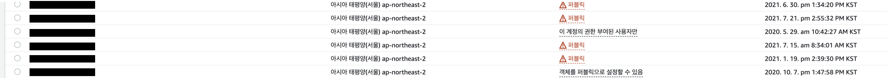
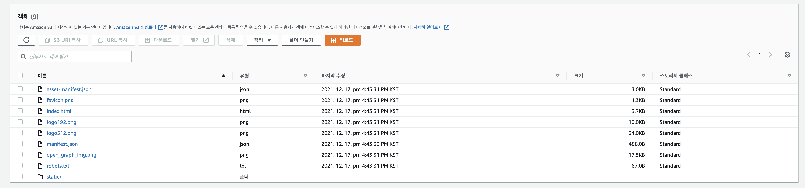
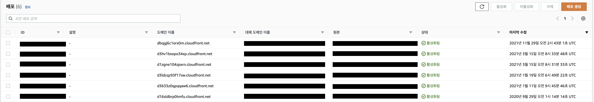
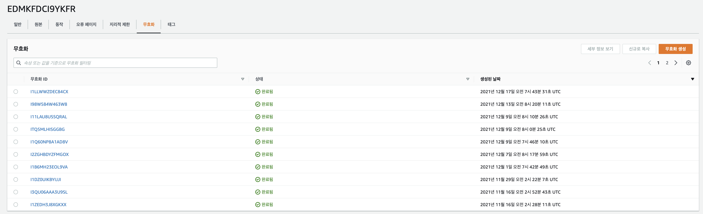
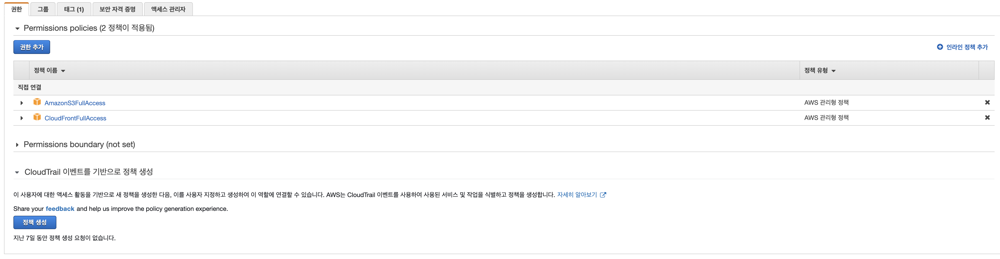

# 스크립트를 통한 배포

**목차**

- [스크립트를 통한 배포](#스크립트를-통한-배포)
  - [개요](#개요)
  - [기존 방식](#기존-방식)
    - [AWS S3 버킷](#aws-s3-버킷)
    - [CloudFront](#cloudfront)
  - [스크립트를 이용한 방식](#스크립트를-이용한-방식)
    - [주의](#주의)

## 개요

여기서 설명하는 것은 스크립트와 **AWS cli**를 이용한 방법이며 **React Build** 파일 생성, **AWS S3** 버킷 파일 교체 그리고 **CloudFront** 캐시 무효화 작업을 스크립트 파일로 작성하여 해당 스크립트를 실행하는 방식입니다.

아래의 설명은 **AWS S3**와 **AWS CloudFront를** 통해 배포가 되어 있는 정적 웹페이지 호스팅을 전제로 합니다.

## 기존 방식

**AWS S3**에서 지원하고 있는 정적 웹페이지 호스팅을 이용하고 있는 상황이라면 **S3**의 특정 버킷 안에 빌드 파일을 업로드하고 해당 빌드 파일을 기반으로 호스팅이 되고 있는 상황일 겁니다.

버킷에 업로드된 빌드 파일을 기반으로 웹페이지가 호스팅되기 때문에 수정 사항이 생겼을 경우 업로드 되어 있는 파일들을 삭제하고 새로운 빌드 파일로의 교체가 필요합니다.

> ✋ **주의**  
> **특정 파일이 아닌 전체 파일을 교체하는 이유**
>
> 1. 버킷에 업로드된 파일에서 수정된 파일만 교체하는 작업은 상당히 번거롭습니다.
> 2. 엄청나게 큰 파일을 버킷에 올리는 게 아닌 이상 버킷에 파일을 올리는 작업에는 큰 비용이 발생하지 않습니다.
>
> 위와 같은 이유들로 **AWS S3 cli**를 이용하여 버킷 내의 파일을 전부 삭제하고 새로운 빌드 파일을 올리는 방식으로 진행합니다. (이 방법은 정답은 아닙니다)

### AWS S3 버킷

- **버킷 진입**

  특정 웹페이지를 호스팅하고 있는 S3 버킷을 찾아 해당 버킷으로 진입해 줍니다.

  

- **파일 삭제 및 새로운 빌드 파일 업로드**

  

### CloudFront

웹페이지의 캐시 클라우드 역할을 해주는 **AWS** 서비스입니다. 캐시 통계 등을 볼 수 있으며 SSL 인증서(**HTTPS**)를 지원해 줍니다.

> ✋ **주의**  
> **HTTPS**
>
> **Route53**을 이용하여 도메인을 구입했을 경우 **HTTPS** 적용을 쉽고 빠르게 진행할 수 있습니다.
>
> 다른 플랫폼에서 도메인 주소를 구입했을 경우는 인증 과정이 더 복잡합니다. 자세한 사항은 **AWS** 문서를 참고하면 됩니다.

**CloudFront**를 이용하는 경우 캐시를 활용하고 있다는 뜻인데 default로 설정된 캐시 유효 시간이 존재합니다. 이 말은 해당 캐시 유효 기간이 끝날 때까지는 수정 전 파일이 사용자에게 보여진다는 뜻입니다.

따라서, 이러한 캐시를 무효화하는 작업이 필요한데 이를 **CloudFront** 무효화 탭에서 진행할 수 있습니다.

- **CloudFront 객체 진입**

  

- **캐시 무효화 생성**

  

캐시 무효화는 특정 경로를 통해 진행할 수도 `/*`로 전체 경로 캐시 무효화를 진행할 수도 있습니다.

## 스크립트를 이용한 방식

기존 방식으로 몇 번 빌드 파일을 교체해보셨다면 느끼셨겠지만 매번 이런 작업을 진행하는 것은 상당히 귀찮은 일 일겁니다. 그래서 보통은 Github webhook과 Jenkins 등 다양한 방법으로 CI/CD를 구축하여 배포를 자동화합니다. 이를 여기서 다루진 않지만 공부해 두시는 것을 추천합니다.

앞서 설명했듯이 여기서 사용하는 방식은 스크립트와 **AWS cli**를 이용하는 방법입니다. 스크립트 파일을 작성하여 `빌드 파일 생성`, `AWS S3 버킷 파일 삭제 및 업로드` 그리고 `CloudFront 캐시 무효화`를 진행합니다.

### 주의

**IAM**으로 **AWS S3**, **CloudFront**에 권한을 부여해줘야 합니다. **aws cli**를 처음 사용할 때 **IAM**으로 생성한 아이디와 시크릿 키 값을 입력하게 되는데 해당 아이디를 생성할 때 두 서비스에 대한 접근 권한이 필수입니다.
(잘못했거나 사용자를 변경하는 경우 **AWS cli** `config` 설정에서 아이디와 시크릿 키 교체를 진행하면 됩니다)



- `deploy.sh`

```bash
#!/bin/bash

ORIGIN_PATH="your origin path"
BUILD_PATH=$ORIGIN_PATH/build

echo "> Remove build/ : rm -rf build/"
rm -rf $BUILD_PATH

echo "> Build Project : npm run build"
cd $ORIGIN_PATH && npm run build

echo "> Remove S3 bucket files : aws s3 rm s3://[bucket] --recursive"
aws s3 rm s3://sample.com --recursive

echo "> Copy Build files to S3 Bucket : aws s3 sync BUILD_PATH s3://[bucket]"
aws s3 sync $BUILD_PATH s3://sample.com

echo "> AWS CloudFront create invalidation wild card (/*)"
aws cloudfront create-invalidation --distribution-id "id" --paths "/*"
```

위 스크립트를 `sh deploy.sh` 로 터미널에서 실행하면 모든 과정은 완료됩니다.

**AWS S3 cli**, **CloudFront cli**를 각각 사용하며 자세한 사용법은 **AWS** 공식 문서를 참고하시면 됩니다.

- **AWS S3 cli**

[AWS CLI에서 상위 수준(s3) 명령 사용](https://docs.aws.amazon.com/ko_kr/cli/latest/userguide/cli-services-s3-commands.html)

- **AWS CloudFront cli**

[cloudfront - AWS CLI 1.22.26 Command Reference](https://docs.aws.amazon.com/cli/latest/reference/cloudfront/index.html)
