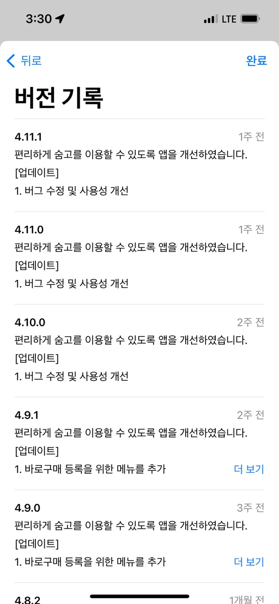
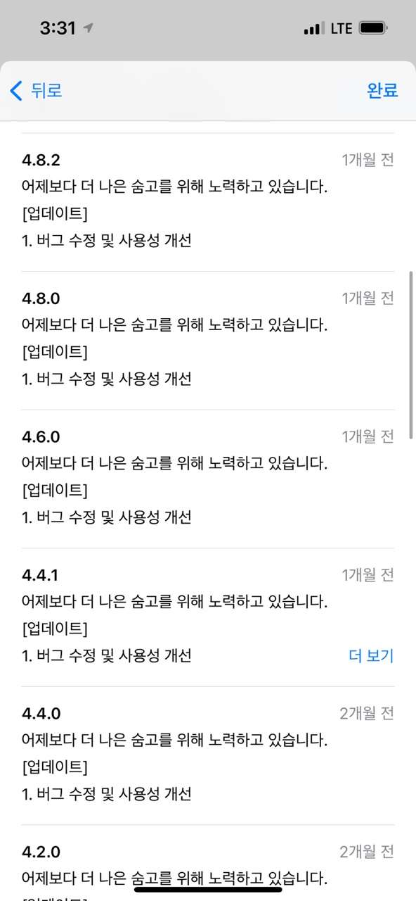

# 웹/앱 업데이트 주기 관련 정리

**목차**

- [웹/앱 업데이트 주기 관련 정리](#웹앱-업데이트-주기-관련-정리)
  - [개요](#개요)
  - [Why It’s Good to Release Updates Frequently](#why-its-good-to-release-updates-frequently)
  - [Strategies for Releasing Your App (릴리즈 전략)](#strategies-for-releasing-your-app-릴리즈-전략)
  - [예시](#예시)
    - [숨고](#숨고)
    - [배민](#배민)

## 개요

모든 것이 그렇듯 정해진 것은 없지만 사용자에게 업데이트 내역을 반영해주기 위한 앱/웹 업데이트가 어느 시기 또는 주기로 진행되어야 할까?

새로운 추가 기능이 개발되었을 경우에는 당연히 새로운 릴리즈 배포가 진행되어야 하지만 자잘한 UI 업데이트 또는 기능 수정의 경우 매번 릴리즈를 진행할 수 없다.
(할 수도 있겠지만 주관적인 생각으로는 좋지 않다고 생각된다)

따라서 일반적으로 앱이나 웹의 업데이트 배포 주기를 어떤식으로 진행하고 있는지 궁금하여 이러한 사항들을 조사하고 이를 정리해두려고 한다.

아래의 링크에서는 릴리즈에 대한 몇몇 전략을 소개해주고 있다.

[Find the Right Release Strategy for your Mobile App](https://betterprogramming.pub/find-the-right-release-strategy-for-your-mobile-app-ba1bce3d7fa2)

## Why It’s Good to Release Updates Frequently

1. 유저들은 새로운 기능을 좋아한다.
2. 작은 릴리즈 사항일 수록 적은 리스크를 가진다.

## Strategies for Releasing Your App (릴리즈 전략)

1. **새로운 기능이 개발될 때마다 릴리즈**
2. **유연한 배치 릴리즈**

   중간 단위의 팀이 기능이 개발되거나 자잘한 업데이트가 모였을 때 릴리즈를 진행하는 방식

3. **스크럼**

   스프린트 방식으로 작업을 진행하며 2-4주 기간마다 스프린트 방식으로 작업한 결과물을 릴리즈 하는 방식

4. **Release train**

   스포티파이에서 실제로 사용하고 있는 릴리즈 방식으로 일정 주기마다 무조건 릴리즈가 이루어지는 방식

   변경점이 없어도 릴리즈를 진행한다고 하는데 이 부분은 스포티파이 팀 내부에서 기준이 있을 것으로 추정

## 예시

### 숨고

왔다 갔다 하지만 평균 1주 단위로 업데이트 사항을 모아 릴리즈를 진행

단, 스토어 배포가 필수적으로 진행되어야 하는 경우 위와 상관없이 스토어 배포를 진행
(네이티브 코드의 변경 또는 이미지 등 정적 파일의 변경이 있을 경우)

### 배민

2주마다 2주의 기간 동안 생긴 업데이트 사항을 모아 릴리즈를 진행

자잘한 업데이트 사항의 경우 모아서 2주마다 진행한다는 것이고 애초에 2주 단위 스프린트 방식으로 기능 개발
