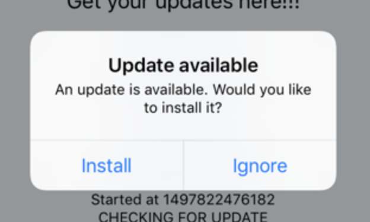
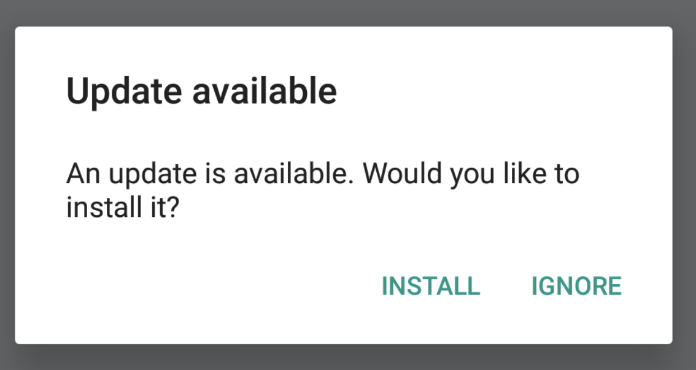
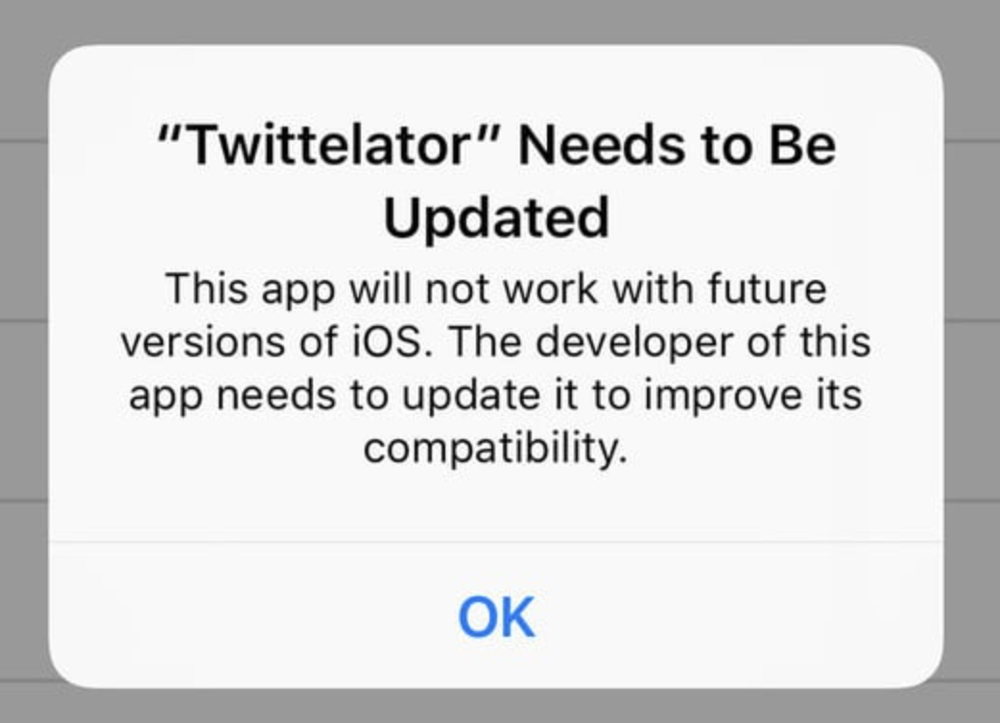

# Codepush

> ✋ **주의**
> 마소에서 만들어 놓은 문서가 상당히 잘 작성되어 있기 때문에 Codepush 공식 홈페이지와 Github 글을 따라가면서 Codepush 설정을 잡는 것을 가장 추천합니다.

**목차**

- [Codepush](#codepush)
  - [1. Staging vs Production](#1-staging-vs-production)
  - [2. updateDiglog 작성하기](#2-updatediglog-작성하기)
    - [업데이트 알림 예시](#업데이트-알림-예시)
  - [3. `codePushStatusDidChange` & `codePushDownloadDidProgress`](#3-codepushstatusdidchange--codepushdownloaddidprogress)
  - [4. Codepush Setup 순서](#4-codepush-setup-순서)
    - [App Center 셋팅](#app-center-셋팅)
    - [Android 셋업](#android-셋업)
    - [iOS 셋업](#ios-셋업)
    - [프로젝트에 codepush 적용하기](#프로젝트에-codepush-적용하기)
    - [릴리즈 하기](#릴리즈-하기)
  - [5. 내가 적용 및 테스트까지 완료했던 Codepush 옵션](#5-내가-적용-및-테스트까지-완료했던-codepush-옵션)
    - [Options](#options)

## 1. Staging vs Production

> [GitHub - microsoft/react-native-code-push: React Native module for CodePush](https://github.com/Microsoft/react-native-code-push#multi-deployment-testing)  
> **Multi-Deployment Testing Description**

하나의 Deployment Key로만 Codepush를 진행해도 되지만 서비스하는 앱이 베타 앱과 릴리즈 앱으로 나뉘어 있듯이 Codepush 또한 이와 같은 방식으로 Deployment Key를 운용할 수 있습니다.

공식 문서에서 제안하는 Production / Staging 트랙의 이상적인 운용은 다음과 같습니다.

1. 열심히 개발한 결과물을 `Staging` 트랙으로 배포합니다.
2. Staging 트랙을 바라보고 있는 앱을 이용해 서버로부터 업데이트 한 후 QA 를 진행하고, 의도대로 동작하는지 검증합니다.
3. 모든 QA 및 테스팅을 통과했다면 Staging 트랙에 배포된 현 상태를 `Production` 트랙으로 승격시킵니다.
4. Production 트랙을 바라보고 있는 앱을 이용해 서버로부터 업데이트 한 후, 의도대로 동작하는지 검증합니다.

## 2. updateDiglog 작성하기

> [CodePush API 참조를 React Native SDK - Visual Studio App Center](https://docs.microsoft.com/ko-kr/appcenter/distribution/codepush/rn-api-ref#codepushoptions)  
> **updateDialog method**

Codepush를 통해 업데이트 사항을 받는 동작에 대해 사용자에게 OS 기본 제공 알림을 띄울 수 있습니다. updateDialog라는 메서드를 통하여 알림을 띄울 수 있으며

- **updatedialog** *(UpdateDialogOptions)* -업데이트를 사용할 수 있는 경우 최종 사용자에 게 확인 대화 상자를 표시할지 여부를 결정 하는 데 사용 되는 "options" 개체이 고, 그럴 경우 사용할 문자열입니다. 기본값은로 `null` , 대화 상자를 비활성화 합니다. 이 값을 임의의 `true` 값으로 설정 하면 기본 문자열을 사용 하 여 대화 상자가 활성화 되 고 개체를이 매개 변수에 전달 하면 대화를 활성화 하 고 하나 이상의 기본 문자열을 재정의할 수 있습니다. 앱 스토어 배포 앱 내에서이 옵션을 사용 하도록 설정 하기 전에 [이 메모](https://github.com/Microsoft/react-native-code-push#app-store)를 참조 하세요.
  다음 목록은 사용 가능한 옵션과 기본값을 나타냅니다.
  - **Appendreleasedescription** *(Boolean)* -사용 가능한 릴리스에 대 한 설명을 최종 사용자에 게 표시 되는 알림 메시지에 추가할지 여부를 나타냅니다. 기본값은 `false`입니다.
  - 설명 **접두사** *(String)* -최종 사용자에 게 업데이트 알림을 표시할 때 릴리스 설명에 접두사를 지정 하려는 문자열 (있는 경우)을 나타냅니다. 기본값은 `" Description: "`입니다.
  - **mandatoryContinueButtonLabel** *(String)* -필수 업데이트를 설치 하기 위해 최종 사용자가 눌러야 하는 단추에 사용할 텍스트입니다. 기본값은 `"Continue"`입니다.
  - **mandatoryUpdateMessage** *(String)* -업데이트가 필수로 지정 된 경우 업데이트 알림의 본문으로 사용 되는 텍스트입니다. 기본값은 `"An update is available that must be installed."`입니다.
  - **optionalIgnoreButtonLabel** *(String)* -최종 사용자가 사용할 수 있는 선택적 업데이트를 무시 하기 위해 누를 수 있는 단추에 사용할 텍스트입니다. 기본값은 `"Ignore"`입니다.
  - **optionalInstallButtonLabel** *(String)* -최종 사용자가 선택적 업데이트를 설치 하기 위해 누를 수 있는 단추에 사용할 텍스트입니다. 기본값은 `"Install"`입니다.
  - **optionalUpdateMessage** *(String)* -업데이트가 선택 사항인 경우 업데이트 알림의 본문으로 사용 되는 텍스트입니다. 기본값은 `"An update is available. Would you like to install it?"`입니다.
  - **title** *(String)* -최종 사용자에 게 표시 되는 업데이트 알림의 머리글로 사용 되는 텍스트입니다. 기본값은 `"Update available"`입니다.

### 업데이트 알림 예시

**선택적 업데이트**

- **iOS**

  

- **Android**

  

**필수 업데이트 (취소 버튼이 없는 경우)**

- **iOS (Android도 위 이미지에서 IGNORE 버튼만 없는 알림창)**

  

## 3. `codePushStatusDidChange` & `codePushDownloadDidProgress`

[https://github.com/microsoft/react-native-code-push/issues/1786](https://github.com/microsoft/react-native-code-push/issues/1786)

**참고)**

- 최초 심사 후 store 업로드 후 적용 가능( 적용 하고 배포 후 심사 통과 시 사용 가능)
- 앱의 심사과정 없이 script 영역을 업데이트 할수 있음 (단 , native code의 수정은 반영할 수 없음)
- `Android` 와 `iOS` 플랫폼 별로 다른 App을 생성해야하며, **이름을 다르게 적용해야한다**

## 4. Codepush Setup 순서

> ✋ **주의**  
> Codepush 적용 옵션에는 다양한 방법이 있습니다. 아래의 설정 방법은 하나의 예시일 뿐 공식 홈페이지를 참조하는 것이 제일 좋은 방법입니다.
>
> 아래는 1개의 Deployment Key로 Codepush를 운용하기 위한 방법의 예시입니다. Staging과 Production으로 나눠 운용하고 싶다면 [1번 Staging vs Production](https://www.notion.so/Codepush-868d935379244d3c954ef28299122f40)에 있는 링크에 접속하여 나와 있는 설정을 추가하는 작업을 진행해주세요.

- **레퍼런스**
  - AppCenter Console
    [App Center](https://appcenter.ms/apps)
  - Microsoft Docs
    [CodePush를 사용 하 여 앱을 라이브 업데이트 - Visual Studio App Center](https://docs.microsoft.com/ko-kr/appcenter/distribution/codepush/)
  - Personal Blog
    [[RN Library 📚] codepush 도입하기 - 1. app center 셋팅](https://velog.io/@dody_/RN-Library-codepush-%EB%8F%84%EC%9E%85%ED%95%98%EA%B8%B0-1.-app-center-%EC%85%8B%ED%8C%85)
    [[RN Library 📚] codepush 도입하기 - 2. react-native-code-push 세팅](https://velog.io/@dody_/RN-Library-codepush-%EB%8F%84%EC%9E%85%ED%95%98%EA%B8%B0-2.-react-native-code-push-%EC%84%B8%ED%8C%85)
    [React Native - Code Push 3](https://gale-lee.medium.com/react-native-code-push-3-237b8c4360d7)
    [React Native 버그픽스 3분완성 [코드푸시 맛] - 2](https://zerogyun.dev/2021/07/15/React-Native-%EB%B2%84%EA%B7%B8%ED%94%BD%EC%8A%A4-3%EB%B6%84%EC%99%84%EC%84%B1-%EC%BD%94%EB%93%9C%ED%91%B8%EC%8B%9C-%EB%A7%9B-2/)

> 원래는 개발자는 앱스토어에 번들을 올리고, 사용자는 그것을 다운받는다. 코드 푸쉬를 도입하게 되면, 코드푸쉬 서버에 codepush deployment key가 등록되어있는 번들을 올려놓는다.자바스크립트를 수정한 후, 코드푸쉬 서버에 수정한 코드를 올린다.사용자가 어플을 시작하면, codepush deployment key를 활용하여 코드푸쉬 서버에 업데이트사항이 있는지 확인한다.업데이트 사항이 있다면 업데이트가 된다.

도입을 위한 단계는 아래와 같다. 차근차근 **App Center** 셋팅부터 해보자.

1. **App Center**에 어플을 등록한다.
2. `react-natvie-code-push`로 프로젝트에 **Codepush SDK**를 심는다.
3. 스토어에 배포를 한다.
4. **Codepush**로 배포를 한다.

### App Center 셋팅

- **`appcenter-cli` 설치**

  ```bash
  $ npm install -g appcenter-cli
  ```

- **App Center 계정 등록 및 관리**

  ```bash
  $ appcenter login
  ```

  터미널에 입력하면 토큰이 적혀있는 웹페이지가 뜬다.  
  토큰을 터미널 `Enter your token from the browser:` 에 넣어준다.

- **앱 생성하기**

  ```bash
  appcenter apps create -d <appDisplayName> -o <operatingSystem>  -p <platform>

  // 예시
  appcenter apps create -d appname -o Android  -p React-Native
  appcenter apps create -d appname -o iOS  -p React-Native

  //주의 appname 은 android/ios 별로 다르게 지정해주어야 한다
  ```

  이렇게 `Android`, `iOS` 각각 앱을 등록하고 앱센터로 가면 내 애플리케이션이 생성되어있다. 앱이 등록되었으면 **deployment production key** 또는 원한다면 **staging key**를 발급받아야 한다.

- **deployment key 발급받기**

  **deployment key**는 `app center의 내 앱 > Distribute > codepush`에 가면 확인할 수 있는데, 아직 발급이 안되었기 때문에 일단 발급부터 하자.

  `ownerName`: Sample Owner

  ```bash
  // deployment key 발급받기
  appcenter codepush deployment add -a <ownerName>/<appName> Staging
  appcenter codepush deployment add -a <ownerName>/<appName> Production

  // deployment key 확인하기
  appcenter codepush deployment list -a <ownerName>/<appname> -k
  ```

  **App Center**에 다시 가서 확인해보면,

  > Everything is ready.

  라는 문구와 함께 `Add the CodePush SDK to your app` 이라는 안내가 나온다.

- **react-native-code-push 셋팅**

  프로젝트에 `react-native-code-push`를 설치하고 `iOS`/`Android` 각각 설정해야 한다.버전마다 설치 방법이 상이하게 다르다고 하니 꼭 공식문서를 참고해서 셋팅할 것

  ```bash
  npm install --save react-native-code-push
  ```

### Android 셋업

- **`android/settings.gradle` 파일 끝에 아래 코드를 추가한다.**

  ```java
  include ':app', ':react-native-code-push'
  project(':react-native-code-push').projectDir = new File(rootProject.projectDir, '../node_modules/react-native-code-push/android/app')
  ```

- **`android/app/build.gradle` 파일에 `codepush.gradle`를 추가한다.**

  ```java
  // apply from: "../../node_modules/react-native/react.gradle"
  apply from: "../../node_modules/react-native-code-push/android/codepush.gradle"
  ```

- **`MainApplication.java`를 공식문서 내용대로 수정한다.**

  ```java
  ...
  // 1. codepush 패키지를 import한다.
  import com.microsoft.codepush.react.CodePush;

  public class MainApplication extends Application implements ReactApplication {

    private final ReactNativeHost mReactNativeHost = new ReactNativeHost(this) {
      ...

      // 2. getJSBundleFile 메소드를 오버라이드 한다.
      @Override
      protected String getJSBundleFile() {
        return CodePush.getJSBundleFile();
      }
    };
  }
  ```

- **배포키를 `strings.xml`에 추가한다.**

  ```bash
  // 배포키 알아내기
  appcenter codepush deployment list -a <ownerName>/<appname> -k
  ```

  ```xml
  // strings.xml
  <resources>
    <string name="app_name">AppName</string>
    <string moduleConfig="true" name="CodePushDeploymentKey">Staging deploymentkey</string>
  </resources>
  ```

### iOS 셋업

- `cd ios && pod install && cd ..`

- `AppDelegate.m` 파일 상단에 `#import <CodePush/CodePush.h>`를 추가한다.아래 **before** 코드를 찾아 **after** 코드로 바꿔준다.

  ```objectivec
  // before
  return [[NSBundle mainBundle] URLForResource:@"main" withExtension:@"jsbundle"];
  // after
  return [CodePush bundleURL];
  ```

- `Info.plist`파일에 아래 코드를 추가한다.

  ```bash
  // 배포키 알아내기
  appcenter codepush deployment list -a <ownerName>/<appname> -k
  ```

  ```xml
  // Info.plist
  <key>CodePushDeploymentKey</key><string>Staging deploymentkey</string>
  ```

### 프로젝트에 codepush 적용하기

최상위 컴포넌트에 아래와 같은 작업을 해야 한다. 관련 옵션도 설정해줄 수 있는데 아래 링크를 참고하자. '앱이 시작할때 업데이트를 할 것이냐' 등의 옵션이 있다.[codepush api 확인하기](https://github.com/microsoft/react-native-code-push/blob/master/docs/api-js.md)

```jsx
import React from 'react';
import codePush from 'react-native-code-push'; // here!

const App = () => <SomeComponent />;

// here! 각종 codepush 관련 옵션을 설정하고
const codePushOptions = {
  checkFrequency: codePush.CheckFrequency.ON_APP_START,
  installMode: codePush.InstallMode.IMMEDIATE,
};

// here! 최상위 컴포넌트를 codepush 래퍼로 감싸서 export 시키고, 해당 컴포넌트를 앱에 등록시킵니다.
export default codepush(codePushOptions)(App);
```

### 릴리즈 하기

프로젝트 루트 디렉토리에서 한다.

```bash
// 릴리즈 하기
appcenter codepush release-react -a <ownerName>/<appname> -d Staging
/or
appcenter codepush release-react -a <ownerName>/<appname> -d Production

// codepush에 이름 붙이기
appcenter codepush release-react -a <ownerName>/<appname>  -m --description "Modified the header color"

// 배포 확인하기
appcenter codepush deployment list -a <ownerName>/<appName>
```

## 5. 내가 적용 및 테스트까지 완료했던 Codepush 옵션

> `codePushStatusDidChange`과 `codePushDownloadDidProgress` 메서드를 이용하기 위해 Context를 구현해놓은 상태

- **CodepushProvider.tsx**

  ```tsx
  import React, { createContext, useContext } from 'react';
  import { Alert } from 'react-native';
  import codePush, { DownloadProgress } from 'react-native-code-push';

  interface ICodepushContext {
    status: null | codePush.SyncStatus;
    progress: null | number;
  }

  // @ts-ignore
  const CodePushContext = createContext<ICodepushContext>({});

  export const useCodePush = () => useContext<ICodepushContext>(CodePushContext);

  class CodepushController extends React.Component<{}, ICodepushContext> {
    state = {
      status: null,
      progress: null,
    };

    codePushStatusDidChange(status: codePush.SyncStatus) {
      switch (status) {
        case codePush.SyncStatus.UPDATE_INSTALLED:
          Alert.alert(
            '다운로드 완료',
            "업데이트 사항을 반영하시겠습니까?\n'나중에'를 클릭하시면 앱이 종료되고 다시 시작될 때 자동으로 업데이트 사항이 반영됩니다.",
            [
              {
                text: '나중에',
                style: 'cancel',
              },
              {
                text: '반영',
                onPress: () => codePush.restartApp(),
              },
            ]
          );
      }
      this.setState({ status });
    }

    codePushDownloadDidProgress(progress: DownloadProgress) {
      this.setState({ progress: progress.receivedBytes / progress.totalBytes });
    }

    render() {
      return (
        <CodePushContext.Provider
          value={{
            status: this.state.status,
            progress: this.state.progress,
          }}
        >
          {this.props.children}
        </CodePushContext.Provider>
      );
    }
  }

  export const CodepushProvider = codePush({
    checkFrequency: codePush.CheckFrequency.ON_APP_START,
    updateDialog: {
      title: '업데이트 알림',
      optionalInstallButtonLabel: '확인',
      optionalIgnoreButtonLabel: '취소',
      optionalUpdateMessage:
        "업데이트 사항이 존재합니다.\n지금 업데이트 사항을 내려받으시겠습니까?\n('확인'을 누르면 자동으로 진행됩니다.)",
      mandatoryContinueButtonLabel: '확인',
      mandatoryUpdateMessage:
        '필수 업데이트가 있습니다.\n최적화된 환경에서 이용할 수 있도록\n최신 버전으로 업데이트를 진행합니다.',
    },
    installMode: codePush.InstallMode.ON_NEXT_RESTART,
  })(CodepushController);
  ```

### Options

- `codePushStatusDidChange`

  업데이트 사항 다운로드 완료 타이밍을 잡기 위하여 추가된 메서드

- `codePushDownloadDidProgress`

  다운로드 % 진행률을 표시해주기 위해서 추가해놓은 옵션

- **checkFrequency**

  **Codepush**가 앱 버전에 해당하는 업데이트 사항이 있는지 체크하는 타이밍을 설정하는 옵션  
  `codePush.CheckFrequency.ON_APP_START`로 앱이 구동될 때 체크

- **installMode**

  **Codepush**로 내려받은 업데이트 사항을 설치하는 타이밍을 설정하는 옵션  
  `codePush.InstallMode.ON_NEXT_RESTART`로 앱이 재시작될 때 다운 받은 업데이트 사항이 적용되도록 구성  
  단, 업데이트 다운 완료 후 사용자에게 재시작 버튼 옵션을 제공하여 재시작 버튼을 누를 경우 바로 앱이 재시작 되면서 업데이트가 적용되도록 한 상태
