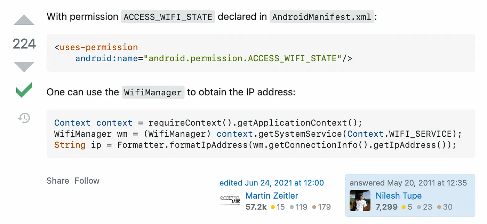
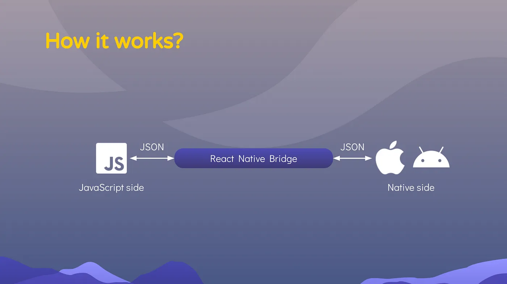

# Deep dive into React Native JSI

> 원본 글  
> https://engineering.teknasyon.com/deep-dive-into-react-native-jsi-5fbad4ea8f06

**목차**

- [Deep dive into React Native JSI](#deep-dive-into-react-native-jsi)
  - [How old React Native Architecture works](#how-old-react-native-architecture-works)
  - [Emerging of JSI](#emerging-of-jsi)
  - [Variable definitions in JavaScript and JSI](#variable-definitions-in-javascript-and-jsi)
    - [Number type definition](#number-type-definition)
    - [String type definition](#string-type-definition)
    - [Function definition](#function-definition)
  - [Bridge and JSI differences](#bridge-and-jsi-differences)
  - [MMKV library as an example for JSI](#mmkv-library-as-an-example-for-jsi)
  - [Using JSI in Vision Camera Library](#using-jsi-in-vision-camera-library)
  - [Custom Host Object creation](#custom-host-object-creation)
  - [Accessing to a global async function in the JS runtime](#accessing-to-a-global-async-function-in-the-js-runtime)
  - [Conclusion](#conclusion)

## How old React Native Architecture works

아시는 분들도 계시겠지만, React Native에서는 JS 측과 Native 측의 통신이 Bridge 파운데이션으로 이루어집니다. JS 측은 이미 잘 격리된 환경을 가지고 있기 때문에 Native 측과 통신할 수 있는 메커니즘이 없습니다. 예를 들어, 네이티브 모듈을 만들지 않고는 자바스크립트 환경에서 디바이스 이름에 접근할 수 없거나 현재 디바이스의 로컬 IP 주소를 가져올 수 없습니다.



> 현재 디바이스에 대한 로컬 IP 주소를 얻으려면 네이티브 모듈을 만들어야 합니다.

네이티브 모듈에서는 JS 코드에서 네이티브 측에 액세스하기 위해 Java 및 ObjC 언어로 API를 생성합니다. 그리고 이러한 상황은 React Native에만 국한된 것이 아닙니다. Java에서는 C++ 및 네이티브 C 코드를 호출하기 위해 JNI를 사용해야 합니다. 마찬가지로 Swift에서 C++ API를 호출하려면 C 또는 ObjC 언어를 사용하여 Bridge 계층을 만들어야 합니다. React Native에서도 Bridge 구조는 동일한 방식으로 작동합니다.



> React Native의 Bridge 구조는 JSON 메시지를 통한 통신을 가능하게 합니다.

Bridge는 터널을 제공하며, 이 터널을 통해 JS와 Native 간의 메시지 전송을 수행합니다. 예를 들어, 디바이스의 IP 주소를 가져오려면 Native 측의 `getIPAddress` 메서드를 호출해야 합니다. 네이티브 측에서 이 메시지를 받으면 디바이스의 실제 IP 주소를 얻게 되고, 이를 다른 메시지에 담아 Bridge를 통해 JS 측으로 전송합니다. JS 측은 메시지에서 이 IP 주소를 가져와 화면에 표시할 수 있습니다.


> React Native 애플리케이션에서 카메라 열기 위한 플로우는 위 이미지와 같습니다.

아시다시피 Bridge flow는 네이티브 측을 호출하는 데 이상적인 솔루션이 아닙니다. 이 솔루션은 이러한 메시지를 일괄 처리합니다. 일괄 처리 시스템이 이러한 메시지를 일괄 처리하기 때문에 사용자 기기에서 약간의 지연이 발생합니다. 따라서 메시지를 다른 쪽에 즉시 보낼 수 없습니다. 또한 메시지를 JSON 형식으로 묶기 위해 일부 직렬화 작업이 수행됩니다. 예를 들어, 간단한 숫자 변수를 네이티브 측에 보내려면 이 변수를 JSON 문자열로 변환해야 합니다. 그리고 이 작업은 네이티브 통신에 비해 엄청나게 느립니다. 이러한 이유로 Bridge를 새로운 아키텍처로 교체해야 합니다.

## Emerging of JSI


> JSC(자바스크립트 코어), 헤르메스 및 V8 엔진은 JSI를 지원합니다.

JSC, Hermes, V8과 같은 자바스크립트 런타임은 고성능으로 작동해야 하므로 C와 C++로 작성됩니다. 이러한 상황을 활용하고자 하는 개발자들은 네이티브 측과 대화할 수 있는 C++ API를 만들었습니다. 그리고 이를 JSI(JavaScript Interface)라고 불렀습니다. JSI는 자바스크립트 런타임에 추상화 계층을 제공합니다. 이 계층은 객체 지향 언어의 인터페이스 개념으로 생각하면 됩니다. 이러한 언어에서는 인터페이스에 정의할 함수를 지정하면 이를 구현하는 클래스가 이를 재정의할 의무가 있습니다. 마찬가지로 JSI 측에서 이 작업을 수행하면 C++ 측에서 숫자 값을 직접 전송하고 자바스크립트 측에서 유형 변환 없이 값을 가져올 수 있습니다.

## Variable definitions in JavaScript and JSI

### Number type definition

자바스크립트에서 number 타입의 변수를 정의하는 방법은 다음과 같습니다:

```javascript
// Javascript
const number = 42;
```

그렇다면 C++ 측에서 변수를 정의하고 JS 측으로 전달하려면 어떻게 해야 할까요? 먼저 C++에서 숫자가 어떻게 정의되는지 자세히 살펴봅시다:

```c++
// JSI (C++)
jsi::Value number = jsi::Value(42);
```

여기에서 볼 수 있듯이 `Value` 클래스의 인스턴스는 **jsi** 네임스페이스에서 `Value()` 생성자를 사용하여 생성됩니다. 나중에 이 인스턴스는 자바스크립트 측에서 숫자로 직접 사용할 수 있습니다.

### String type definition

마찬가지로 JS와 C++ 쪽의 string 변수 정의는 다음과 같습니다:

```javascript
// JavaScript
const name = 'Marc';
```

```c++
// JSI (C++)
jsi::Value name = jsi::String::createFromUtf8(runtime, "Marc")
```

여기서 문자열 변수는 **jsi** 네임스페이스의 `String`에서 `createFromUtf8` 메서드를 사용하여 생성됩니다.

### Function definition

아시다시피 함수는 자바스크립트 측에서 다음과 같이 정의할 수 있습니다:

```javascript
// JavaScript
const add = (first, second) => {
  return first + second;
};
```

C++ 측에서 함수를 생성하여 JavaScript 측에서 사용하려면 다음과 같이 `createFromHostFunction` 메서드를 사용합니다:

```c++
// JSI (C++)
auto add = jsi::Function::createFromHostFunction(
    runtime,
    jsi::PropNameID::forAscii(runtime, "add"), // add function name
    2, // first, second variables (2 variables)
    [](
        jsi::Runtime& runtime,
        const jsi::Value& thisValue,
        const jsi::Value* arguments, // function arguments
        size_t count
    ) -> jsi::Value {
        double result = arguments[0].asNumber() + arguments[1].asNumber();
        return jsi::Value(result);
    }
);
```

JSI의 number는 항상 `double` 타입입니다. 위와 같이 생성된 `add` 메서드는 자바스크립트 측에서 바로 사용할 수 있습니다.

```javascript
// JavaScript
const result = add(5, 8);
```

이 방법은 C++ 쪽에서도 사용할 수 있습니다:

```c++
// JSI (C++)
auto result = add.call(runtime, 5, 8);
```

물론 위와 같이 글로벌 네임스페이스에서 `add` 함수를 사용하려면 다음과 같이 정의해야 합니다:

```javascript
// Javascript
global.add = add;
```

```c++
// JSI (C++)
runtime.global().setProperty(runtime, 'add', std::move(add));
```

우리가 만든 메소드를 Bridge의 다른 네이티브 모듈과 비교하면 이 함수가 비동기로 정의되지 않았으므로 동기적으로 실행된다는 것을 알 수 있습니다. 여기서 볼 수 있듯이, 연산 결과는 호스트 함수에서 생성되어 JS 측에서 직접 사용됩니다. `add` 함수가 브리지 함수였다면 다음과 같이 `await` 키워드와 함께 사용해야 합니다:

```javascript
const result = await global.add(5, 2);
```

아시다시피 JSI 함수는 직접적이고 동기식이며 JavaScript 런타임에서 가장 빠른 호출 방법입니다.

IP 주소 예제로 돌아가서, 이 시나리오를 구현하려면 먼저 C++에서 IP 주소를 반환하는 메서드를 만든 다음, 전역 속성을 사용하여 JS 측에서 이 함수를 로드하고 마지막으로 함수를 호출하기만 하면 됩니다. 이제 함수를 직접 호출할 수 있으므로 `await` 키워드를 사용할 필요가 없으며, 다른 JS 메서드와 마찬가지로 호출할 수 있습니다. 또한 직렬화 프로세스가 없기 때문에 추가적인 처리 부하가 없습니다.

이제 구현을 자세히 살펴보겠습니다:

```c++
// JSI (C++)
auto getIpAddress = jsi::Function::createFromHostFunction(
    runtime,
    jsi::PropNameID::forAscii(runtime, "getIpAddress"),
    0, // Takes no parameter so it have 0 parameters
    [](
        jsi::Runtime& runtime,
        // thisValue, arguments ve count variables not necessary
        const jsi::Value&,
        const jsi::Value*,
        size_t
    ) -> jsi::Value {
        // iOS or android side method will be called
        auto ip = SomeIosApi.getIpAddress();
        return jsi::String::createFromUtf8(runtime, ip.toString());
    }
);
runtime.global().setProperty(runtime, "getIpAddress", std::move(getIpAddress));
```

그런 다음 JS 측에서 다음과 같이 호출할 수 있습니다:

```javascript
// JavaScript
const ip = global.getIpAddress();
```

## Bridge and JSI differences

요약하자면, JSI 기술이 Bridge를 대체할 것이라고 말할 수 있습니다. 당분간은 JSI와 Bridge가 프로젝트에 포함되겠지만, 곧 Bridge가 완전히 제거되고 모든 네이티브 모듈이 JSI를 사용하게 될 것입니다. JSI는 JS 런타임에 더 빠르고 직접 액세스할 수 있기 때문에 Bridge보다 더 성능이 뛰어난 구조를 만듭니다.

반면에 Bridge에서는 JS와 네이티브 측 통신이 비동기적으로 이루어지고 메시지가 일괄 처리되므로 `await` 키워드를 사용하려면 숫자 2개를 더하는 것과 같은 간단한 연산이 필요합니다.

JSI에서는 기본적으로 모든 것이 동기식으로 작동하기 때문에 최상위 범위에서도 사용할 수 있습니다. 물론 장기 실행 작업을 위해 비동기 메서드를 생성할 수 있으며 `Promise`도 쉽게 사용할 수 있습니다.

단점으로는 JSI가 JS 런타임에 액세스하기 때문에 구글 크롬과 같은 원격 디버거를 사용할 수 없다는 점입니다. 대신 `Flipper` 데스크톱 앱을 사용하여 애플리케이션을 디버깅할 수 있습니다.

JSI는 네이티브 구현을 위한 추상화 계층이 되었기 때문에 JSI를 직접 사용할 필요도 없고 C++ 내부를 알 필요도 없습니다. 예전처럼 JS 측에서 네이티브 함수를 호출하기만 하면 됩니다. 또한 터보 모듈 API는 네이티브 모듈 API와 거의 동일합니다. 따라서 RN 에코시스템의 각 기존 네이티브 모듈을 처음부터 다시 작성하지 않고도 쉽게 터보 모듈로 마이그레이션할 수 있습니다.

이제 MMKV 라이브러리를 자세히 살펴보고 JSI 구현이 어떻게 작동하는지 이해해 보세요.

## MMKV library as an example for JSI

[react-native-mmkv](https://github.com/mrousavy/react-native-mmkv)는 JSI를 이용해 간단한 `key`-`value` 저장 연산을 수행하는 라이브러리입니다. 동기식 호출을 통해 읽기/쓰기 연산을 비동기 저장소보다 30배 빠르게 수행합니다.


> iPhone 8 기기에서 스토리지에서 1000배 읽기 작업 시간(ms). MMKV는 약 10ms인 반면, AsyncStorage는 약 230ms입니다. 대략적으로 MMKV가 비동기식 스토리지보다 23배 빠릅니다.

이러한 기능으로 인해 `mmkv` 라이브러리는 JSI의 좋은 예시이기도 합니다. JSI 구현을 위한 안드로이드 프로젝트 구조를 살펴봅시다. `MainApplicaton.java`부터 시작하여 어떻게 구현되었는지 살펴보겠습니다:

```java
public class MainApplication extends Application implements ReactApplication {

  private final ReactNativeHost mReactNativeHost =
      new ReactNativeHost(this) {
        @Override
        public boolean getUseDeveloperSupport() {
          return BuildConfig.DEBUG;
        }

        @Override
        protected List<ReactPackage> getPackages() {
          return new PackageList(this).getPackages();
        }
        @Override
        protected String getJSMainModuleName() {
          return "index";
        }

        @Override
        protected JSIModulePackage getJSIModulePackage() {
          return new MmkvModulePackage();
        }
      };

  @Override
  public ReactNativeHost getReactNativeHost() {
    return mReactNativeHost;
  }
}
```

Bridge와 달리 JSI 모듈에는 자동 연결 메커니즘이 없습니다. 따라서 수동으로 연결 작업을 수행해야 합니다. `MainApplication.java`에서 `ReactNativeHost` 인스턴스의 `getJSIModulePackage` 메서드를 오버라이드해야 합니다. 이 메서드는 `JSIModulePackage`를 구현하는 `MmkvModulePackage()`를 반환합니다.

[`MmkvModulePackage.java`](https://github.com/mrousavy/react-native-mmkv/blob/f46da7c566b4d731407780464a0c83e84c37fb97/android/src/main/java/com/reactnativemmkv/MmkvModulePackage.java) 파일을 보면 이 클래스가 `getJSIModules` 함수를 재정의하는 것을 볼 수 있습니다:

```java
public class MmkvModulePackage implements JSIModulePackage {
  @Override
  public List<JSIModuleSpec> getJSIModules(
    ReactApplicationContext ctx,
    JavaScriptContextHolder jsContext) {

    MmkvModule.install(jsContext,ctx.getFilesDir().getAbsolutePath() + "/mmkv");

    return Collections.emptyList();
  }
}
```

보시다시피 `getJSIModules` 함수는 `JSIModuleSpec` 인스턴스를 목록으로 반환합니다. 그리고 `return`에서 함수는 단순히 빈 목록을 반환합니다. 이는 이 함수가 JS 스레드에서만 호출되기 때문입니다. 이러한 호출은 번들이 생성되기 전에 이루어지기 때문에 `mmkv` 모듈을 전역 네임스페이스에 쉽게 로드할 수 있습니다. 네이티브 모듈 스레드와 같은 다른 스레드에서 이 작업을 수행했다면 런타임에 오류가 발생하여 애플리케이션이 충돌했을 것입니다.

이제 [`install`](https://github.com/mrousavy/react-native-mmkv/blob/f46da7c566b4d731407780464a0c83e84c37fb97/android/src/main/java/com/reactnativemmkv/MmkvModule.java#L15) 메서드가 어떻게 작동하는지 살펴보겠습니다:

```java
public static void install(
    JavaScriptContextHolder jsContext,
    String storageDirectory) {

    nativeInstall(jsContext.get(), storageDirectory);
}
private static native void nativeInstall(long jsiPtr, String path);
```

여기에서 볼 수 있듯이 `install` 메서드는 `JavaScriptContextHolder`라는 인스턴스 매개변수를 받습니다. 이 클래스는 하이브리드 Java 클래스이며 자바스크립트 런타임도 C++ 인스턴스로 포함합니다. 따라서 Java에서 C++로 값을 전송할 수 있습니다. 여기서 `nativeInstall` 함수는 JNI 함수일 뿐이며 C++의 네이티브 함수를 Java에서 호출할 수 있도록 합니다. 또한 언어 간 데이터 전송도 여기서 이루어집니다.

`nativeInstall` 함수는 C++ [파일](https://github.com/mrousavy/react-native-mmkv/blob/d9b422cf37add63796ad5e22c65841a7daf5fbde/android/src/main/cpp/cpp-adapter.cpp)에 다음과 같이 정의되어 있습니다:

```c++
extern "C"
JNIEXPORT void JNICALL
Java_com_reactnativemmkv_MmkvModule_nativeInstall(
    JNIEnv *env,
    jobject clazz,
    jlong jsiPtr,
    jstring path) {

    MMKV::initializeMMKV(jstringToStdString(env, path));

    auto runtime = reinterpret_cast<jsi::Runtime*>(jsiPtr);
    if (runtime) {
        install(*runtime);
    }
// if runtime was nullptr, MMKV will not be installed. This should only happen while Remote Debugging (Chrome), but will be weird either way.
}
```

여기에서 볼 수 있듯이, 이 파일의 `Java_com_reactnativemmkv_MmkvModule` 부분은 네이티브 모듈 네임스페이스와 일치합니다. `env` 표현식은 JNI 환경이고, `clazz` 매개변수는 `MMKV` 모듈입니다. `jsiPtr` 매개변수는 JavaScript 런타임 인스턴스를 보유합니다. `path` 매개변수는 `MMKV` 모듈이 변수를 저장하는 파일 경로를 나타냅니다. 마지막 두 매개변수는 Java에서 호출되는 매개변수와 동일합니다:

```java
nativeInstall(jsContext.get(), storageDirectory);
```

그런 다음 `the reinterpret_cast` 메서드 덕분에 `jsiPtr` 변수가 `jsi::Runtime`으로 캐스팅됩니다. 캐스팅 작업이 성공하면 `install` 메서드가 호출됩니다. 실패하면 JSI를 지원하지 않는 환경이 사용되고 있는 것입니다. 이 환경은 앞서 언급한 3가지 환경이 아닌 다른 엔진일 수도 있고, Chrome 원격 디버거일 수도 있습니다.

이제 [`install`](https://github.com/mrousavy/react-native-mmkv/blob/522634c1639ed50cc4ebc0ac1c3908a9bd94c4ae/ios/Mmkv.mm) 메서드를 살펴보겠습니다:

```c++
void install(jsi::Runtime& jsiRuntime) {
    // MMKV.set(key: string, value: string | number | bool)
    auto mmkvSet = jsi::Function::createFromHostFunction(jsiRuntime,
        jsi::PropNameID::forAsci(jsiRuntime, "mmkvSet"),
        2,  // key, value
        [](
            jsi::Runtime& runtime,
            const jsi::Value& thisValue,
            const jsi::Value* arguments,
            size_t count) -> jsi::Value
        {
            if (!arguments[0].isString()) throw jsi::JSError(runtime, "MMKV::set: First argument ('key') has to be of type string!");
            auto keyName = arguments[0].getString(runtime).utf8(runtime);

            if (arguments[1].isBool()) {
                MMKV::defaultMMKV()->set(arguments[1].getBool(), keyName);
            } else if (arguments[1].isNumber()) {
                MMKV::defaultMMKV()->set(arguments[1].getNumber(), keyName);
            } else if (arguments[1].isString()) {
                auto stringValue = arguments[1].getString(runtime).utf8(runtime);
                MMKV::defaultMMKV()->set(stringValue, keyName);
            } else {
                throw jsi::JSError(runtime, "MMKV::set: 'value' argument is not of type bool, number or string!");
            }
            return jsi::Value::undefined();
        }
    );
    jsiRuntime.global().setProperty(jsiRuntime, "mmkvSet", std::move(mmkvSet));
    // ...
}
```

이 메서드의 `createFromHostFunction` 인스턴스는 앞서 언급한 추가 예제의 `createFromHostFunction` 부분과 매우 유사합니다. `key`/`value` 쌍은 인수 변수에서 가져와 `MMKV` 네임스페이스의 함수로 설정합니다.

다른 예로 [vision camera](https://github.com/mrousavy/react-native-vision-camera) 라이브러리를 살펴보겠습니다.

## Using JSI in Vision Camera Library

이 라이브러리에서는 프레임의 너비와 높이 프로퍼티에 직접 액세스하여 네이티브 프로세서 플러그인으로 바로 전송할 수 있습니다.

```javascript
const frameProcessor = useFrameProcessor((frame) => {
  'worklet';

  console.log(`A new ${frame.width} x ${frame.height} frame arrived!`);

  const values = examplePlugin(frame);
  console.log(`Return values ${JSON.stringify(values)}`);
}, []);
```

이 `worklet` 표현식은 백그라운드에서 실행됨을 의미합니다. 따라서 메인 스레드를 차단하지 않고 작업이 수행됩니다. 프레임 매개변수는 JSI 호스트 객체입니다. 즉, C++로 생성된 객체이며 JavaScript에서 직접 액세스할 수 있습니다. 여기서 `frame.height`에 액세스하면 실제로는 C++ 코드인 `getProperty` 메서드가 트리거됩니다.

이제 [Frame object](https://github.com/mrousavy/react-native-vision-camera/blob/fa5f5c0cabf15676f1d4a8e4148894e0e36cc5b5/src/Frame.ts) 속성을 살펴보겠습니다:

```typescript
export interface Frame {
  isValid: boolean;
  width: number;
  height: number;
  bytesPerRow: number;
  planesCount: number;
  toString(): string;
  close(): void;
}
```

이 프로퍼티는 타입스크립트 쪽에만 도입되어 있고 자바스크립트 쪽에는 코드가 없다는 것을 알 수 있습니다. 사실 프레임 객체의 프로퍼티는 C++ 쪽에만 존재합니다. 이에 대한 자세한 정보는 `HostObject` [파일](https://github.com/mrousavy/react-native-vision-camera/blob/b7bfa5ef0ad9a1c0add3d3508d7a4e0c65d2f6da/ios/Frame%20Processor/FrameHostObject.h)을 보면 알 수 있습니다:

```c++
#pragma once

#import <jsi/jsi.h>
#import <CoreMedia/CMSampleBuffer.h>
#import "Frame.h"

using namespace facebook;

class JSI_EXPORT FrameHostObject: public jsi::HostObject {
public:
  explicit FrameHostObject(Frame* frame): frame(frame) {}

public:
  // By overriding the get and getPropertyNames functions,
  //    properties can be used as JS object property.
  // For example, when frame.height is requested,
  //    the get method here is called by setting the name property "height" below.
  jsi::Value get(jsi::Runtime&, const jsi::PropNameID& name) override;
  std::vector<jsi::PropNameID> getPropertyNames(jsi::Runtime& rt) override;
  void close();

public:
  // We cannot access directly to frame object
  //    Because this is C++ object and JS doesn't know how to interact with this object.
  //    Instead we use the get methods above.
  Frame* frame;

private:
  void assertIsFrameStrong(jsi::Runtime& runtime, const std::string& accessedPropName);
};
```

이제 프로퍼티가 어떻게 [호출](https://github.com/mrousavy/react-native-vision-camera/blob/b7bfa5ef0ad9a1c0add3d3508d7a4e0c65d2f6da/ios/Frame%20Processor/FrameHostObject.mm)되는지 살펴보겠습니다:

```c++
#import "FrameHostObject.h"
#import <Foundation/Foundation.h>
#import <jsi/jsi.h>

// This method returns all of keys
std::vector<jsi::PropNameID> FrameHostObject::getPropertyNames(jsi::Runtime& rt) {
  std::vector<jsi::PropNameID> result;
  result.push_back(jsi::PropNameID::forUtf8(rt, std::string("toString")));
  result.push_back(jsi::PropNameID::forUtf8(rt, std::string("isValid")));
  result.push_back(jsi::PropNameID::forUtf8(rt, std::string("width")));
  result.push_back(jsi::PropNameID::forUtf8(rt, std::string("height")));
  result.push_back(jsi::PropNameID::forUtf8(rt, std::string("bytesPerRow")));
  result.push_back(jsi::PropNameID::forUtf8(rt, std::string("planesCount")));
  result.push_back(jsi::PropNameID::forUtf8(rt, std::string("close")));
  return result;
}

// Returns a value based on propName'e
jsi::Value FrameHostObject::get(jsi::Runtime& runtime, const jsi::PropNameID& propName) {
  auto name = propName.utf8(runtime);
  // ...

  // Returns frame height
  if (name == "height") {
    this->assertIsFrameStrong(runtime, name);
    auto imageBuffer = CMSampleBufferGetImageBuffer(frame.buffer);
    auto height = CVPixelBufferGetHeight(imageBuffer);
    return jsi::Value((double) height);
  }

  // For returning a function, we need to create host function as follows:
  if (name == "close") {
    auto close = [this] (jsi::Runtime& runtime, const jsi::Value&, const jsi::Value*, size_t) -> jsi::Value {
      if (this->frame == nil) {
        throw jsi::JSError(runtime, "Trying to close an already closed frame! Did you call frame.close() twice?");
      }
      this->close();
      return jsi::Value::undefined();
    };
    return jsi::Function::createFromHostFunction(runtime, jsi::PropNameID::forUtf8(runtime, "close"), 0, close);
  }

  //...

  return jsi::Value::undefined();
}
```

이제 사용자 지정 호스트 객체 생성 프로세스로 넘어가겠습니다.

## Custom Host Object creation

사용자 지정 호스트 객체를 생성하면 다음과 같이 다양한 타입의 데이터를 반환할 수 있습니다:

```c++
#pragma once

#include <jsi/jsi.h>
#include <jni.h>
#include <fbjni/fbjni.h>

using namespace facebook;

class ExampleHostObject : public jsi::HostObject {
  public:
    explicit ExampleHostObject() {}
  public:
    std::vector<jsi::PropNameID> getPropertyNames(jsi::Runtime& rt) override {
      std::vector<jsi::PropNameID> result;
      result.push_back(jsi::PropNameID::forUtf8(rt, std::string("someValue")));
      return result;
    }

    jsi::Value get(jsi::Runtime&, const jsi::PropNameID& propName) override {
      auto name = propName.utf8(runtime);
      if (name == "someValue") {
        // number
        return jsi::Value(13);
      }
      if (name == "someBool") {
        // bool
        return jsi::Value(true);
      }
      if (name == "someString") {
        // string
        return jsi::String::creaeFromUtf8(runtime, "Hello!");
      }
      if (name == "someObject") {
        // object
        auto object = jsi::Object(runtime);
        object.setProperty(runtime, "someValue", jsi::Value(13));
        object.setProperty(runtime, "someBool", jsi::Value(true));
        return object;
      }
      if (name == "someArray") {
        // array
        auto array = jsi::Array(runtime, 2);
        array.setValueAtIndex(runtime, 0, jsi::Value(13));
        array.setValueAtIndex(runtime, 1, jsi::Value(true));
        return array;
      }
      if (name == "someHostObjec") {
        // object (C++)
        auto newHostObject = std::make_shared<ExampleHostObject>();
        return jsi::Object::createFromHostObject(runtime, newHostObject);
      }
      if (name == "someHostFunction") {
        // function
        auto func = [](
          jsi::Runtime& runtime,
          const jsi::Value& thisValue,
          const jsi::Value* arguments,
          size_t count
          ) -> jsi::Value
          {
            double result = arguments[0].asNumber() + arguments[1].asNumber();
            return jsi::Value(result);
          };

          return jsi::Function::createFromHostFunction(
            runtime,
            jsi::PropNameID::forAscii(runtime, "func"),
            2, // first, second
            func);
      }

      return jsi::Value::undefined();
    }
};
```

## Accessing to a global async function in the JS runtime

해당 함수가 `Promise`와 같은 전역 함수인 경우 다음과 같이 호출할 수 있습니다:

```c++
auto promiseCtor = runtime.global().getPropertyAsFunction(runtime, "Promise");
auto promise = promiseCtor.callAsConstructor(runtime, resolve, reject);
```

`(const x = () => ...)`와 같은 익명 함수인 경우 C++ 함수에 파라미터로 전달해야 합니다:

```c++
auto nativeFunc = jsi::Function::createFromHostFunction(runtime,
  jsi::PropNameID::forAsci(runtime, "someFunc"),
  1,  // a function
  [](jsi::Runtime& runtime,
  const jsi::Value& thisValue,
  constjsi::Value* arguments,
  size_t count) -> jsi::Value {
    auto func = arguments[0].asObject().asFunction();
    return func.call(runtime, jsi::Value(42));
});
```

## Conclusion

JSI를 사용하면 이 모듈을 사용하는 모듈과 애플리케이션의 성능이 향상되는 것은 분명해 보입니다. JSI는 인프라만 변경하는 것이기 때문에 일상적인 React Native 앱 개발에는 영향을 미치지 않을 것이라고 생각합니다. 하지만 라이브러리 유지보수자라면 C++를 조금 배워서 간단한 라이브러리를 JSI로 마이그레이션해보는 것도 유용할 것 같습니다.
