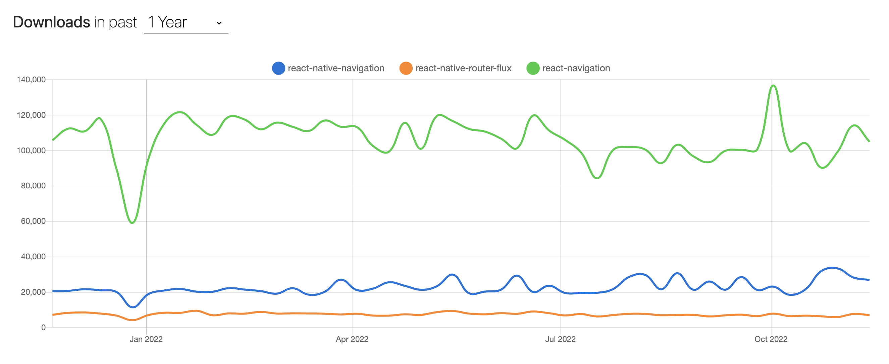

# React Native Navigation 라이브러리 비교

**목차**

- [React Native Navigation 라이브러리 비교](#react-native-navigation-라이브러리-비교)
  - [개요](#개요)
  - [1. React Native Navigation 라이브러리 종류](#1-react-native-navigation-라이브러리-종류)
    - [NPM Trends](#npm-trends)
  - [2. Scene이라는 용어](#2-scene이라는-용어)
  - [3. 라이브러리 비교](#3-라이브러리-비교)
    - [react-native-router-flux](#react-native-router-flux)
    - [react-native-navigation](#react-native-navigation)
    - [react-navigation](#react-navigation)
  - [레퍼런스](#레퍼런스)

## 개요

**Github**, **Medium**, **Stackoverflow** 등의 사이트를 돌아보며 **React Native** 폴더 구조를 조사하던 중 화면을 담당하는 컴포넌트들을 담는 폴더의 네이밍이 `Screen`과 `Scene`이 번갈아 가면서 나오는 것을 확인했습니다.

`Screen`이라는 폴더명이 대부분을 차지했으나 `Scene`으로 되어있는 폴더명이 간간히 나왔기 때문에 해당 용어가 어디서 나왔는지 확인할 겸 현재 **React Native** 프로젝트에서 사용되고 있는 **Navigation** 라이브러리들을 비교해 보겠습니다.

## 1. React Native Navigation 라이브러리 종류

현재 **React Native**에서 화면 전환을 비롯한 **Navigation** 기능을 위해 사용하는 **Navigation** 라이브러리는 대표적으로 다음과 같습니다.

| Package                  | Github                                               | Docs                                                                                |
| ------------------------ | ---------------------------------------------------- | ----------------------------------------------------------------------------------- |
| react-native-navigation  | https://github.com/wix/react-native-navigation       | [Link](https://wix.github.io/react-native-navigation/docs/before-you-start/)        |
| react-native-router-flux | https://github.com/aksonov/react-native-router-flux  | [Link](https://github.com/aksonov/react-native-router-flux/blob/master/docs/API.md) |
| react-navigation         | https://github.com/react-navigation/react-navigation | [Link](https://reactnavigation.org/)                                                |

### NPM Trends



## 2. Scene이라는 용어

`Scene`이라는 네이밍을 사용하고 있는 라이브러리는 **react-native-router-flux**입니다.

다른 **Navigation** 라이브러리에선 **Screen** 컴포넌트로 역할은 동일하며 네이밍만 다릅니다. 다음은 해당 라이브러리리의 샘플 코드입니다.

```jsx
const App = () => (
  <Router>
    <Stack key="root">
      <Scene key="login" component={Login} title="Login" />
      <Scene key="register" component={Register} title="Register" />
      <Scene key="home" component={Home} />
    </Stack>
  </Router>
);
```

위와 같이 사용하기 때문에 해당 라이브러리를 주로 사용하는 개발자가 만든 React Native 프로젝트일 경우 `Scene`이라는 이름을 사용하는 것으로 보입니다. 앞서 말씀드렸듯이 대부분의 RN 프로젝트에서 `Screen`이라는 폴더명을 사용하고 있기 때문에 굳이 `Scene`이라는 이름을 사용하지 않아도 된다고 생각합니다.

## 3. 라이브러리 비교

### react-native-router-flux

사람들이 제일 많이 사용하는 `react-navigation` 라이브러리를 이용하여 만들어져 있는 **Navigation** 라이브러리입니다. **MobX**를 좋아하는 개발자가 `react-navigation`을 **MobX** 친화적으로 사용하고 싶어서 만든 라이브러리 같습니다.

**React Navigation**이 v6.x인 상황에 마지막 릴리즈가 2021년 3월, **React Navigation** v5.x를 기반으로 한 점 등을 미루어 보아 더 이상 유지보수가 이루어지지 않는 라이브러리 같습니다.

### react-native-navigation

최근까지 유지보수가 되고 있는 라이브러리입니다. RN에서 달력을 사용하기 위해 관련 라이브러리를 찾아봤다면 한번쯤 마주쳤을 `react-native-calendars`라는 RN 캘린더 라이브러리를 만든 오픈소스팀에서 만든 Navigation 라이브러리입니다.

공식 홈페이지를 참고했을 때 Redux 대신 MobX 설정 문서만 존재하는 것으로 보아 `react-native-router-flux`와 비슷하게 MobX 친화적인 라이브러리로 보입니다.

**Native Stack**(각 **OS** **Navigation** 모듈을 이용하는)이 지원되지 않습니다.

### react-navigation

앞서 **NPM Trends**에서도 확인할 수 있듯이 대다수의 **RN** 프로젝트에서 주로 사용되고 있는 **Navigation** 라이브러리입니다. 최근에 v6.x를 릴리즈할 정도로 꾸준히 유지보수와 기능 개발을 진행하고 있으며 공식 홈페이지도 나머지 라이브러리에 비해 보기 편하고 완성도 있다고 생각합니다.

특히나 `react-native-navigation`이 비해 코드가 직관적이며 이해하기 쉽습니다.

**Native Stack**(각 **OS** **Navigation** 모듈을 이용하는)이 지원합니다.

## 레퍼런스

- [Before you start | React Native Navigation](https://wix.github.io/react-native-navigation/docs/before-you-start/)
- [React Navigation | React Navigation](https://reactnavigation.org/)
