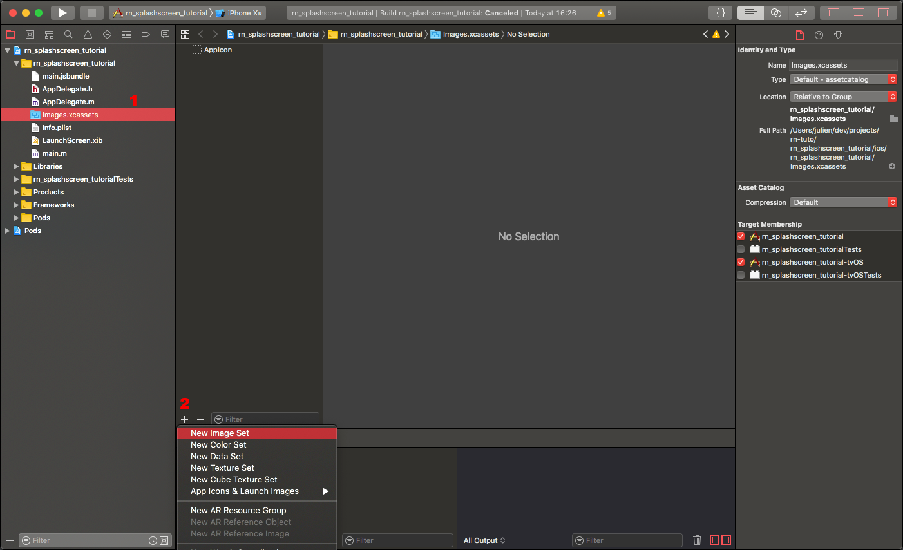
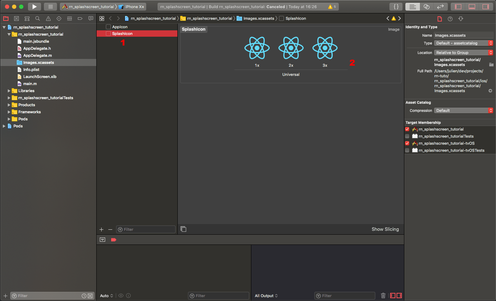
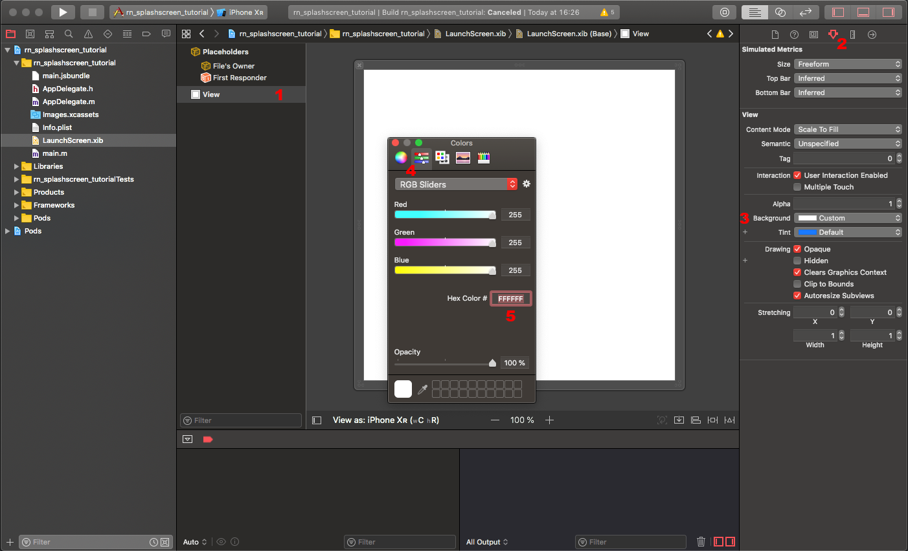
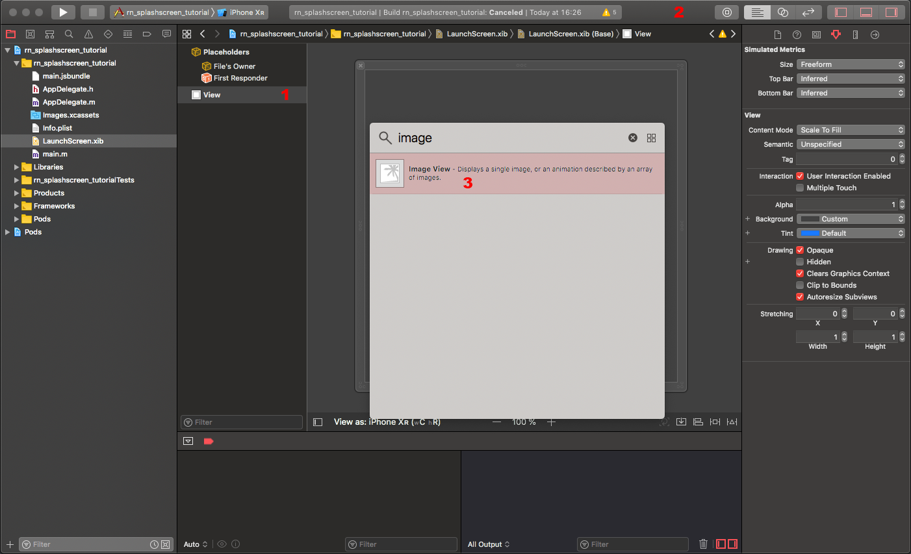
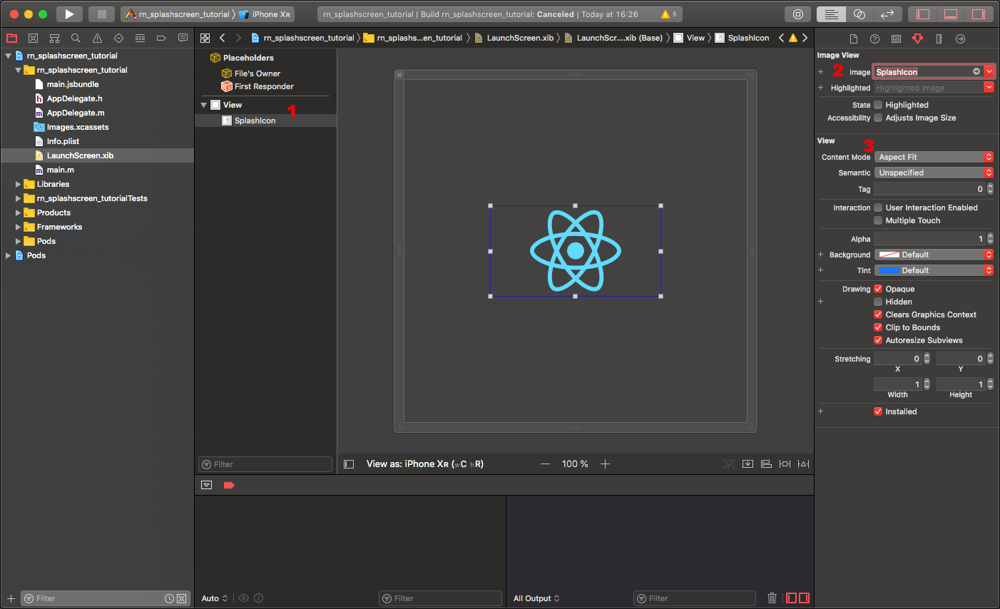
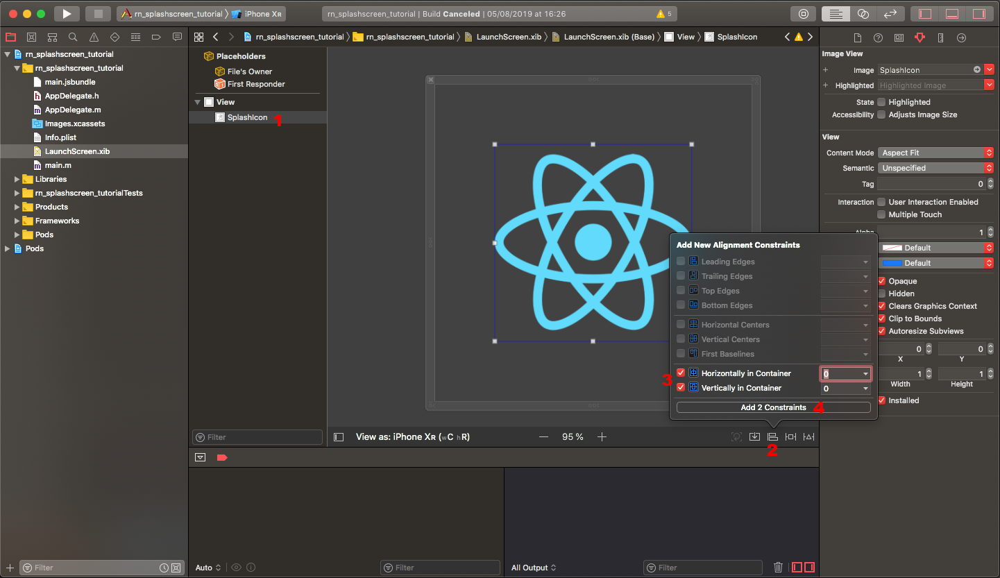
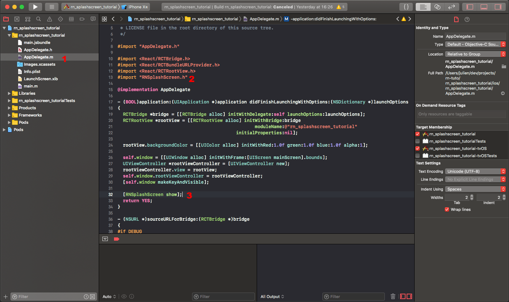

# Splash Screen

> 원본 글  
> https://medium.com/@appstud/add-a-splash-screen-to-a-react-native-app-810492e773f9

**목차**

- [Splash Screen](#splash-screen)
  - [들어가기에 앞서 주의 사항](#들어가기에-앞서-주의-사항)
  - [공통](#공통)
  - [iOS](#ios)
    - [1. Xcode UIKit에 Icon Image 추가하기](#1-xcode-uikit에-icon-image-추가하기)
    - [2. Splash Screen 생성](#2-splash-screen-생성)
    - [3. **react-native-splash-screen을 이용한 Splash Screen 구성**](#3-react-native-splash-screen을-이용한-splash-screen-구성)
  - [Android](#android)
    - [1. icon 이미지 추가](#1-icon-이미지-추가)
    - [2. Splash Screen 생성](#2-splash-screen-생성-1)
    - [3. Splash Screen에서 사용하는 색상값 정의하기](#3-splash-screen에서-사용하는-색상값-정의하기)
    - [4. Splash Screen 추가하기](#4-splash-screen-추가하기)
    - [5. 애플리케이션에게 Splash Screen을 사용하라고 알려주기](#5-애플리케이션에게-splash-screen을-사용하라고-알려주기)
    - [6. React Native 빌드되는 동안에 Splash Screen 사용하게 만들기](#6-react-native-빌드되는-동안에-splash-screen-사용하게-만들기)
    - [7. 임의의 Splash Screen 만들기](#7-임의의-splash-screen-만들기)

### 들어가기에 앞서 주의 사항

1. 현재 `React Native`를 사용해서 애플리케이션을 개발하고 있어야 한다.
2. **OS**에서 제공하는 **Splash Screen** 적용 방법 외에 **React Native**가 빌드되는 시간에도 **Splash Screen**을 적용시키는 것이 현재 포스팅의 목표다.
3. Splash Screen에 필요한 icon 이미지가 필요하다. 필요한 icon 이미지 규격은 다음과 같다. Splash Screnn 적용에 앞서 icon 이미지를 미리 준비하자.
   - **iOS**
     - `1x`
     - `2x`
     - `3x`
   - **Android**
     - LDPI : 36x36 px
     - MDPI : 48x48 px
     - HDPI : 72x72 px
     - XHDPI : 96x96 px
     - XXHDPI : 144x144 px
     - XXXHDPI : 192x192 px

## 공통

**React Native**가 빌드되는 동안 보여주는 **Splash Screen**이 빌드가 완료돠는 순간 숨김처리하는 로직이 필요하다. 이 작업은 **OS**의 구분없이 동일하므로 각 **OS**의 **Splash Screen** 작업을 진행하기에 앞서 먼저 진행해준다.

```shell
yarn add react-native-splash-screen

or

npm install react-native-splash-screen --save
```

> ✋ **주의**  
> Native 쪽 코드를 건드리는 라이브러리이기 때문에 `pod install`은 필수이다.

설치가 완료됐다면 최상단 컴포넌트인 `App` 컴포넌트가 마운트 되는 순간 **Splash Screen**을 숨기는 작업이 필요하기 때문에 해당 작업을 해줄 코드를 작성해준다.

```tsx
import SplashScreen from 'react-native-splash-screen';

function App() {
  useEffect(() => {
    SplashScreen.hide();
  });
}
```

## iOS

### 1. Xcode UIKit에 Icon Image 추가하기

**iOS**가 제공하는 **Splash Screen**을 사용하려면 **Xcode**의 **UIKit**을 통해 **Splash Screen**을 만들어줘야 한다. 다만, 그전에 해당 **Splash Screen**에서 사용하기 위한 `icon` 이미지 추가를 먼저 해주자.

`프로젝트 이름` > `프로젝트 이름` > `Images`

와 같은 경로를 타고 내려갈 경우 **Xcode**의 **UIKit**을 이용할 수 있다. 거기서 `+` 버튼을 눌러 **SplashIcon**이라는 파일을 생성하여 미리 준비해놓은 iOS용 `icon` 이미지를 삽입해주자.





이렇게 `1x`, `2x`, `3x`의 `icon` 이미지를 모두 삽입했다면 **Splash Screen**에서 사용할 수 있는 `icon` 이미지의 준비는 모두 끝이다.

### 2. Splash Screen 생성

`Navigator`로 이동하여 **LaunchScreen.xib**을 선택하고 **View**를 클릭하자

`View`를 클릭했다면 **React Native**를 통해 프로젝트 생성했을 경우 자동으로 생성되는 **Splash Screen**이 보일 것이다. 여기서 기본 제공되는 **React Native Splash Screen element**들을 삭제하고 배경색 및 위에서 추가한 `icon` 이미지를 추가하자.

**배경색 변경**



**icon 이미지를 삽입할 ImageView 추가**

오른쪽 상단의 라이브러리 `icon`을 통해 `ImageView`를 추가하고 위에서 추가한 `icon` 이미지를 추가해주자.





**정렬**

오르쪽 네비게이터 하단을 보면 Align(정렬) 관련 속성이 있다. 이를 통해 이미지를 원하는 대로 정렬하자.



여기까지 수행했다면 OS에서 기본적으로 제공하는 Splash Screen의 적용은 끝났다. 이제 React Native가 빌드되는 동안에도 Splash Screen이 보여지도록 추가적인 작업을 진행하자.

### 3. **react-native-splash-screen을 이용한 Splash Screen 구성**

`프로젝트 이름` > `프로젝트 이름` > `AppDelegate.m` 파일로 이동

- `#import "RNSplashScreen.h"` 구문을 코드 상단에 입력한다.
- `[RNSplashScreen show];` 구문을 `return YES;` 구문 바로 위에 입력해준다.



## Android

### 1. icon 이미지 추가

`android/app/src/main/res` 경로 하위에 있는 폴더에 각각 `splash_icon.png`라는 이름으로 Splash Screen에 사용될 icon 이미지를 추가한다.

> ✋ **주의**  
> 단, 이미지의 사이즈는 위에서 언급한대로 추가해준다.

- `mipmap-mdpi/splash_icon.png`
- `mipmap-hdpi/splash_icon.png`
- `mipmap-xhdpi/splash_icon.png`
- `mipmap-xxhdpi/splash_icon.png`
- `mipmap-xxxhdpi/splash_icon.png`

### 2. Splash Screen 생성

`android/app/src/main/res/drawable` 경로에 `background_splash.xml` 파일을 생성하자.

(해당 파일이 없을 경우 동일한 이름으로 파일을 생성해주자)

```xml
<?xml version="1.0" encoding="utf-8"?>
<layer-list xmlns:android="http://schemas.android.com/apk/res/android">
  <item android:drawable="@color/splashscreen_bg"/>
  <item
    android:width="300dp"
    android:height="300dp"
    android:drawable="@mipmap/splash_icon"
    android:gravity="center"
  />
</layer-list>
```

위 `layer-list`에는 순수한 배경과 미리 추가한 icon 이미지가 포함되어 있다.

### 3. Splash Screen에서 사용하는 색상값 정의하기

`android/app/src/main/res/values` 하위에 `colors.xml` 파일을 생성하여 `background_splash.xml` 파일에서 사용할 색상값을 정의해주자.

```xml
<?xml version="1.0" encoding="utf-8"?>
<resources>
  <color name="splashscreen_bg">#424242</color>
  <color name="app_bg">#424242</color>
</resources>
```

### 4. Splash Screen 추가하기

`android/app/src/main/res/values/styles.xml` 파일에 Splash Screen을 추가해주자.

```xml
<resources>
  <!-- Base application theme. -->
  <style name="AppTheme" parent="Theme.AppCompat.Light.NoActionBar">
    <!-- Customize your theme here. -->
    <item name="android:textColor">#000000</item>

    <!-- Add the following line to set the default status bar color for all the app. -->
    <item name="android:statusBarColor">@color/app_bg</item>
    <!-- Add the following line to set the default status bar text color for all the app to be a light color (false) or a dark color (true) -->
    <item name="android:windowLightStatusBar">false</item>
    <!-- Add the following line to set the default background color for all the app. -->
    <item name="android:windowBackground">@color/app_bg</item>
  </style>

  <!-- Adds the splash screen definition -->
  <style name="SplashTheme" parent="Theme.AppCompat.Light.NoActionBar">
    <item name="android:statusBarColor">@color/splashscreen_bg</item>
    <item name="android:background">@drawable/background_splash</item>
  </style>
</resources>
```

색상이 마음에 들지 않는다면 앞서 작성했던 `colors.xml` 파일에서 정의한 색상값을 수정해주면 된다.

### 5. 애플리케이션에게 Splash Screen을 사용하라고 알려주기

`android/app/src/main/AndroidManifest.xml`

```xml
<manifest xmlns:android="http://schemas.android.com/apk/res/android" package="com.myPackageName">

  <uses-permission android:name="android.permission.INTERNET" />

  <application
    android:name=".MainApplication"
    android:label="@string/app_name"
    android:icon="@mipmap/ic_launcher"
    android:roundIcon="@mipmap/ic_launcher_round"
    android:allowBackup="false"
    android:theme="@style/AppTheme"
  >

    <!-- Add this SplashActivity -->
    <activity
      android:name=".SplashActivity"
      android:theme="@style/SplashTheme"
      android:label="@string/app_name"
    >
      <intent-filter>
        <action android:name="android.intent.action.MAIN" />
        <category android:name="android.intent.category.LAUNCHER" />
      </intent-filter>
    </activity>

    <!-- Remove the intent-filter of the MainActivity and add a param android:exported="true" -->
    <activity
      android:name=".MainActivity"
      android:label="@string/app_name"
      android:configChanges="keyboard|keyboardHidden|orientation|screenSize"
      android:windowSoftInputMode="adjustResize"
      android:exported="true"
    />
    <activity android:name="com.facebook.react.devsupport.DevSettingsActivity" />
  </application>
</manifest>
```

> ✋ **주의**  
> **패키지 이름 변경을 잊지 말자.**

`android/app/src/main/java/[your_package_name]/SplashActivity.java`

```java
package com.myPackageName; // **Change this to your package name.**

import android.content.Intent;
import android.os.Bundle;
import androidx.appcompat.app.AppCompatActivity;

public class SplashActivity extends AppCompatActivity {
  @Override
  protected void onCreate(Bundle savedInstanceState) {
    super.onCreate(savedInstanceState);

    Intent intent = new Intent(this, MainActivity.class);
    startActivity(intent);
    finish();
  }
}
```

### 6. React Native 빌드되는 동안에 Splash Screen 사용하게 만들기

> ✋ **주의**  
> 잊지 말자. 패키지 이름 변경은 필수이다.

`android/app/src/main/java/[my_packasge_name]/MainActivity.java`

```java
package com.myPackageName; // **This should be your package name.**

import com.facebook.react.ReactActivity;
import org.devio.rn.splashscreen.SplashScreen; // Import this.
import android.os.Bundle; // Import this.

public class MainActivity extends ReactActivity {
  // Add this method.
  @Override
  protected void onCreate(Bundle savedInstanceState) {
    SplashScreen.show(this);
    super.onCreate(savedInstanceState);
  }

  // ...
}
```

위 작업을 통해 **Android**가 기본적으로 제공하는 **Splash Screen** 외에 **React Native**가 빌드되는 시간에도 특정 **Splash Screen**을 보여주도록 만들었다.

이제 특정 **Splash Screen**을 만들어 보자.

### 7. 임의의 Splash Screen 만들기

`android/app/src/main/res/layout/launch_screen.xml`

```xml
<?xml version="1.0" encoding="utf-8"?>
<LinearLayout xmlns:android="http://schemas.android.com/apk/res/android"
  android:layout_width="match_parent"
  android:layout_height="match_parent"
  android:background="@drawable/background_splash"
  android:orientation="vertical">
</LinearLayout>
```

위 **Splash Screen**이 `background_splash.xml` 이후에 나타나 **React Native**가 빌드되는 동안 보여질 것이다.
