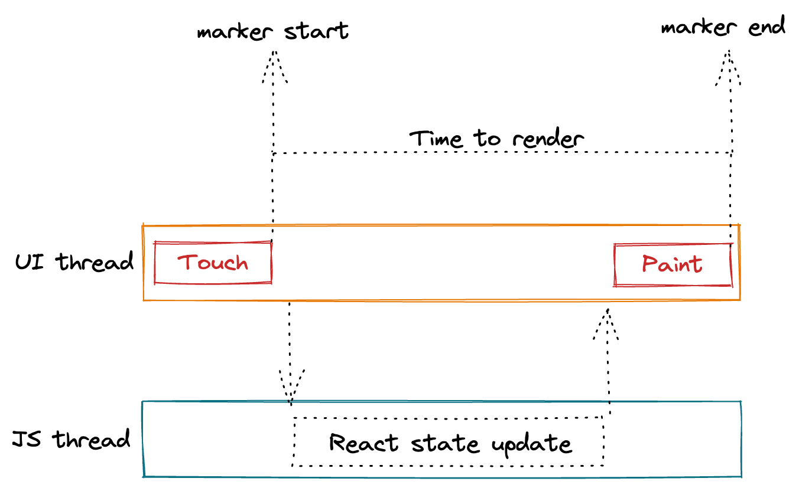
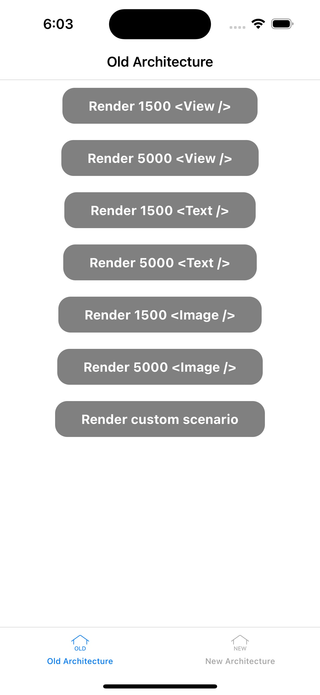
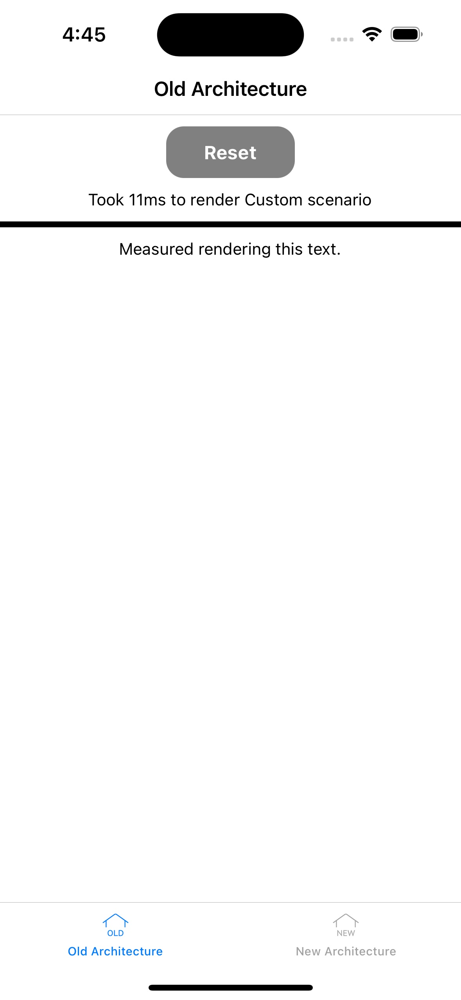

# The New Architecture Performance Benchmarks

> 원본 글  
> https://github.com/reactwg/react-native-new-architecture/discussions/123?ck_subscriber_id=1780635791

**목차**

- [The New Architecture Performance Benchmarks](#the-new-architecture-performance-benchmarks)
  - [개요](#개요)
  - [Fabric](#fabric)
    - [Motivations and Benefits of the new renderer](#motivations-and-benefits-of-the-new-renderer)
  - [How we measured time to render for the benchmarks](#how-we-measured-time-to-render-for-the-benchmarks)
  - [Results](#results)
    - [Physical Device: Google Pixel 4](#physical-device-google-pixel-4)
    - [Physical Device: iPhone 12 Pro](#physical-device-iphone-12-pro)
  - [Write your own performance scenario](#write-your-own-performance-scenario)
  - [Performance gaps](#performance-gaps)

## 개요

이러한 비교에 사용된 것과 같은 합성 벤치마크가 항상 실제 시나리오를 대표하는 것은 아니라는 점에 유의해야 합니다. 따라서 새 아키텍처로의 마이그레이션으로 인해 성능이 크게 향상될 것으로 기대하지는 않습니다.

## Fabric

Fabric은 기존 렌더링 시스템에서 개념적으로 진화한 React Native의 새로운 렌더링 시스템입니다. 핵심 원칙은 C++에서 더 많은 렌더링 로직을 통합하고, 호스트 플랫폼과의 상호 운용성을 개선하며, React Native의 새로운 기능을 구현하는 것입니다. 2018년에 개발이 시작되어 2021년에는 새로운 렌더러를 통해 Facebook 앱의 React Native가 지원됩니다.

### Motivations and Benefits of the new renderer

렌더링 아키텍처는 기존 아키텍처로는 불가능했던 더 나은 사용자 경험을 제공하기 위해 만들어졌습니다. 몇 가지 예는 다음과 같습니다:

- 호스트 뷰와 React 뷰 간의 상호 운용성이 개선되어 렌더러가 React surface를 동기적으로 측정하고 렌더링할 수 있습니다. 레거시 아키텍처에서는 React Native 레이아웃이 비동기식이어서 호스트 뷰에 React Native 렌더링 뷰를 임베드할 때 레이아웃 `jump` 문제가 발생했습니다.

  > **Host View Tree** (and **Host View**)란?
  >
  > 호스트 플랫폼(예: Android, iOS)에서 뷰의 트리 표현입니다. Android에서 호스트 뷰는 호스트 뷰 트리의 빌딩 블록인 `android.view.ViewGroup`, `android.widget.TextView` 등의 인스턴스입니다. 각 호스트 뷰의 크기와 위치는 `Yoga`로 계산된 레이아웃 메트릭을 기반으로 하며, 각 호스트 뷰의 스타일과 콘텐츠는 React 섀도우 트리의 정보를 기반으로 합니다.

- 다중 우선순위 및 동기 이벤트를 지원하므로 렌더러는 특정 사용자 인터랙션의 우선순위를 지정하여 적시에 처리할 수 있습니다.
- React 앱에서 데이터 패칭을 보다 직관적으로 디자인할 수 있는 React Suspense와의 통합.
- React Native에서 React Concurrent 기능을 활성화합니다.
- React Native용 서버 사이드 렌더링을 더 쉽게 구현할 수 있습니다.

새로운 아키텍처는 코드 품질, 성능 및 확장성 측면에서도 이점을 제공합니다:

- **Type safety**: 코드 생성을 통해 JS 및 호스트 플랫폼에서 Type safety를 보장합니다. 코드 생성은 JavaScript 컴포넌트 선언을 신뢰할 수 있는 소스로 사용하여 프로퍼티를 담을 C++ 구조를 생성합니다. JavaScript와 호스트 컴포넌트 프롭이 일치하지 않으면 빌드 오류가 발생합니다.
- **Shared C++ core**: 렌더러는 C++로 구현되고 코어는 플랫폼 간에 공유됩니다. 이렇게 하면 일관성이 향상되고 새로운 플랫폼에서 React Native를 더 쉽게 적용할 수 있습니다.
- **Better Host Platform Interoperability**: 동기식 및 thread-safe 레이아웃 계산은 호스트 컴포넌트를 React Native에 임베드할 때 사용자 경험을 개선하며, 이는 동기식 API가 필요한 호스트 플랫폼 프레임워크와의 통합이 더 쉬워진다는 것을 의미합니다.
- **Improved Performance**: 렌더러 시스템의 새로운 크로스 플랫폼 구현을 통해 한 플랫폼의 한계로 인해 제한적이었던 성능 개선의 이점을 모든 플랫폼에서 누릴 수 있습니다. 예를 들어, 뷰 평탄화(view flattening)는 원래 Android용 퍼포먼스 솔루션이었으나 이제 Android와 iOS 모두에서 기본적으로 제공됩니다.
- **Consistency**: 새로운 렌더링 시스템은 크로스 플랫폼을 지원하므로 여러 플랫폼 간에 일관성을 유지하기가 더 쉽습니다.
- **Faster Startup**: 호스트 컴포넌트는 기본적으로 lazily initialize 됩니다.
- **Less serialization of data between JS and host platform**(JS와 호스트 플랫폼 간의 데이터 직렬화 감소): React는 JavaScript와 호스트 플랫폼 간에 데이터를 직렬화된 JSON으로 전송하는 데 사용됩니다. 새로운 렌더러는 **JavaScript Interfaces**(JSI)를 사용하여 자바스크립트 값에 직접 액세스함으로써 데이터 전송을 개선합니다.

## How we measured time to render for the benchmarks

업데이트에 걸리는 시간을 측정하려면 업데이트가 시작되는 시점과 화면에 결과가 표시되는 시점이라는 두 가지 이벤트에 대한 타임스탬프가 있어야 합니다.

업데이트는 "Touch ended" 이벤트가 트리거되면 시작됩니다. "Touch ended"는 사용자가 화면에서 손가락을 떼면 UI 스레드의 호스트 플랫폼에 의해 트리거됩니다. `Pressable.onPress`에 전달된 이벤트 객체에는 타임스탬프 키 아래에 이 정보가 있습니다. 이 타임스탬프를 마커 이름과 함께 네이티브 모듈 `RTNTimeToRender`에 전달하여 업데이트가 시작된 시점을 저장합니다. 터치 이벤트가 UI 스레드에서 더 일찍 발생했기 때문에 자바스크립트에서 현재 시간을 사용할 수 없습니다.

결과가 화면에 그려지면 업데이트가 완료됩니다. React Native는 결과가 화면에 언제 그려지는지에 대한 타임스탬프를 기본적으로 제공하지 않습니다. 우리는 이를 대신할 작은 네이티브 컴포넌트를 작성해야 합니다. 네이티브 컴포넌트에는 "marker name"이라는 프로퍼티가 있습니다. 호스트 플랫폼 API를 사용하면 컴포넌트가 언제 페인팅되었는지 정확하게 캡처할 수 있습니다. 이제 업데이트가 시작된 시점의 타임스탬프를 빼고 `RTNTimeToRender`에 저장하면 결과물을 페인팅하는 데 걸린 시간을 알 수 있습니다.

## Results

여기에 제시된 각 값은 5개의 측정값의 평균입니다. 측정값은 React Native 0.72.0-RC.1을 실행하는 실제 기기에서 수집되었습니다. 이는 가상의 벤치마크이며 실제 React Native 사용 환경을 반영하지 않을 수 있다는 점에 유의해야 합니다. 새 아키텍처로 마이그레이션해도 특정 앱의 성능이 개선되지 않을 수도 있습니다.

### Physical Device: Google Pixel 4

| Scenario              | Old Architecture | New Architecture | Difference                                        |
| --------------------- | ---------------- | ---------------- | ------------------------------------------------- |
| 1500 View components  | 282ms            | 258ms            | New Architecture is ~8% faster                    |
| 5000 View components  | 1088ms           | 1045ms           | New Architecture is ~4% faster                    |
| 1500 Text components  | 512ms            | 505ms            | New Architecture is ~1% faster                    |
| 5000 Text components  | 2156ms           | 2089ms           | New Architecture is ~3% faster                    |
| 1500 Image components | 406ms            | 404ms            | New Architecture is neutral with Old Architecture |
| 5000 Image components | 1414ms           | 1370ms           | New Architecture is ~3% faster                    |

### Physical Device: iPhone 12 Pro

| Scenario              | Old Architecture | New Architecture | Difference                      |
| --------------------- | ---------------- | ---------------- | ------------------------------- |
| 1500 View components  | 137ms            | 117ms            | New Architecture is ~15% faster |
| 5000 View components  | 435ms            | 266ms            | New Architecture is ~39% faster |
| 1500 Text components  | 324ms            | 284ms            | New Architecture is ~13% faster |
| 5000 Text components  | 1009ms           | 808ms            | New Architecture is ~20% faster |
| 1500 Image components | 212ms            | 172ms            | New Architecture is ~19% faster |
| 5000 Image components | 673ms            | 451ms            | New Architecture is ~33% faster |

## Write your own performance scenario

이전 아키텍처와 새 아키텍처 간의 자체 컴포넌트 성능을 비교하고 싶다면 `App.tsx`로 이동하여 쉽게 비교할 수 있습니다. 자신만의 코드를 추가하고 `README`의 지침을 따르세요. 앱에 컴포넌트를 렌더링하는 데 걸린 시간이 표시됩니다. 하단의 버튼을 사용하여 이전 아키텍처와 새 아키텍처 간에 전환할 수 있습니다. 즐거운 테스트 되세요!

## Performance gaps

새 아키텍처에서 세 가지 성능 문제를 발견했습니다. 하나는 Android와 iOS 모두에 영향을 미쳤습니다. 하나는 Android에, 다른 하나는 iOS에 특정된 문제입니다. 이러한 문제는 0.72.0-RC.1에서 수정되었습니다.

가장 큰 결함은 최적화된 빌드에서 NDEBUG 컴파일러 플래그가 누락되어 발생했습니다. NDEBUG 컴파일러 플래그는 C++ 프로그램에서 디버깅 기능을 비활성화하는 데 사용됩니다. 새 아키텍처의 핵심은 C++로 작성되며, 최적화된 빌드에서 NDEBUG 플래그가 없으면 코드가 디버그 전용 검사를 수행합니다. 이 문제(Android, iOS)에 대한 수정 사항은 0.72.0-RC.1에서 사용할 수 있습니다. 이 검사는 디버깅 전용이므로 최적의 성능을 위해 최적화된 빌드에서는 제거해야 합니다.

또한 두 플랫폼 모두에서 텍스트 렌더링 인프라에서 중복 작업을 발견했습니다.
iOS에서는 모든 `<Text />` 요소에 대해 한 번은 ₩에서 UI의 다른 부분을 레이아웃하기 위해 텍스트의 크기를 측정하기 위해, 두 번째는 화면에 텍스트를 그리기 위해 ₩를 두 번 생성하고 있었습니다. `NSTextStorage`는 생성 비용이 많이 들며 캐시될 수 있습니다. 이 문제가 해결되어 이제 새 아키텍처에서는 5,000개의 `<Text />` 요소 렌더링이 20% 더 빨라졌습니다.

Android에서 React Native가 동일한 제약 조건으로 동일한 텍스트를 여러 번 재측정하는 것을 발견했습니다. 안드로이드에서 텍스트를 측정하려면 텍스트 데이터를 JNI를 통해 C++에서 Java로 전송하고, 스패너블 객체를 생성하고, 마지막으로 레이아웃을 계산해야 하기 때문에 비용이 많이 듭니다. 이 로직은 이번 커밋에서 최적화되었습니다. 또한 렌더링 중에 스패너블 텍스트 객체가 다시 생성되지 않도록 안드로이드에 두 번째 캐싱 레이어를 추가했습니다.
