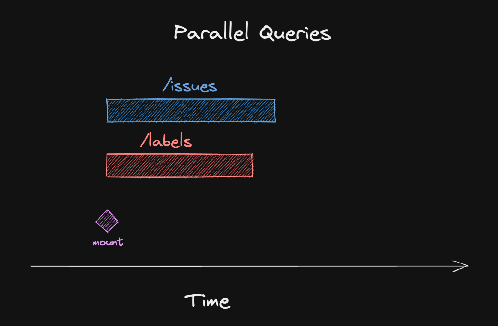
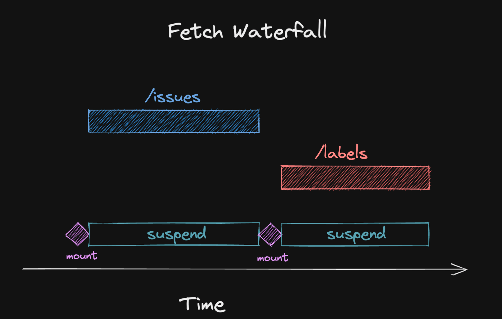
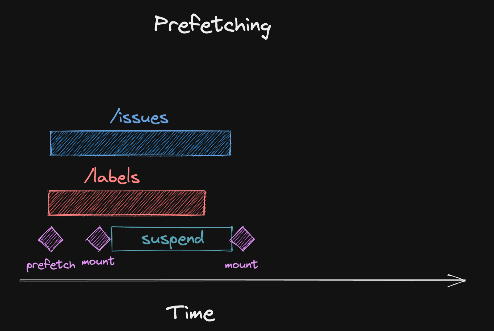

# #17 Seeding the Query Cache

> 원본 글  
> https://tkdodo.eu/blog/seeding-the-query-cache

**Series**

- [#1 Practical React Query](https://github.com/taeyoungs/Goals/blob/main/react-query/Tkdodo_%231_Practical_React_Query.md)
- [#2 React Query Data Transformations](https://github.com/taeyoungs/Goals/blob/main/react-query/Tkdodo_%232_React_Query_Data_Transformations.md)
- [#3 React Query Render Optimizations](https://github.com/taeyoungs/Goals/blob/main/react-query/Tkdodo_%233_React_Query_Render_Optimizations.md)
- [#4 Status Checks in React Query](https://github.com/taeyoungs/Goals/blob/main/react-query/Tkdodo_%234_Status_Checks_in_React_Query.md)
- [#6 React Query and TypeScript](https://github.com/taeyoungs/Goals/blob/main/react-query/Tkdodo_%236_React_Query_and_TypeScript.md)
- [#7 Using WebSockets with React Query](https://github.com/taeyoungs/Goals/blob/main/react-query/Tkdodo_%237_Using_WebSockets_with_React_Query.md)
- [#8 Effective React Query Keys](https://github.com/taeyoungs/Goals/blob/main/react-query/Tkdodo_%238_Effective_React_Query_Keys.md)
- [#8a Leveraging the Query Function Context](https://github.com/taeyoungs/Goals/blob/main/react-query/Tkdodo_%238a_Leveraging_the_Query_Function_Context.md)
- [#9 Placeholder and Initial Data in React Query](https://github.com/taeyoungs/Goals/blob/main/react-query/Tkdodo_%239_Placeholder_and_Initial_Data_in_React_Query.md.md)
- [#10 React Query as a State Manager](https://github.com/taeyoungs/Goals/blob/main/react-query/Tkdodo_%2310_React_Query_as_a_State_Manager.md)
- [#11 React Query Error Handling](https://github.com/taeyoungs/Goals/blob/main/react-query/Tkdodo_%2311_React_Query_Error_Handling.md)
- [#12 Mastering Mutations in React Query](https://github.com/taeyoungs/Goals/blob/main/react-query/Tkdodo_%2312_Mastering_Mutations_in_React_Query.md)
- [#13 Offline React Query](https://github.com/taeyoungs/Goals/blob/main/react-query/Tkdodo_%2313_Offline_React_Query.md)
- [#14 React Query and Forms](https://github.com/taeyoungs/Goals/blob/main/react-query/Tkdodo_%2314_React_Query_and_Forms.md)
- [#15 React Query FAQs](https://github.com/taeyoungs/Goals/blob/main/react-query/Tkdodo_%2315_React_Query_FAQs.md)
- [#16 React Query meets React Router](https://github.com/taeyoungs/Goals/blob/main/react-query/Tkdodo_%2316_React_Query_meets_React_Router.md)
- #17 Seeding the Query Cache (현재)

**목차**

- [#17 Seeding the Query Cache](#17-seeding-the-query-cache)
  - [개요](#개요)
  - [Fetch waterfalls](#fetch-waterfalls)
  - [Suspense](#suspense)
    - [A note on TypeScript](#a-note-on-typescript)
  - [Suspense waterfalls](#suspense-waterfalls)
  - [Prefetching](#prefetching)
  - [The use RFC](#the-use-rfc)
  - [Seeding details from lists](#seeding-details-from-lists)
    - [Pull approach](#pull-approach)
    - [Push approach](#push-approach)

## 개요

[first class support for Promises](https://github.com/reactjs/rfcs/pull/229)에 대한 새로운 **RFC**가 지난 주에 발표되었으며 이것이 잘못 사용될 경우 **fetch waterfalls**을 야기할 수도 있다는 점에 대해 논의가 이루어 지고 있다.

> 원본 포스팅 업로드 일자가 2022년 10월 22일이니 여기서 일주일 전이라하면 15일, 이때 발표됐다는 것 같다.

그래서 **fetch waterfalls** 정확히 무엇일까?

## Fetch waterfalls

**waterfall**이란 하나의 요청이 만들어 지고 다른 요청을 발생시키 전에 해당 요청이 마무리되기까지 기다려야만 하는 상황을 말한다.

때론 이런 상황을 피할 수가 없는데 첫 번째 요청이 포함하고 있는 정보가 두 번째 요청에서 필요하기 때문이다. 이를 **dependent queries**라고 부른다.


대부분의 경우 이러한 요청들은 독립적인 데이터이므로 모든 데이터를 `parallel` 하게 패칭해올 수 있다.



**React Query**에선 이를 두 가지 다른 방법으로 수행할 수 있다.

```jsx
// 1. Use useQuery twice
const issues = useQuery({ queryKey: ['issues'], queryFn: fetchIssues })
const labels = useQuery({ queryKey: ['labels'], queryFn: fetchLabels })

// 2. Use the useQueries hook
const [issues, labels] = useQueries([
  queryKey: ['issues'], queryFn: fetchIssues },
  queryKey: ['labels'], queryFn: fetchLabels },
])
```

위 두 가지 방법 모두 **React Query**는 `parallel` 하게 데이터를 패칭한다. 그렇다면 어디서 **waterfalls**가 발생하는 것일까?

## Suspense

> ✋ **주의**
>
> 유념해야 할 것이 이 글을 쓰는 시점에도 데이터 패칭에 대한 `Suspense`는 여전히 실험 단계다. 이후 나올 예제에서 **RFC**에서 제안하는 방법을 사용하지 않고 **React Query**에서 이미 사용 가능한 `Suspense` 구현을 사용할 것이다. (이 또한 아직 실험 단계다)

As described in the above linked RFC, suspense a way to unwrap promises with React. **Promise**의 특성은 `Pending`, `Fulfilled`, 또는 `Rejected`에 해당하는 3가지 다른 사태를 가질 수 있다는 것이다.

컴포넌트를 렌더링할 때, 대개 우리가 관심있는 건 성공 시나리오다. 각각의 모든 컴포넌트에서 로딩과 에러 상태를 처리하는 것은 지루할 수 있는데 `Suspense`는 이러한 문제를 해결하는 데 포커즈가 잡혀 있다.

`Promise`가 `Pending` 상태일 때, **React**는 컴포넌트 트리를 `unmount` 할 것이고 **Suspense boundary** 컴포넌트에 정의되어 있는 `fallback`을 렌더링할 것이다. 에러의 경우, 에러는 버블링되어 가장 가까운 `ErrorBoundary`에서 처리된다.

이러면 해당 상태를 처리하는 컴포넌트를 분리되고 성공 시나리오에 집중할 수 있다. 이는 거의 캐시에서 값을 읽는 동기 코드와 같이 동작한다.

```jsx
function Issues() {
  // 👓 read data from cache
  const { data } = useQuery({
    queryKey: ['issues'],
    queryFn: fetchIssues,
    // ⬇️ this enables experimental suspense mode
    suspense: true,
  });

  // 🎉 no need to handle loading or error states

  return (
    <div>
      {data.map((issue) => (
        <div>{issue.title}</div>
      ))}
    </div>
  );
}

function App() {
  // 🚀 Boundaries handle loading and error states
  return (
    <Suspense fallback={<div>Loading...</div>}>
      <ErrorBoundary fallback={<div>On no!</div>}>
        <Issues />
      </ErrorBoundary>
    </Suspense>
  );
}
```

### A note on TypeScript

슬프게도, `Suspense`는 **React Query**에게 껏다 킬 수 있는 플래그일 뿐이기에 **TypeScript**를 사용하는 경우 위 예제에서 데이터는 잠재적으로 `undefined` 일 수 있다. 또한 `enabled` 옵션과 결합하여 **Query**가 실행되지 않도록 하여 컴포넌트가 `suspend` 되지 않도록 할 수도 있다.

We might change this in the future with a dedicated `useSuspenseQuery` hook.

## Suspense waterfalls

물론 이런 기능들은 좋지만 `Suspense`가 설정된 동일한 컴포넌트에서 다수의 **Query**를 사용하려고 할 때 역효과가 발생할 수도 있다. Here is what happens:



- 컴포넌트가 렌더링되고 첫 번째 **Query**를 읽으려고 시도한다.
- 해당 **Query**의 캐시 데이터가 아직 존재하지 않음을 깨닫고 `suspend` 한다.
- 컴포넌트 트리를 `unmount` 하고 `fallback`을 렌더링한다.
- 데이터 패칭이 완료됐을 때, 컴포넌트 트리를 다시 `mount` 한다.
- 첫 번째 **Query**는 이제 성공적으로 캐시로부터 데이터를 읽을 수 있다.
- 컴포넌트는 두 번째 **Query**를 보고 이를 읽으려고 시도한다.
- 두 번째 **Query**에 대한 데이터가 캐시에 없다는 것을 깨닫고 다시 `suspend` 한다.
- 두 번째 **Query**에 대한 데이터 패칭이 시작된다.
- 컴포넌트는 마침내 성공적으로 렌더링된다.

이는 필요 이상으로 `fallback`을 오래 볼 수 있기 때문에 애플리케이션의 퍼포먼스에 상당한 영향을 끼칠 것이다.

이 문제를 우회하는 가장 좋은 방법은 컴포넌트가 캐시 데이터를 읽으려고 시도하는 시점에 캐시에 이미 데이터가 존재하도록 만드는 것이다.

## Prefetching

데이터 패칭은 일찍 시작할 수록 더 좋다. 왜냐하면 빨리 시작할 수록 빨리 끝나기 때문이다.

- 만약 사용하고 있는 아키텍처가 서버 사이드 렌더링을 지원한다면 [서버에서의 데이터 패칭](https://tanstack.com/query/v4/docs/guides/ssr)을 고려해보자.
- 만약 `loader`를 지원하는 라우터를 가지고 있다면 이를 이용한 `prefetching`을 고려해보자.

위 케이스들에 해당되지 않을지라도 `prefetchQuery`를 사용하여 컴포넌트가 렌더링되기 전에 패칭을 시작할 수 있다.

```jsx
const issuesQuery = { queryKey: ['issues'], queryFn: fetchIssues };

// ⬇️ initiate a fetch before the component renders
queryClient.prefetchQuery(issuesQuery);

function Issues() {
  const issues = useQuery(issuesQuery);
}
```

`prefetchQueries`에 대한 호출은 **JavaScript** 번들이 평가되지마자 수행된다. 이는 만약 라우터를 기반으로 하는 **code splitting**을 진행하고 있는 경우에 매우 잘 동작한다. 왜냐하면 이는 특정 페이지에 대한 코드가 `lazy` 하게 로딩될 것이고 사용자가 해당 페이지로 `navigate` 하자마자 해당 페이지의 코드들이 평가되기 시작한다는 것을 의미하기 때문이다.

즉, 컴포넌트가 렌더링되기 전에 데이터 패칭이 시작될 것이라는 말이다. 만약 위 예제의 두 **Query**에 이를 적용할 경우 `Suspense`를 사용하여도 **parallel queries**를 통해서 데이터를 가져올 수 있다.



보시다시피 **Query**는 두 **Query**의 데이터 패칭이 모두 완료될 때까지 `suspend` 되겠지만 이들 모두 `parallel` 하게 발생하기 때문에 이제 대기 시간이 크게 줄어 든다.

> ✋ **주의**
>
> `useQuries`는 아직 `Suspense`를 지원하지는 않지만 추후에는 지원하게 될 것이다. 만약 `Suspense`에 대한 지원이 추가되면, 위에서 나온 **waterfalls**를 피하여 모든 데이터 패칭을 `parallel` 하게 발생시키는 것이 목표다.

## The use RFC

I don't know enough about the RFC yet to properly comment on it. A big part is still missing, namely how the cache API will work. I do think it is a bit problematic that the default behaviour will lead to waterfalls unless developers explicitly seed the cache early on. I'm still pretty excited about it because it will likely make internals of React Query easier to understand and maintain. It remains to be seen if it is something that will be used in userland a lot.

## Seeding details from lists

캐시를 읽을 때까지 캐시가 채워지는지 확인하는 또 다른 좋은 방법은 캐시의 다른 부분에서 데이터를 심는 것이다. 만약 특정 요소의 상세 페이지를 렌더링하려고 할 때 이전에 요소들의 목록을 표시하는 목록 페이지에 렌더링하고자 하는 요소가 있었던 경우 해당 요소에 대한 데이터를 쉽게 사용할 수 있는 경우가 꽤 많다.

### Pull approach

This is the one also described [in the docs](https://tanstack.com/query/v4/docs/guides/initial-query-data#initial-data-from-cache): 상세 페이지를 렌더링하려고 할 때, 렌더링하고자 하는 요소의 목록 데이터에 대한 캐시를 확인한다. 만약 목록 데이터에 렌더링하고자 하는 요소의 데이터가 있다면 상세 **Query**에 초기 데이터로 이를 사용한다.

```jsx
const useTodo = (id: number) => {
  const queryClient = useQueryClient();

  return useQuery({
    queryKey: ['todos', 'detail', id],
    queryFn: () => fetchTodo(id),
    initialData: () => {
      // ⬇️ look up the list cache for the item
      return queryClient.getQueryData(['todos', 'list'])?.find((todo) => todo.id === id);
    },
  });
};
```

만약 `initlaData` 함수에 `undefined`가 반환된다면, **Query**는 평범하게 서버에 데이터 패칭을 진행할 것이다. 이에 반해 만약 무언가 발견됐다면, 캐시에 직접 데이터를 집어 넣을 것이다.

`staleTime`을 설정한 경우 `initialData`를 **fresh**한 데이터로 취급하기 때문에 **Background Refetch**가 발생하지 않는다는 점을 유의하자. 만약 마지막 데이터 패칭이 20분 전이라면 캐시에 있던 목록 데이터는 원하는 데이터가 아닐 지도 모른다.

As shown [in the docs](https://tanstack.com/query/v4/docs/guides/initial-query-data#initial-data-from-the-cache-with-initialdataupdatedat), 추가적으로 상세 **Query**에 `initialDataUpdatedAt`을 명시할 수도 있다. 이는 **React Query**에게 `initialData`을 통하여 전달하는 데이터가 맨 처음 가져와진 때에 대한 정보를 알려줌으로써 해당 데이터가 `stale` 상태인지 아닌지 정확하게 결정할 수 있게 한다. 편리하게도 **React Query**는 목록 데이터를 마지막으로 가져온 시점도 알고 있으므로 그냥 전달할 수 있다.

```jsx
const useTodo = (id: number) => {
  const queryClient = useQueryClient();

  return useQuery({
    queryKey: ['todos', 'detail', id],
    queryFn: () => fetchTodo(id),
    initialData: () => {
      return queryClient.getQueryData(['todos', 'list'])?.find((todo) => todo.id === id);
    },
    initialDataUpdateAt: () =>
      // ⬇️ get the last fetch time of the list
      queryClient.getQueryState(['todos', 'list'])?.dataUpdateAt,
  });
};
```

🟢 "제 때" 캐시에 데이터를 심을 수 있다.  
🔴 `stale` 상태를 설명하기 위한 더 많은 작업이 필요하다.

### Push approach

또는 목록 데이터 **Query**를 패칭할 때마다 상세 페이지에 대한 캐시 데이터를 생성할 수도 있다. 이는 목록 데이터를 패칭할 때 상세 페이지에 대한 캐시 데이터를 생성하기 때문에 자동으로 `stale` 상태를 체크할 수 있다는 장점이 있다.

하지만, **Query**를 패칭할 때 훅에서 사용할만한 좋은 콜백이 없다. `useQuery`의 `onSuccess`는 기술적으로 동작하긴 하지만 `useQuery`의 매 인스턴스에 대해서 수행된다. 만약 다수의 **Observer**를 가지고 있다면 동일한 데이터를 캐시에 여러 번 저장하는 일이 발생한다. 캐시 자체에 존재하는 전역 `onSuccess` 콜백도 동작은 하나 매 **Query**에 대해 수행되기에 올바른 **Query Key**로 범위를 좁혀야 한다.

**Push approach**를 실행하는 가장 좋은 방법은 데이터가 패칭된 후에 `queryFn`에서 직접 수행하는 것이다.

```jsx
const useTodos = () => {
  const queryClient = useQueryClient();

  return useQuery({
    queryKey: ['todos', 'list'],
    queryFn: async () => {
      const todos = await fetchTodos();
      todos.forEach((todo) => {
        // ⬇️ create a detail cache for each item
        queryClient.setQueryData(['todos', 'detail', todo.id], todo);
      });
      return todos;
    },
  });
};
```

이는 목록 데이터로 즉시 각 요소에 대한 상세 데이터를 만들어낼 수 있다. 현재 시점에는 활성화되어 있는 상세 **Query**가 없기 때문에 `inactive` 상태로 표시될 것이고 이는 `cacheTime`이 경과한 후에 기비지 컬렉팅될 수도 있다는 것을 의미한다. (`default`는 15분이다)

그래서 만약 **Push approach**를 사용하고자 한다면, 여기서 만든 상세 데이터는 상세 페이지로 사용자가 실제로 `navigate` 하는 경우 더 이상 사용할 수 없을 수도 있다(`cacheTime`이 지나고 이동해서 가비지 컬렉팅 됐을 수도 있으니). 또한 만약 목록 데이터가 너무 거대할 경우 필요하지도 않은 요소들을 너무 많이 만들고 있을 수도 있다.

🟢  staleTime is automatically respected  
🟡  there is no good callback  
🟡  might create unnecessary cache entries  
🔴  pushed data might be garbage collected too early

상세 **Query**의 구조가 목록 **Query**의 구조와 완전히 동일해야만(적어도 할당 가능해야) 위 두 가지 접근 방법이 동작한다는 사실을 명심하자. 만약 상세 페이지에 목록 데이터에는 없는 필수 항목이 존재하는 경우 `initialData`를 통해 캐시 데이터를 심는 방식은 좋은 아이디어가 아니다. This is where *placeholderData* comes in, and I've written a comparison about the two in [#9: Placeholder and Initial Data in React Query](https://tkdodo.eu/blog/placeholder-and-initial-data-in-react-query).
