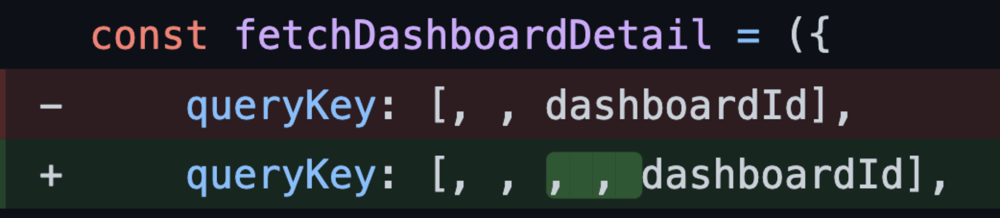

# #8a Leveraging the Query Function Context

> 원본 글  
> https://tkdodo.eu/blog/leveraging-the-query-function-context

**Series**

- [#1 Practical React Query](https://github.com/taeyoungs/Goals/blob/main/react-query/Tkdodo_%231_Practical_React_Query.md)
- [#2 React Query Data Transformations](https://github.com/taeyoungs/Goals/blob/main/react-query/Tkdodo_%232_React_Query_Data_Transformations.md)
- [#3 React Query Render Optimizations](https://github.com/taeyoungs/Goals/blob/main/react-query/Tkdodo_%233_React_Query_Render_Optimizations.md)
- [#4 Status Checks in React Query](https://github.com/taeyoungs/Goals/blob/main/react-query/Tkdodo_%234_Status_Checks_in_React_Query.md)
- [#6 React Query and TypeScript](https://github.com/taeyoungs/Goals/blob/main/react-query/Tkdodo_%236_React_Query_and_TypeScript.md)
- [#7 Using WebSockets with React Query](https://github.com/taeyoungs/Goals/blob/main/react-query/Tkdodo_%237_Using_WebSockets_with_React_Query.md)
- [#8 Effective React Query Keys](https://github.com/taeyoungs/Goals/blob/main/react-query/Tkdodo_%238_Effective_React_Query_Keys.md)
- #8a Leveraging the Query Function Context (현재)
- [#9 Placeholder and Initial Data in React Query](https://github.com/taeyoungs/Goals/blob/main/react-query/Tkdodo_%239_Placeholder_and_Initial_Data_in_React_Query.md.md)
- [#10 React Query as a State Manager](https://github.com/taeyoungs/Goals/blob/main/react-query/Tkdodo_%2310_React_Query_as_a_State_Manager.md)
- [#11 React Query Error Handling](https://github.com/taeyoungs/Goals/blob/main/react-query/Tkdodo_%2311_React_Query_Error_Handling.md)
- [#12 Mastering Mutations in React Query](https://github.com/taeyoungs/Goals/blob/main/react-query/Tkdodo_%2312_Mastering_Mutations_in_React_Query.md)
- [#13 Offline React Query](https://github.com/taeyoungs/Goals/blob/main/react-query/Tkdodo_%2313_Offline_React_Query.md)
- [#14 React Query and Forms](https://github.com/taeyoungs/Goals/blob/main/react-query/Tkdodo_%2314_React_Query_and_Forms.md)
- [#15 React Query FAQs](https://github.com/taeyoungs/Goals/blob/main/react-query/Tkdodo_%2315_React_Query_FAQs.md)
- [#16 React Query meets React Router](https://github.com/taeyoungs/Goals/blob/main/react-query/Tkdodo_%2316_React_Query_meets_React_Router.md)

**목차**

- [#8a Leveraging the Query Function Context](#8a-leveraging-the-query-function-context)
    - [개요](#개요)
  - [Hot take](#hot-take)
  - [QueryFunctionContext](#queryfunctioncontext)
  - [How to type the QueryFunctionContext](#how-to-type-the-queryfunctioncontext)
  - [Query Key Factories](#query-key-factories)
  - [Object Query Keys](#object-query-keys)
  - [Is this worth it?](#is-this-worth-it)

### 개요

우리 모두는 엔지니어로서 개선하기 위해 노력하며 시간이 지남에 따라 그 노력에서 성공하기를 바란다. 어쩌면 우리는 우리가 갖고 있던 생각들을 무효화하거나 그러한 생각들에 반하는 새로운 것들을 배울 지도 모른다. 또는 우리가 이상적이라고 생각했던 패턴이 당장 필요한 수준가지 확장되지 않는다는 것을 깨닫곤 한다.

필자가 **React Query**를 사용한지도 꽤 시간이 흘렀다. 그러한 시간 속에서 아주 많은 것을 배웠고 아주 많은 것을 보았다. 필자는 필자의 블로그가 가능한 한 최신 상태로 유지되길 바란다. 그래야 독자들이 다시 돌아와서 포스팅을 읽을 수 있고, 그때 봤던 패턴들이 여전히 유효하다는 것을 알 수 있기 때문이다.

> **Tanner Linsley**(TanStack 우두머리)가 **React Query** 공식 문서에 **Tkdodo**의 블로그로 이동하는 링크를 두는 것을 동의한 이후로는 현재 블로그 시리즈는 더 중요해졌다.

## Hot take

> 인라인 함수를 사용하지 말자 - 제공된 **Query Function Context**를 활용하고 객체 키를 생성하는 **Query Key** 팩토리를 사용한다.

인라인 함수는 `queryFn`에 파라미터를 전달하는 가장 쉬운 방법이다. 왜냐하면 커스텀 훅 내에서 사용할 수 있는 다른 변수에 대한 **Closure**를 허용하기 때문이다. 다음 예제를 같이 살펴보자.

```tsx
type State = 'all' | 'open' | 'done';
type Todo = {
  id: number;
  state: TodoState;
};
type Todos = ReadonlyArray<Todo>;

const fetchTodos = async (state: State): Promise<Todos> => {
  const response = await axios.get(`todos/${state}`);

  return response.data;
};

export const useTodos = () => {
  // imagine this grabs the current user selection
  // from somewhere, e.g. the url
  const { state } = useTodoParams();

  // ✅ The queryFn is an inline function that
  // closures over the passed state
  return useQuery(['todos', state], () => fetchTodos(state));
};
```

위 예제는 익숙할지도 모른다. - 이는 [#1: Practical React Query - Treat the query key like a dependency array](https://tkdodo.eu/blog/practical-react-query#treat-the-query-key-like-a-dependency-array)에서 나온 예제의 변형이다. 위 예제는 간단한 예제로써는 훌륭하지만, 많은 파라미터를 가지기 시작할 때부터 심각한 문제를 가져올 수 있다. 큰 규모의 애플리케이션에선, 필터와 정렬 옵션이 엄청 많은 경우도 있으며 필자는 10개가 넘는 파라미터가 넘어가는 경우도 본 적이 있다.

위 **Query**에 정렬 옵션을 추가한다고 해보자. 필자는 **상향식**(`the bottom up`) 접근 방식을 좋아한다. - `queryFn`에서 시작하여 컴파일러가 다음에 변경해야할 사항이 무엇인지 알려주는 구조

> `queryFn`의 반환 타입 정의을 깔끔하게 만들어 줌으로써 컴파일러가 **useQuery**를 비롯한 `queryFn` 관련 타입을 자연스레 알려주게 만들 수 있다.

```tsx
type Sorting = 'dateCreated' | 'name';

const fetchTodos = async (state: State, sorting: Sorting): Promise<Todos> => {
  const response = await axios.get(`todos/${state}?sorting=${sorting}`);

  return response.data;
};
```

위와 같은 수정은 `fetchTodos`를 호출하는 커스텀 훅에서 에러를 발생시킬 것이다. 이를 해결해보자.

```tsx
export const useTodos = () => {
  const { state, sorting } = useTodoParams();

  // 🚨 can you spot the mistake ⬇️
  return useQuery(['todos', state], () => fetchTodos(state, sorting));
};
```

이미 문제를 발견했을지도 모른다. `queryKey`가 실제 `dependency`과 동기화되지 않았고 빨간색 물결선이 이에 대해 비명을 지르지 않는다.

> `fetchTodos`에 정렬 옵션을 추가하긴 했지만 막상 이를 사용하는 **useQuery**의 **Query Key**엔 정렬 옵션이 동기화되지 않았고 이에 대한 아무런 에러(린트)도 발생시키지 않는다.

위와 같은 경우, 문제를 빨리 발견할 수 있을 것이다. (예를 들어, 통합 테스트를 통해서) 왜냐하면 정렬 옵션을 변경해서 자동으로 `refetch`가 발생하지 않을 것이기 때문이다. 이는 간단한 예제에선 명백하게 문제로 보인다. 그러나 필자는 지난 몇 달 동안 **Query Key**가 실제 `dependency`에서 몇 번 벗어나 있는 것을 보았고 이러한 누락은 애플리케이션이 더 복잡해질 경우 추적하기 어려운 문제로 이어질 수도 있다. 이는 React가 이러한 문제들을 피하기 위해 [react-hooks/exhaustive-deps eslint rule](https://reactjs.org/docs/hooks-rules.html#eslint-plugin)와 같은 린트 룰을 제공하는 이유기도 하다.

그러면 **React Query**도 이와 같은 고유의 린트 룰을 제공하게 될까?

음, 하나의 옵션이 될 수 있을 지도 모른다. 모든 `dependency`들을 포함하여 **Query Key**를 생성하여 위와 같은 문제를 해결하는 https://github.com/dominictwlee/babel-plugin-react-query-key-gen이라는 이름의 바벨 플러그인도 존재한다. 그러나 **React Query**에는 `dependency`를 처리하는 다른 기본 제공 방식인 **QueryFunctionContext**가 있다.

## QueryFunctionContext

**QueryFunctionContext**는 `queryFn`에 인자값으로써 전달하는 객체이다. 독자들은 아마도 이전에 `infinite quries`와 함께 사용해봤을 수도 있다.

```tsx
// this is the QueryFunctionContext ⬇️
const fetchProjects = ({ pageParam = 0 }) => fetch('/api/projects?cursor=' + pageParam);

useInfiniteQuery('projects', fetchProjects, {
  getNextPageParam: (lastPage) => lastPage.nextCursor,
});
```

**React Query**는 해당 객체를 사용하여 **Query**에 대한 정보를 `queryFn`에 주입한다. `infinite queries`의 경우, `getNextPageParam`의 반환값이 `pageParam`으로 주입된다.

그러나, 이 **Context**는 해당 **Query**에 사용되는 **Query Key** 또한 포함하고 있다. (그리고 앞으로 **Context**에 더 멋진 것들을 추가할 예정이다) 이는 **Query Key**에 대한 정보들을 **React Query**에 의해서 제공될 것이기 때문에 굳이 **Closure**를 사용하여 이를 전달하지 않아도 됨을 의미한다.

```tsx
const fetchTodos = async ({ queryKey }) => {
  // 🚀 we can get all params from the queryKey
  const [, state, sorting] = queryKey;

  const response = await axios.get(`todos/${state}?sorting=${sorting}`);

  return response.data;
};

export const useTodos = () => {
  const { state, sorting } = useTodoParams();

  // ✅ no need to pass parameters manually
  return useQuery(['todos', state, sorting], fetchTodos);
};
```

위 방식을 이용할 경우, **Query Key**에 `dependency`를 늘리는 걸로는 `queryFn`에 추가 파라미터를 사용할 일이 발생하지 않는다.

## How to type the QueryFunctionContext

위 방식의 가장 큰 목표 중 하나는 `full type safety`와 **useQuery**에 전달한 **Query Key**를 통해 **QueryFunctionContext**의 타입을 추론하게끔 만드는 것이었다. 이는 쉽지 않았지만 **React Query** v3.13.3 이후로 지원 가능해졌다. 만약 `queryFn`을 인라인으로 만든다면, 타입들이 정상적으로 추론되는 것을 볼 수 있을 것이다. (`Generic` 덕분 !)

```tsx
export const useTodos = () => {
  const { state, sorting } = useTodoParams();

  return useQuery(['todos', state, sorting] as const, async ({ queryKey }) => {
    const response = await axios.get(
      // ✅ this is safe because the queryKey is a tuple
      `todos/${queryKey[1]}?sorting=${queryKey[2]}`
    );
    return response.data;
  });
};
```

위 방법은 괜찮지만 여전히 몇 가지 결점을 가지고 있다.

- 여전히 클로저에 있는 모든 것을 사용하여 쿼리를 작성할 수 있다.
- 위의 방법으로 **API URL**을 만들기 위해 **Query Key**를 사용하는 것은 모든 것을 문자열화할 수 있기 때문에 여전히 안전하지 않다.

## Query Key Factories

여기에서 다시 **Query Key Factory**가 등장한다. 만약 **Query Key**를 만들기 위한 **typesafe Query Key Factory**를 가지고 있다면, 해당 **Factory**의 반환 타입을 이용하여 **QueryFunctionContext**의 타입이 추론되도록 만들 수 있다.

```tsx
const todoKeys = {
	all: ['todos'] as const,
	lists: () => [...todoKeys.all, 'list'] as const,
	list: (state: State, sorting: Sorting) =>
		[...todoKeys.lists(), state, sorting] as const,
}

const fetchTodos = async ({
	queryKey,
}: // 🤯 only accept keys that come from the factory
QueryFunctionContext<ReturnType<typeof todoKeys['list']>>) => {
	const [, , state, sorting] = queryKey

	const response = await axios.get(`todos/${state}?sorting=${sorting}`

	return response.data
}

export const useTodos = () =>
	const { state, sorting } = useTodoParams()

	// ✅ build the key via the factory
	return useQuery(todoKeys.list(state, sorting), fetchTodos)
}
```

**QueryFunctionContext**의 타입은 **React** **Query**에서 `export` 된다. (**React Query**에서 `import` 해와서 사용할 수 있다는 뜻) 이는 **Query Key**의 타입을 정의하는 하나의 `Generic`을 취한다. 위 예제에서 해당 `Generic`은 **Query Key Factory**의 `list` 함수 반환 값과 동일하게 설정한다. 우리가 `const assertions`를 사용했기 때문에 모든 `Key`는 **strictly typed tuples**가 될 것이다. - 그렇기에 만약 해당 구조를 따르지 않는 `Key`를 사용하려고 할 경우에 타입 에러가 발생할 것이다.

## Object Query Keys

위 방식으로 천천히 전환하는 와중에, 필자는 **Key 배열**이 실제로는 잘 동작하지 않는다는 것을 알았다. 제대로 동작하지 않는 이유는 **Query Key**를 **구조 분해 할당하는 방법**을 보면 잘 알 수 있다.

```tsx
const [, , state, sorting] = queryKey;
```

우리는 기본적으로 처음 두 부분(**Query Key Factory**에서 하드코딩된 `todo`와 `list`)을 생략하고 동적으로 전달하는 부분만을 사용한다. 당연히, 초기 상태에서 다른 `Key`를 추가하기까지 얼마 걸리지 않았고 이는 다시 URL이 만들어지는데 문제가 되기 시작했다.

> 번역을 잘 못해서 해석이 좀 어색한데 정리를 조금 더 하자면, **Query Key**가 계속해서 추가되는 경우(예를 들어, 계층 구조를 늘린다거나) 배열을 이용한 구조 분해 할당은 아래 이미지와 같이 계속해서 수정이 필요할 수 밖에 없는 구조라는 것이다.



Source: A PR I recently made

알고 보니, 객체는 이러한 문제가 잘 해결된다. 왜냐하면 `named destructuring`을 사용할 수 있기 때문이다. 또한 `query invalidation`을 위한 `fuzzy matching`이 **배열**과 **객체**에 대해 동일하게 동작하기 때문에 **Query Key** 내에 객체를 이용한 구조 분해 할당을 사용하는 것에 단점이 추가적으로 발생하지 않는다.

> [https://github.com/TanStack/query/blob/9e414e8b4f3118b571cf83121881804c0b58a814/src/core/utils.ts#L321-L338](https://github.com/TanStack/query/blob/9e414e8b4f3118b571cf83121881804c0b58a814/src/core/utils.ts#L321-L338)

```tsx
// fuzzy matching을 담당하는 partialDeepEqual 함수의 동작이 궁금하다면 위 링크를 확인하자.

export function partialDeepEqual(a: any, b: any): boolean {
  if (a === b) {
    return true;
  }

  if (typeof a !== typeof b) {
    return false;
  }

  if (a && b && typeof a === 'object' && typeof b === 'object') {
    return !Object.keys(b).some((key) => !partialDeepEqual(a[key], b[key]));
  }
}
```

이를 염두에 두고 내가 알고 있는 방법으로 **Query Key**를 구성하는 방법은 다음과 같다.

```tsx
const todoKeys = {
  // ✅ all keys are arrays with exactly one object
  all: [{ scope: 'todos' }] as const,
  lists: () => [{ ...todoKeys.all[0], entity: 'list' }] as const,
  list: (state: State, sorting: Sorting) => [{ ...todoKeys.lists()[0], state, sorting }] as const,
};

const fetchTodos = async ({
  // ✅ extract named properties from the queryKey
  queryKey: [{ state, sorting }],
}: QueryFunctionContext<ReturnType<typeof todoKeys['list']>>) => {
  const response = await axios.get(`todos/${state}?sorting=${sorting}`);

  return response.data;
};

export const useTodos = () => {
  const { state, sorting } = useTodoParams();

  return useQuery(todoKeys.list(state, sorting), fetchTodos);
};
```

**객체 Query Key**는 순서가 의미가 없기 때문에 `fuzzy matching`을 더욱 더 강력하게 만들어 준다. 배열을 이용한 방식일 경우, 우리는 `todo`와 관련된 모든 것(모든 `todo` 목록들 또는 특정 **필터**와 함께하는 `todo` 목록)과 씨름해야 한다. With objects keys, you can do that too, but also tackle all lists (e.g. todo lists and profile lists) if you want to:

```tsx
// 🕺 remove everything related to the todos feature
queryClient.removeQueries([{ scope: 'todos' }])

// 🚀 reset all todo lists
queryClient.resetQueries({ scope: 'todos', entity: 'list' }])

// 🙌 invalidate all lists across all scopes
queryClient.invalidateQueries([{ entity: 'list' }])
```

이것은 계층 구조가 있는 겹치는 범위가 여러 개 있지만 여전히 하위 범위에 속한 모든 항목과 일치시키려는 경우에 매우 유용할 수 있다.

> 말이 좀 어색한데 정리를 하자면 **계층 구조가 있는 상태**(위 예제의 `scope`, `entity`와 같은)에서 하위 범위(`entitiy`)에 속하는 **모든 항목에 대해서 동일한 처리**(`invalidate`, `reset` 등)를 해야하는 경우 **객체 Query Key**를 통한 `fuzzy matching`을 활용하여 이뤄낼 수 있다는 뜻

**배열 Query Key**로 동일한 작업이 불가능하다는 것이 아니라 **객체 Query Key**를 사용한 방법이 더 직관적이고 사용성 측면에서 더 유용하다는 것

>

## Is this worth it?

As always: it depends. I've been loving this approach lately (which is why I wanted to share it with you), but there is certainly a tradeoff here between complexity and type safety. Composing query keys inside the key factory is slightly more complex (because *queryKeys*
 still have to be an Array at the top level), and typing the context depending on the return type of the key factory is also not trivial. If your team is small, your api interface is slim and / or you're using plain JavaScript, you might not want to go that route. As per usual, choose whichever tools and approaches make the most sense for your specific situation. 🙌
