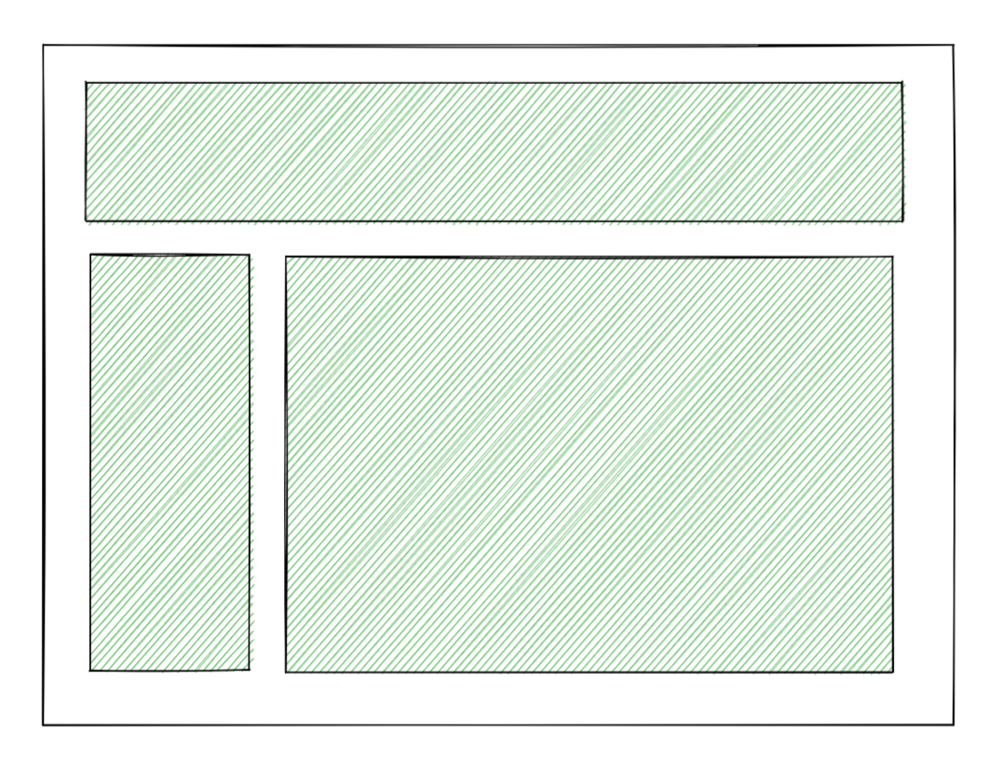

# New Suspense SSR Architecture in React 18

> 원본 글  
> https://github.com/reactwg/react-18/discussions/37

**목차**

- [New Suspense SSR Architecture in React 18](#new-suspense-ssr-architecture-in-react-18)
  - [개요](#개요)
  - [tl;dr](#tldr)
  - [What is SSR?](#what-is-ssr)
  - [What Are the Problems with SSR Today?](#what-are-the-problems-with-ssr-today)
    - [You have to fetch everything before you can show anything](#you-have-to-fetch-everything-before-you-can-show-anything)
    - [You have to load everything before you can hydrate anything](#you-have-to-load-everything-before-you-can-hydrate-anything)
    - [You have to hydrate everything before you can interact with anything](#you-have-to-hydrate-everything-before-you-can-interact-with-anything)
    - [How can we solve these problems?](#how-can-we-solve-these-problems)
  - [React 18: Streaming HTML and Selective Hydration](#react-18-streaming-html-and-selective-hydration)
    - [Streaming HTML before all the data is fetched](#streaming-html-before-all-the-data-is-fetched)
    - [Hydrating the page before all the has loaded](#hydrating-the-page-before-all-the-has-loaded)
    - [Hydrating the page before all the HTML has been streamed](#hydrating-the-page-before-all-the-html-has-been-streamed)
    - [Interacting with the page before all the components have hydrated](#interacting-with-the-page-before-all-the-components-have-hydrated)
  - [In Conclusion](#in-conclusion)

## 개요

**React 18**에는 서버 사이드 렌더링(**SSR**) 퍼포먼스에 대한 아키텍처 개선 사항이 포함되어 있다(원문에는 `will`로 표현되어 있지만 현재 **React 18**이 릴리즈된 상황이므로 `포함되어 있다고` 표현). 이러한 개선 사항은 수년 간의 작업한 결과물이다. 이러한 개선 사항들의 대부분 내부에 존재하지만 그 중에서 알아야 하는, 특히나 프레임워크를 사용하지 않는 경우 알아야 하는 몇 가지 옵트인 메커니즘이 존재한다.

주요 새로운 **API**는 [Upgrading to React 18 on the Server](https://github.com/reactwg/react-18/discussions/22)에서 알 수 있는 `renderToPipeableStream`이다. We plan to write more about it in detail as it's not final and there are things to work out.

The primary existing API is `<Suspense>`.

이 페이지는 새로운 아키텍처의 설계 그리고 아키텍처를 통해 해결하고자 하는 문제에 대한 **high-level overview**이다.

## tl;dr

**Server-Side Rendering**(이하 **SSR**)은 서버에서 **React** 컴포넌트로 **HTML**을 생성하여 사용자에게 보낼 수 있게 해준다. **SSR**을 사용하면 **JavaScript** 번들을 가져와서 실행하기 전에 페이지의 컨텐츠를 사용자가 볼 수 있다.

**React**의 **SSR**은 항상 몇 가지 단계를 통해 이루어 진다.

- 서버에서 전체 애플리케이션에 대한 데이터를 패칭한다.
- 그 다음, 서버에서 전체 애플리케이션을 **HTML**로 렌더링하고 이를 응답에 담아 보낸다.
- 그 다음, 클라이언트에서 전체 애플리케이션에 대한 **JavaScript** 코드를 가져온다.
- 그 다음, 클라이언트에서 **JavaScript** 로직을 전체 애플리케이션에 대해 서버에서 생성된 **HTML**에 연결한다(이를 `hydration`이라고 한다).

여기서 핵심은 **다음 단계가 실행되기 전에 전체 애플리케이션에 대해 각 단계가 완료되어야만 한다**는 것이다. 이는 규모가 어느 정도 있는 애플리케이션인 이상 애플리케이션의 특정 부분이 다른 부분에 비해 느릴 경우 효율적이지 않다.

**React 18**은 `<Suspense>`를 사용하여 애플리케이션을 더 작고 독립적인 단위로 나눌 수 있게 만들어 준다. 이렇게 하면 위와 같은 단계들이 미리 나눠진 단위마다 독립적으로 실행되기 때문에 나눠진 단위가 나머지 애플리케이션을 막아서는 일이 없게 된다. 결과적으로 애플리케이션의 사용자들은 컨텐츠를 더 빨리 보게 될 것이고 여기에 더해 더 빠르게 이런 컨텐츠와 상호 작용할 수 있게 된다. 애플리케이션의 가장 느린 부분이 빠른 부분을 지연시키지 않는다. 이러한 개선 사항은 자동으로 이루어지기 때문에 작동을 위해서 특별한 추가 코드를 작성할 필요가 없다.

This also means that `React.lazy` "just works" with SSR now. Here's a [demo](https://codesandbox.io/s/kind-sammet-j56ro?file=/src/App.js).

_(If you don’t use a framework, you will need to change the exact way the HTML generation is [wired up](https://codesandbox.io/s/kind-sammet-j56ro?file=/server/render.js:1054-1614).)_

## What is SSR?

사용자가 애플리케이션을 실행시킬 때 가능한 한 빠르게 완전히 상호 작용 가능한 페이지를 보여주려고 한다.


위 이미지에서 녹색 영역들은 페이지에서 사용자와 상호 작용 가능한 영역을 의미한다. 즉, 모든 **JavaScript** 이벤트 핸들러가 이미 연결되어 있고 버튼을 클릭하여 상태값을 업데이트할 수 있다.

그러나 위 페이지는 **JavaScript** 코드가 완전히 실행될 때까지 사용자가 상호 작용할 수 없다. 이 **JavaScript** 코드에는 **React**와 애플리케이션 코드가 모두 포함된다. 따라서, 규모가 작지 않은 애플리케이션에서는 적지 않은 시간이 애플리케이션 코드를 다운받는 데 사용될 것이다.

만약 **SSR**을 사용하지 않는다면, 사용자가 할 수 있는 일이라곤 **JavaScript**가 모두 로딩될 때까지 빈 페이지를 보는 일 뿐이다.


이런 좋지 않은 상황들이 **SSR**을 권장하는 이유다. **SSR**을 사용하면 **React** 컴포넌트를 서버에서 **HTML**로 렌더링하여 사용자에게 보낼 수 있다. **HTML**은 대화형이 아니다(`link`와 `form`과 같은 상호 작용이 가능한 간단한 빌트인 태그 제외). 그런데도 사용자가 무언가를 보기 위해서는 **JavaScript**를 여전히 기다려야 한다.

> `link`나 `form`과 같은 대화형 태그, 즉 상호 작용이 가능한 몇몇의 태그를 제외하고 **HTML**은 정적인 리소스다. 따라서, 실질적으로 **JavaScript** 없이 사용자가 **HTML**을 보거나 클릭해도 상관이 없다.


위 이미지에서 회색 영역은 아직 완전히 사용자와 상호 작용 가능하지 않은 스크린 영역들이다. 애플리케이션의 **JavaScript** 코드가 아직 로딩되지 않았기에 버튼을 클릭해도 아무런 일이 일어나지 않는다. 그러나 특히 컨텐츠가 많은 웹사이트의 경우 **SSR**은 좋지 못한 네트워크 연결 상태를 가진 사용자일지라도 **JavaScript**가 로딩되는 동안에 컨텐츠를 읽거나 볼 수 있기 때문에 상당히 유용하다.

**React**와 애플리케이션 코드가 모두 로딩되면 **HTML**이 상호 작용 가능해지길 원할 것이다. 이때 **React**에게 "**여기 서버에서 이 HTML을 생성한 App 컴포넌트야. HTML에 이벤트 핸들러를 연결해줘!**"라고 말하면 된다. 그러면 **React**는 메모리에 컴포넌트 트리를 렌더링하긴 할테지만 **DOM** 노드를 생성하는 대신 기존 **HTML**에 모든 로직을 연결할 것이다.

컴포넌트를 렌더링하고 이벤트 핸들러를 연결하는 이 과정을 `hydration`이라고 한다. 이는 "**건조한**" **HTML**에 `interactivity`와 이벤트 핸들러라는 "**물**"을 주는 것과 같다. (Or at least, that’s how I explain this term to myself.)

`hydration` 이후에는 평소에 알고 있던 **React**가 된다. (컴포넌트에 상태값을 설정하거나 클릭에 반응하는 등)



**SSR**은 일종의 "마술(magic trick)"같다. 이는 애플리케이션이 완전히 상호 작용 가능하게 되는 시점을 앞당겨 주진 않는다. 대신 사용자가 **JavaScript**가 로딩되기를 기다리는 동안 정적 컨텐츠를 볼 수 있도록 애플리케이션의 **non-interactive** 버전을 더 빨리 보여준다. 그러나 이 트릭은 네트워크 연결 상태가 좋지 않은 사람에게 큰 차이를 만들어 내고 전반적인 퍼포먼스를 향상시킨다. 또한 더 쉬운 인덱싱과 더 나은 속도를 통해 검색 엔진 순위를 올릴 수 있도록 도와준다.

> ✋ **주의**
>
> **SSR**을 서버 컴포넌트와 헷갈리면 안된다. Server Components are a more experimental feature that is still in research and likely won’t be a part of the initial React 18 release. You can learn about Server Components [here](https://reactjs.org/blog/2020/12/21/data-fetching-with-react-server-components.html). **서버 컴포넌트**는 **SSR**을 보완하며 권장되는 데이터 패칭 접근 방식의 일부가 될 것이긴 하지만 우선 이 포스팅에서는 이를 다루진 않는다.

## What Are the Problems with SSR Today?

위에서 설명한 방식은 효과는 있지만 여러 면에서 최선의 방식은 아니다.

### You have to fetch everything before you can show anything

오늘날 **SSR**의 문제점 중 하나는 컴포넌트가 "데이터를 기다리는 것"을 허용하지 않는다는 점이다. 현재의 **API**를 사용하면 **HTML**을 렌더링할 때까지 서버의 컴포넌트에 대한 모든 데이터를 이미 가지고 있어야만 한다. 이말인 즉슨 클라이언트에 **HTML**을 보내기 전에 서버에서 필요한 모든 데이터를 모아야 한다는 말이다. 이는 꽤나 비효율적이다.

예를 들어, 포스팅의 댓글을 렌더링하고 싶다고 해보자. 댓글들은 빨리 보여주는 것이 중요하기 때문에 **server HTML output**에 댓글들이 포함되기를 원한다. 그러나 데이터베이스나 **API** 레이어가 느리기에 이를 어떻게 할 수가 없는 상황이다. 이제 여기서 어려운 결정을 내려야 한다. 만약 **server output**에서 댓글을 제외할 경우 사용자는 **JavaScript**가 로딩될 때까지 댓글을 볼 수가 없다. 하지만 만약 **server output**에 포함시킨다면 댓글에 대한 로딩이 완료되고 전체 트리를 렌더링할 수 있을 때까지 나머지 **HTML**(예를 들어, **navigation bar**, **sidebar**, 심지어 포스팅 내용까지도)의 전송을 지연해야만 한다. 이는 좋지 않다.

> 참고로 일부 데이터 패칭 솔루션은 반복적으로 트리를 **HTML**로 렌더링하려고 하고 데이터 문제가 해결될 때까지 결과물을 버려버리는데 이는 **React**가 **ergonomic option**을 더 제공하지 않기 때문이다. **React** 팀은 이런 극단적인 방식을 요구하지 않는 해결책을 제공하려고 한다.
>
> As a side note, some data fetching solutions repeatedly try to render the tree to HTML and throw away the result until the data has been resolved because React doesn't provide a more ergonomic option. We’d like to provide a solution that doesn’t require such extreme compromises.

### You have to load everything before you can hydrate anything

**JavaScript** 코드가 로딩된 후에 **React**에게 **HTML**을 `hydrate`하여 상호 작용 가능하게 만들라고 할 것이다. **React**는 컴포넌트가 렌더링되는 동안에 서버에서 생성된 **HTML**에게로 갈 것이고 해당 **HTML**에 이벤트 핸들러를 연결한다. 이 작업을 위해서 브라우저에서 컴포넌트들에 의해 생성된 트리는 반드시 서버에서 생성된 트리와 일치해야만 한다. 그렇지 않으면 **React**는 이 둘을 매칭할 수 없다. 이 방식의 문제점은 클라이언트에서 모든 컴포넌트에 대해 `hydrate` 하기 전에 모든 컴포넌트에 대한 **JavaScript**를 로딩해야만 한다는 점이다.

예를 들어, 댓글 위젯이 상호 작용을 위한 복잡한 로직을 많이 포함하고 있고 이에 대한 **JavaScript**를 로딩하려면 꽤 오랜 시간이 소요된다고 해보자. 이제 여기서 다시 한번 어려운 결정을 해야 한다. 사용자에게 빠르게 댓글 위젯을 보여주기 위해선 서버에서 댓글 위젯을 **HTML**로 렌더링하는 게 좋을 것이다. 하지만 오늘날 `hydration`은 **single pass**만 가능하기 때문에 댓글 위젯에 대한 코드를 모두 로딩하기 전까진 **navigation bar**, **sidebar**, 그리고 **포스팅 컨텐츠**에 대한 `hydrating`을 수행할 수 없다. 물론 **code splitting**을 사용하여 개별적으로 로딩할 수도 있지만 이러려면 **server HTML**에서 댓글 위젯을 제외해야 한다. 그렇지 않으면 **React**는 **HTML chunk**로 무엇을 해야할 지 모르기에 `hydration` 중에 이를 삭제할 것이다.

### You have to hydrate everything before you can interact with anything

`hydration` 자체에도 비슷한 이슈가 있다. **React**는 **single pass** 에서 트리를 `hydrate` 한다. `hydrate`(which is essentially calling your component functions)가 한번 시작되고 나면 **React**는 전체 트리에 대해 `hydrate`를 끝내기 전까지 멈출 수가 없다. 결과적으로 컴포넌트와 상호 작용하려면 모든 컴포넌트가 `hydrate` 될 때까지 기다려야만 한다.

예를 들어, 댓글 위젯이 비용이 높은 렌더링 로직을 가지고 있다고 해보자. 이 로직은 우리의 컴퓨터에서는 빠르게 동작하겠지만 저사양 기기에서 모든 로직을 실행하는 것은 비용이 작지도 않을 뿐더러 몇 초 동안 스크린을 잠궈버릴지도 모른다. 물론 이상적이라면 우리는 클라이언트단에 비용이 높은 렌더링 로직을 두지 않을 것이다(그리고 이런건 서버 컴포넌트가 도울 수 있다). 하지만 일부 로직의 경우 비용이 높은 로직을 이벤트 핸들러에서 수행해야 할 수도 있고 이는 사용자와 상호 작용하기 위해서 필수적이기 때문에 클라이언트단에 해당 로직을 둬야 할 수도 있다. 결과적으로 `hydration`이 한번 시작되면 사용자는 전체 트리가 `hydrate` 될 때까지 **navigation bar**, **sidebar**, 또는 **포스팅 컨텐츠**와 상호 작용할 수 없다. 특히나 `navigation`의 경우 사용자가 현재 페이지에서 아예 다른 페이지로 `navigate` 하고 싶을 수도 있기 때문에 이는 안타까운 일이다. 앞서 설명했듯이 `hydrating` 하기 바쁘기 때문에 사용자가 더 이상 관심이 없는 현재 페이지를 유지할 수 밖에 없다.

### How can we solve these problems?

이러한 문제점들 사이에 공통점이 하나 있다. 문제점들은 모두 무언가를 먼저 하거나(먼저 할 경우 해당 작업이 모든 작업을 막기 때문에 UX를 해친다) 무언가를 나중에 하라며(시간을 낭비하고 있기 때문에 이 또한 UX를 해친다) 선택을 강요하고 있다는 점이다.

이는 이 방식이 "**waterfall"** 방식이기 때문이다.

- **fetch data (server)**
- **render to HTML (server)**
- **load code (client)**
- **hydrate (client)**

**waterfall** 방식이기 때문에 애플리케이션은 이전 단계가 완료될 때까지 다음 단계를 실행할 수 없다. 이것이 바로 **waterfall** 방식이 비효율적인 이유다. 새로운 솔루션은 위와 같은 작업을 쪼개 전체 애플리케이션에 대해서 위 단계를 수행하는 것이 아닌 스크린의 일부에 대해 각각 위 단계를 수행하는 것이다.

이 솔루션이 참신한 아이디어는 아니다. 예를 들어, **Marko**는 위 솔루션을 구현해낸 **JavaScript** 웹 프레임워크 중 하나다. 문제는 어떻게 이러한 솔루션을 **React** 프로그래밍 모델에 적용하는가였다. 이 문제를 해결하는데 시간이 좀 걸렸다. 2018년에는 이를 위해 `<Suspense>` 컴포넌트를 소개했다. `<Suspense>` 컴포넌트를 처음 소개할 때 `<Suspense>`가 지원할 수 있는 것은 오직 코드를 **lazy-loading** 하는 것 뿐이었다. 하지만 목표 자체는 이를 서버 렌더링과 통합하여 앞서 언급됐었던 문제들을 해결하는 것이었다.

Let’s see how to use `<Suspense>` in React 18 to solve these issues.

## React 18: Streaming HTML and Selective Hydration

다음은 `Suspense`에 의해서 가능해진 **React 18**의 주요한 **SSR** 기능 두 가지다.

- **Streaming HTML** on the server
  - 이를 수행하기 위해선 [여기에](https://github.com/reactwg/react-18/discussions/22) 묘사된 것처럼 `renderToString`을 새로운 `renderToPipeableStream` 메서드로 전환해야 한다.
- **Selective Hydration** on the client
  - 이를 수행하기 위해선 클라이언트에서 `hydrateRoot`로 전환하고 애플리케이션의 일부를 `<Suspense>`로 래핑해야 한다.

이러한 기능들이 무엇을 하는지 그리고 위 문제들을 어떻게 해결하는지 알아보기 위해 예제로 다시 돌아가보자.

### Streaming HTML before all the data is fetched

오늘날의 **SSR**에서는 **HTML**을 렌더링하는 것과 `hydration`은 "**all or nothing**"이다. 먼저 모든 **HTML**을 렌더링한다.

```html
<main>
  <nav>
    <!--NavBar -->
    <a href="/">Home</a>
  </nav>
  <aside>
    <!-- Sidebar -->
    <a href="/profile">Profile</a>
  </aside>
  <article>
    <!-- Post -->
    <p>Hello world</p>
  </article>
  <section>
    <!-- Comments -->
    <p>First comment</p>
    <p>Second comment</p>
  </section>
</main>
```

The client eventually receives it:


그 다음 모든 코드를 로딩하고 전체 애플리케이션을 `hydrate` 한다.


하지만 **React 18**은 새로운 가능성을 제공한다. 바로 페이지의 일부를 `<Suspense>`로 래핑하는 것이다.

예를 들어, 댓글 블록을 `<Suspense>`로 래핑하고 **React**에게 해당 블록이 준비될 때까지 `<Spinner />` 컴포넌트를 보여줘야 한다고 알린다.

```html
<Layout>
  <NavBar />
  <Sidebar />
  <RightPane>
    <Post />
    <Suspense fallback={<Spinner />}>
      <Comments />
    </Suspense>
  </RightPane>
</Layout>
```

`<Comments>`를 `<Suspense>`로 래핑함으로써 페이지의 나머지 부분에 대한 **HTML Streaming**을 시작하기 위해서 댓글 블록을 기다릴 필요가 없다고 알려준다. 이렇게 하면 **React**는 댓글 대신에 `placeholder`, 즉 `Spinner`를 보낸다.

> `will send`라고 원문이 되어 있는데 **Stream**에게 보낸다는 의미같다.


댓글 블록은 이제 초기 **HTML**에서 찾을 수 없다.

```html
<main>
  <nav>
    <!--NavBar -->
    <a href="/">Home</a>
  </nav>
  <aside>
    <!-- Sidebar -->
    <a href="/profile">Profile</a>
  </aside>
  <article>
    <!-- Post -->
    <p>Hello world</p>
  </article>
  <section id="comments-spinner">
    <!-- Spinner -->
    
  </section>
</main>
```

여기서 끝이 아니다. 서버에서 댓글에 대한 데이터가 준비 완료되면 **React**는 추가적인 **HTML** 뿐만 아니라 해당 **HTML**을 "**정확한 곳**"에 위치시키기 위한 최소한의 인라인 `<script>`도 동일한 `stream`에 보낼 것이다.

```html
<div hidden id="comments">
  <!-- Comments -->
  <p>First comment</p>
  <p>Second comment</p>
</div>
<script>
  // This implementation is slightly simplified
  document.getElementById('sections-spinner').replaceChildren(document.getElementById('comments'));
</script>
```

결과적으로 **React** 자체가 클라이언트에 로딩되기 전에 댓글에 대한 뒤늦은 **HTML**이 "나타난다(**pop in**)".


이는 위에서 설명했던 첫 번째 문제를 해결한다. 이제 더 이상 무언가를 보여주기 전에 모든 데이터를 패칭하지 않아도 된다. 만약 스크린의 일부가 초기 **HTML** 렌더링을 지연하는 경우, 이전처럼 모든 **HTML**을 지연하는 것과 문제가 되는 스크린의 일부를 **HTML** 제외하는 것 중에 하나를 선택하지 않아도 된다. 이제 그저 해당 부분을 **HTML Stream**에서 나중에 나타나도록 설정하기만 하면 된다.

기존 **HTML Streaming**과는 달리 **top-down** 순서, 즉 하향식 순서로 **Streaming**이 일어날 필요가 없다. 예를 들어, 만약 **Sidebar**가 데이터가 필요한 경우 **Sidebar**를 `Suspense`로 래핑하면 **React**는 `placeholder`를 보여주고 포스팅에 대한 렌더링을 계속해서 수행할 것이다. 그리고 나서 **Sidebar HTML**이 준비되면 **React**는 해당 **HTML**을 올바른 곳에 삽입하기 위해서 `<script>` 태그와 함께 **Streaming** 한다. 포스팅에 대한 **HTML**(which is further in the tree)이 이미 보내졌음에도 불구하고! 특정 순서로 데이터가 로딩되어야 한다는 요구 사항은 없다. `Spinner`가 보여질 위치를 지정하면 **React**가 나머지를 파악한다.

> ✋ **주의**
>
> 위 작업을 위해선 데이터 패칭 솔루션이 `Suspense`와 통합되어야 한다. 서버 컴포넌트는 `Suspense`와 통합될 것이고 그 외에 독립적인 **React** 데이터 패칭 라이브러리에 대해서도 `Suspense`와 통합할 수 있는 방법을 제공할 것이다.

---

"포스팅에 대한 **HTML**(which is further in the tree)이 이미 보내졌음에도 불구하고!" 라는 말인 즉슨 네트워크 요청을 통해 받아온 **HTML**을 렌더링하면서 `Suspense`로 감싼 블록에서 수행된 또 다른 네트워크 요청이 완료되었을 때 이전 **HTML**에 응답으로 받은 추가적인 **HTML**을 삽입한다.

서버에서 **HTML**을 렌더링할 때 `Suspense`로 감싼 부분은 감싸진 부분에서 수행되는 작업을 기다리지 않고 `fallback` 속성에 담긴 요소를 렌더링하여 클라이언트에게 보낸다.

그 후에 감싸져 있던 부분에서 수행되는 작업이 완료되면 이를 클라이언트에게 보내주는데 이때 이전 요청에서 보냈던 **HTML**에 새롭게 보내는 **HTML**을 껴넣는다.

이래서 **Streaming**이라고 표현하는 것 같다.

---

### Hydrating the page before all the has loaded

이제 초기 **HTML**을 더 빠르게 보낼 수 있지만 여전히 문제가 있다. 댓글 위젯에 대한 **JavaScript** 코드가 로딩되기 전까지 클라이언트에서 애플리케이션에 대한 `hydrating`을 수행할 수 없다. 만약 코드 사이즈가 더 커진다면 이는 꽤나 많은 시간을 잡아먹을 것이다.

거대한 번들을 피하기 위해서 주로 "**code splitting**"을 사용한다. 동기적으로 로딩할 필요 없는 코드의 일부를 명시하면 번들러가 이를 별도의 `<script>` 태그로 분리한다.

이를 `React.lazy`와 함께 사용하여 메인 번들에서 댓글에 대한 코드 부분을 분리해낼 수 있다.

```jsx
import { lazy } from 'react';

const Comments = lazy(() => import('./Comments.js');

// ...

<Suspense fallback={<Spinner />}>
  <Comments />
</Suspense>
```

이전에 위 코드는 서버 렌더링에서 동작하지 않았다. (우리가 아는 한, 유명한 해결 방법에서 조차 **code splitting**한 컴포넌트에서 **SSR**을 제외하거나 모든 코드를 로딩한 후에 이를 `hydrating` 하여 **code splitting**의 목적이 퇴색되게 만드는 것 중에서 선택하도록 강요했다)

하지만 **React 18**에서 `<Suspense>`는 댓글 위젯이 로딩되기 전에 애플리케이션을 `hydrate` 할 수 있게 해준다.

사용자 관점에서 처음에는 **HTML**로 **Streaming** 되는 비대화형(상호 작용할 수 없는) 컨텐츠를 보게 된다.


그리고 나서 **React**에게 `hydrate` 하라고 알린다. 댓글 블록에 대한 코드는 아직 없지만 괜찮다.


이것이 **Selective Hydration**의 예다. `Comments`(댓글 컴포넌트)를 `<Suspense>`로 래핑함으로써 **React**에게 래핑한 부분이 **Streaming**에서 페이지의 나머지 부분을 막아선 안된다고 알렸다. 그리고 이는 위에서 언급한대로 `hydrating` 에서도 동일하다. 이는 두 번째 문제가 해결됐음을 의미한다. 이제 더 이상 `hydrating`을 수행하기 위해 모든 코드가 로딩될 때까지 기다리지 않아도 된다. **React**가 해당 코드들이 로딩되는 동안 `hydrate` 할 수 있다.

**React**는 코드의 로딩이 완료된 후에 댓글 섹션을 `hydrating` 하기 시작할 것이다.


**Selective Hydration**에게 감사하자. 이제 **JavaScript**의 무거운 부분(데이터 로딩이 오래 걸리는 부분)은 페이지의 나머지 부분이 상호 작용 가능해지는 것을 방해하지 않는다.

### Hydrating the page before all the HTML has been streamed

**React**는 이 모든 것을 자동으로 처리하기 때문에 예측하지 못한 순서로 일이 발생하는 것에 대해 신경 쓸 필요가 없다. 예를 들어, **Streaming** 되는 동안 **HTML** 로딩에 꽤 시간이 소요될 수도 있다.


만약 모든 **HTML** 보다 **JavaScript** 코드의 로딩이 먼저 끝났다면, **React**은 더 이상 기다릴 이유가 없다. 페이지의 나미저 부분을 `hydrate` 할 것 이다.


`Comments`에 대한 **HTML** 로딩이 끝났을 때, 이는 **JavaScript**가 아직 준비가 되지 않았기 때문에 비대화형(상호 작용이 불가능한 상태)으로 보여질 것이다.


마지막으로 댓글 위젯에 대한 **JavaScript** 코드의 로딩이 완료됐을 때 페이지는 완전히 상호 작용 가능해질 것이다.


### Interacting with the page before all the components have hydrated

댓글 영역을 `<Suspense>`로 래핑했을 때 내부적으로 발생하는 개선점이 하나 더 있다. 이제 `hydration`은 더 이상 브라우저가 다른 작업을 수행하는 것을 막지 않는다.

예를 들어, 사용자가 댓글이 `hydrate` 되고 있는 와중에 **Sidebar**를 클릭했다고 해보자.


**React 18**에서 `Suspense` 영역 내에서 컨텐츠에 대한 `hydrating`은 브라우저가 이벤트를 처리 할 수 있는 작은 간격을 만들어 낸다. Thanks to this, 사용자의 클릭은 그 즉시 처리되며 브라우저는 저사양 기기에서의 긴 `hydrating` 중에도 멈춘 것처럼 보이지 않는다. 예를 들어, 이젠 이전과 다르게 사용자가 현재 페이지에 더 이상 흥미가 없을 때 다른 곳으로 `navigate` 해버릴 수도 있다.

지금까지의 예제에선 오직 `Comments` 컴포넌트만 `Suspense`로 래핑되어 있었기에 페이지 나머지 부분에 대한 `hydrating`이 **single pass** 내에서 이루어 졌다. 그러나 이는 더 많은 곳에 `Suspense`를 사용함으로써 해결할 수 있다. 예를 들어, **Sidebar** 또한 `Suspnse`로 감싸보자.

```html
<Layout>
  <NavBar />
  <Suspense fallback={<Spinner />}>
    <Sidebar />
  </Suspense>
  <RightPane>
    <Post />
    <Suspense fallback={<Spinner />}>
      <Comments />
    </Suspense>
  </RightPane>
</Layout>
```

이제 **navigation bar**와 **포스팅**을 포함한 초기 **HTML** 이후에 서버에서 이 둘(**Sidebar**, **Comments**)을 **Streaming** 할 수 있다. But this also has a consequence on hydration. 이 둘에 대한 **HTML**은 로딩됐는데 이 둘에 대한 **JavaScript** 코드는 아직 로딩되지 않은 상태라고 해보자.


이러고 나면 **Sidebar**와 **Comments**에 대한 코드를 모두 포함하는 번들 파일이 로딩된다. **React**는 이전에 트리에서 찾은 `Suspense` 경계에서부터 시작하여 둘 다 `hydrate` 하려고 시도한다(현재 예제에서 이 경계는 **Sidebar**다).


하지만 이때 사용자가 댓글 위젯과 상호 작용하려고 한다고 해보자.


**React**는 클릭 이벤트의 캡처링 단계 동안 댓글 영역을 동시에 `hydrate` 할 것이다.


결과적으로, 댓글 영역은 클릭을 처리할 수 있고 사용자와의 상호 작용에 반응할 수 있도록 적절하게 `hydrate` 된다. 그리고 나서, **React**는 더 이상 급할 게 없으므로 **Sidebar**를 `hydrate` 한다.


이는 세 번째 문제점을 해결한다. **Selective Hydration**에게 감사하자. 우리는 더 이상 "무언가와 상호 작용하기 위해서 모든 것을 `hydrate`" 할 필요가 없다. **React**는 가능한 한 빠르게 모든 것을 `hydrating` 하기 시작하고 사용자와의 상호 작용을 기반으로 스크린의 가장 긴급한 부분을 우선 순위로 지정한다. **Selective Hydration**의 이점은 `Suspense`를 애플리케이션에 사용함에 따라 경계가 더 세분화된다는 점을 고려하면 더욱 더 분명해진다.


예를 들어, `hydration`이 시작되고 사용자가 첫 번째 댓글을 클릭했다고 해보자. **React**는 모든 상위 `Suspense` 경계의 컨텐츠에 `hydrating`에 대한 우선 순위를 부여하지만 이때 관계 없는 형제 요소들은 건너뛴다. 이는 상호 작용이 이루어진 컴포넌트가 `hydrate`가 먼저 이루어 지기 때문에 `hydration`이 즉각적이라는 환상을 만든다. **React**는 나머지 애플리케이션에 대해서 즉시 `hydrate` 할 것이다.

In practice, you would likely add Suspense close to the root of your app:

```html
<Layout>
  <NavBar />
  <Suspense fallback={<BigSpinner />}>
    <Suspense fallback={<SidebarGlimmer />}>
      <Sidebar />
    </Suspense>
    <RightPane>
      <Post />
      <Suspense fallback={<CommentsGlimmer />}>
        <Comments />
      </Suspense>
    </RightPane>
  </Suspense>
</Layout>
```

위 예제의 초기 **HTML**은 `<NavBar>` 컨텐츠를 포함할 수 있지만 나머지 부분은 **Streaming** 되고 관련된 코드가 로딩되자마자 `hydrate` 되며 이는 사용자와의 상호 작용을 기반으로 우선 순위를 부여한다.

> ✋ **주의**

아마 어떻게 완전히 `hydrate` 되지 않은 상태의 애플리케이션이 동작할 수 있는지 궁금할 수도 있다. 이를 동작하게 만드는 설계에는 몇 가지 세부 사항이 있다. 예를 들어, 각 개별적으로 컴포넌트를 `hydrating` 이 발생하는 대신 전체 `<Suspense>` 경계에서 `hydration`이 발생한다. `<Suspense>`는 바로 보여주지 않을 컨텐츠에 이미 사용되었기 때문에 우리의 코드는 즉시 사용할 수 없는 하위 요소들에 대해 `resilient` 하다(탄력적 ? 회복 가능한 ?)_._ **React**는 항상 부모 요소 먼저 `hydrate` 하기 때문에 컴포넌트는 항상 `props`가 준비되어 있다. **React**는 이벤트가 발생한 지점에서 전체 부모 트리가 `hydrate` 될 때까지 이벤트를 `dispatch` 하는 것을 보류한다. 마지막으로 만약 부모 요소가 `hydrate` 되지 않은 상태의 **HTML**을 `stale` 상태로 업데이트하는 경우 **React**는 이를 숨기고 대신 코드가 로딩될 때까지 `fallback`에 명시해놓은 것으로 대체한다. 이것이 트리가 사용자에게 일관적으로 보여지게 만든다. \*You don’t need to think about it, but that’s what makes it work.

Note: You might be wondering how your app can work in this not-fully-hydrated state. There are a few subtle details in the design that make it work. For example, instead of hydrating each individual component separately, hydration happens for entire `<Suspense>` boundaries. Since `<Suspense>` is already used for content that doesn't appear right away, your code is resilient to its children not being immediately available. React always hydrates in the parent-first order, so the components always have their props set. React holds off from dispatching events until the entire parent tree from the point of the event is hydrated. Finally, if a parent updates in a way that causes the not-yet-hydrated HTML to become stale, React will hide it and replace it with the `fallback` you specified until the code has loaded. This ensures the tree appears consistent to the user. You don’t need to think about it, but that’s what makes it work.\*

>

## In Conclusion

**React 18** offers two major features for **SSR**:

- **Streaming HTML**
  - **Streaming HTML**을 사용하면 원하는 대로 **HTML** 생성을 시작할 수 있으며, 추가 컨텐츠를 올바른 위치에 배치하는 `<script>` 태그와 함께 **HTML**을 **Streaming** 할 수 있다.
- **Selective Hydration**
  - **Selective Hydration**을 사용하면 **HTML**의 나머지 부분과 **JavaScript** 코드가 모두 다운로드 되기 전에 가능한 한 빨리 `hydrating`을 시작할 수 있다.
  - 또한 사용자가 상호 작용하는 영역의 `hydrating`에 우선 순위를 부여하여 `hydration`이 즉각적으로 이루어 지는 듯한 착각을 불러일으킨다.

These features solve three long-standing problems with **SSR** in **React**:

- **더 이상 HTML을 보내기 전에 서버에서 모든 데이터가 로딩되기까지 기다릴 필요가 없다.**
  - 기다리는 대신 애플리케이션에서 사용자에게 무언가를 보여주기에 충분해지면 **HTML**을 보내기 시작하고 준비가 되는대로 **HTML**의 나머지 부분을 **Streaming** 한다.
- 더 이상 `hydrating`을 시작하기 위해 모든 **JavaScript** 코드가 로딩될 때까지 기다릴 필요가 없다.
  - 기다리는 대신 서버 렌더링과 함께 **code splitting**을 사용할 수 있다.
  - **server HTML**은 보존될 것이며 **React**가 관련된 코드를 로딩할 때 해당 **HTML**을 `hydrate` 한다.
- 더 이상 페이지가 상호 작용 가능해지기 위해 모든 컴포넌트가 hydrate 되는 것을 기다릴 필요가 없다.
  - 기다리는 대신 사용자가 상호 작용하는 컴포넌트에 우선 순위를 부여하기 위한 **Selective Hydration**에 의존할 수 있다.
  - 이러면 우선 순위가 높아진 상호 작용하는 컴포넌트들이 일찍 `hydrate` 된다.

The `<Suspense>` component serves as an opt-in for all of these features. 이러한 개선 사항 자체는 **React** 내부에서 자동으로 이루어지며 대부분의 기존 **React** 코드와 함께 작동할 것으로 예상하고 있다. 이것은 로딩 상태를 선언적으로 표현하는 힘을 보여준다. `if (isLoading)`에서 `<Suspense>`로의 변화가 큰 변화처럼 보이지 않을 수도 있지만 `<Suspense>`는 이러한 모든 개선 사항의 제한을 해제하는 것이다.
