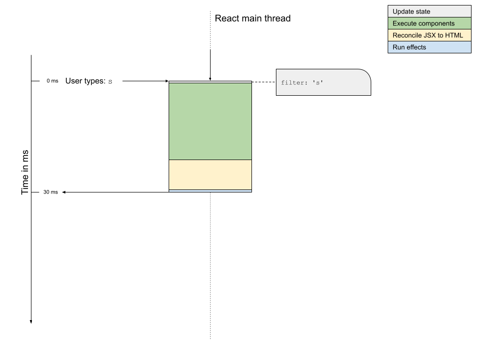
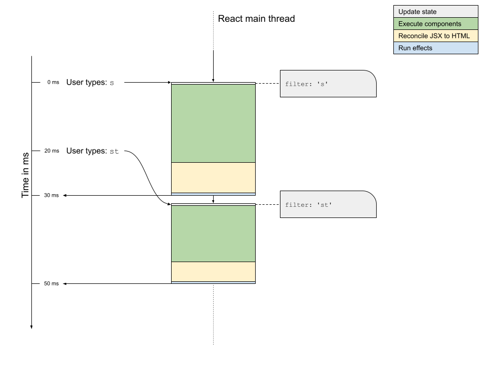
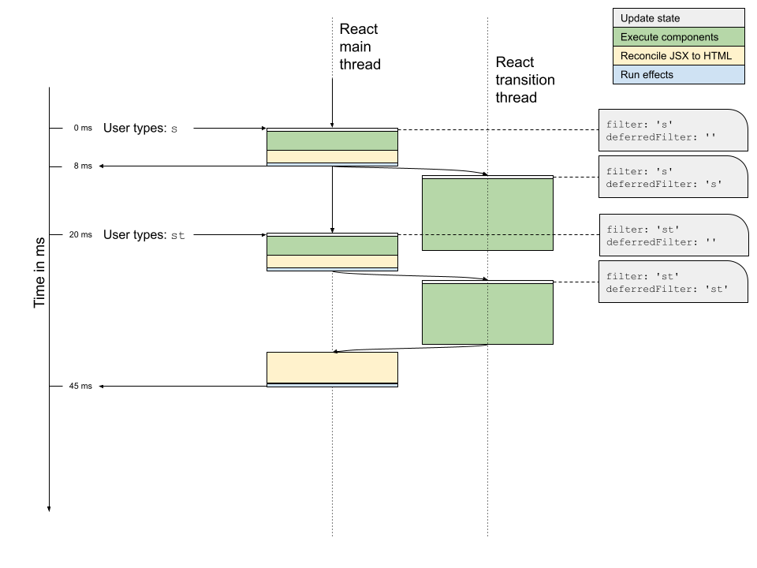

# React 18 Concurrent Mode: How transitions really work (feat. Wordle)

> 원본 글  
> https://mortenbarklund.com/blog/react-18-concurrent-mode-how-transitions-work/

**목차**

- [React 18 Concurrent Mode: How transitions really work (feat. Wordle)](#react-18-concurrent-mode-how-transitions-really-work-feat-wordle)
  - [개요](#개요)
  - [Like, what’s your problem, man?](#like-whats-your-problem-man)
  - [`startTransition`을 사용한 우선 순위가 낮은 업데이트](#starttransition을-사용한-우선-순위가-낮은-업데이트)
  - [`useTransition` hook](#usetransition-hook)
  - [What about useDeferredValue?](#what-about-usedeferredvalue)
  - [Conclusion](#conclusion)

## 개요

React 18이 출시되었고, 이와 함께 React는 동시성 모드를 도입했습니다. 이에 대해 많은 이야기가 있었지만, 저는 특히 동시성 모드의 한 가지 측면에 집중하고 싶습니다: **Transitions**.

다소 끔찍한 이름에도 불구하고 React `transition`(이하 트랜지션)은 CSS 트랜지션이나 요소 간의 트랜지션 또는 시각적 상태와 같은 것과는 관련이 없습니다. 간결하게 정의해 보겠습니다:

> React 트랜지션은 상태 업데이트 블록으로, 개발자가 더 중요한 일이 발생하면 우선순위를 낮추고 지연시키도록 React에 지시합니다.

이 경우 트랜지션은 상태 업데이트 명령어입니다. 애플리케이션의 어딘가에 어떤 state를 업데이트하도록 지시하면서 트랜지션에서 이를 수행하도록 지시하는 경우, 우선순위가 낮고 중단 가능하며 연기할 수 있는 작업으로 React가 이를 수행하도록 허용한다는 의미입니다. React는 결국 트랜지션에 도달하겠지만, 우선순위가 더 높은 업데이트에 밀려 잠시 지연될 수 있습니다.

React의 트랜지션은 React 패키지의 두 가지 새로운 최상위 함수인 `startTransition`과 그 hook-variant인 `useTransition`을 사용하여 두 가지 방법으로 생성할 수 있습니다.

이 모든 것이 매우 이론적이므로 실제로 살펴봅시다.

---

Wordle의 열렬한 팬인 여러분이 문제를 푸는 데 도움이 되는 작은 도우미 도구를 만들고 싶다고 상상해 보세요. 거창한 치트 엔진이 아니라 주어진 글자로 가능한 모든 단어를 찾아주는 작은 도구만 있으면 시중에 많이 나와 있습니다.

이를 수행하는 간단한 React 애플리케이션을 쉽게 만들 수 있습니다. 실제로 이 [Codepen](https://codepen.io/barklund/pen/poaoezR?editors=0010)에 약 60줄의 코드만 있으면 됩니다. 검색 필드에 글자를 입력하면 입력한 글자가 강조 표시된 채로 단어 목록이 줄어드는 것을 볼 수 있습니다:

여기서는 비즈니스 로직에 대해 자세히 설명하지 않겠습니다. 더 나은 방법이 있을 수도 있지만, 저희의 목적에 맞게 작동합니다. 앱이 훌륭하게 작동하지는 않지만 작동은 합니다.

## Like, what’s your problem, man?

그렇다면 위 애플리케이션의 문제점은 무엇일까요? Wordle에서 허용되는 단어 목록이 꽤 깁니다. 실제로 12,972개의 단어가 있습니다. 이는 목록에 표시해야 할 HTML 노드가 너무 많다는 뜻입니다. 그리고 모든 노드 내부에 약간의 변경을 가하여 수많은 단어를 다시 렌더링해야 할 때(예: "s"만 포함된 모든 단어를 강조 표시할 때) 상황이 약간 고르지 않게 되기 시작합니다.

React는 컴포넌트를 렌더링할 때 여러 가지 작업을 차례로 수행합니다. 가장 중요한 부분은 다음과 같습니다:

- 업데이트된 모든 구성 요소의 상태를 업데이트합니다.
- (업데이트된 각 컴포넌트의) 실제 렌더링 함수를 실행하고 결과 JSX를 수집합니다.
- 해당 JSX를 기존 HTML로 조정합니다.
- 업데이트 컴포넌트에서 Effect 실행

특히 두 중간 단계는 컴포넌트 기능의 복잡성과 JSX에 대한 업데이트에 따라 상당한 시간이 소요될 수 있습니다.

우리는 애플리케이션의 성능과 반응성이 뛰어나기를 원합니다. 입력에 문자를 입력하면 입력이 즉시 이 문자가 렌더링되었음을 반영하기를 원합니다. 그리고 React가 제어된 입력을 처리하는 방식 때문에, 입력이 포함된 컴포넌트를 업데이트된 상태로 다시 렌더링하기 위해 React가 필요합니다. 입력 아래에 표시되는 목록은 렌더링하는 데 시간이 오래 걸리고 목록의 렌더링이 입력의 렌더링과 연결되어 있기 때문에(모두 동일한 상태 값을 기반으로 동일한 컴포넌트에서 발생함) 입력이 응답하지 않는 것처럼 보입니다.



> 이것은 문자 하나를 눌렀을 때 어떤 일이 일어나는지 보여줍니다. React는 먼저 모든 컴포넌트를 실행하는 데 꽤 많은 시간을 할애해야 하고, 그 다음에는 JSX를 HTML로 조정하는 데 더 많은 시간을 할애해야 합니다.

이 문제는 두 문자를 연속해서 빠르게 누를 때 실제로 나타납니다. 첫 번째 문자 누름의 전체 렌더링 주기가 두 번째 문자 누름이 발생하기 전에 완료되지 않습니다. 그리고 두 번째 문자 누름의 전체 렌더링 주기가 지연됩니다:



> 이 네이티브 앱에서 여러 문자를 빠르게 연속해서 누르면, 첫 번째 문자를 누른 후 두 번째 문자를 누를 때 앱이 업데이트되지 않아 두 번째 문자가 완료될 때까지 더 오래 기다려야 합니다.

이것은 좋은 전략이 아닙니다. 입력 필드가 즉시 렌더링되기를 원하지만, 앱의 반응성을 높이기 위해 필요하다면 목록 렌더링이 지연되는 것을 감수할 수 있습니다. 어떻게 할 수 있을까요?

## `startTransition`을 사용한 우선 순위가 낮은 업데이트

더 이상 할 일이 없을 때만 무언가를 업데이트하라고 React에 지시할 수 있다고 상상해 보세요. 이것이 바로 React 트랜지션이 하는 일이며, 이 글에 매우 유용한 기능입니다!

React API는 메인 패키지에 콜백을 매개변수로 받는 새로운 함수 `startTransition`으로 확장되었습니다. state 업데이트를 `startTransition`에 전달된 콜백으로 감싸면 React는 이(또는 이러한) 상태 업데이트를 우선순위가 낮은 것으로 처리합니다. React는 우선순위가 높은 모든 업데이트를 먼저 실행하고 우선순위가 낮은 업데이트만 두 번째로 실행하며, 더 중요한 일이 발생하면 즉시 우선순위가 낮은 업데이트를 중단할 수 있습니다.

이 새로운 기능을 활용하기 위해 우리가 원하는 것은 바로 이 두 가지입니다:

- 입력 필드의 값 속성이 즉시 업데이트되기를 원합니다.
- 단어 컴포넌트의 필터 속성이 사용자의 입력을 방해하지 않고 업데이트할 수 있을 때만 업데이트되도록 하려고 합니다.

flow 다이어그램에서는 다음과 같이 표시됩니다. 더 중요한 일이 발생하면 트랜지션 스레드의 업데이트가 어떻게 중단될 수 있는지 주목하세요. 아래 그림에서 "s"를 누른 후 발생하는 우선순위가 낮은 업데이트는 다른 우선순위가 높은 업데이트가 발생했기 때문에 중단됩니다. "st"를 누른 후 우선순위가 낮은 업데이트는 중단되지 않고 완료될 때까지 실행될 수 있으며, 완료되면 React는 우선순위가 낮은 업데이트를 실제로 메인 스레드에 렌더링하여 사용자에게 표시할 수 있도록 합니다.



> 이 이상적인 세계에서는 사용자가 입력할 때 입력 필드의 값을 먼저 업데이트하여 입력 필드가 반응하는 것처럼 보이게 한 다음, Words 컴포넌트에 적용된 필터 값으로 업데이트를 계산하기 시작합니다. 이를 위해 두 개의 상태 값을 별도로 만들어 개별적으로 업데이트할 수 있습니다.

**Note**: 여기서 완전히 솔직히 말해서 트랜지션 업데이트가 얼마나 중단 가능한지 정확히 알지 못한다는 점을 인정해야 합니다. 자바스크립트는 본질적으로 싱글 스레드이므로 한 번 실행된 함수를 중단할 수 없지만 Web Worker(백그라운드 스레드)를 사용하여 다른 스레드에서 코드를 실행할 수 있으므로 아마도 React는 실행 중에 일부 플래그를 확인하고 "메인" 스레드에서 플래그가 뒤집힌 경우 중단할 수 있을 것입니다.

제 생각에는 React가 결과 JSX를 DOM에 조정해야 하는지 여부를 확인하기 전에 컴포넌트가 모두 완료된 것으로 렌더링된다고 생각하지만 완전히 확실하지는 않습니다. 어떻게 작동하는지 정확히 알고 계신다면 트위터 @barklund에서 언제든지 저에게 핑을 보내주세요.

컴포넌트에서 이 작업을 수행하는 방법을 살펴봅시다. 이전에 작성한 코드는 다음과 같습니다. 입력 필드와 아래에 표시된 목록을 모두 업데이트하는 상태 변수가 필터라는 단일 변수뿐인 것을 주목하세요:

```javascript
function FilterWords() {
  const [list, setList] = useState([]);
  useEffect(() => {
    fetch(targetURL)
      .then((r) => r.text())
      .then((r) => setList(r.split('\n').sort()));
  }, []);
  const [filter, setFilter] = useState('');
  const handleChange = ({ target: { value } }) => {
    setFilter(value);
  };
  return (
    <main>
      <label>
        Filter:
        <input type="search" value={filter} onChange={handleChange} />
      </label>
      <Words list={list} filter={filter} />
    </main>
  );
}
```

이제 필터 변수를 두 개로 분할해 보겠습니다. 하나는 입력에 사용되는 우선순위가 높은 값이고 다른 하나는 목록에 사용되는 우선순위가 낮은 값입니다. 전자는 Click 콜백 함수에서 직접 업데이트하지만, 후자는 다음과 같이 시작 트랜지션 콜백 함수 안에 래핑할 것입니다:

```javascript
function FilterWords() {
  const [list, setList] = useState([]);
  useEffect(() => {
    fetch(targetURL)
      .then((r) => r.text())
      .then((r) => setList(r.split('\n').sort()));
  }, []);
  const [filter, setFilter] = useState('');
  const [deferredFilter, setDeferredFilter] = useState('');
  const handleChange = ({ target: { value } }) => {
    setFilter(value);
    startTransition(() => {
      setDeferredFilter(value);
    });
  };
  return (
    <main>
      <label>
        Filter:
        <input type="search" value={filter} onChange={handleChange} />
      </label>
      <Words list={list} filter={deferredFilter} />
    </main>
  );
}
```

[Codepen](https://codepen.io/barklund/pen/ZErELWQ?editors=0110)에서 이를 실제로 확인할 수 있습니다:

빠르게 입력하면 입력 필드가 즉시 업데이트되는 방식에 주목하세요. 입력하는 동안 잠시 휴식을 취하거나 결과 단어 목록이 너무 작아서 다음 문자를 누르기 전에 완료될 수 있을 정도로 빠르게 렌더링될 때만 목록이 업데이트됩니다.

## `useTransition` hook

위의 예에서는 트랜지션이 아직 실행되지 않았기 때문에 현재 검색 필터와 실제로 일치하지 않는 단어 목록이 표시되는 경우가 있습니다. 트랜지션이 실행되기를 기다리는 동안 단어 목록을 '오래된'(즉, 새롭지 않은) 것으로 표시할 수 있다면 어떨까요?

이것이 바로 React API가 새로운 훅인 `useTransition`으로 확장된 이유입니다. 이 훅은 boolean 플래그와 함수를 배열로 반환합니다(`useState`의 반환값과 유사하게).

boolean 값의 이름은 종종 `isPending`이고 함수의 이름은 `startTransition`이지만, 반드시 필요한 것은 아닙니다. 이 `startTransition`은 React 패키지의 같은 이름의 전역 함수의 변형이지만, 이 함수는 `isPending` 플래그에 연결됩니다. 이 특정 `startTransition`으로 생성된 아직 불완전한 트랜지션이 있는 동안 해당 `isPending` 플래그는 `true`고, 그렇지 않으면 `false`가 됩니다.

보류 중인 트랜지션이 있을 때처럼 목록이 오래된(stale) 경우 이 `isPending` 플래그를 사용해 단어 목록을 흐리게 할 수 있습니다. `startTransition`은 이제 React 패키지의 전역 함수가 아니라 훅이 반환하는 로컬 함수에 대한 참조입니다:

```javascript
function FilterWords() {
  const [list, setList] = useState([]);
  useEffect(() => {
    fetch(targetURL)
      .then((r) => r.text())
      .then((r) => setList(r.split('\n').sort()));
  }, []);
  const [filter, setFilter] = useState('');
  const [isPending, startTransition] = useTransition();
  const [deferredFilter, setDeferredFilter] = useState('');
  const handleChange = ({ target: { value } }) => {
    setFilter(value);
    startTransition(() => {
      setDeferredFilter(value);
    });
  };
  return (
    <main>
      <label>
        Filter:
        <input type="search" value={filter} onChange={handleChange} />
      </label>
      <div style={{ opacity: isPending ? 0.3 : 1 }}>
        <Words list={list} filter={deferredFilter} />
      </div>
    </main>
  );
}
```

목록이 회색으로 표시되는 기간은 대부분 매우 짧은 경우가 많으므로 위와 같은 사소한 시각적 단서에만 `isPending`을 사용해야 한다는 점에 유의하세요. 많은 예제에서 이 플래그를 사용하여 "목록이 업데이트되는 동안 기다려주세요"와 같은 메시지를 표시하지만, 0.1초만 표시되면 어차피 읽을 수 없으므로 실제 사용자 경험 개선보다는 번쩍이는 혼란만 야기할 수 있습니다.

## What about useDeferredValue?

우선순위가 낮은 상태 업데이트를 위한 다른 새로운 훅인 `useDeferredValue`를 사용하여 똑같은 문제를 해결할 수 있었습니다. 그런데 왜 그렇게 하지 않았을까요? 이는 다른 (향후) 글에서 다룰 주제입니다.

## Conclusion

특히 React 동시성 모드와 트랜지션은 React API에 새로 추가된 상당히 복잡한 기능입니다. 트랜지션은 이해하기가 약간 까다롭고 올바르게 적용하기 어려울 수 있습니다.

아주 숙련된 개발자가 아니라면 처음에는 항상 트랜지션 없이 애플리케이션을 구현하세요. 메모와 마찬가지로 트랜지션을 잘못 적용하면 득보다 실이 많고 사용자 경험을 이유 없이 망칠 수 있습니다. 애플리케이션과 인터페이스가 느리게 느껴지기 시작할 때만 트랜지션을 적용하는 것을 고려해야 합니다. 하지만 성능 최적화를 위해 트랜지션이 필요한 경우에는 이전에 사용했던 모든 해결 방법보다 훨씬 더 나은 솔루션입니다.
