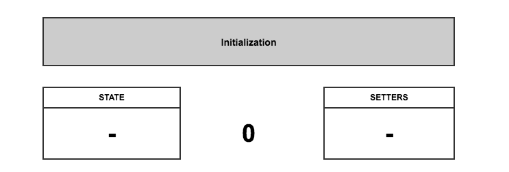
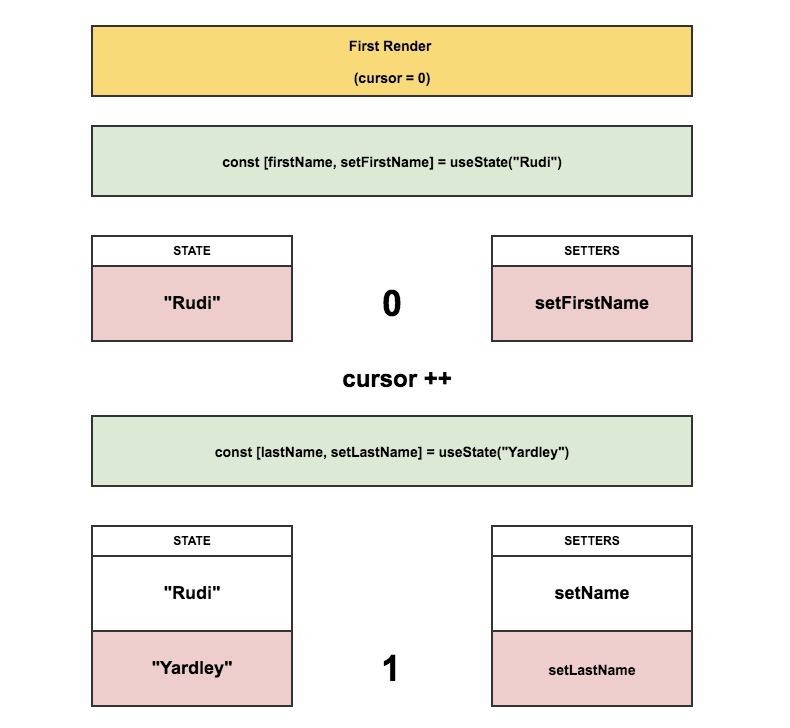
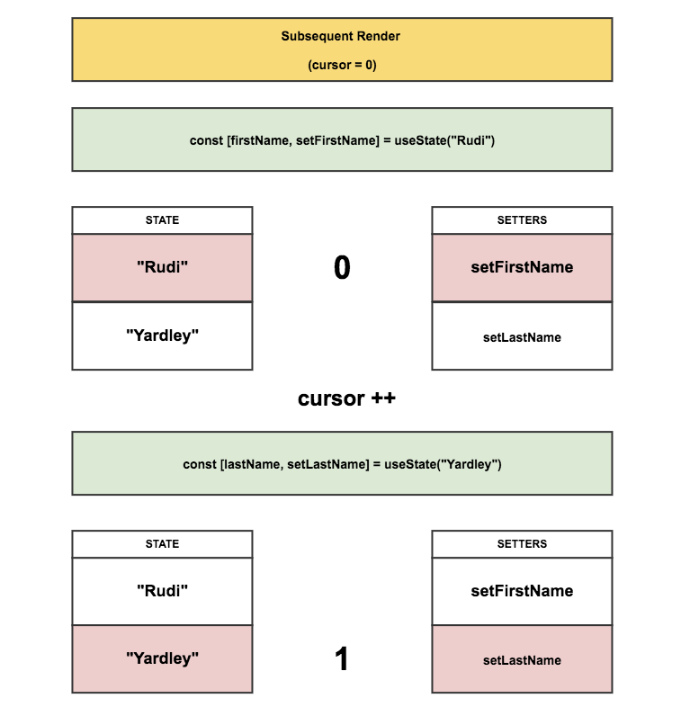
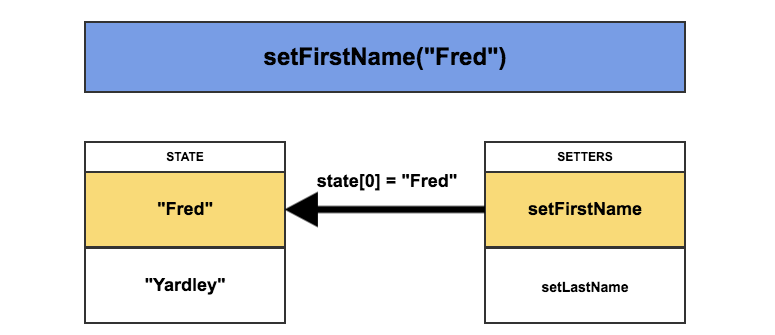
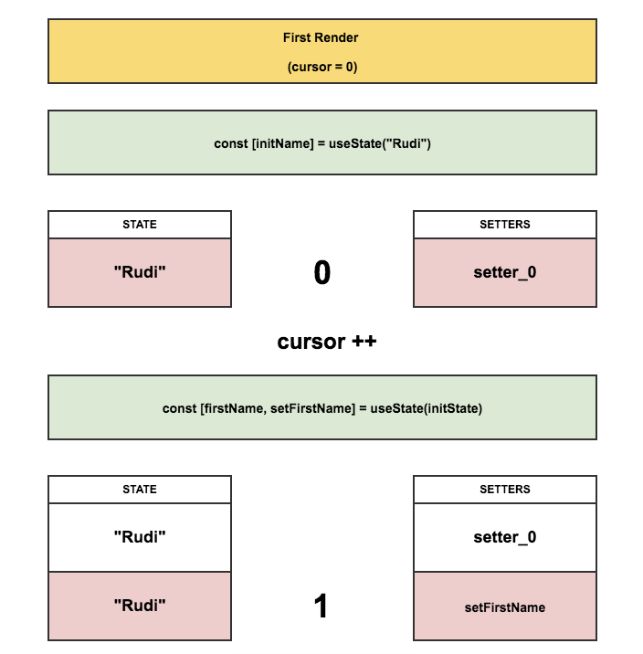
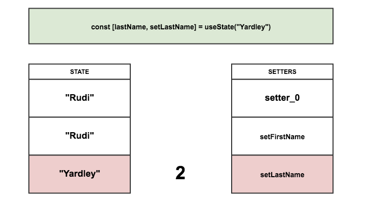
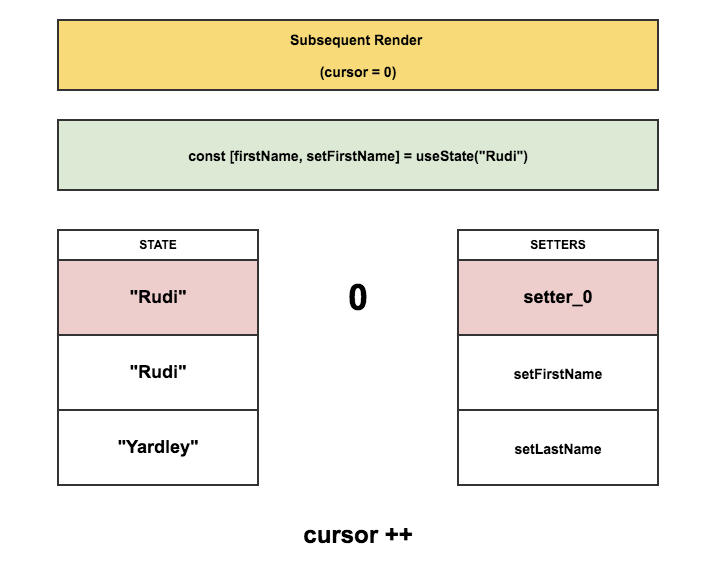
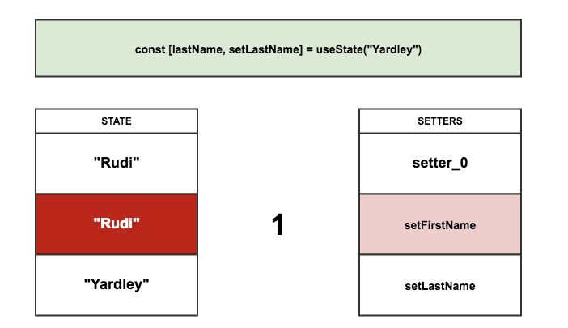

# React hooks: not magic, just arrays

> 원본 글  
> https://medium.com/@ryardley/react-hooks-not-magic-just-arrays-cd4f1857236e

**목차**

- [React hooks: not magic, just arrays](#react-hooks-not-magic-just-arrays)
  - [Unpacking how hooks work](#unpacking-how-hooks-work)
    - [The rules of hooks](#the-rules-of-hooks)
    - [State management in hooks is all about arrays](#state-management-in-hooks-is-all-about-arrays)
  - [How could we implement `useState()`?](#how-could-we-implement-usestate)
  - [So what’s React going to do with this?](#so-whats-react-going-to-do-with-this)
    - [1) Initialisation](#1-initialisation)
    - [2) First render](#2-first-render)
    - [3) Subsequent render](#3-subsequent-render)
    - [4) Event handling](#4-event-handling)
    - [And the naive implementation](#and-the-naive-implementation)
  - [Why order is important](#why-order-is-important)
    - [Bad Component First Render](#bad-component-first-render)
    - [Bad Component Second Render](#bad-component-second-render)
    - [Think about hooks manipulating a set of arrays and you wont break the rules](#think-about-hooks-manipulating-a-set-of-arrays-and-you-wont-break-the-rules)
  - [Conclusion](#conclusion)

## Unpacking how hooks work

I have heard some people struggling with the `magic` around the new hooks API draft proposal so I thought I would attempt to unpack how the syntax proposal works at least on a superficial level.

### The rules of hooks

**hooks**에는 **React** core 팀에서 공식 문서에 규정해놓은 것과 같이 **hooks**를 사용하기 위해 따라야 하는 두 가지 주요한 사용 규칙이 존재한다.

- **Hooks**를 반복문, 조건문 또는 중첩 함수 내에서 호출하지 말아라
- **Hooks**는 오직 함수 컴포넌트 내에서 호출되어야만 한다.

두 번째 규칙이 말하고자 하는 바는 명확하다. To attach behaviour to a functional component you need to be able to associate that behaviour with the component somehow.

그러나 첫 번째 규칙은 이와 같은 규칙을 가진 API를 사용하여 프로그래밍하는 것이 부자연스러워 보일 수 있기 때문에 규칙을 보는 우리는 혼란스러울 수도 있다. 그렇기에 이 부분에 대해 오늘 탐구해보고자 한다.

### State management in hooks is all about arrays

보다 명확한 **hooks**의 멘탈 모델에 대해 알기 위해 먼저 **hooks** API의 간단한 구현체를 살펴보자.

> 이것은 추측이며 API를 구현하는 방법 중 하나일 뿐이다. 이것이 반드시 API가 내부적으로 작동하는 방식은 아니다.

## How could we implement `useState()`?

`useState` **hooks**가 어떻게 동작하는지 보여주기 위해서 아래 예제를 자세히 들여다보자.

먼저 컴포넌트로 시작한다.

```jsx
function RenderFunctionComponent() {
  const [firstName, setFirstName] = useState('Rudi');
  const [lastName, setLastName] = useState('Yardley');

  return <Button onClick={() => setFirstName('Fred')}>Fred</Button>;
}
```

**hooks** API의 아이디어는 **hook** 함수로부터 반환되는 배열의 두 번째 항목으로 반환된 `setter` 함수를 사용할 수 있으며 해당 `setter` 함수가 **hook**에서 관리하는 `state`를 제어한다는 것이다.

## So what’s React going to do with this?

이제 **React** 내에서 **hooks**가 내부적으로 어떻게 동작하는지 살펴보자. 다음에 나오는 과정은 특정 컴포넌트가 렌더링하기 위해 실행 컨텍스트 내부에서 동작한다. 이는 여기에 저장될 데이터가 렌더링되는 컴포넌트 외부에 있음을 의미한다. 이 `state`는 다른 컴포넌트와 공유되지는 않지만 특정 컴포넌트의 후속 렌더링에서 접근할 수 있는 범위에서 유지된다.

### 1) Initialisation

두 개의 빈 배열을 생성한다.

- `setters`
- `state`

`cursor`를 `0`으로 설정한다.



> Initialisation: Two empty arrays, Cursor is 0  
> 출처: https://medium.com/@ryardley/react-hooks-not-magic-just-arrays-cd4f1857236e

### 2) First render

처음으로 컴포넌트 함수가 실행된다.

첫 실행 때 각 `useState` 함수의 호출은 `setters` 배열에 `setter` 함수(`cursor` 위치에 바인딩된)를 집어넣고 `state` 배열에 `state`를 집어넣는다.



> First render: Items written to the arrays as cursor increments.  
> 출처: https://medium.com/@ryardley/react-hooks-not-magic-just-arrays-cd4f1857236e

### 3) Subsequent render

각 후속 렌더링 때 커서는 초기화되고 `value`들은 각 배열에서 읽는다.



> Subsequent render: Items read from the arrays as cursor increments  
> 출처: https://medium.com/@ryardley/react-hooks-not-magic-just-arrays-cd4f1857236e

### 4) Event handling

각 `setter` 함수에는 `cursor` 위치에 대한 참조값이 있으므로 어떠한 `setter` 함수를 호출해도 `state` 배열에서 `cursor` 위치값에 해당하는 `state` 값을 변경할 것이다.



> Setters “remember” their index and set memory according to it.  
> 출처: https://medium.com/@ryardley/react-hooks-not-magic-just-arrays-cd4f1857236e

### And the naive implementation

다음은 useState의 구현체를 설명하기 위한 의사 코드 예제이다.

> ✋  **주의**
>
> 이것은 hooks가 작동하는 방식을 정확히 나타내지는 않지만 단일 컴포넌트에 대해 hooks가 어떻게 작동하는 지에 대해 설명하는 좋은 방법에 대한 아이디어를 제공한다. 이것이 우리가 **module level vars**(`let`을 의미하는 듯) 등을 사용하는 이유이다.

```jsx
let state = [];
let setters = [];
let firstRun = true;
let cursor = 0;

function createSetter(cursor) {
  return function setterWithCursor(newVal) {
    state[cursor] = newVal;
  };
}

// This is the pseudocode for the useState helper
export function useState(initVal) {
  if (firstRun) {
    state.push(initVal);
    setters.push(createSetter(cursor));
    firstRun = false;
  }

  const setter = setters[cursor];
  const value = state[cursor];

  cursor++;
  return [value, setter];
}

// Our component code that uses hooks
function RenderFunctionComponent() {
  const [firstName, setFirstName] = useState('Rudi'); // cursor: 0
  const [lastName, setLastName] = useState('Yardley'); // cursor: 1

  return (
    <div>
      <Button onClick={() => setFirstName('Richard')}>Richard</Button>
      <Button onClick={() => setFirstName('Fred')}>Fred</Button>
    </div>
  );
}

// This is sort of simulating Reacts rendering cycle
function MyComponent() {
  cursor = 0; // resetting the cursor
  return <RenderFunctionComponent />; // render
}

console.log(state); // Pre-render: []
MyComponent();
console.log(state); // First-render: ['Rudi', 'Yardley']
MyComponent();
console.log(state); // Subsequent-render: ['Rudi', 'Yardley'];

// click the 'Fred' button

console.log(state); // After-click: ['Fred', 'Yardley']
```

## Why order is important

이제 외부 요인이나 컴포넌트 `state`를 기반으로 하는 **render cycle**의 **hooks**의 순서를 변경하면 무슨 일이 일어날까?

**React** 팀에서 우리에게 하지 말라고 하는 것들을 해보자.

```jsx
let firstRender = true;

function RenderFunctionComponent() {
  let initName;

  if (firstRender) {
    [initName] = useState('Rudi');
    firstRender = false;
  }

  const [firstName, setFirstName] = useState(initName);
  const [lastName, setLastName] = useState('Yardley');

  return <Button onClick={() => setFirstName('Fred')}>Fred</Button>;
}
```

위 코드는 `useState`의 호출은 선택적으로 하는 예제이다. 이것이 시스템에 미치는 혼란을 보자.

### Bad Component First Render




> Rendering an extra ‘bad’ hook that will be gone next render  
> 출처: https://medium.com/@ryardley/react-hooks-not-magic-just-arrays-cd4f1857236e

이때 우리의 vars 인스턴스 `firstName`과 `lastName`은 정확한 데이터를 포함하지만 문제는 다음 렌더링 때 발생한다.

### Bad Component Second Render




> By removing the hook between renders we get an error.  
> 출처: https://medium.com/@ryardley/react-hooks-not-magic-just-arrays-cd4f1857236e

이제 `state` 저장소(배열)가 일관성이 없어짐에 따라 `firstName`과 `lastName` 모두 `Rudi`로 설정된다. 이는 분명히 잘못된 것이고 작동하지도 않지만 이를 통해 hooks에 대한 두 번째 규칙이 지켜져야 하는 이유에 대해 알 수 있다.

> **React 팀은 hooks 사용 규칙을 규정하고 있다. 왜냐하면 이러한 규칙을 따르지 않으면 데이터가 일관되지 않기 때문이다.**
>
> The React team are stipulating the usage rules because not following them will lead to inconsistent data

### Think about hooks manipulating a set of arrays and you wont break the rules

이제 우리가 조건문이나 반복문 내에서 use- hooks를 호출할 수 없는 이유가 명확해졌다. 왜냐하면 우리는 일련의 배열 집합을 가리키는 cursor를 다루고 있기 때문에 렌더링 내에서 hooks의 호출 순서를 변경할 경우 cursor는 데이터와 일치하지 않게 된다. 즉 일관성 없게 데이터를 가리키게 되며 이로 인해 우리가 hooks를 호출할 때 우리가 예상하고 있는 올바른 데이터 또는 핸들러를 가리키지 않게 될 것이다.

따라서, **hooks**를 일관된 `cursor`가 필요한 배열 집합으로 생각하면 편하다. 만약 `cursor`의 일관성을 보장해준다면 모든 것이 정상적으로 동작할 것이다.

## Conclusion

Hopefully I have laid out a clearer mental model for how to think about what is going on under the hood with the new hooks API. Remember the true value here is being able to group concerns together so being careful about order and using the hooks API will have a high payoff.

Hooks is an effective plugin API for React Components. There is a reason why people are excited about this and if you think about this kind of model where state exists as a set of arrays then you should not find yourselves breaking the rules around their usage.
