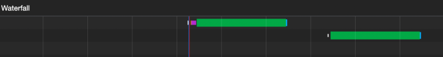

# Suspense

**목차**

- [Suspense](#suspense)
  - [개요](#개요)
  - [`Suspense`를 사용하는 방법](#suspense를-사용하는-방법)
  - [Data fetching approaches](#data-fetching-approaches)
    - [Fetch-on-render](#fetch-on-render)
    - [Fetch-then-render](#fetch-then-render)

## 개요

`Suspense`는 **React**로 만들어진 애플리케이션 내에서 비동기 작업을 관리할 수 있게 도와주는 기능이다. 이는 어느 데이터를 기다리는 동안 React와 커뮤니케이션할 수 있게 도와준다.

중요한 점은 `Suspense`는 `react-async`, `react-query` 등과 같은 데이터 패칭 라이브러리도 아니고 전역 상태를 관리하는 `Redux`와 같은 라이브러리도 아니라는 점이다. `Suspense`는 비동기 작업을 기다리면서 완료될 때까지 `fallback`을 선언적으로 사용할 수 있게 해주는 친구이다.

아래에서 더 자세히 설명할테지만 `Suspense`는 우리가 사용자에게 동기적으로 로딩 상태일 때 다른 컴포넌트를 보여줌으로써 사용자에게 더 좋은 사용자 경험을 제공할 수 있게 해준다. 이는 이미 존재하는 애플리케이션을 완전히 다시 렌더링할 필요없는 즉, 방해하지 않는 방법(non-intrusive way)이다.

## `Suspense`를 사용하는 방법

`Suspense`의 가장 간단한 사용 예제를 알아보기 위해 우선 컴포넌트 내에서 네트워크 요청의 `Pending` 상태를 핸들링하는 코드를 봐보자.

```tsx
const [todos, isLoading] = fetchData('/todos');

if (isLoading) {
  return <Spinner />;
}

return <Todos data={todos} />;
```

위 코드는 상당히 친숙하다. 아마도 대부분(나를 포함한)의 사람들이 네트워크 요청을 기다리는 상황을 관리하는 방식일 것이다. `fetchData` 함수의 구현은 `Spinner` 그리고 `Todos` 컴포넌트와 관련이 없다.

`isLoading`이라는 변수는 네트워크 요청의 상태를 추적하는데 사용된다. 만약 `true`라면, 우리는 `Spinner`를 렌더링하여 사용자에게 현재 네트워크 상태를 알려준다. 이 방법은 전혀 문제가 없다. 하지만 `Suspense`를 이용하여 동일한 케이스를 어떻게 다루는지 살펴보자.

```tsx
const todos = fetchData('/todos');

return (
  <Suspense fallback={<Spinner />}>
    <Todos data={todos} />
  </Suspense>
);
```

위 코드에는 미묘하지만 중요한 변경점이 있다. 로딩 상태를 추적하고 있는 상태 변수에 기반하여 **Spinner**를 렌더링하는 로직을 대신하여 `Suspense`를 통해 이를 관리하고 있다. 우리는 이제 `fallback`을 통해 선언적으로 렌더링한다.

이전 예제에서 **React**가 네트워크 요청에 대해 모르기 때문에 `isLoading`이라는 변수를 만들어 로딩 상태를 관리하는 용도로 사용했었다. 이 예제에서, React는 `Todos` 컴포넌트를 `Suspense`로 감싸줌으로 인해 네트워크 요청이 발생한다는 것을 알고 있으며 이것(`Suspense`)이 네트워크 요청이 끝날 때까지 렌더링을 딜레이시켜 줄 것이다.

또 다른 중요한 점 중 하나는 `Suspense`에게 `fallback` 속성을 전달한다는 점이다. 이것으로 네트워크 요청이 끝날 때까지 기다리는 동안 우리가 원하는 무엇이는 렌더링할 수 있게 된다. 이는 `Spinner`가 될 수도 있으며, `Skeleton UI`가 될 수도 있고 심지어는 아무것도 렌더링안할 수도 있다.

**React**는 `fallback`의 값이 무엇이는 네트워크 요청이 끝날 때까지 기다리는 동안 렌더링할 것이다.

**React**는 어떻게 네트워크 요청이 `Pending` 상태라는 것을 정확하게 알고 있을까? `Suspense`는 우리가 겪은 바에 이하여 오직 기다리는 동안 `fallback` 컴포넌트만 렌더링한다. 우리는 코드의 어디에서 네트워크 요청을 만들고 있다는 것을 **React**와 소통하고 있는걸까?

이것은 데이터 패칭 라이브러리가 들어오는 곳에서 시작된다. 현재는, `Relay` 그리고 `SWR`이 **React**와 로딩 상태에 대해 소통하기 위하여 `Suspense`와 통합되어 있다. 아마도 추후에 더 많은 라이브러리의 저자들이 `Suspense`의 통합을 진행할 것이라고 예상한다.

지금까지 우리가 배운 것이 무엇일까? 지금까지 우리는 `Suspense`는 애플리케이션의 `Pending` 상태를 **React**가 접근할 수 있게 만들어 준다는 사실을 배웠으며 이로 인해 네트워크 요청을 기다리는 동안 선언적으로 `fallback` 컴포넌트를 렌더링할 수 있게 만들어 준다는 사실을 배울 수 있었다.

다음은 일반적인 데이터 패칭 접근과 그것들의 한계점에 대해 알아볼 것이며, `Suspense`가 어떻게 개발자와 사용자의 경험을 향상시키는 지에 대해 알아볼 것이다. 그리고 나서, 우리는 `Suspense`를 이용하여 네트워크 요청의 로딩 상태를 관리하는 방식으로 앱을 만들어 볼 것이다. 마지막으로, 우리는 `Suspense`가 제공하는 이점에 대한 탐구로 이들을 함께 묶어볼 것이다.

## Data fetching approaches

만약 **React** 컴포넌트가 **API**로부터 몇 가지 데이터를 필요로 하는 상황이라면 우리는 일반적으로 어디에선가 데이터를 가져오기 위해 네트워크 요청을 만들어낼 것이다.

> 여기서 말하는 `data fetching approaches`란 [https://blog.logrocket.com/patterns-for-data-fetching-in-react-981ced7e5c56/](https://blog.logrocket.com/patterns-for-data-fetching-in-react-981ced7e5c56/) 에서 정리된 접근법에 대한 것이다.

### Fetch-on-render

이 방법을 사용할 경우, 네트워크 요청은 컴포넌트가 마운트되고 난 후 발생한다.

이는 `fetch-on-render`라고 불리는 이유 때문인데 네트워크 요청은 컴포넌트가 렌더링되기 전까지는 `trigger`되지 않으며 몇몇 케이스에서는 `waterfall`이라 알려진 문제로 이어질 수 있다. 다음 예제를 봐보자.

```tsx
const App = () => {
  const [useDetails, setUserDetails] = useState({});

  useEffect(() => {
    fetchUserDetails().then(setUserDetails);
  }, []);

  if (!userDetails.id) return <p>Fetching user details...</p>;

  return (
    <div className="app">
      <h2>Simple Todo</h2>

      <UserWelcome user={userDetails} />
      <Todos />
    </div>
  );
};
```

위 예제는 저자가 일반적으로 컴포넌트에서 필요한 데이터를 **API**를 통해 가져오는 상황과 몹시 비슷하다. 하지만 여기엔 문제가 있다.

만약 `nested`된 **Todos** 컴포넌트에서도 **API**를 통해 데이터를 패칭할 필요가 있다면, 이는 `fetchUserDetails()` 함수가 완료될 때까지 기다릴 수 밖에 없게 된다. 만약 이게 3초가 걸린다면, `<Todos />`는 요청을 평행하게(다른 요청을 기다린 후에 진행하는 것이 아닌) 하는 것이 아니라 자신의 데이터에 대한 패칭을 시작하기 전에 3초를 기다리게 될 것이다.

`networks` 탭을 살펴보면 확실하게 알 수 있는데, 두 번째 네트워크 요청은 첫 번째 네트워크 요청이 완료된 이후에 진행되는 것을 볼 수 있다.



컴포넌트 내에 자기 만의 비동기 요청을 만들어 내는 다른 컴포넌트들이 복수로 존재할 경우 이는 애플리케이션의 속도를 느리게 만들고 사용자 경험을 안좋게 만들 것이다.

당연히, 우리는 `UserWelcome` 컴포넌트가 자신만의 데이터 패칭을 관리하도록 만들 수 있다.(상위 컴포넌트에서 데이터 패칭을 해서 `props`로 데이터를 전달받는 구조가 아닌 하위 컴포넌트에서 직접 데이터 패칭을 하는 구조) 그러나 여기서 요점은 위 이미지에서 볼 수 있는 네트워크 요청을 조절하는 아이디어이고 이는 `Suspense`가 문제없이 해결해준다.

### Fetch-then-render

이 방법을 사용하면 우리는 컴포넌트가 렌더링 되기 전에 비동기 요청을 할 수 있다. 이전 예제로 돌아가 다음과 같이 고쳐보자.

```tsx
const fetchDataPromise = fetchUserDetailsAndTodos(); // 우리는 여기서 패칭을 시작한다.

const App = () => {
  const [userDetails, setUserDetails] = useState({});
  const [todos, setTodos] = useState([]);

  useEffect(() => {
    fetchDataPromise.then((data) => {
      setUserDetails(data.userDetails);
      setTodos(data.todos);
    });
  }, []);

  return (
    <div className="app">
      <h2>Simple Todo</h2>

      <UserWelcome user={userDetails} />
      <Todos todos={todos} />
    </div>
  );
};
```
