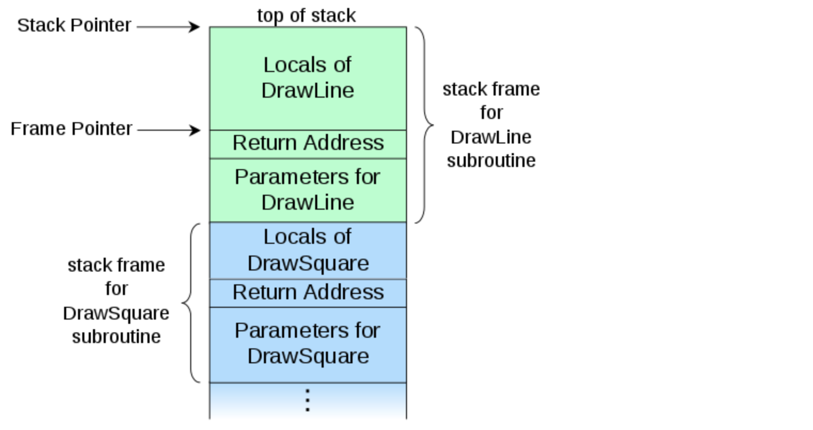

# The how and why on React’s usage of linked list in Fiber to walk the component’s tree

> 원본 글  
> https://medium.com/react-in-depth/the-how-and-why-on-reacts-usage-of-linked-list-in-fiber-67f1014d0eb7

**목차**

- [The how and why on React’s usage of linked list in Fiber to walk the component’s tree](#the-how-and-why-on-reacts-usage-of-linked-list-in-fiber-to-walk-the-components-tree)
  - [개요](#개요)
  - [Setting the background](#setting-the-background)
  - [A word about the stack](#a-word-about-the-stack)
  - [Why is the stack relevant to React](#why-is-the-stack-relevant-to-react)
  - [Recursive traversal](#recursive-traversal)
  - [Linked list traversal](#linked-list-traversal)
  - [Work loop in React](#work-loop-in-react)

## 개요

React에서 변경 감지 메커니즘은 종종 `reconciliation` 또는 `rendering`이라고 불리며, **Fiber**는 이를 가장 최근에 구현한 것입니다. 기본 아키텍처로 인해 non-blocking 렌더링 수행, 우선순위에 따른 업데이트 적용, 백그라운드에서 콘텐츠 pre-rendering과 같은 많은 흥미로운 기능을 구현할 수 있는 기능을 제공합니다. 이러한 기능을 Concurrent React 철학에서는 **time-slicing**이라고 합니다.

이러한 메커니즘의 내부 구현은 애플리케이션 개발자의 실제 문제를 해결하는 것 외에도 엔지니어링 관점에서 다양한 매력을 지니고 있습니다. 소스에는 개발자로서 성장하는 데 도움이 되는 풍부한 지식이 존재합니다.

구글에 "**React Fiber**"를 검색하면 검색 결과에서 꽤 많은 기사를 볼 수 있을 것입니다. 하지만 앤드류 클라크의 노트를 제외하고는 모두 매우 높은 수준의 설명입니다. 이 글에서는 이 자료를 참고하여 **Fiber**에서 특히 중요한 몇 가지 개념에 대해 자세히 설명하겠습니다. 이 글을 다 읽고 나면 린 클라크(Lin Clark)가 ReactConf 2017에서 했던 훌륭한 강연에서 **work loop representation**을 이해하는 데 충분한 지식을 얻게 될 것입니다. 이 강연은 꼭 보셔야 할 강연입니다. 하지만 소스를 조금 더 살펴보고 나면 훨씬 더 이해가 쉬워질 것입니다.

이 포스팅은 React의 **Fiber** 내부에 대한 시리즈를 시작합니다. 구현의 내부 세부 사항을 이해하는 데 70% 정도 진행했으며 조정 및 렌더링 메커니즘에 대한 세 편의 글이 더 준비되어 있습니다.

## Setting the background

**Fiber**의 아키텍처에는 `reconciliation`/`rende`과 `commit`이라는 두 가지 주요 단계가 있습니다. 소스 코드에서 `reconciliation` 단계는 대부분 "`render` 단계"라고 불립니다. 이 단계는 React가 컴포넌트 트리를 걸어가는 단계입니다:

- updates state and props,  
  (state와 props를 업데이트 하고)
- calls lifecycle hooks,  
  (라이프 사이클 훅을 호출하며)
- retrieves the children from the component,  
  (컴포넌트에서 children을 검색한 뒤)
- compares them to the previous children,  
  (이전 children과 비교하여)
- and figures out the DOM updates that need to be performed.  
  (이를 사용하여 수행해야 하는 DOM 업데이트를 파악합니다)

이러한 모든 활동을 **Fiber** 내부의 작업이라고 합니다. 수행해야 하는 작업의 유형은 React 엘리먼트의 유형에 따라 다릅니다. 예를 들어, 클래스 컴포넌트의 경우 React는 클래스를 인스턴스화해야 하지만 함수형 컴포넌트의 경우 그렇지 않습니다. 관심이 있으시다면 [여기](https://github.com/facebook/react/blob/340bfd9393e8173adca5380e6587e1ea1a23cefa/packages/shared/ReactWorkTags.js#L29-L28)에서 **Fiber**의 모든 유형의 작업 대상을 볼 수 있습니다. 앤드류가 여기서 이야기하는 활동은 바로 이런 것들입니다:

> UI를 처리할 때 한 번에 너무 많은 작업을 실행하면 애니메이션 프레임이 떨어질 수 있다는 문제가 있습니다...

이제 '한 번에 모두(all at once)'라는 부분은 어떻게 될까요? 기본적으로 React가 전체 컴포넌트 트리를 동적으로 이동하면서 각 컴포넌트에 대한 작업을 수행한다면, 애플리케이션 코드가 로직을 실행하는 데 사용할 수 있는 시간이 16ms를 초과할 수 있습니다. 그러면 프레임이 떨어지고 시각적 효과가 끊기는 현상이 발생합니다.

So this can be helped?

> 최신 브라우저(및 React Native)는 이 문제를 해결하는 데 도움이 되는 API를 구현합니다...

그가 말하는 새로운 API는 브라우저의 유휴 기간 동안 호출할 함수를 대기열에 넣는 데 사용할 수 있는 `requestIdleCallback` 전역 함수입니다. 이 함수를 직접 사용하는 방법은 다음과 같습니다:

```javascript
requestIdleCallback((deadline) => {
  console.log(deadline.timeRemaining(), deadline.didTimeout);
});
```

이제 콘솔을 열고 위의 코드를 실행하면 Chrome에서 `49.9 false`로 기록합니다. 기본적으로 `49.9ms`의 시간이 남아 있고 아직 할당된 시간을 모두 사용하지 않았다는 의미이며, 그렇지 않으면 `deadline.didTimeout`이 `true`가 됩니다. `timeRemaining`은 브라우저에 할 일이 생기면 바로 변경될 수 있으므로 지속적으로 확인해야 한다는 점을 명심하세요.

`requestIdleCallback`은 실제로 너무 제한적이고 부드러운 UI 렌더링을 구현하기에 충분히 자주 실행되지 않기 때문에 React 팀은 자체 버전을 구현해야 했습니다.

이제 React가 컴포넌트에서 수행하는 모든 활동을 `performWork` 함수에 넣고 `requestIdleCallback`을 사용하여 작업을 예약하면 코드가 다음과 같이 보일 수 있습니다:

```javascript
requestIdleCallback((deadline) => {
  // while we have time, perform work for a part of the components tree
  // (시간이 있는 동안 컴포넌트 트리의 일부에 대한 작업을 수행합니다)
  while ((deadline.timeRemaining() > 0 || deadline.didTimeout) && nextComponent) {
    nextComponent = performWork(nextComponent);
  }
});
```

한 컴포넌트에서 작업을 수행한 다음 처리할 다음 컴포넌트에 대한 참조를 반환합니다. 이 방법은 한 가지 문제만 없다면 작동할 것입니다. `reconciliation` 알고리즘의 이전 구현에서처럼 전체 컴포넌트 트리를 동시에 처리할 수는 없습니다. 이것이 바로 앤드류가 이야기하는 문제입니다:

> 이러한 API를 사용하려면 렌더링 작업을 증분 단위(incremental units)로 분할하는 방법이 필요합니다.

따라서 이 문제를 해결하기 위해 React는 내장 스택에 의존하는 동기식 재귀 모델에서 링크된 목록과 포인터를 사용하는 비동기식 모델로 트리를 걷는 알고리즘을 다시 구현해야 했습니다. 다음은 앤드류에 이러한 점에 대해 작성한 내용입니다:

> 내장 콜 스택에만 의존하면 스택이 비워질 때까지 계속 작업을 수행하게 되는데... 콜 스택을 마음대로 중단하고 스택 프레임을 수동으로 조작할 수 있다면 좋지 않을까요? 이것이 바로 React **Fiber**의 목적입니다.**Fiber**는 스택을 React 컴포넌트에 특화시켜 재구현한 것입니다. 하나의 **Fiber**를 가상 스택 프레임이라고 생각하면 됩니다.

지금부터 이에 대해 설명해드리겠습니다.

## A word about the stack

여러분 모두 콜 스택이라는 개념에 익숙하실 것입니다. 중단점에서 코드를 일시 중지하면 브라우저의 디버깅 도구에서 볼 수 있는 것이 바로 이 콜 스택입니다. 다음은 Wikipedia에서 인용한 몇 가지 관련 인용문과 다이어그램입니다:

> 컴퓨터 과학에서 콜 스택은 컴퓨터 프로그램의 활성 서브루틴에 대한 정보를 저장하는 스택 데이터 구조입니다... 콜 스택이 있는 주된 이유는 각 활성 서브루틴이 실행을 마쳤을 때 제어권을 반환해야 하는 지점을 추적하기 위해서입니다... 콜 스택은 스택 프레임으로 구성됩니다... 각 스택 프레임은 아직 반환으로 종료되지 않은 서브루틴에 대한 호출에 해당합니다. 예를 들어, DrawLine이라는 이름의 서브루틴이 현재 실행 중이고 서브루틴 DrawSquare에 의해 호출된 경우 콜 스택의 상단 부분은 인접한 그림과 같이 배치될 수 있습니다.



## Why is the stack relevant to React

이 글의 첫 번째 부분에서 정의한 것처럼 React는 `reconciliation`/`rende` 단계에서 컴포넌트 트리를 걷고 컴포넌트에 대해 몇 가지 작업을 수행합니다. 이전 `reconciliation` 구현에서는 내장 스택에 의존하여 트리를 걷는 동기 재귀 모델을 사용했습니다. `reconciliation`에 대한 [공식 문서](https://legacy.reactjs.org/docs/reconciliation.html?source=post_page---------------------------#recursing-on-children)에서는 이 프로세스를 설명하고 재귀에 대해 많이 이야기합니다:

> 기본적으로 DOM 노드의 자식들을 재귀 처리할 때 React는 두 자식 목록을 동시에 반복하고 차이가 있을 때마다 변형(mutation)을 생성합니다.

생각해 보면 각 재귀 호출은 스택에 프레임을 추가합니다. 그리고 이 작업은 동기적으로 이루어집니다. 다음과 같은 컴포넌트 트리가 있다고 가정해 봅시다:


이는 렌더링 함수가 있는 객체로 표현됩니다. 컴포넌트의 인스턴스라고 생각하면 됩니다:

```javascript
const a1 = { name: 'a1' };
const b1 = { name: 'b1' };
const b2 = { name: 'b2' };
const b3 = { name: 'b3' };
const c1 = { name: 'c1' };
const c2 = { name: 'c2' };
const d1 = { name: 'd1' };
const d2 = { name: 'd2' };

a1.render = () => [b1, b2, b3];
b1.render = () => [];
b2.render = () => [c1];
b3.render = () => [c2];
c1.render = () => [d1, d2];
c2.render = () => [];
d1.render = () => [];
d2.render = () => [];
```

React는 트리를 반복하고 각 컴포넌트에 대해 작업을 수행해야 합니다. 간단히 설명하자면, 현재 컴포넌트의 이름을 기록하고 그 자식들을 검색하는 작업입니다. 재귀를 사용해 이를 수행하는 방법은 다음과 같습니다.

## Recursive traversal

트리를 반복하는 주요 함수는 아래 구현에서 `walk`라고 합니다:

```javascript
walk(a1);

function walk(instance) {
  doWork(instance);
  const children = instance.render();
  children.forEach(walk);
}

function doWork(o) {
  console.log(o.name);
}
```

Here’s the output we’re getting:

```
a1, b1, b2, c1, d1, d2, b3, c2
```

재귀에 대해 잘 모르겠다면 재귀에 대한 [심층적인 글](https://medium.com/angular-in-depth/learn-recursion-in-10-minutes-e3262ac08a1)을 확인하세요.

재귀적 접근 방식은 직관적이고 트리를 걷는 데 적합합니다. 하지만 우리가 발견한 것처럼 재귀적 접근법에는 한계가 있습니다. 가장 큰 한계는 작업을 증분 단위(incremental units)로 나눌 수 없다는 점입니다. 특정 컴포넌트에서 작업을 일시 중지했다가 나중에 다시 시작할 수 없습니다. 이 접근 방식을 사용하면 React는 모든 컴포넌트를 처리하고 스택이 비워질 때까지 계속 반복합니다.

그렇다면 재귀 없이 트리를 걷는 알고리즘은 어떻게 구현할까요? 단일 링크된 리스트 트리 순회 알고리즘(singly linked list tree traversal algorithm)을 사용합니다. 이 알고리즘은 순회를 일시 중지하고 스택이 커지는 것을 멈출 수 있게 해줍니다.

## Linked list traversal

운 좋게도 Sebastian Markbåge가 설명한 알고리즘의 요점을 [여기](https://github.com/facebook/react/issues/7942?source=post_page---------------------------#issue-182373497)에서 찾을 수 있었습니다. 알고리즘을 구현하려면 3개의 필드가 있는 데이터 구조가 필요합니다:

- child — reference to the first child
- sibling — reference to the first sibling
- return — reference to the parent

React의 새로운 `reconciliation` 알고리즘의 맥락에서 이러한 필드가 있는 데이터 구조를 **Fiber**라고 합니다. 내부적으로는 해야 할 작업의 대기열을 유지하는 React 엘리먼트의 표현입니다. 다음 글에서 더 자세히 설명하겠습니다.

다음 다이어그램은 링크된 목록을 통해 연결된 객체의 계층 구조와 객체 간의 연결 유형을 보여줍니다:


먼저 커스텀 노드 생성자를 정의해 보겠습니다:

```javascript
class Node {
  constructor(instance) {
    this.instance = instance;
    this.child = null;
    this.sibling = null;
    this.return = null;
  }
}
```

그리고 노드 배열을 가져와서 서로 연결하는 함수입니다. `render` 메서드에서 반환된 자식들을 연결하는 데 사용할 것입니다:

```javascript
function link(parent, elements) {
  if (elements === null) elements = [];

  parent.child = elements.reduceRight((previous, current) => {
    const node = new Node(current);
    node.return = parent;
    node.sibling = previous;
    return node;
  }, null);

  return parent.child;
}
```

이 함수는 마지막 노드부터 시작하여 노드 배열을 반복하여 단일 링크 목록으로 연결합니다. 이 함수는 목록의 첫 번째 형제(sibling)에 대한 참조를 반환합니다. 다음은 작동 방식에 대한 간단한 데모입니다:

```javascript
const children = [{ name: 'b1' }, { name: 'b2' }];
const parent = new Node({ name: 'a1' });
const child = link(parent, children);

// the following two statements are true
console.log(child.instance.name === 'b1');
console.log(child.sibling.instance === children[1]);
```

또한 노드에 대해 몇 가지 작업을 수행하는 헬퍼 함수를 구현할 것입니다. 여기서는 컴포넌트의 이름을 기록할 것입니다. 하지만 그 외에도 컴포넌트의 자식들을 검색하고 서로 연결합니다:

```javascript
function doWork(node) {
  console.log(node.instance.name);
  const children = node.instance.render();
  return link(node, children);
}
```

이제 메인 traversal 알고리즘을 구현할 준비가 되었습니다. 부모 우선, 깊이 우선 구현입니다. 다음은 유용한 주석이 포함된 코드입니다:

```javascript
function walk(o) {
  let root = o;
  let current = o;

  while (true) {
    // perform work for a node, retrieve & link the children
    let child = doWork(current);

    // if there's a child, set it as the current active node
    if (child) {
      current = child;
      continue;
    }

    // if we've returned to the top, exit the function
    if (current === root) {
      return;
    }

    // keep going up until we find the sibling
    while (!current.sibling) {
      // if we've returned to the top, exit the function
      if (!current.return || current.return === root) {
        return;
      }

      // set the parent as the current active node
      current = current.return;
    }

    // if found, set the sibling as the current active node
    current = current.sibling;
  }
}
```

구현이 특별히 어렵지는 않지만, 익숙해지려면 조금 만져봐야 할 수도 있습니다. 여기에서 해보세요. 아이디어는 현재 노드에 대한 참조를 유지하고 분기의 끝에 도달할 때까지 트리를 내려가면서 참조를 다시 할당하는 것입니다. 그런 다음 반환 포인터를 사용해 공통 부모로 돌아갑니다.

이제 이 구현으로 콜 스택을 확인하면 다음과 같은 내용을 확인할 수 있습니다:


보시다시피 트리를 따라 내려가면서 스택이 커지지 않습니다. 하지만 이제 디버거를 `doWork` 함수에 넣고 노드 이름을 기록하면 다음과 같은 내용을 볼 수 있습니다:


브라우저의 콜 스택처럼 보입니다. 따라서 이 알고리즘을 사용하면 브라우저의 콜 스택 구현을 자체 구현으로 효과적으로 대체할 수 있습니다. 앤드류가 여기서 설명하는 것이 바로 이 알고리즘입니다:

**Fiber**는 스택을 재구현한 것으로, React 컴포넌트에 특화되어 있습니다. 하나의 **Fiber**를 가상 스택 프레임으로 생각하면 됩니다.

이제 최상위 프레임 역할을 하는 노드에 대한 참조를 유지하여 스택을 제어하고 있기 때문입니다:

```javascript
function walk(o) {
  let root = o;
  let current = o;

  while (true) {
    // ...

    current = child;
    // ...

    current = current.return;
    // ...

    current = current.sibling;
  }
}
```

이를 사용하면 언제든지 탐색을 중지하고 나중에 다시 시작할 수 있습니다. 이것이 바로 새로운 `requestIdleCallback` API를 사용하기 위해 우리가 달성하고자 했던 조건입니다.

## Work loop in React

다음은 React에서 작업 루프를 구현하는 코드입니다:

Here’s [the code](https://github.com/facebook/react/blob/95a313ec0b957f71798a69d8e83408f40e76765b/packages/react-reconciler/src/ReactFiberScheduler.js?source=post_page---------------------------#L1118) that implements work loop in React:

```javascript
function workLoop(isYieldy) {
  if (!isYieldy) {
    // Flush work without yielding
    while (nextUnitOfWork !== null) {
      nextUnitOfWork = performUnitOfWork(nextUnitOfWork);
    }
  } else {
    // Flush asynchronous work until the deadline runs out of time.
    while (nextUnitOfWork !== null && !shouldYield()) {
      nextUnitOfWork = performUnitOfWork(nextUnitOfWork);
    }
  }
}
```

보시다시피 위에서 제시한 알고리즘과 잘 매핑됩니다. 현재 **Fiber** 노드에 대한 참조를 최상위 프레임 역할을 하는 `nextUnitOfWork` 변수에 유지합니다.

이 알고리즘은 컴포넌트 트리를 동기화하여 트리의 각 **Fiber** 노드에 대해 작업을 수행할 수 있습니다(`nextUnitOfWork`). 이는 일반적으로 UI 이벤트(클릭, 입력 등)로 인한 소위 인터랙티브 업데이트의 경우에 해당합니다. 또는 **Fiber** 노드에 대한 작업을 수행한 후 남은 시간이 있는지 비동기적으로 컴포넌트 트리를 탐색할 수도 있습니다. `shouldYield` 함수는 React가 **Fiber** 노드에 대한 작업을 수행할 때 지속적으로 업데이트되는 `deadlineDidExpire`와 `deadline` 변수를 기반으로 결과를 반환합니다.

`peformUnitOfWork` 함수는 [여기](https://indepth.dev/posts/1008/inside-fiber-in-depth-overview-of-the-new-reconciliation-algorithm-in-react)에서 자세히 설명합니다.
